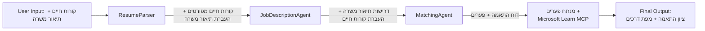

# PersonalCareerCopilot - בוחן התאמת קורות חיים למשרה

אפליקציית סוכנים מרובים מבוססת זרימת עבודה שמעריכה עד כמה קורות החיים מתאימים לתפקיד, ואחר כך יוצרת מפת דרכים אישית ללמידה לסגירת הפערים.

---

## סוכנים

| סוכן | תפקיד | כלים |
|-------|------|-------|
| **ResumeParser** | מוציא יכולות, ניסיון, הסמכות במבנה מאותו טקסט קורות חיים | - |
| **JobDescriptionAgent** | מוציא כישורים, ניסיון, הסמכות נדרשים/מועדפים מתיאור משרה | - |
| **MatchingAgent** | משווה פרופיל מול דרישות → ציון התאמה (0-100) + כישורים תואמים/חסרים | - |
| **GapAnalyzer** | בונה מפת דרכים אישית ללמידה עם משאבי Microsoft Learn | `search_microsoft_learn_for_plan` (MCP) |

## זרימת עבודה


```mermaid
flowchart LR
    UserInput["User Input: קורות חיים + תיאור משרה"] --> ResumeParser
    ResumeParser -- "קורות חיים מפורטים + העברת תיאור משרה" --> JobDescriptionAgent
    JobDescriptionAgent -- "דרישות תיאור משרה + העברת קורות חיים" --> MatchingAgent
    MatchingAgent -- "דוח התאמה + פערים" --> GapAnalyzerMCP["מנתח פערים +\nMicrosoft Learn MCP"]
    GapAnalyzerMCP --> FinalOutput["Final Output:\nציון התאמה + מפת דרכים"]
```

---

## התחלה מהירה

### 1. הגדר סביבת עבודה

תיקייה זו היא היישום המדגם לזרימת העבודה במסגרת Lab 02. הקובץ `main.py` בו משתמש בבלוקים הקיימים יחד עם `WorkflowBuilder` לחיבור ארבעת הסוכנים.

```powershell
cd workshop\lab02-multi-agent\PersonalCareerCopilot
python -m venv .venv
.\.venv\Scripts\Activate.ps1          # Windows PowerShell
# source .venv/bin/activate            # macOS / Linux
pip install -r requirements.txt
```

### 2. הגדר הרשאות

צור קובץ `.env` בתיקייה זו:

```powershell
copy .env .env.bak 2>$null; echo $null > .env
```

ערוך את `.env`:

```env
FOUNDRY_PROJECT_ENDPOINT=https://<your-account>.services.ai.azure.com/api/projects/<your-project>
AZURE_AI_MODEL_DEPLOYMENT_NAME=gpt-4.1-mini
```

| ערך | היכן למצוא |
|-------|------------------|
| `FOUNDRY_PROJECT_ENDPOINT` | סרגל צד Foundry Toolkit → לחץ ימני על הפרויקט שלך → **העתק נקודת קצה של הפרויקט** |
| `AZURE_AI_MODEL_DEPLOYMENT_NAME` | סרגל צד Foundry → הרחב את הפרויקט → **Models + endpoints** → שם הפעלת המודל |

### 3. הפעל מקומית

```powershell
python -m debugpy --listen 127.0.0.1:5679 main.py --port 8088
```

או השתמש במשימת VS Code: `Ctrl+Shift+P` → **Tasks: Run Task** → **Run Agent HTTP Server**.

לניפוי באגים עם F5, השתמש ב-**Debug Local Agent HTTP Server**.

### 4. בדוק עם Agent Inspector

פתח את Agent Inspector: `Ctrl+Shift+P` → **Foundry Toolkit: Open Agent Inspector**.

הדבק את ההנחיה לבדיקה הזו:

```
Resume:
Jane Doe
Senior Software Engineer with 5 years of experience in Python, Django, and AWS.
Built microservices handling 10K+ requests/second. Led a team of 4 developers.
Certifications: AWS Solutions Architect Associate.
Education: B.S. Computer Science, State University.

Job Description:
Senior Cloud Engineer at Contoso Ltd.
Required: Python, Azure, Kubernetes, Terraform, CI/CD pipelines.
Preferred: Go, monitoring (Prometheus/Grafana), cost optimization.
Experience: 5+ years in cloud infrastructure.
Certifications: Azure Solutions Architect Expert preferred.
```

**תוצאה צפויה:** ציון התאמה (0-100), כישורים תואמים/חסרים, ומפת דרכים אישית ללמידה עם קישורים מ-Microsoft Learn.

### 5. פרוס ל-Foundry

`Ctrl+Shift+P` → **Foundry Toolkit: Deploy Hosted Agent** → בחר את הפרויקט שלך → אשר.

---

## מבנה הפרויקט

```
PersonalCareerCopilot/
├── .env                ← Your credentials (git-ignored)
├── agent.yaml          ← Hosted agent definition (name, resources, env vars)
├── Dockerfile          ← Container image for Foundry deployment
├── main.py             ← 4-agent workflow (instructions, MCP tool, WorkflowBuilder)
└── requirements.txt    ← Python dependencies
```

## קבצי מפתח

### `agent.yaml`

מגדיר את הסוכן המאוחסן לשירות הסוכנים Foundry:
- `kind: hosted` - רץ כמכולה מנוהלת
- `protocols` - פרוטוקול `responses` עם `version: 1.0.0`, חושף את נקודת הקצה HTTP `/responses`
- `environment_variables` - `AZURE_AI_MODEL_DEPLOYMENT_NAME` מוגדר כאן; `FOUNDRY_PROJECT_ENDPOINT` מוזן אוטומטית בזמן הפריסה

### `main.py`

מכיל:
- **הוראות לסוכנים** - ארבע קבועות `*_INSTRUCTIONS`, אחת לכל סוכן
- **כלי MCP** - `search_microsoft_learn_for_plan()` קורא ל-`https://learn.microsoft.com/api/mcp` דרך HTTP סטרימבילי
- **יצירת סוכנים** - ארבע מופעי `Agent()` + `AgentExecutor()` שמשתפים לקוח `FoundryChatClient` אחד
- **גרף זרימת עבודה** - `WorkflowBuilder` מחבר סוכנים כצינור מרצף: ResumeParser → JD Agent → MatchingAgent → GapAnalyzer
- **הפעלת שרת** - `ResponsesHostServer` רץ בפורט 8088

### `requirements.txt`

| חבילה | מטרה |
|---------|----------|
| `agent-framework-foundry` | סביבה בסיסית: `Agent`, `AgentExecutor`, `WorkflowBuilder`, `@tool`, `FoundryChatClient` |
| `agent-framework-foundry-hosting` | `ResponsesHostServer` + אינטגרציית אירוח Foundry |
| `mcp<2,>=1.24.0` | לקוח MCP ל-GapAnalyzer (`streamable_http_client`) |
| `debugpy` | ניפוי באגים בפייתון (F5 ב-VS Code) |

---

## פתרון בעיות

| בעיה | פתרון |
|-------|-----|
| `KeyError: 'FOUNDRY_PROJECT_ENDPOINT'` או `KeyError: 'AZURE_AI_MODEL_DEPLOYMENT_NAME'` | צור `.env` עם שני הערכים `FOUNDRY_PROJECT_ENDPOINT` ו-`AZURE_AI_MODEL_DEPLOYMENT_NAME` מוגדרים |
| `ModuleNotFoundError: No module named 'agent_framework'` | הפעל את ה-venv והריץ `pip install -r requirements.txt` |
| אין קישורים מ-Microsoft Learn ביציאה | בדוק חיבור לאינטרנט לכתובת `https://learn.microsoft.com/api/mcp` |
| רק כרטיס פער אחד (קוצר) | וודא ש-`GAP_ANALYZER_INSTRUCTIONS` כולל את הבלוק `CRITICAL:` |
| פורט 8088 בשימוש | עצור שרתים אחרים: `netstat -ano \| findstr :8088` |

לפתרונות מפורטים יותר ראו [Module 8 - Troubleshooting](../docs/08-troubleshooting.md).

---

**מדריך מלא:** [Lab 02 Docs](../docs/README.md) · **חזרה אל:** [Lab 02 README](../README.md) · [דף הבית של הסדנא](../../../README.md)

---

<!-- CO-OP TRANSLATOR DISCLAIMER START -->
**כתב ויתור**:
מסמך זה תורגם באמצעות שירות תרגום אוטומטי [Co-op Translator](https://github.com/Azure/co-op-translator). למרות שאנו שואפים לדיוק, יש לקחת בחשבון שתרגומים אוטומטיים עלולים להכיל שגיאות או אי-דיוקים. יש להחשיב את המסמך המקורי בשפתו הטבעית כמקור הסמכות. למידע קריטי מומלץ להשתמש בתרגום מקצועי על ידי מתרגם אדם. אנו לא אחראים לכל אי-הבנה או פירוש שגוי הנובע מהשימוש בתרגום זה.
<!-- CO-OP TRANSLATOR DISCLAIMER END -->