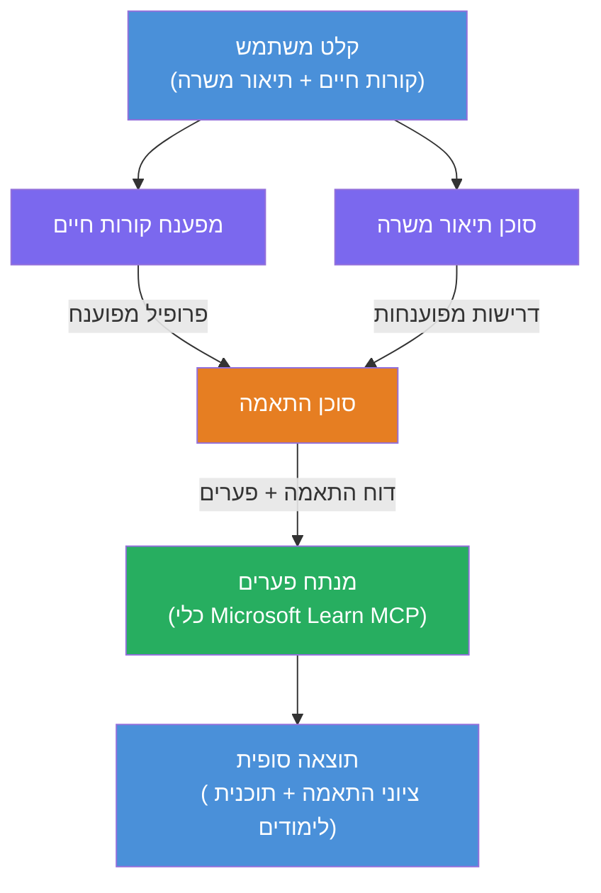

# מעבדה 02 - תזרים עבודה רב-סוכני: מפענח קורות חיים → מעריך התאמת תפקיד

---

## מה תבנו

**מפענח קורות חיים → מעריך התאמת תפקיד** - תזרים עבודה רב-סוכני שבו ארבעה סוכנים מתמחים משתפים פעולה להערכת מידת ההתאמה של קורות החיים של המועמד לתיאור התפקיד, ולאחר מכן יוצרים מפת דרכים מותאמת אישית ללמידה לסגירת הפגמים.

### הסוכנים

| סוכן | תפקיד |
|-------|------|
| **מפענח קורות חיים** | מפיק מיומנויות, ניסיון, הסמכות מובנות מטקסט קורות החיים |
| **סוכן תיאור תפקיד** | מפיק מיומנויות, ניסיון, הסמכות נדרשות/מועדפות מתיאור תפקיד |
| **סוכן התאמה** | משווה בין הפרופיל לדרישות → ציון התאמה (0-100) + מיומנויות תואמות/חסרות |
| **מנתח הפערים** | בונה מפת דרכים מותאמת אישית ללמידה עם משאבים, זמנים, ופרויקטים לניצחון מהיר |

### זרימת הדגמה

העלאת **קורות חיים + תיאור תפקיד** → קבלת **ציון התאמה + מיומנויות חסרות** → קבלת **מפת דרכים מותאמת אישית ללמידה**.

### ארכיטקטורת תזרים העבודה

> סגול = סוכנים במקביל | כתום = נקודת איסוף | ירוק = סוכן סופי עם כלים. עיין ב-[מודול 1 - להבין את הארכיטקטורה](docs/01-understand-multi-agent.md) וב-[מודול 4 - תבניות אורקסטרה](docs/04-orchestration-patterns.md) עבור דיאגרמות מפורטות וזרימת נתונים.

### נושאים שנלמדו

- יצירת תזרים עבודה רב-סוכני באמצעות **WorkflowBuilder**
- הגדרת תפקידי סוכנים וזרימת אורקסטרה (מקבילית + סידורית)
- דפוסי תקשורת בין סוכנים
- בדיקה מקומית עם Agent Inspector
- פריסה של תזרימי עבודה רב-סוכניים ל-Foundry Agent Service

---

## דרישות מוקדמות

יש להשלים קודם את מעבדה 01:

- [מעבדה 01 - סוכן יחיד](../lab01-single-agent/README.md)

---

## התחלה

עיין בהוראות ההתקנה המלאות, הסבר קוד, ופקודות בדיקה ב:

- [תיעוד מעבדה 2 - דרישות מוקדמות](docs/00-prerequisites.md)
- [תיעוד מעבדה 2 - מסלול למידה מלא](docs/README.md)
- [מדריך הפעלה PersonalCareerCopilot](PersonalCareerCopilot/README.md)

## תבניות אורקסטרה (חלופות סוכניות)

מעבדה 2 כוללת את זרימת הברירת מחדל **מקביל → מאגד → מתכנן**, והתיעוד גם מתאר תבניות חלופיות להדגמת התנהגות סוכנית חזקה יותר:

- **Fan-out/Fan-in עם הסכמה משוקללת**
- **מעבר בוחן/מבקר לפני מפת הדרכים הסופית**
- **נתב מותנה** (בחירת מסלול על בסיס ציון התאמה ומיומנויות חסרות)

עיין ב-[docs/04-orchestration-patterns.md](docs/04-orchestration-patterns.md).

---

**קודם:** [מעבדה 01 - סוכן יחיד](../lab01-single-agent/README.md) · **חזרה ל:** [בית הסדנה](../../README.md)

---

<!-- CO-OP TRANSLATOR DISCLAIMER START -->
**כתב ויתור**:  
מסמך זה תורגם באמצעות שירות תרגום מבוסס בינה מלאכותית [Co-op Translator](https://github.com/Azure/co-op-translator). למרות שאנו שואפים לדיוק, יש להביא בחשבון כי תרגומים אוטומטיים עלולים להכיל שגיאות או אי דיוקים. יש להתייחס למסמך המקורי בשפתו המקורית כמקור המוסמך והמהימן. עבור מידע קריטי, מומלץ תרגום מקצועי של בני אדם. אנו לא נישא באחריות לכל אי הבנה או פרשנות לא נכונה הנובעת משימוש בתרגום זה.
<!-- CO-OP TRANSLATOR DISCLAIMER END -->