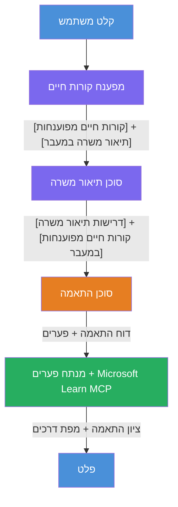

# מעבדה 02 - זרימת עבודה מולטי-סוכן: מעריך התאמת קורות חיים למשרה

## סקירה כללית

במעבדה המעשית הזו, תבנו **אפליקציית מולטי-סוכן שממוקדת בזרימת העבודה** תוך שימוש ב-Foundry Toolkit ב-VS Code ותפרסמו אותה לשירות Microsoft Foundry Agent.

**מה שתבנו:** מעריך התאמת קורות חיים למשרה שמנתח קורות חיים ותיאור משרה, מדרג את ההתאמה ומייצר מפת דרכים לימודית מותאמת אישית תוך שימוש במשאבי Microsoft Learn.

---

## ארכיטקטורה

```mermaid
flowchart TD
    A["קלט משתמש"] --> B["מפענח קורות חיים"]
    B -->|"[קורות חיים מפוענחות] + [תיאור משרה במעבר]"| C["סוכן תיאור משרה"]
    C -->|"[דרישות תיאור משרה] + [קורות חיים מפוענחות במעבר]"| D["סוכן התאמה"]
    D -->|דוח התאמה + פערים| E["מנתח פערים + Microsoft Learn MCP"]
    E -->|ציון התאמה + מפת דרכים| F["פלט"]

    style A fill:#4A90D9,color:#fff
    style B fill:#7B68EE,color:#fff
    style C fill:#7B68EE,color:#fff
    style D fill:#E67E22,color:#fff
    style E fill:#27AE60,color:#fff
    style F fill:#4A90D9,color:#fff
```

**איך זה עובד:**
1. המשתמש מדביק קורות חיים ותיאור משרה.
2. **ResumeParser** מנתח את קורות החיים ומעתיק את תיאור המשרה במלואו לסעיף `[JOB DESCRIPTION PASS-THROUGH]`.
3. **JD Agent** מפיק דרישות מבניות מתוך התוכן המועבר, ואז מעביר את `[PARSED RESUME]` הלאה בתור `[PARSED RESUME PASS-THROUGH]`.
4. **MatchingAgent** משווה בין `[PARSED RESUME PASS-THROUGH]` ל-`[JD REQUIREMENTS]` ומפיק ציון התאמה.
5. **GapAnalyzer** ממיר את הפערים למפת דרכים מעשית ומביא קישורים אמיתיים מ-Microsoft Learn באמצעות MCP.

---

## דרישות מוקדמות

סיים קודם את מעבדה 01:

- [מעבדה 01 - סוכן יחיד](../lab01-single-agent/README.md)

---

## חלק 1: קרא את המודולים לפי סדר

ראו את מסלול הלמידה המלא ב:

- [מסמכי מעבדה 2 - דרישות מוקדמות](docs/00-prerequisites.md)
- [מסמכי מעבדה 2 - מסלול למידה מלא](docs/README.md)
- [מדריך הפעלה ל-PersonalCareerCopilot](PersonalCareerCopilot/README.md)

---

## חלק 2: בנה ובדוק את זרימת העבודה

1. השתמש באשף Foundry Toolkit כדי ליצור קונסטרוקציה לפרויקט מבוסס זרימת עבודה.
2. העתק את קטעי השאילתות וגרף זרימת העבודה מהקובץ `PersonalCareerCopilot/main.py` אל סביבת העבודה שלך.
3. הרץ באופן מקומי עם Agent Inspector ואמת את כל ארבעת הסוכנים בתוספת כלי MCP.
4. פרסם את הסוכן המאוחסן ל-Foundry לאחר שהבדיקות המקומיות עוברות בהצלחה.

---

## דפוסי אורקסטרציה

מעבדה 02 כוללת את הזרימה ברירת המחדל **fan-out → fan-in → עקבי**, והמסמכים מציגים גם דפוסי אורקסטרציה חלופיים לניסויים.

- **Fan-out/Fan-in עם הסכמה משוקללת**
- **מעבר של מבקר/מבקר לפני מפת דרך סופית**
- **נתב מותנה** המבוסס על ציון התאמה ויכולות חסרות

עיין ב-[docs/04-orchestration-patterns.md](docs/04-orchestration-patterns.md).

---

**קודם:** [מעבדה 01 - סוכן יחיד](../lab01-single-agent/README.md) · **חזור אל:** [דף הבית של הסדנה](../../README.md)

---

<!-- CO-OP TRANSLATOR DISCLAIMER START -->
**כתב ויתור**:
מסמך זה תורגם באמצעות שירות תרגום אוטומטי [Co-op Translator](https://github.com/Azure/co-op-translator). למרות שאנו שואפים לדיוק, יש לקחת בחשבון שתרגומים אוטומטיים עלולים להכיל שגיאות או אי-דיוקים. יש להחשיב את המסמך המקורי בשפתו הטבעית כמקור הסמכות. למידע קריטי מומלץ להשתמש בתרגום מקצועי על ידי מתרגם אדם. אנו לא אחראים לכל אי-הבנה או פירוש שגוי הנובע מהשימוש בתרגום זה.
<!-- CO-OP TRANSLATOR DISCLAIMER END -->