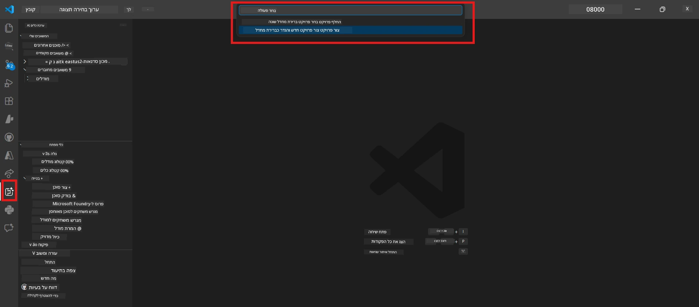

# מודול 0 - דרישות מוקדמות

לפני שמתחילים את המעבדה 02, וודאו שסיימתם את הדברים הבאים. מעבדה זו בונה ישירות על מעבדה 01 - אל תדלגו עליה.

---

## 1. השלם את מעבדה 01

מעבדה 02 מניחה שכבר עשיתם:

- [x] השלמתם את כל 8 המודולים של [מעבדה 01 - סוכן יחיד](../../lab01-single-agent/README.md)
- [x] פרסתם בהצלחה סוכן יחיד לשירות Foundry Agent
- [x] אימתתם שהסוכן פועל הן ב-Agent Inspector מקומי והן ב-Foundry Playground

אם לא השלמתם את מעבדה 01, חזרו וסיימו אותה עכשיו: [מסמכי מעבדה 01](../../lab01-single-agent/docs/00-prerequisites.md)

---

## 2. אמת הגדרה קיימת

כלים ממעבדה 01 צריכים עדיין להיות מותקנים ופועלים. הריצו בדיקות מהירות אלו:

### 2.1 Azure CLI

```powershell
az account show --query "{name:name, id:id}" --output table
```

צפוי: מציג את שם ומזהה המנוי שלכם. אם זה נכשל, הריצו [`az login`](https://learn.microsoft.com/cli/azure/authenticate-azure-cli-interactively).

### 2.2 תוספי VS Code

1. לחצו `Ctrl+Shift+P` → הקלידו **"Microsoft Foundry"** → אמתו שאתם רואים פקודות (למשל, `Microsoft Foundry: Create a New Hosted Agent`).
2. לחצו `Ctrl+Shift+P` → הקלידו **"Foundry Toolkit"** → אמתו שאתם רואים פקודות (למשל, `Foundry Toolkit: Open Agent Inspector`).

### 2.3 פרויקט ומודל Foundry

1. לחצו על סמל **Microsoft Foundry** בסרגל הפעילות של VS Code.
2. אמתו שהפרויקט שלכם מופיע (למשל, `workshop-agents`).
3. הרחיבו את הפרויקט → אמתו שקיים מודל שפורס עם סטטוס **Succeeded** (למשל, `gpt-4.1-mini`).

> **אם פריסת המודל שלכם פגה:** פריסות בחינם לפעמים פגות אוטומטית. פרסו מחדש מ-[מקטלוג המודלים](https://learn.microsoft.com/azure/foundry/foundry-models/concepts/models-sold-directly-by-azure) (`Ctrl+Shift+P` → **Microsoft Foundry: Open Model Catalog**).



### 2.4 תפקידי RBAC

אמתו שיש לכם את תפקיד **Azure AI User** בפרויקט Foundry שלכם:

1. [פורטאל Azure](https://portal.azure.com) → משאב ה-**פרויקט** של Foundry שלכם → **Access control (IAM)** → לשונית **[Role assignments](https://learn.microsoft.com/azure/foundry/concepts/rbac-foundry)**.
2. חפשו את שמכם → אמתו שתפקיד **[Azure AI User](https://aka.ms/foundry-ext-project-role)** רשום.

---

## 3. הבנת מושגי סוכנים מרובים (חדש במעבדה 02)

מעבדה 02 מציגה מושגים שלא כוסו במעבדה 01. עברו עליהם לפני שתמשיכו:

### 3.1 מהי זרימת עבודה של סוכנים מרובים?

במקום שסוכן אחד מטפל בכל דבר, **זרימת עבודה של סוכנים מרובים** מחלקת עבודה בין סוכנים מומחים שונים. לכל סוכן יש:

- הוראות משלו (הנחיית מערכת)
- תפקיד משלו (מה הוא אחראי עליו)
- כלים אופציונליים (פונקציות שהוא יכול לקרוא להן)

הסוכנים מתקשרים דרך **גרף תזמור** שמגדיר איך הנתונים זורמים ביניהם.

### 3.2 WorkflowBuilder

המחלקה [`WorkflowBuilder`](https://learn.microsoft.com/agent-framework/workflows/agents-in-workflows) מ-`agent_framework` היא רכיב ה-SDK שמחבר בין הסוכנים:

```python
from agent_framework import WorkflowBuilder

workflow = (
    WorkflowBuilder(
        name="MyWorkflow",
        start_executor=agent_a,
        output_executors=[agent_d],
    )
    .add_edge(agent_a, agent_b)
    .add_edge(agent_a, agent_c)
    .add_edge(agent_b, agent_d)
    .add_edge(agent_c, agent_d)
    .build()
)
```

- **`start_executor`** - הסוכן הראשון שמקבל את קלט המשתמש
- **`output_executors`** - הסוכן(ים) שהפלט שלהם הופך לתגובה הסופית
- **`add_edge(source, target)`** - מגדיר ש-`target` מקבל את הפלט מ-`source`

### 3.3 כלים של MCP (פרוטוקול הקשר מודל)

מעבדה 02 משתמשת ב**כלי MCP** שמבצע קריאות API ל-Microsoft Learn כדי להשיג משאבי לימוד. [MCP (Model Context Protocol)](https://modelcontextprotocol.io/introduction) הוא פרוטוקול סטנדרטי לחיבור מודלים של AI למקורות נתונים וכלים חיצוניים.

| מונח | הגדרה |
|------|---------|
| **שרת MCP** | שירות שחושף כלים/משאבים דרך [פרוטוקול MCP](https://learn.microsoft.com/azure/foundry/agents/how-to/tools/model-context-protocol) |
| **לקוח MCP** | קוד הסוכן שלכם שמתחבר לשרת MCP וקורא לכלים בו |
| **[Streamable HTTP](https://learn.microsoft.com/agent-framework/agents/tools/hosted-mcp-tools)** | שיטת התקשורת המשמשת לתקשר עם שרת MCP |

### 3.4 כיצד מעבדה 02 שונה מ-מעבדה 01

| אספקט | מעבדה 01 (סוכן יחיד) | מעבדה 02 (סוכנים מרובים) |
|--------|----------------------|---------------------|
| סוכנים | 1 | 4 (תפקידים מומחים) |
| תזמור | אין | WorkflowBuilder (מקביל + רציף) |
| כלים | פונקציית `@tool` אופציונלית | כלי MCP (קריאת API חיצונית) |
| מורכבות | בקשת פרומפט פשוטה → תגובה | קורות חיים + תיאור תפקיד → ציון התאמה → מפת דרכים |
| זרימת הקשר | ישירה | העברת שליטה בין סוכן לסוכן |

---

## 4. מבנה מאגר הסדנה למעבדה 02

ודאו שאתם יודעים היכן נמצאים קבצי מעבדה 02:

```
workshop/
└── lab02-multi-agent/
    ├── README.md                       ← Lab overview
    ├── docs/                           ← You are here
    │   ├── README.md                   ← Learning path index
    │   ├── 00-prerequisites.md         ← This file
    │   ├── 01-understand-multi-agent.md
    │   ├── ...
    │   └── 08-troubleshooting.md
    └── PersonalCareerCopilot/          ← The agent project
        ├── agent.yaml                  ← Agent definition
        ├── main.py                     ← 4-agent workflow code
        ├── Dockerfile                  ← Container configuration
        └── requirements.txt            ← Python dependencies
```

---

### נקודת בדיקה

- [ ] מעבדה 01 הושלמה במלואה (כל 8 המודולים, סוכן פרוס ואומת)
- [ ] `az account show` מחזיר את המנוי שלכם
- [ ] תוספי Microsoft Foundry ו-Foundry Toolkit מותקנים ומגיבים
- [ ] לפרויקט Foundry יש מודל שפורס (למשל, `gpt-4.1-mini`)
- [ ] יש לכם תפקיד **Azure AI User** על הפרויקט
- [ ] קראתם את סעיף מושגי הסוכנים המרובים למעלה ומבינים את WorkflowBuilder, MCP ותזמור סוכנים

---

**הבא:** [01 - הבנת ארכיטקטורת סוכנים מרובים →](01-understand-multi-agent.md)

---

<!-- CO-OP TRANSLATOR DISCLAIMER START -->
**כתב免责声明**:  
מסמך זה תורגם באמצעות שירות תרגום מבוסס בינה מלאכותית [Co-op Translator](https://github.com/Azure/co-op-translator). בעוד שאנו שואפים לדיוק, יש לקחת בחשבון שתרגומים אוטומטיים עשויים להכיל שגיאות או אי-דיוקים. המסמך המקורי בשפת המקור שלו הוא המקור הסמכותי. למידע קריטי מומלץ להשתמש בתרגום מקצועי ידי אדם. אנו לא אחראים לכל אי-הבנות או פרשנויות שגויות הנובעות מהשימוש בתרגום זה.
<!-- CO-OP TRANSLATOR DISCLAIMER END -->