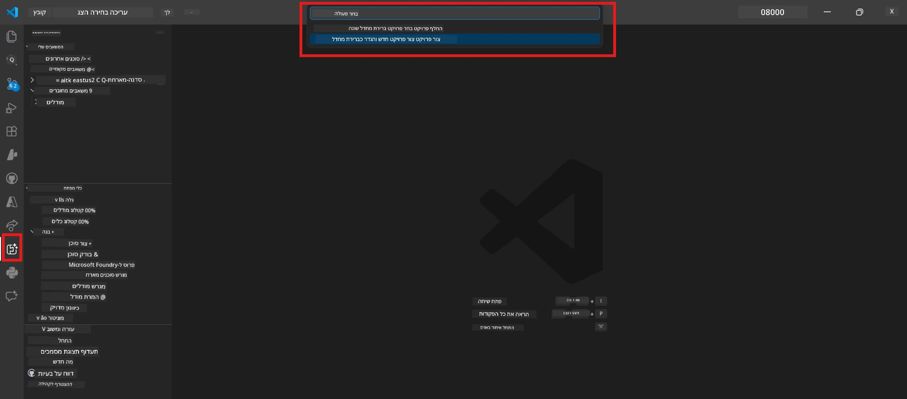

# מודול 0 - מבוא

⏱️ ~10 דקות

> [!WARNING]
> **תצוגה מקדימה ומגבלות:** [סוכנים מתארחים](https://learn.microsoft.com/azure/foundry/agents/concepts/hosted-agents) נמצאים כרגע ב**תצוגה ציבורית מוקדמת** - לא מומלץ לעומסי עבודה פרודקשן. כמה תכונות המוצגות בסדנה זו עשויות להשתנות ככל שהשירות מתקדם לעבר GA.

## מה תבנה

במעבדה זו, אתה מרחיב את כישורי הסוכנים היחידים מהמעבדה 01 לבניית **תהליך עבודה רב-סוכני** - מעריך התאמת קורות חיים למשרה.

אתה מדביק **קורות חיים** ותיאור **משרה**. ארבעה סוכנים מומחים מעבדים את הקלט ברצף, ואז מחזירים:
- ציון התאמה (0–100 עם פירוט ניקוד)
- רשימת פערי מיומנויות ותעודות
- מפת דרכים אישית ללמידה עם קישורים אמיתיים של Microsoft Learn לכל פער

**תהליך העבודה משתמש ב:**
- **מסגרת סוכני מיקרוסופט** - `WorkflowBuilder` לתזמור צינור רציף
- **Foundry Toolkit עבור VS Code** - תבניות, בדיקות מקומיות, פריסה
- **מודל AI** (למשל, `gpt-4.1-mini`) - בשימוש על ידי כל ארבעת הסוכנים
- **שרת Microsoft Learn MCP** - מספק קישורים ממשיים למשאבי לימוד עבור כל פער מיומנות

---

## בחר את הדרך שלך

> ⚠️ **המשך באותה הדרך שבה השתמשת במעבדה 01.**

<details open>
<summary><strong>🅰️ דרך א - ענן Azure (דורש מנוי Azure)</strong></summary>

| | פרטים |
|---|---|
| **למי מיועד?** | השלמת מעבדה 01 עם מנוי Azure |
| **מודל** | Azure OpenAI דרך Foundry (למשל, `gpt-4.1-mini`) |
| **מודולים המכוסים** | כל המודולים (00–09) |
| **פריסה לענן?** | ✅ כן - פריסה מלאה מקצה לקצה |

</details>

<details open>
<summary><strong>🅱️ דרך ב - Foundry מקומי (לא דורש מנוי Azure)</strong></summary>

| | פרטים |
|---|---|
| **למי מיועד?** | השלמת מעבדה 01 עם Foundry מקומי |
| **מודל** | Foundry מקומי (חינמי, פועל על המחשב שלך) |
| **מודולים המכוסים** | מודולים 00–05 (דלג על 06–07 - פריסה ואימות ענן) |
| **פריסה לענן?** | ❌ לא - בדיקות מקומיות בלבד דרך Agent Inspector |

</details>

---

## בדיקת מעבדה 01

מעבדה 02 בנויה ישירות על מעבדה 01. סיים את מעבדה 01 לפני שמתחילים כאן.

עדיין לא עשית מעבדה 01? התחל כאן: [Lab 01 - Introduction](../../lab01-single-agent/docs/00-prerequisites.md)

<details open>
<summary><strong>🅰️ דרך א - ענן Azure</strong></summary>

```powershell
az account show --query "{name:name, id:id}" --output table
```

אם זה נכשל, הרץ `az login`. לאחר מכן אמת ב-VS Code:

1. `Ctrl+Shift+P` → הקלד **Foundry Toolkit** → אמת שהפקודות מופיעות.
2. לחץ על סימן **Foundry Toolkit** → הפרויקט שלך והמודל המופץ מציגים **הושלם**.



> **RBAC:** הקצית את **Foundry User** במעבדה 01. אם יש צורך בהקצאה מחדש, ראה [מעבדה 01, מודול 1](../../lab01-single-agent/docs/01-setup.md#deploy-a-model--assign-rbac). התפקיד נקרא בעבר **Azure AI User** - אותן הרשאות.

</details>

<details open>
<summary><strong>🅱️ דרך ב - Foundry מקומי</strong></summary>

```powershell
Invoke-WebRequest -Uri "http://localhost:5273/v1/health" -UseBasicParsing | Select-Object StatusCode
```

צפוי: `StatusCode: 200`. אם לא, הפעל מחדש את Foundry Local מסרגל Foundry Toolkit.

> כל ההסקה מתבצעת על המחשב שלך. השיחה היחידה החוצה היא כלים MCP ל- `https://learn.microsoft.com/api/mcp`.

</details>

---

## מה חדש במעבדה 02

| | מעבדה 01 | מעבדה 02 |
|--|--------|--------|
| סוכנים | 1 | 4 (שרשרת עם WorkflowBuilder) |
| תבנית מתאר | בסיסי - Agent Framework | תהליכי עבודה - Agent Framework |
| חבילה חדשה | - | `mcp` |
| תזמור | סוכן שיחה יחיד | צינור סדרתי (WorkflowBuilder) |
| כלי חדש | - | `search_microsoft_learn_for_plan` (MCP) |

---

**הבא:** [01 - להבין את הארכיטקטורה →](01-understand-multi-agent.md)

---

<!-- CO-OP TRANSLATOR DISCLAIMER START -->
**כתב ויתור**:
מסמך זה תורגם באמצעות שירות תרגום אוטומטי [Co-op Translator](https://github.com/Azure/co-op-translator). למרות שאנו שואפים לדיוק, יש לקחת בחשבון שתרגומים אוטומטיים עלולים להכיל שגיאות או אי-דיוקים. יש להחשיב את המסמך המקורי בשפתו הטבעית כמקור הסמכות. למידע קריטי מומלץ להשתמש בתרגום מקצועי על ידי מתרגם אדם. אנו לא אחראים לכל אי-הבנה או פירוש שגוי הנובע מהשימוש בתרגום זה.
<!-- CO-OP TRANSLATOR DISCLAIMER END -->