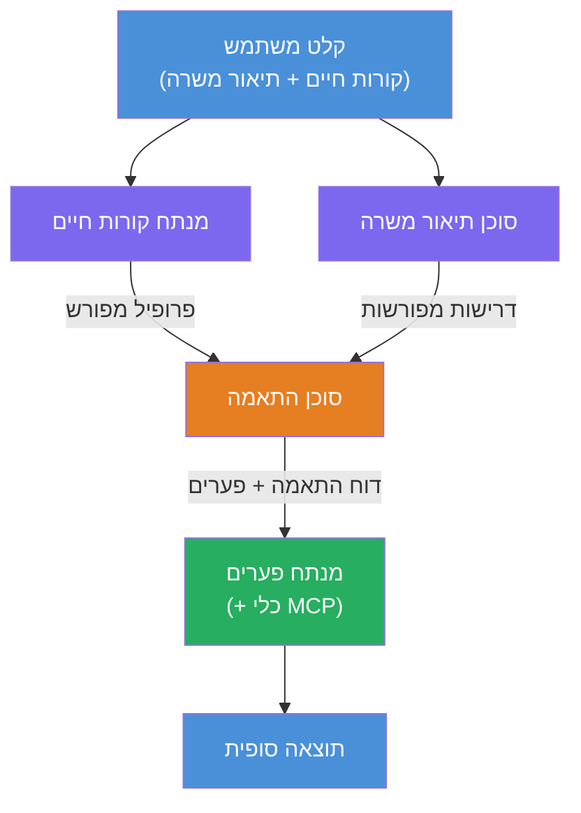
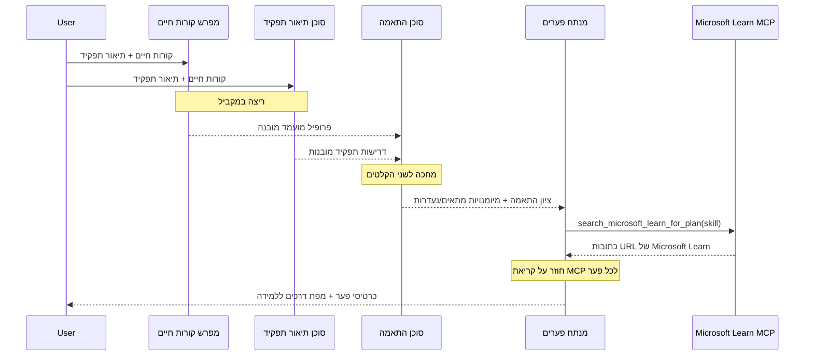
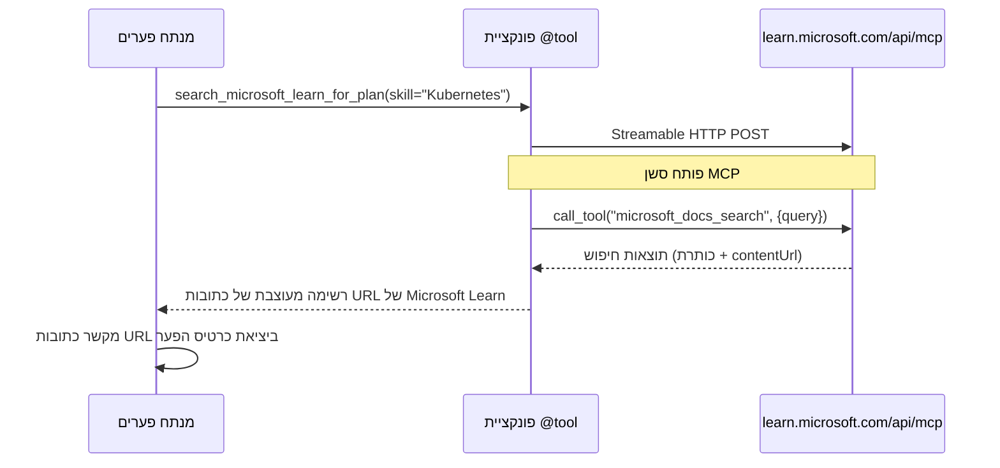

# מודול 1 - הבנת הארכיטקטורה של מערכת מולטי-סוכן

במודול זה, תלמד את הארכיטקטורה של מערכת Resume → Job Fit Evaluator לפני כתיבת כל קוד. הבנת גרף האורקסטרציה, תפקידי הסוכנים, וזרימת הנתונים היא קריטית לניפוי שגיאות ולהרחבת [זרימות עבודה מולטי-סוכן](https://learn.microsoft.com/azure/architecture/ai-ml/idea/multiple-agent-workflow-automation).

---

## הבעיה שזו פותרת

התאמת קורות חיים לתיאור עבודה כוללת מספר מיומנויות מובחנות:

1. **פירסינג** - חילוץ נתונים מובנים מטקסט לא מובנה (קורות חיים)
2. **ניתוח** - חילוץ דרישות מתיאור עבודה
3. **השוואה** - דירוג ההתאמה בין השניים
4. **תכנון** - בניית מפת דרכים ללמידה לשם סגירת פערים

סוכן יחיד שמבצע את כל ארבע המטלות בפרומפט אחד לרוב מייצר:
- חילוץ לא מלא (הוא ממהר לפירסינג כדי להגיע לדירוג)
- דירוג שטחי (ללא פירוט מבוסס ראיות)
- מפת דרכים כללית (לא מותאמת לפערים הספציפיים)

על ידי חלוקה ל-**ארבעה סוכנים מתמחים**, כל אחד מתמקד במשימתו עם הנחיות ייעודיות, וכתוצאה מכך נוצרת תוצאה באיכות גבוהה בכל שלב.

---

## ארבעת הסוכנים

כל סוכן הוא סוכן מלא של [Microsoft Foundry](https://learn.microsoft.com/azure/foundry/agents/concepts/hosted-agents) שנוצר באמצעות `AzureAIAgentClient.as_agent()`. הם משתמשים באותו פריסת מודל אך בעלי הנחיות שונות ו(אופציונלית) כלים שונים.

| # | שם הסוכן | תפקיד | קלט | פלט |
|---|-----------|------|-------|--------|
| 1 | **ResumeParser** | מחלץ פרופיל מובנה מטקסט קורות החיים | טקסט גולמי של קורות החיים (מהמשתמש) | פרופיל מועמד, כישורים טכניים, כישורים רכים, הסמכות, ניסיון תחומי, הישגים |
| 2 | **JobDescriptionAgent** | מחלץ דרישות מובנות מתיאור עבודה | טקסט גולמי של תיאור התפקיד (מהמשתמש, מועבר דרך ResumeParser) | סקירת תפקיד, כישורים נדרשים, כישורים מועדפים, ניסיון, הסמכות, השכלה, אחריויות |
| 3 | **MatchingAgent** | מחשב דירוג התאמה מבוסס ראיות | פלטים מ-ResumeParser ו-JobDescriptionAgent | דירוג התאמה (0-100 עם פירוט), כישורים תואמים, כישורים חסרים, פערים |
| 4 | **GapAnalyzer** | בונה מפת דרכים אישית ללמידה | פלט מ-MatchingAgent | כרטיסי פער (לכל מיומנות), סדר לימוד, לוח זמנים, משאבים מ-Microsoft Learn |

---

## גרף האורקסטרציה

זרימת העבודה משתמשת ב-**פיצול מקבילי** ואחריו **אגרגציה סדרתית**:


> **מקרא:** סגול = סוכנים מקבילים, כתום = נקודת אגרגציה, ירוק = סוכן סופי עם כלים

### כיצד הנתונים זורמים


1. **המשתמש שולח** הודעה המכילה קורות חיים ותיאור עבודה.
2. **ResumeParser** מקבל את כל קלט המשתמש ומחלץ פרופיל מועמד מובנה.
3. **JobDescriptionAgent** מקבל את קלט המשתמש במקביל ומחלץ דרישות מובנות.
4. **MatchingAgent** מקבל תוצאות מ**שני** ResumeParser ו-JobDescriptionAgent (המסגרת מחכה ששניהם יסיימו לפני הרצת MatchingAgent).
5. **GapAnalyzer** מקבל את הפלט של MatchingAgent ומבצע קריאה לכלי **Microsoft Learn MCP** כדי לאתר משאבי למידה אמיתיים עבור כל פער.
6. ה**פלט הסופי** הוא תגובת GapAnalyzer, הכוללת את דירוג ההתאמה, כרטיסי הפער ומפת דרכים מלאה ללמידה.

### מדוע פיצול מקבילי חשוב

ResumeParser ו-JobDescriptionAgent פועלים **במקביל** כי אף אחד מהם לא תלוי בשני. זה:
- מקצר את זמן ההמתנה הכולל (שניהם רצים בו זמנית במקום ברצף)
- פיצול טבעי (פירסינג של קורות חיים מול פירסינג של תיאור תפקיד הם משימות עצמאיות)
- מדגים דפוס נפוץ במולטי-סוכן: **פיצול → אגרגציה → פעולה**

---

## WorkflowBuilder בקוד

כך הגרף לעיל מתורגם לקריאות API של [`WorkflowBuilder`](https://learn.microsoft.com/agent-framework/workflows/agents-in-workflows) ב-`main.py`:

```python
from agent_framework import WorkflowBuilder

workflow = (
    WorkflowBuilder(
        name="ResumeJobFitEvaluator",
        start_executor=resume_parser,       # הסוכן הראשון לקבלת קלט מהמשתמש
        output_executors=[gap_analyzer],     # הסוכן הסופי שתוצאתו מוחזרת
    )
    .add_edge(resume_parser, jd_agent)      # ResumeParser → JobDescriptionAgent
    .add_edge(resume_parser, matching_agent) # ResumeParser → MatchingAgent
    .add_edge(jd_agent, matching_agent)      # JobDescriptionAgent → MatchingAgent
    .add_edge(matching_agent, gap_analyzer)  # MatchingAgent → GapAnalyzer
    .build()
)
```

**הבנת הקצוות:**

| קצה | משמעות |
|------|--------------|
| `resume_parser → jd_agent` | סוכן JD מקבל את פלט ResumeParser |
| `resume_parser → matching_agent` | MatchingAgent מקבל את פלט ResumeParser |
| `jd_agent → matching_agent` | MatchingAgent גם מקבל את פלט סוכן JD (מחכה לשני הפלטים) |
| `matching_agent → gap_analyzer` | GapAnalyzer מקבל את פלט MatchingAgent |

מכיוון של-`matching_agent` יש **שני קצוות נכנסים** (`resume_parser` ו-`jd_agent`), המסגרת מחכה אוטומטית לשניהם להשלים לפני הרצת סוכן ההתאמה.

---

## כלי MCP

לסוכן GapAnalyzer יש כלי אחד: `search_microsoft_learn_for_plan`. זהו **[כלי MCP](https://learn.microsoft.com/agent-framework/agents/tools/hosted-mcp-tools)** שמבצע קריאה ל-API של Microsoft Learn כדי להביא משאבי למידה מסוננים.

### כיצד זה עובד

```python
@tool
async def search_microsoft_learn_for_plan(
    skill: str, role: str = "", max_results: int = 5
) -> str:
    """Search Microsoft Learn MCP and return curated official links."""
    # מתחבר ל-https://learn.microsoft.com/api/mcp באמצעות HTTP ניתן להפעלה בזרם
    # מפעיל את כלי 'microsoft_docs_search' על שרת ה-MCP
    # מחזיר רשימה מעוצבת של כתובות URL של Microsoft Learn
```

### זרימת קריאות MCP


1. GapAnalyzer מחליט שצריך משאבי למידה עבור מיומנות (למשל, "Kubernetes")
2. המסגרת קוראת ל-`search_microsoft_learn_for_plan(skill="Kubernetes")`
3. הפונקציה פותחת חיבור [HTTP סטרימבל](https://learn.microsoft.com/agent-framework/agents/tools/hosted-mcp-tools) ל-`https://learn.microsoft.com/api/mcp`
4. היא קוראת לכלי `microsoft_docs_search` ב[שרת MCP](https://learn.microsoft.com/azure/foundry/agents/how-to/tools/model-context-protocol)
5. שרת MCP מחזיר תוצאות חיפוש (כותרת + URL)
6. הפונקציה מעצבת את התוצאות ומחזירה אותם כמחרוזת
7. GapAnalyzer משתמש ב-URL המוחזרים בפלט כרטיסי הפער שלו

### יומני MCP צפויים

כאשר הכלי פועל, תראה רשומות יומן כמו:

```
GET https://learn.microsoft.com/api/mcp → 405 (Method Not Allowed)
POST https://learn.microsoft.com/api/mcp → 200
DELETE https://learn.microsoft.com/api/mcp → 405 (Method Not Allowed)
```

**אלה נורמליים.** לקוח MCP מבצע פקודות GET ו-DELETE במהלך האתחול - החזרות 405 הן התנהגות צפויה. קריאות הכלי בפועל הן POST ומחזירות 200. יש לדאוג רק אם קריאות POST נכשלים.

---

## דפוס יצירת סוכן

כל סוכן נוצר באמצעות **מנהל הקשר האסינכרוני [`AzureAIAgentClient.as_agent()`](https://learn.microsoft.com/python/api/overview/azure/ai-agents-readme)**. זהו דפוס SDK של Foundry ליצירת סוכנים שננקים אוטומטית:

```python
async with (
    get_credential() as credential,
    AzureAIAgentClient(
        project_endpoint=PROJECT_ENDPOINT,
        model_deployment_name=MODEL_DEPLOYMENT_NAME,
        credential=credential,
    ).as_agent(
        name="ResumeParser",
        instructions=RESUME_PARSER_INSTRUCTIONS,
    ) as resume_parser,
    # ... חזור על כך עבור כל סוכן ...
):
    # כל 4 הסוכנים קיימים כאן
    workflow = create_workflow(resume_parser, jd_agent, matching_agent, gap_analyzer)
```

**נקודות מפתח:**
- לכל סוכן יש מופע `AzureAIAgentClient` נפרד (ה-SDK דורש ששם הסוכן יהיה מקומי ללקוח)
- כל הסוכנים משתפים את אותו `credential`, `PROJECT_ENDPOINT`, ו-`MODEL_DEPLOYMENT_NAME`
- בלוק ה-`async with` מבטיח שכל הסוכנים ינוקו כשהשרת נסגר
- GapAnalyzer מקבל בנוסף `tools=[search_microsoft_learn_for_plan]`

---

## הפעלת השרת

לאחר יצירת הסוכנים ובניית זרימת העבודה, מתחיל השרת:

```python
from azure.ai.agentserver.agentframework import from_agent_framework

agent = create_workflow(resume_parser, jd_agent, matching_agent, gap_analyzer)
await from_agent_framework(agent).run_async()
```

`from_agent_framework()` עוטף את זרימת העבודה כשרת HTTP החושף את נקודת הקצה `/responses` בפורט 8088. זה הדפוס זהה ל-Lab 01, אך ה"סוכן" כעת הוא כל [גרף זרימת העבודה](https://learn.microsoft.com/agent-framework/workflows/as-agents).

---

### נקודת בקרה

- [ ] אתה מבין את הארכיטקטורה של 4 הסוכנים ואת תפקיד כל סוכן
- [ ] אתה יכול לעקוב אחרי זרימת הנתונים: משתמש → ResumeParser → (במקביל) סוכן JD + MatchingAgent → GapAnalyzer → פלט
- [ ] אתה מבין מדוע MatchingAgent מחכה ל-ResumeParser ולסוכן JD (שני קצות נכנסים)
- [ ] אתה מבין את כלי MCP: מה הוא עושה, כיצד הוא נקרא, ושרישומי GET 405 הם נורמליים
- [ ] אתה מבין את דפוס `AzureAIAgentClient.as_agent()` ולמה לכל סוכן יש מופע לקוח משלו
- [ ] אתה יכול לקרוא את קוד `WorkflowBuilder` ולהחיל אותו על הגרף הוויזואלי

---

**הקודם:** [00 - דרישות מוקדמות](00-prerequisites.md) · **הבא:** [02 - בניית פרויקט מולטי-סוכן →](02-scaffold-multi-agent.md)

---

<!-- CO-OP TRANSLATOR DISCLAIMER START -->
**כתב וכליאה**:  
מסמך זה תורגם באמצעות שירות תרגום מבוסס בינה מלאכותית [Co-op Translator](https://github.com/Azure/co-op-translator). בעוד שאנו שואפים לדיוק, יש לקחת בחשבון שתרגומים אוטומטיים עלולים להכיל שגיאות או אי־דיוקים. המסמך המקורי בשפת המקור שלו צריך להיחשב כמקור מוסמך. למידע קריטי מומלץ להשתמש בתרגום מקצועי של אדם. אנו לא אחראים לכל אי הבנה או פרשנות שגויה הנובעים משימוש בתרגום זה.
<!-- CO-OP TRANSLATOR DISCLAIMER END -->