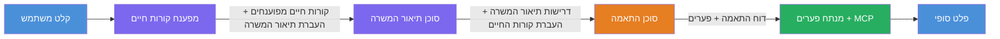

# מודול 1 - הבנת הארכיטקטורה

⏱️ ~5 דקות

לפני כתיבת כל קוד, הנה סקירה קצרה של מה שאתה בונה ואיך זה עובד.

---

## מה שאתה בונה

אתה מדביק **קורות חיים** ו-**תיאור משרה**. זרימת העבודה מחזירה:

- ציון התאמה (0–100 עם פירוט)
- רשימת פערי מיומנויות ותעודות
- מפת דרכים ללמידה מותאמת אישית עם קישורי Microsoft Learn לכל פער

---

## ארבעת הסוכנים

סוכן אחד שמנסה לפרש, לדרג ולתכנן הכל יחד נוטה למהר ולהפיק פלט שטחי. פיצול העבודה לארבעה סוכנים מתמחים מביא לתוצאות טובות יותר:

| סוכן | מה שהוא עושה |
|-------|-------------|
| **ResumeParser** | מנתח את קורות החיים; מעתיק את תיאור התפקיד כפי שהוא ל-`[JOB DESCRIPTION PASS-THROUGH]` עבור הסוכנים בהמשך |
| **JobDescriptionAgent** | מפיק דרישות מ-JD מהמעבר; משדר את `[PARSED RESUME]` קדימה כ-`[PARSED RESUME PASS-THROUGH]` |
| **MatchingAgent** | משווה בין שני החלקים המסומנים; מייצר ציון התאמה בין 0–100 ורשימת פערים |
| **GapAnalyzer** | בונה מפת דרכים ללמידה; מחפש ב-Microsoft Learn עבור כל פער |

---

## גרף האורקסטרציה

זרימת העבודה היא **צינור רציף** - כל סוכן מעביר את הפלט שלו לסוכן הבא:


```mermaid
flowchart LR
    A["קלט משתמש"] --> B["מפענח קורות חיים"]
    B -- "קורות חיים מפוענחים + העברת תיאור המשרה" --> C["סוכן תיאור המשרה"]
    C -- "דרישות תיאור המשרה + העברת קורות החיים" --> D["סוכן התאמה"]
    D -- "דוח התאמה + פערים" --> E["מנתח פערים + MCP"]
    E --> F["פלט סופי"]

    style A fill:#4A90D9,color:#fff
    style B fill:#7B68EE,color:#fff
    style C fill:#7B68EE,color:#fff
    style D fill:#E67E22,color:#fff
    style E fill:#27AE60,color:#fff
    style F fill:#4A90D9,color:#fff
```

1. **ResumeParser** מקבל את קלט המשתמש, מנתח את קורות החיים ומעתיק את ה-JD ל-`[JOB DESCRIPTION PASS-THROUGH]`.
2. **סוכן JD** מפיק דרישות מובנות ומשדר את `[PARSED RESUME PASS-THROUGH]` קדימה.
3. **MatchingAgent** משווה בין שני החלקים ומפיק ציון התאמה ורשימת פערים.
4. **GapAnalyzer** בונה את מפת הדרכים וקורא לכלי MCP של Microsoft Learn עבור כל פער.

---

## איך זה מתורגם לקוד

ב-`main.py` אתה מתאר את הגרף עם `WorkflowBuilder`:

```python
workflow_agent = (
    WorkflowBuilder(
        start_executor=resume_executor,       # הסוכן הראשון לקבלת קלט מהמשתמש
        output_executors=[gap_executor],      # הסוכן האחרון - הפלט שלו הוא התגובה
    )
    .add_edge(resume_executor, jd_executor)       # ResumeParser → סוכן JD
    .add_edge(jd_executor, matching_executor)     # סוכן JD → MatchingAgent
    .add_edge(matching_executor, gap_executor)    # MatchingAgent → GapAnalyzer
    .build()
    .as_agent()
)
```

כל `Agent` עטוף ב-`AgentExecutor`. קריאות ל-`add_edge()` מגדירות צינור רציף מוחלט - כל סוכן מקבל רק את הפלט של הקודם הישיר לו.

> `context_mode="last_agent"` משמעותו שכל מפעיל רואה רק את הפלט של הקודם הישיר שלו. ResumeParser וסוכן JD מעבירים נתונים קדימה בחלקים מסומנים כך שלכל סוכן בהמשך יש בדיוק את מה שהוא צריך.

---

## כלי ה-MCP

ל-GapAnalyzer יש כלי אחד: `search_microsoft_learn_for_plan`. הוא מתחבר ל-`https://learn.microsoft.com/api/mcp` ומחזיר קישורים אמיתיים של Microsoft Learn לכל פער מיומנות.

כשכלי זה רץ תראה את הלוגים האלה - כולם צפויים:

```
GET  https://learn.microsoft.com/api/mcp → 405   ← connection probe, normal
POST https://learn.microsoft.com/api/mcp → 200   ← actual tool call
DELETE https://learn.microsoft.com/api/mcp → 405 ← cleanup probe, normal
```

דאג רק אם בקשת ה-`POST` מחזירה שגיאה.

---

**קודם:** [00 - דרישות מוקדמות](00-prerequisites.md) · **הבא:** [02 - הקמת שלד הפרויקט →](02-scaffold-multi-agent.md)

---

<!-- CO-OP TRANSLATOR DISCLAIMER START -->
**כתב ויתור**:
מסמך זה תורגם באמצעות שירות תרגום אוטומטי [Co-op Translator](https://github.com/Azure/co-op-translator). למרות שאנו שואפים לדיוק, יש לקחת בחשבון שתרגומים אוטומטיים עלולים להכיל שגיאות או אי-דיוקים. יש להחשיב את המסמך המקורי בשפתו הטבעית כמקור הסמכות. למידע קריטי מומלץ להשתמש בתרגום מקצועי על ידי מתרגם אדם. אנו לא אחראים לכל אי-הבנה או פירוש שגוי הנובע מהשימוש בתרגום זה.
<!-- CO-OP TRANSLATOR DISCLAIMER END -->