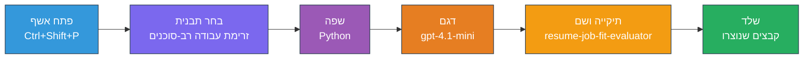
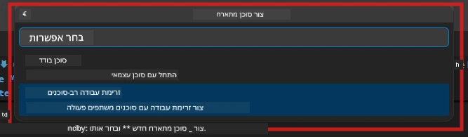

# מודול 2 - תבנית לפרויקט רב-סוכנים

במודול זה, אתה משתמש בהרחבת [Microsoft Foundry](https://marketplace.visualstudio.com/items?itemName=TeamsDevApp.vscode-ai-foundry) כדי **לתבנית פרויקט זרימת עבודה רב-סוכנית**. ההרחבה יוצרת את מבנה הפרויקט המלא - `agent.yaml`, `main.py`, `Dockerfile`, `requirements.txt`, `.env`, וקונפיגורציית איתור באגים. לאחר מכן תתאים אישית קבצים אלה במודולים 3 ו-4.

> **הערה:** תיקיית `PersonalCareerCopilot/` במעבדה זו היא דוגמה שלמה ומתפקדת לפרויקט רב-סוכנים מותאם אישית. אתה יכול או ליצור פרויקט חדש (מומלץ ללמידה) או ללמוד ישירות את הקוד הקיים.

---

## שלב 1: פתח את אשף יצירת הסוכן המHosted


1. לחץ `Ctrl+Shift+P` לפתיחת **פלטת הפקודות**.
2. הקלד: **Microsoft Foundry: Create a New Hosted Agent** ובחר.
3. אשף יצירת הסוכן המHosted יפתח.

> **חלופה:** לחץ על הסמל של **Microsoft Foundry** בסרגל הפעילויות → לחץ על סמל **+** ליד **Agents** → **Create New Hosted Agent**.

---

## שלב 2: בחר את תבנית זרימת העבודה רב-סוכנית

האשף יבקש ממך לבחור תבנית:

| תבנית | תיאור | מתי להשתמש |
|----------|-------------|-------------|
| סוכן יחיד | סוכן אחד עם הוראות וכלים אופציונליים | מעבדה 01 |
| **זרימת עבודה רב-סוכנית** | מספר סוכנים שמשתפים פעולה דרך WorkflowBuilder | **מעבדה זו (מעבדה 02)** |

1. בחר **זרימת עבודה רב-סוכנית**.
2. לחץ **הבא**.



---

## שלב 3: בחר שפת תכנות

1. בחר **Python**.
2. לחץ **הבא**.

---

## שלב 4: בחר את הדגם שלך

1. האשף מציג דגמים המופעלים בפרויקט Foundry שלך.
2. בחר את אותו דגם שבו השתמשת במעבדה 01 (למשל, **gpt-4.1-mini**).
3. לחץ **הבא**.

> **טיפ:** [`gpt-4.1-mini`](https://learn.microsoft.com/azure/foundry/foundry-models/concepts/models-sold-directly-by-azure#gpt-41-series) מומלץ לפיתוח - מהיר, זול וטוב בהתמודדות עם זרימות עבודה רב-סוכניות. עבור לפריסה סופית השתמש ב-`gpt-4.1` אם תרצה פלט איכותי יותר.

---

## שלב 5: בחר מיקום תיקייה ושם הסוכן

1. תפתח חלון דיאלוג קבצים. בחר תיקיית יעד:
   - אם אתה עובד עם רפוזיטורי הסדנה: נווט ל-`workshop/lab02-multi-agent/` וצור תיקיית משנה חדשה
   - אם מתחיל מאפס: בחר כל תיקייה
2. הזן **שם** לסוכן המHosted (למשל, `resume-job-fit-evaluator`).
3. לחץ **צור**.

---

## שלב 6: המתן לסיום יצירת התבנית

1. VS Code יפתח חלון חדש (או יעדכן את החלון הנוכחי) עם פרויקט התבנית.
2. אתה אמור לראות את מבנה הקבצים הבא:

```
resume-job-fit-evaluator/
├── .env                ← Environment variables (placeholders)
├── .vscode/
│   └── launch.json     ← Debug configuration
├── agent.yaml          ← Agent definition (kind: hosted)
├── Dockerfile          ← Container configuration
├── main.py             ← Multi-agent workflow code (scaffold)
└── requirements.txt    ← Python dependencies
```

> **הערת סדנה:** ברפוזיטוריית הסדנה, תיקיית `.vscode/` נמצאת בשורש סביבת העבודה עם קבצי `launch.json` ו-`tasks.json` משותפים. קונפיגורציות האיתור באגים של מעבדה 01 ומעבדה 02 כלולות שניהם. כשאתה לוחץ F5, בחר **"Lab02 - Multi-Agent"** מהרשימה.

---

## שלב 7: הבן את הקבצים שהתבנית יצרה (מאפייני רב-סוכנים)

תבנית רב-הסוכנים שונה מתבנית סוכן יחיד בכמה דרכים מפתח:

### 7.1 `agent.yaml` - הגדרת הסוכן

```yaml
kind: hosted
name: resume-job-fit-evaluator
description: >
  A multi-agent workflow that evaluates resume-to-job fit.
metadata:
  authors:
    - Microsoft
  tags:
    - Multi-Agent Workflow
    - Resume Evaluator
protocols:
  - protocol: responses
    version: v1
environment_variables:
  - name: PROJECT_ENDPOINT
    value: ${PROJECT_ENDPOINT}
  - name: MODEL_DEPLOYMENT_NAME
    value: ${MODEL_DEPLOYMENT_NAME}
```

**הבדל עיקרי ממעבדה 01:** סעיף `environment_variables` עשוי לכלול משתנים נוספים לנקודות סוף MCP או הגדרות כלים אחרות. השדות `name` ו-`description` משקפים את השימוש רב-סוכני.

### 7.2 `main.py` - קוד זרימת עבודה רב-סוכנית

התבנית כוללת:
- **מחרוזות הוראות מרובות לסוכנים** (קבוע אחד לכל סוכן)
- **מנהלי הקשר [`AzureAIAgentClient.as_agent()`](https://learn.microsoft.com/python/api/overview/azure/ai-agents-readme)** מרובים (אחד לכל סוכן)
- **[`WorkflowBuilder`](https://learn.microsoft.com/agent-framework/workflows/agents-in-workflows)** לחיבור הסוכנים יחד
- **`from_agent_framework()`** כדי להגיש את זרימת העבודה כנמל HTTP

```python
from agent_framework import WorkflowBuilder, tool
from agent_framework.azure import AzureAIAgentClient
from azure.ai.agentserver.agentframework import from_agent_framework
```

הייבוא הנוסף של [`WorkflowBuilder`](https://learn.microsoft.com/agent-framework/workflows/agents-in-workflows) הוא חדש לעומת מעבדה 01.

### 7.3 `requirements.txt` - תלותיות נוספות

פרויקט רב-הסוכנים משתמש באותם חבילות בסיס כמעבדה 01, בנוסף לכל חבילות MCP:

```
agent-framework-azure-ai==1.0.0rc3
agent-framework-core==1.0.0rc3
azure-ai-agentserver-agentframework==1.0.0b16
azure-ai-agentserver-core==1.0.0b16
debugpy
agent-dev-cli --pre
```

> **הערת גרסה חשובה:** חבילת `agent-dev-cli` דורשת את הדגל `--pre` בקובץ `requirements.txt` כדי להתקין את גרסת התצוגה המקדימה העדכנית ביותר. זוהי דרישה לתאימות Agent Inspector עם `agent-framework-core==1.0.0rc3`. ראה [מודול 8 - פתרון בעיות](08-troubleshooting.md) לפרטי גרסאות נוספים.

| חבילה | גרסה | תכלית |
|---------|---------|---------|
| [`agent-framework-azure-ai`](https://learn.microsoft.com/agent-framework/overview/) | `1.0.0rc3` | אינטגרציית Azure AI עבור [Microsoft Agent Framework](https://github.com/microsoft/agent-framework) |
| [`agent-framework-core`](https://learn.microsoft.com/agent-framework/overview/) | `1.0.0rc3` | ליבת זמן ריצה (כולל WorkflowBuilder) |
| `azure-ai-agentserver-agentframework` | `1.0.0b16` | זמן ריצה של שרת סוכן מנוהל |
| `azure-ai-agentserver-core` | `1.0.0b16` | הפשטות לשרת סוכן מרכזי |
| `debugpy` | העדכנית ביותר | איתור באגים של Python (F5 ב-VS Code) |
| `agent-dev-cli` | `--pre` | CLI לפיתוח מקומי + Agent Inspector backend |

### 7.4 `Dockerfile` - זהה למעבדה 01

ה-Dockerfile זהה לזה שבמעבדה 01 - הוא מעתיק קבצים, מתקין תלותיות מ-`requirements.txt`, פותח את פורט 8088 ומריץ `python main.py`.

```dockerfile
FROM python:3.14-slim
WORKDIR /app
COPY ./ .
RUN pip install --upgrade pip && \
    if [ -f requirements.txt ]; then \
        pip install -r requirements.txt; \
    else \
      echo "No requirements.txt found" >&2; exit 1; \
    fi
EXPOSE 8088
CMD ["python", "main.py"]
```

---

### נקודת בדיקה

- [ ] השימוש באשף התבנית הושלם → מבנה הפרויקט החדש גלוי
- [ ] ניתן לראות את כל הקבצים: `agent.yaml`, `main.py`, `Dockerfile`, `requirements.txt`, `.env`
- [ ] `main.py` כולל ייבוא של `WorkflowBuilder` (מאשר שתבנית רב-סוכנים נבחרה)
- [ ] `requirements.txt` כולל גם את `agent-framework-core` וגם את `agent-framework-azure-ai`
- [ ] אתה מבין כיצד תבנית רב-סוכנים שונה מתבנית סוכן יחיד (ריבוי סוכנים, WorkflowBuilder, כלים MCP)

---

**קודם:** [01 - הבן את ארכיטקטורת רב-סוכנים](01-understand-multi-agent.md) · **הבא:** [03 - קבע תצורת סוכנים וסביבה →](03-configure-agents.md)

---

<!-- CO-OP TRANSLATOR DISCLAIMER START -->
**כתב ויתור**:  
מסמך זה תורגם באמצעות שירות תרגום מבוסס בינה מלאכותית [Co-op Translator](https://github.com/Azure/co-op-translator). למרות שאנו שואפים לדיוק, אנא שים לב כי תרגומים אוטומטיים עלולים להכיל שגיאות או אי דיוקים. יש להתייחס למסמך המקורי בשפת המקור כמקור הסמכותי. למידע קריטי מומלץ להיעזר בתרגום מקצועי של אדם. איננו נושאים באחריות על כל אי הבנות או פרשנויות מוטעות הנובעות משימוש בתרגום זה.
<!-- CO-OP TRANSLATOR DISCLAIMER END -->