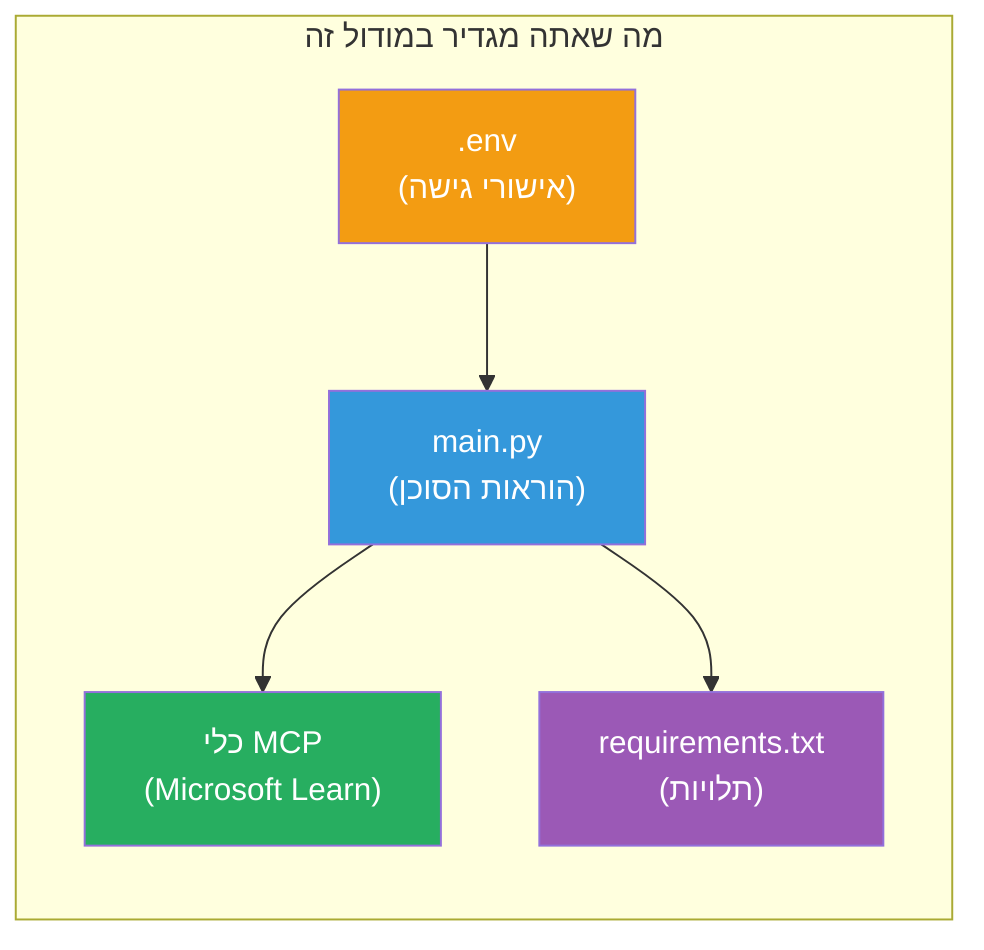

# מודול 3 - תצורת סוכנים, כלי MCP וסביבה

במודול זה, תתאים אישית את פרויקט הרב-סוכנים המוכן מראש. תכתוב הוראות לכל ארבעת הסוכנים, תגדיר את כלי MCP עבור Microsoft Learn, תגדיר משתני סביבה, ותתקין תלותיות.


> **הפניה:** הקוד המלא והעובד נמצא ב-[`PersonalCareerCopilot/main.py`](../../../../../workshop/lab02-multi-agent/PersonalCareerCopilot/main.py). השתמש בו כהפניה בעת בניית הקוד שלך.

---

## שלב 1: הגדרת משתני סביבה

1. פתח את הקובץ **`.env`** בשורש הפרויקט שלך.
2. מלא את פרטי פרויקט Foundry שלך:

   ```env
   PROJECT_ENDPOINT=https://<your-account>.services.ai.azure.com/api/projects/<your-project>
   MODEL_DEPLOYMENT_NAME=gpt-4.1-mini
   ```

3. שמור את הקובץ.

### איפה למצוא את הערכים האלה

| ערך | איך למצוא אותו |
|-------|---------------|
| **נקודת קצה של הפרויקט** | סרגל הצד של Microsoft Foundry → לחץ על הפרויקט שלך → כתובת נקודת הקצה בתצוגת הפרטים |
| **שם פריסת הדגם** | סרגל הצד של Foundry → הרחב את הפרויקט → **Models + endpoints** → שם לצד הדגם שפורס |

> **אבטחה:** אין להתחייב .env למערכת בקרת גירסאות. הוסף אותו ל-.gitignore אם הוא לא שם כבר.

### מיפוי משתני סביבה

הקובץ `main.py` של הרב-סוכנים קורא שמות של משתני סביבה סטנדרטיים וכאלה ספציפיים לסדנה:

```python
PROJECT_ENDPOINT = os.getenv("AZURE_AI_PROJECT_ENDPOINT") or os.getenv("PROJECT_ENDPOINT")
MODEL_DEPLOYMENT_NAME = os.getenv(
    "AZURE_AI_MODEL_DEPLOYMENT_NAME",
    os.getenv("MODEL_DEPLOYMENT_NAME", "gpt-4.1-mini"),
)
MICROSOFT_LEARN_MCP_ENDPOINT = os.getenv(
    "MICROSOFT_LEARN_MCP_ENDPOINT", "https://learn.microsoft.com/api/mcp"
)
```

לנקודת הקצה של MCP יש ערך ברירת מחדל הגיוני - אין צורך להגדיר אותו ב-.env אלא אם ברצונך לעקוף את זה.

---

## שלב 2: כתיבת הוראות לסוכנים

זהו השלב הקריטי ביותר. כל סוכן צריך הנחיות מעוצבות בקפידה שמגדירות את התפקיד שלו, פורמט הפלט והחוקים. פתח את `main.py` ויצור (או שנה) את הקבועים של ההוראות.

### 2.1 סוכן מנתח קורות חיים

```python
RESUME_PARSER_INSTRUCTIONS = """\
You are the Resume Parser.
Extract resume text into a compact, structured profile for downstream matching.

Output exactly these sections:
1) Candidate Profile
2) Technical Skills (grouped categories)
3) Soft Skills
4) Certifications & Awards
5) Domain Experience
6) Notable Achievements

Rules:
- Use only explicit or strongly implied evidence.
- Do not invent skills, titles, or experience.
- Keep concise bullets; no long paragraphs.
- If input is not a resume, return a short warning and request resume text.
"""
```

**למה הסעיפים האלה?** ה-MatchingAgent צריך נתונים מובנים כדי להעריך. סעיפים עקביים מאפשרים העברת מידע אמינה בין סוכנים.

### 2.2 סוכן תיאור משרה

```python
JOB_DESCRIPTION_INSTRUCTIONS = """\
You are the Job Description Analyst.
Extract a structured requirement profile from a JD.

Output exactly these sections:
1) Role Overview
2) Required Skills
3) Preferred Skills
4) Experience Required
5) Certifications Required
6) Education
7) Domain / Industry
8) Key Responsibilities

Rules:
- Keep required vs preferred clearly separated.
- Only use what the JD states; do not invent hidden requirements.
- Flag vague requirements briefly.
- If input is not a JD, return a short warning and request JD text.
"""
```

**למה לדרוש נפרד מהעדיף?** ה-MatchingAgent משתמש במשקלים שונים לכל אחד (כישורים נדרשים = 40 נקודות, כישורים מועדפים = 10 נקודות).

### 2.3 סוכן ההתאמה

```python
MATCHING_AGENT_INSTRUCTIONS = """\
You are the Matching Agent.
Compare parsed resume output vs JD output and produce an evidence-based fit report.

Scoring (100 total):
- Required Skills 40
- Experience 25
- Certifications 15
- Preferred Skills 10
- Domain Alignment 10

Output exactly these sections:
1) Fit Score (with breakdown math)
2) Matched Skills
3) Missing Skills
4) Partially Matched
5) Experience Alignment
6) Certification Gaps
7) Overall Assessment

Rules:
- Be objective and evidence-only.
- Keep partial vs missing separate.
- Keep Missing Skills precise; it feeds roadmap planning.
"""
```

**למה ניקוד מפורש?** ניקוד ניתן לשחזור מאפשר השוואת הפעלות ופתרון תקלות. סקלה של 100 נקודות קלה להבנה למשתמשים.

### 2.4 סוכן מנתח פערים

```python
GAP_ANALYZER_INSTRUCTIONS = """\
You are the Gap Analyzer and Roadmap Planner.
Create a practical upskilling plan from the matching report.

Microsoft Learn MCP usage (required):
- For EVERY High and Medium priority gap, call tool `search_microsoft_learn_for_plan`.
- Use returned Learn links in Suggested Resources.
- Prefer Microsoft Learn for free resources.

CRITICAL: You MUST produce a SEPARATE detailed gap card for EVERY skill listed in
the Missing Skills and Certification Gaps sections of the matching report. Do NOT
skip or combine gaps. Do NOT summarize multiple gaps into one card.

Output format:
1) Personalized Learning Roadmap for [Role Title]
2) One DETAILED card per gap (produce ALL cards, not just the first):
   - Skill
   - Priority (High/Medium/Low)
   - Current Level
   - Target Level
   - Suggested Resources (include Learn URL from tool results)
   - Estimated Time
   - Quick Win Project
3) Recommended Learning Order (numbered list)
4) Timeline Summary (week-by-week)
5) Motivational Note

Rules:
- Produce every gap card before writing the summary sections.
- Keep it specific, realistic, and actionable.
- Tailor to candidate's existing stack.
- If fit >= 80, focus on polish/interview readiness.
- If fit < 40, be honest and provide a staged path.
"""
```

**למה דגש על "קריטי"?** בלי הנחיות מפורשות ליצירת כל כרטיסי הפער, המודל נוטה לייצר רק 1-2 כרטיסים ולסכם את השאר. הבלוק "קריטי" מונע קיצור זה.

---

## שלב 3: הגדרת כלי MCP

GapAnalyzer משתמש בכלי הקורא לשרת [Microsoft Learn MCP](https://learn.microsoft.com/azure/foundry/agents/how-to/tools/model-context-protocol). הוסף זאת ל-`main.py`:

```python
import json
from agent_framework import tool
from mcp.client.session import ClientSession
from mcp.client.streamable_http import streamable_http_client

@tool
async def search_microsoft_learn_for_plan(
    skill: str, role: str = "", max_results: int = 5
) -> str:
    """Search Microsoft Learn MCP and return curated official links for roadmap planning."""
    query = " ".join(part for part in [skill, role, "learning path module"] if part).strip()
    query = query or "job skills learning path"

    try:
        async with streamable_http_client(MICROSOFT_LEARN_MCP_ENDPOINT) as (
            read_stream, write_stream, _,
        ):
            async with ClientSession(read_stream, write_stream) as session:
                await session.initialize()
                result = await session.call_tool(
                    "microsoft_docs_search", {"query": query}
                )

        if not result.content:
            return (
                "No results returned from Microsoft Learn MCP. "
                "Fallback: https://learn.microsoft.com/training/support/catalog-api"
            )

        payload_text = getattr(result.content[0], "text", "")
        data = json.loads(payload_text) if payload_text else {}
        items = data.get("results", [])[:max(1, min(max_results, 10))]

        if not items:
            return f"No direct Microsoft Learn results found for '{skill}'."

        lines = [f"Microsoft Learn resources for '{skill}':"]
        for i, item in enumerate(items, start=1):
            title = item.get("title") or item.get("url") or "Microsoft Learn Resource"
            url = item.get("url") or item.get("link") or ""
            lines.append(f"{i}. {title} - {url}".rstrip(" -"))
        return "\n".join(lines)
    except Exception as ex:
        return (
            f"Microsoft Learn MCP lookup unavailable. Reason: {ex}. "
            "Fallbacks: https://learn.microsoft.com/api/mcp"
        )
```

### איך הכלי עובד

| שלב | מה קורה |
|------|-------------|
| 1 | GapAnalyzer מחליט שהוא צריך משאבים לכישור מסוים (לדוגמה, "Kubernetes") |
| 2 | המסגרת קוראת ל-`search_microsoft_learn_for_plan(skill="Kubernetes")` |
| 3 | הפונקציה פותחת חיבור [Streamable HTTP](https://learn.microsoft.com/agent-framework/agents/tools/hosted-mcp-tools) ל-`https://learn.microsoft.com/api/mcp` |
| 4 | קוראת ל-`microsoft_docs_search` על [שרת MCP](https://learn.microsoft.com/azure/foundry/agents/how-to/tools/model-context-protocol) |
| 5 | שרת MCP מחזיר תוצאות חיפוש (כותרת + URL) |
| 6 | הפונקציה מעצבת את התוצאות כרשימה ממוספרת |
| 7 | GapAnalyzer משלב את ה-URLs בכרטיס הפער |

### תלותיות MCP

ספריות הלקוח של MCP כלולות בעקיפין דרך [`agent-framework-core`](https://learn.microsoft.com/agent-framework/overview/). אינך צריך להוסיף אותן ל-`requirements.txt` בנפרד. אם יש שגיאות ייבוא, בדוק:

```powershell
pip list | Select-String "mcp"
```

צפוי: החבילה `mcp` מותקנת (גרסה 1.x או מאוחרת יותר).

---

## שלב 4: חיבור הסוכנים וזרימת העבודה

### 4.1 יצירת סוכנים עם מנהלי הקשר

```python
from contextlib import asynccontextmanager

@asynccontextmanager
async def create_agents():
    async with (
        get_credential() as credential,
        AzureAIAgentClient(
            project_endpoint=PROJECT_ENDPOINT,
            model_deployment_name=MODEL_DEPLOYMENT_NAME,
            credential=credential,
        ).as_agent(
            name="ResumeParser",
            instructions=RESUME_PARSER_INSTRUCTIONS,
        ) as resume_parser,
        AzureAIAgentClient(
            project_endpoint=PROJECT_ENDPOINT,
            model_deployment_name=MODEL_DEPLOYMENT_NAME,
            credential=credential,
        ).as_agent(
            name="JobDescriptionAgent",
            instructions=JOB_DESCRIPTION_INSTRUCTIONS,
        ) as jd_agent,
        AzureAIAgentClient(
            project_endpoint=PROJECT_ENDPOINT,
            model_deployment_name=MODEL_DEPLOYMENT_NAME,
            credential=credential,
        ).as_agent(
            name="MatchingAgent",
            instructions=MATCHING_AGENT_INSTRUCTIONS,
        ) as matching_agent,
        AzureAIAgentClient(
            project_endpoint=PROJECT_ENDPOINT,
            model_deployment_name=MODEL_DEPLOYMENT_NAME,
            credential=credential,
        ).as_agent(
            name="GapAnalyzer",
            instructions=GAP_ANALYZER_INSTRUCTIONS,
            tools=[search_microsoft_learn_for_plan],
        ) as gap_analyzer,
    ):
        yield resume_parser, jd_agent, matching_agent, gap_analyzer
```

**נקודות מפתח:**
- לכל סוכן יש מופע **שלו** של `AzureAIAgentClient`
- רק GapAnalyzer מקבל `tools=[search_microsoft_learn_for_plan]`
- `get_credential()` מחזיר [`ManagedIdentityCredential`](https://learn.microsoft.com/python/api/overview/azure/identity-readme#managed-identity-support) באז'ור, ו-[`DefaultAzureCredential`](https://learn.microsoft.com/azure/developer/python/sdk/authentication/credential-chains#defaultazurecredential-overview) בסביבה מקומית

### 4.2 בניית גרף זרימת העבודה

```python
def create_workflow(resume_parser, jd_agent, matching_agent, gap_analyzer):
    workflow = (
        WorkflowBuilder(
            name="ResumeJobFitEvaluator",
            start_executor=resume_parser,
            output_executors=[gap_analyzer],
        )
        .add_edge(resume_parser, jd_agent)
        .add_edge(resume_parser, matching_agent)
        .add_edge(jd_agent, matching_agent)
        .add_edge(matching_agent, gap_analyzer)
        .build()
    )
    return workflow.as_agent()
```

> ראה [Workflows as Agents](https://learn.microsoft.com/agent-framework/workflows/as-agents) כדי להבין את תבנית `.as_agent()`.

### 4.3 הפעלת השרת

```python
async def main() -> None:
    validate_configuration()
    async with create_agents() as (resume_parser, jd_agent, matching_agent, gap_analyzer):
        agent = create_workflow(resume_parser, jd_agent, matching_agent, gap_analyzer)
        from azure.ai.agentserver.agentframework import from_agent_framework
        await from_agent_framework(agent).run_async()

if __name__ == "__main__":
    asyncio.run(main())
```

---

## שלב 5: יצירת והפעלת סביבה וירטואלית

### 5.1 יצירת הסביבה

```powershell
cd workshop\lab02-multi-agent\PersonalCareerCopilot
python -m venv .venv
```

### 5.2 הפעלתה

**PowerShell (Windows):**
```powershell
.\.venv\Scripts\Activate.ps1
```

**macOS/Linux:**
```bash
source .venv/bin/activate
```

### 5.3 התקנת תלותיות

```powershell
pip install -r requirements.txt
```

> **הערה:** השורה `agent-dev-cli --pre` ב-`requirements.txt` מבטיחה שהגרסה המקדימה העדכנית ביותר מותקנת. נדרש זאת לתאימות עם `agent-framework-core==1.0.0rc3`.

### 5.4 אימות ההתקנה

```powershell
pip list | Select-String "agent-framework|agentserver|agent-dev"
```

פלט צפוי:
```
agent-dev-cli                  0.0.1b260316
agent-framework-azure-ai       1.0.0rc3
agent-framework-core            1.0.0rc3
azure-ai-agentserver-agentframework 1.0.0b16
azure-ai-agentserver-core      1.0.0b16
```

> **אם `agent-dev-cli` מציג גרסה ישנה יותר** (למשל, `0.0.1b260119`), Agent Inspector יכשל עם שגיאות 403/404. שדרוג: `pip install agent-dev-cli --pre --upgrade`

---

## שלב 6: אימות הזדהות

הפעל את אותה בדיקה של הזדהות מ-Lab 01:

```powershell
az account show --query "{name:name, id:id}" --output table
```

אם זה נכשל, הרץ [`az login`](https://learn.microsoft.com/cli/azure/authenticate-azure-cli-interactively).

לזרימות עבודה רב-סוכניות, כל ארבעת הסוכנים משתמשים באותו האישוי. אם ההזדהות עובדת לאחד, היא עובדת לכולם.

---

### נקודת בדיקה

- [ ] `.env` מכיל ערכים תקינים של `PROJECT_ENDPOINT` ו-`MODEL_DEPLOYMENT_NAME`
- [ ] כל ארבעת קבועי ההוראות לסוכנים מוגדרים ב-`main.py` (ResumeParser, JD Agent, MatchingAgent, GapAnalyzer)
- [ ] כלי MCP בשם `search_microsoft_learn_for_plan` מוגדר ונרשם ל-GapAnalyzer
- [ ] `create_agents()` יוצר את כל ארבעת הסוכנים עם מופעי `AzureAIAgentClient` נפרדים
- [ ] `create_workflow()` בונה את הגרף המתאים עם `WorkflowBuilder`
- [ ] הסביבה הווירטואלית נוצרה והופעלה (`(.venv)` נראה)
- [ ] הפקודה `pip install -r requirements.txt` הושלמה ללא שגיאות
- [ ] `pip list` מראה את כל החבילות הצפויות בגרסאות הנכונות (rc3 / b16)
- [ ] `az account show` מחזיר את המנוי שלך

---

**קודם:** [02 - Scaffold Multi-Agent Project](02-scaffold-multi-agent.md) · **הבא:** [04 - Orchestration Patterns →](04-orchestration-patterns.md)

---

<!-- CO-OP TRANSLATOR DISCLAIMER START -->
**כתב ויתור**:  
מסמך זה תורגם באמצעות שירות תרגום מבוסס בינה מלאכותית [Co-op Translator](https://github.com/Azure/co-op-translator). בעוד שאנו שואפים לדיוק, יש לקחת בחשבון כי תרגומים אוטומטיים עלולים להכיל שגיאות או אי דיוקים. המסמך המקורי בשפה המקורית שלו נחשב למקור הסמכותי. למידע קריטי מומלץ להשתמש בתרגום מקצועי על ידי אדם. אנחנו לא אחראים להבדלים או אי הבנות הנובעים משימוש בתרגום זה.
<!-- CO-OP TRANSLATOR DISCLAIMER END -->