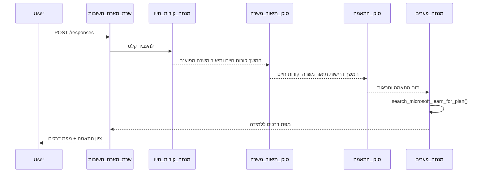

# מודול 3 - קביעת הוראות, סביבה והתקנת תלותים

⏱️ ~15 דקות

במודול זה, תמיר את השלד שנבנה לזרימת עבודה רב-סוכנים **שלך** - על ידי הגדרת משתני סביבה, כתיבת הוראות סוכן, הוספת כלי MCP, חיבור גרף הזרימה והתקנת התלותים.

> **הפניה:** הקוד המלא עובד נמצא ב-[`PersonalCareerCopilot/main.py`](../../../../../workshop/lab02-multi-agent/PersonalCareerCopilot/main.py). השתמש בו כהפניה בעת בניית גרף הזרימה וחסימות הפרומפט שלך.

---

## כיצד ארבעת הסוכנים משתלבים יחד


```mermaid
sequenceDiagram
    participant User
    participant Server as שרת_מארח_תשובות
    participant RP as מנתח_קורות_חייו
    participant JD as סוכן_תיאור_משרה
    participant MA as סוכן_התאמה
    participant GA as מנתח_פערים

    User->>Server: POST /responses
    Server->>RP: להעביר קלט
    RP-->>JD: המשך קורות חיים ותיאור משרה מפוענח
    JD-->>MA: המשך דרישות תיאור משרה וקורות חיים
    MA-->>GA: דוח התאמה וחריגות
    GA->>GA: search_microsoft_learn_for_plan()
    GA-->>Server: מפת דרכים ללמידה
    Server-->>User: ציון התאמה + מפת דרכים
```

---

## שלב 1: הגדר משתני סביבה

1. פתח את הקובץ **`.env`** בשורש הפרויקט שלך (נוצר על ידי אשף השלד).
2. החלף את המידע המייצג בערכים האמיתיים שלך מ-מעבדה 01.

<details open>
<summary><strong>🅰️ דרך א - מנוי Foundry</strong></summary>

```env
FOUNDRY_PROJECT_ENDPOINT=https://<your-account>.services.ai.azure.com/api/projects/<your-project>
AZURE_AI_MODEL_DEPLOYMENT_NAME=gpt-4.1-mini
```

> **היכן למצוא ערכים:** ראה [מעבדה 01, מודול 1](../../lab01-single-agent/docs/01-setup.md#deploy-a-model--assign-rbac).

</details>

<details open>
<summary><strong>🅱️ דרך ב - Foundry מקומי</strong></summary>

```env
FOUNDRY_PROJECT_ENDPOINT=http://localhost:5273/v1
AZURE_AI_MODEL_DEPLOYMENT_NAME=phi-4-mini
```

> כל ההסקות מתבצעות על המכשיר שלך - אין נתונים שיוצאים מהמכשיר. הרץ `foundry model list` כדי לאשר את כינוי המודל המדויק. הקריאה היחידה החוצה היא קריאת כלי MCP ל- `https://learn.microsoft.com/api/mcp`.

> **היכן למצוא ערכים:** ראה [מעבדה 01, מודול 1 - דרך מקומית](../../lab01-single-agent/docs/01-setup.md#step-2-set-up-based-on-your-access).

</details>

> **אבטחה:** לעולם אל תכלול `.env` בבקרת גרסאות. הוא אמור כבר להיות ב- `.gitignore`.

---

## שלב 2: כתיבת הוראות סוכן

ההוראות מגדירות את תפקיד כל סוכן, פורמט הפלט והכללים. פתח את `main.py` והגדר (או החלף) את ארבעת הקבועים של ההוראות - המחרוזות המלאות נמצאות ב- [`PersonalCareerCopilot/main.py`](../../../../../workshop/lab02-multi-agent/PersonalCareerCopilot/main.py).

### 2.1 `RESUME_PARSER_INSTRUCTIONS`
מפרש את קורות החיים לפרופיל מועמד במבנה **וגם** מעתיק את תיאור התפקיד במדויק אל `[JOB DESCRIPTION PASS-THROUGH]`. שני החלקים המסומנים חייבים להופיע בפלט.

> **למה העברת הפלט?** עם `context_mode="last_agent"`, ResumeParser הוא ה**יחיד** שרואה את הודעת המשתמש המקורית. אם הוא לא מעתיק את תיאור התפקיד קדימה, הסוכנים הבאים לעולם לא רואים אותו.

### 2.2 `JOB_DESCRIPTION_INSTRUCTIONS`
קורא את `[PARSED RESUME]` ואת `[JOB DESCRIPTION PASS-THROUGH]` מפלט ResumeParser. מפיק את `[JD REQUIREMENTS]` (דרישות במבנה מסודר) ואת `[PARSED RESUME PASS-THROUGH]` (עותק מדויק של קורות החיים ל-MatchingAgent).

### 2.3 `MATCHING_AGENT_INSTRUCTIONS`
קורא את `[JD REQUIREMENTS]` ואת `[PARSED RESUME PASS-THROUGH]`. מפיק דוח התאמה עם ניקוד (0–100) עם חישובי פירוט, כישורים מותאמים, כישורים חסרים, והתאמת ניסיון.

### 2.4 `GAP_ANALYZER_INSTRUCTIONS`
קורא את דוח ההתאמה. עבור **כל** כישור חסר, מפעיל את `search_microsoft_learn_for_plan` כדי להביא משאבי למידה מ-Microsoft Learn. מפיק כרטיס פער מפורט לכל כישור בנוסף למפת דרכים לימודית שבועית.

---

## שלב 3: הוסף את כלי MCP

ה-GapAnalyzer קורא לשרת MCP של [Microsoft Learn](https://learn.microsoft.com/azure/foundry/agents/how-to/tools/model-context-protocol) כדי להביא משאבי למידה אמיתיים לכל פער כישורים. הפונקציה המלאה `search_microsoft_learn_for_plan` נמצאת ב- [`PersonalCareerCopilot/main.py`](../../../../../workshop/lab02-multi-agent/PersonalCareerCopilot/main.py).

רישום הכלי על GapAnalyzer בעת יצירת הסוכן:

```python
gap_analyzer = Agent(
    client=client,
    instructions=GAP_ANALYZER_INSTRUCTIONS,
    name="GapAnalyzer",
    tools=[search_microsoft_learn_for_plan],
)
```

> ראה ב-[`PersonalCareerCopilot/main.py`](../../../../../workshop/lab02-multi-agent/PersonalCareerCopilot/main.py) את גרף `WorkflowBuilder` המלא עם `FoundryChatClient`, `AgentExecutor` וכל קריאות `add_edge()`.

---

## שלב 4: צור סביבה וירטואלית והתקן תלותים

> ⚠️ **אל תדלג על שלב זה.** בלי התקנת תלותים, ניפוי שגיאות עם F5 ייכשל.

### 4.1 צור את הסביבה הווירטואלית

```powershell
python -m venv .venv
```

### 4.2 הפעל אותה

| מערכת הפעלה | פקודה |
|----|---------|
| **Windows (PowerShell)** | `.\.venv\Scripts\Activate.ps1` |
| **Windows (CMD)** | `.venv\Scripts\activate.bat` |
| **macOS / Linux** | `source .venv/bin/activate` |

עליך לראות `(.venv)` בקידומת הטרמינל שלך.

### 4.3 התקן תלותים

```powershell
pip install -r requirements.txt
```

### 4.4 אמת

```powershell
pip list | Select-String "agent-framework|mcp|debugpy"
```

צפוי: `agent-framework-foundry`, `agent-framework-foundry-hosting`, `mcp` ו- `debugpy` מופיעים ברשימה.

---

## שלב 5: אמת את האימות

<details open>
<summary><strong>🅰️ דרך א - קרדנציאל Azure</strong></summary>

```powershell
az account show --query "{name:name, id:id}" --output table
```

אם זה נכשל, הרץ את [`az login`](https://learn.microsoft.com/cli/azure/authenticate-azure-cli-interactively).

כל ארבעת הסוכנים משתמשים ב-`FoundryChatClient` אחד וב-`DefaultAzureCredential` אחד. אם האימות עובד לאחד, הוא עובד לכולם.

</details>

<details open>
<summary><strong>🅱️ דרך ב - Foundry מקומי</strong></summary>

אין צורך באימות לניסויים מקומיים.

</details>

---

### ✅ נקודת בדיקה

> אל תמשיך למודול 04 עד ש: **(1)** `(.venv)` נראה בקידומת שלך ו- **(2)** `pip install -r requirements.txt` הושלם בהצלחה.

- [ ] ל- `.env` יש נקודת קצה ושם פריסה של מודל תקינים (לא ערכי מ"מ)
- [ ] כל 4 קבועי הוראות הסוכן מוגדרים ב- `main.py` (ResumeParser, JD Agent, MatchingAgent, GapAnalyzer)
- [ ] כלי MCP `search_microsoft_learn_for_plan` מוגדר ונרשם על GapAnalyzer
- [ ] אובייקטים `FoundryChatClient` + 4 `Agent` + 4 `AgentExecutor` נוצרו ב- `main()`
- [ ] `WorkflowBuilder` בונה את גרף הרצף הנכון עם כל 3 הקריאות ל- `add_edge()`
- [ ] סביבה וירטואלית נוצרה והופעלה (`(.venv)` נראה בקידומת)
- [ ] `pip install -r requirements.txt` הושלם ללא שגיאות
- [ ] **דרך א:** `az account show` מצליח או שסמל החשבונות ב-VS Code מראה חשבון מחובר

---

**קודם:** [02 - Scaffold Multi-Agent Project](02-scaffold-multi-agent.md) · **הבא:** [04 - Orchestration Patterns →](04-orchestration-patterns.md)

---

<!-- CO-OP TRANSLATOR DISCLAIMER START -->
**כתב ויתור**:
מסמך זה תורגם באמצעות שירות תרגום אוטומטי [Co-op Translator](https://github.com/Azure/co-op-translator). למרות שאנו שואפים לדיוק, יש לקחת בחשבון שתרגומים אוטומטיים עלולים להכיל שגיאות או אי-דיוקים. יש להחשיב את המסמך המקורי בשפתו הטבעית כמקור הסמכות. למידע קריטי מומלץ להשתמש בתרגום מקצועי על ידי מתרגם אדם. אנו לא אחראים לכל אי-הבנה או פירוש שגוי הנובע מהשימוש בתרגום זה.
<!-- CO-OP TRANSLATOR DISCLAIMER END -->