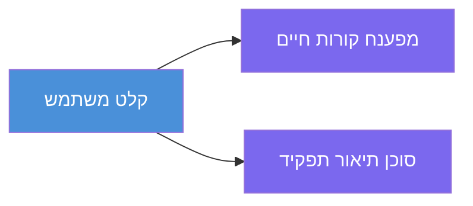
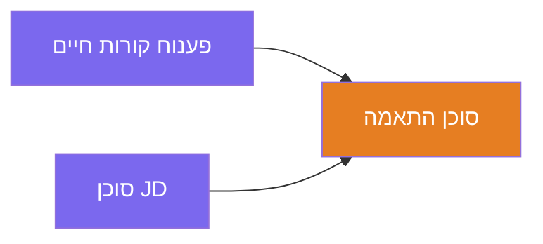
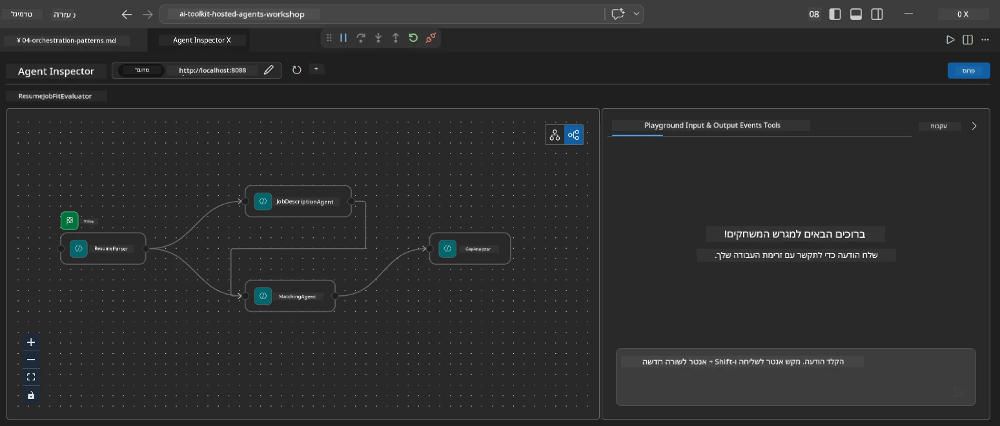
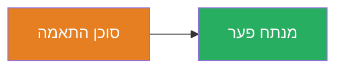
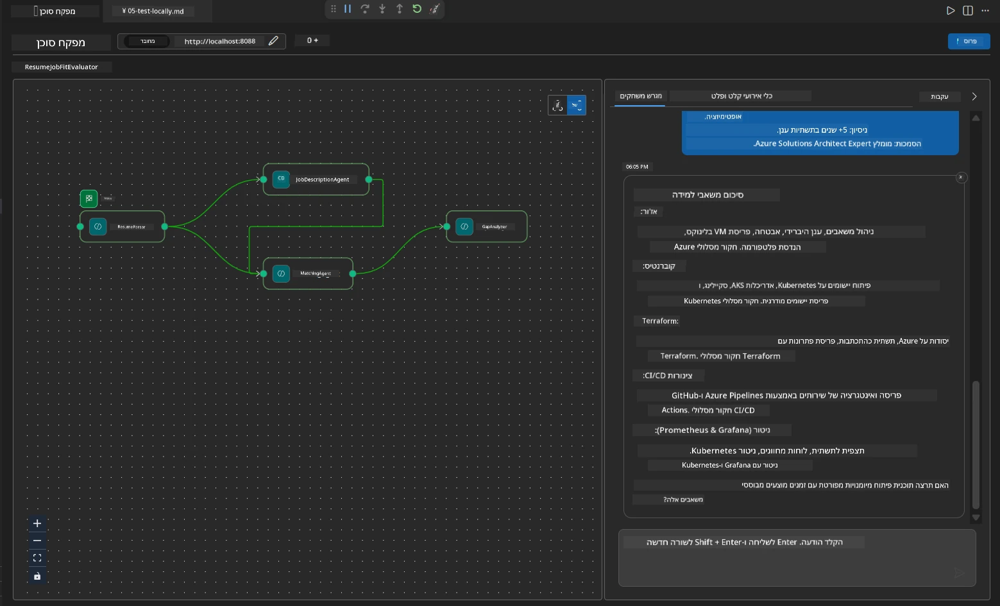

# מודול 4 - דפוסי תזמור

במודול זה, אתם חוקרים את דפוסי התזמור המשמשים ב-Resume Job Fit Evaluator ולומדים כיצד לקרוא, לשנות ולהרחיב את גרף זרימת העבודה. הבנת דפוסים אלו חיונית לאיתור תקלות בזרימת נתונים ולבניית [זרימות עבודה מרובות סוכנים](https://learn.microsoft.com/agent-framework/workflows/) משלכם.

---

## דפוס 1: פאן-אאוט (פיצול במקביל)

הדפוס הראשון בזרימת העבודה הוא **פאן-אאוט** - קלט יחיד נשלח למספר סוכנים במקביל.


בקוד, זה קורה משום ש-`resume_parser` הוא ה-`start_executor` - הוא מקבל קודם כל את הודעת המשתמש. לאחר מכן, משום של-`jd_agent` ו-`matching_agent` יש קשתות מ-`resume_parser`, המסגרת מפנה את הפלט של `resume_parser` לשניהם:

```python
.add_edge(resume_parser, jd_agent)         # פלט ResumeParser → סוכן JD
.add_edge(resume_parser, matching_agent)   # פלט ResumeParser → MatchingAgent
```

**למה זה עובד:** ResumeParser ו-JD Agent מעבדים היבטים שונים של אותו הקלט. הרצתם במקביל מפחיתה את ההשהיה הכוללת לעומת הרצה סדרתית.

### מתי להשתמש בפאן-אאוט

| מקרה שימוש | דוגמה |
|----------|---------|
| משימות משנה עצמאיות | ניתוח קורות חיים לעומת ניתוח JD |
| רדונדנציה / הצבעה | שני סוכנים מנתחים את אותם הנתונים, סוכן שלישי בוחר את התשובה הטובה ביותר |
| פלט בפורמטים מרובים | סוכן אחד מייצר טקסט, וסוכן אחר מייצר JSON מובנה |

---

## דפוס 2: פאן-אין (אגרגציה)

הדפוס השני הוא **פאן-אין** - פלטים של מספר סוכנים נאספים ונשלחים לסוכן אחד שיושב ממש לאחריהם.


בקוד:

```python
.add_edge(resume_parser, matching_agent)   # פלט ResumeParser → MatchingAgent
.add_edge(jd_agent, matching_agent)        # פלט JD Agent → MatchingAgent
```

**התנהגות עיקרית:** כאשר לסוכן יש **שתי קשתות נכנסות או יותר**, המסגרת מחכה אוטומטית שכל הסוכנים שמעליו יסיימו לפני שהיא מריצה את הסוכן התחתון. MatchingAgent לא מתחיל עד ששני ה-ResumeParser וה-JD Agent סיימו.

### מה MatchingAgent מקבל

המסגרת מחברת את הפלטים מכל הסוכנים שנמצאים מעל. הקלט של MatchingAgent נראה כך:

```
[ResumeParser output]
---
Candidate Profile:
  Name: Jane Doe
  Technical Skills: Python, Azure, Kubernetes, ...
  ...

[JobDescriptionAgent output]
---
Role Overview: Senior Cloud Engineer
Required Skills: Python, Azure, Terraform, ...
...
```

> **הערה:** פורמט ההדבקה המדויק תלוי בגרסת המסגרת. ההוראות לסוכן צריכות להיות מנוסחות לטיפול גם בפלט מובנה וגם בפלט לא מובנה מהסוכנים שמעליו.



---

## דפוס 3: שרשור סדרתי

הדפוס השלישי הוא **שרשור סדרתי** - הפלט של סוכן אחד מוזן ישירות לסוכן הבא.


בקוד:

```python
.add_edge(matching_agent, gap_analyzer)    # פלט MatchingAgent → GapAnalyzer
```

זה הדפוס הפשוט ביותר. GapAnalyzer מקבל את ציון ההתאמה, הכישורים המתאימים/החסרים, והפערים מ-MatchingAgent. לאחר מכן קורא לכלי ה-[MCP](https://learn.microsoft.com/azure/foundry/agents/how-to/tools/model-context-protocol) עבור כל פער כדי להביא משאבי Microsoft Learn.

---

## הגרף המלא

שילוב של כל שלושת הדפוסים יוצר את זרימת העבודה המלאה:

```mermaid
flowchart TD
    A["קלט משתמש"] --> B["מנתח קורות חיים"]
    A --> C["סוכן JD"]
    B -->|"פרופיל מפורש"| D["סוכן התאמה"]
    C -->|"דרישות מפורשות"| D
    D -->|"דו"ח התאמה + פערים"| E["מנתח פערים
    (+ כלי MCP)"]
    E --> F["פלט סופי"]

    style A fill:#4A90D9,color:#fff
    style B fill:#7B68EE,color:#fff
    style C fill:#7B68EE,color:#fff
    style D fill:#E67E22,color:#fff
    style E fill:#27AE60,color:#fff
    style F fill:#4A90D9,color:#fff
```
### ציר זמן ביצוע

```mermaid
gantt
    title ציר זמן ביצוע סוכן
    dateFormat X
    axisFormat %s

    section מקביל
    Resume Parser       :rp, 0, 3
    JD Agent            :jd, 0, 2

    section רציף
    Matching Agent      :ma, 3, 5
    Gap Analyzer        :ga, 5, 9
```


> זמן קיר כולל הוא בערך `max(ResumeParser, JD Agent) + MatchingAgent + GapAnalyzer`. GapAnalyzer הוא בדרך כלל האיטי ביותר משום שהוא מבצע מספר קריאות לכלי MCP (אחת לכל פער).

---

## קריאת קוד WorkflowBuilder

להלן הפונקציה המלאה `create_workflow()` מתוך `main.py`, עם הערות:

```python
def create_workflow(resume_parser, jd_agent, matching_agent, gap_analyzer):
    workflow = (
        WorkflowBuilder(
            name="ResumeJobFitEvaluator",

            # הסוכן הראשון לקבל את קלט המשתמש
            start_executor=resume_parser,

            # הסוכן(ים) שהתוצאה שלהם הופכת לתגובה הסופית
            output_executors=[gap_analyzer],
        )
        # פיזור יציאות: הפלט של ResumeParser עובר גם ל-JD Agent וגם ל-MatchingAgent
        .add_edge(resume_parser, jd_agent)
        .add_edge(resume_parser, matching_agent)

        # איחוד כניסות: MatchingAgent מחכה גם ל-ResumeParser וגם ל-JD Agent
        .add_edge(jd_agent, matching_agent)

        # ריצתי: פלט MatchingAgent מוזן ל-GapAnalyzer
        .add_edge(matching_agent, gap_analyzer)

        .build()
    )
    return workflow.as_agent()
```

### טבלת סיכום הקשתות

| # | קשת | דפוס | השפעה |
|---|------|---------|--------|
| 1 | `resume_parser → jd_agent` | פאן-אאוט | JD Agent מקבל את הפלט של ResumeParser (בנוסף לקלט המקורי של המשתמש) |
| 2 | `resume_parser → matching_agent` | פאן-אאוט | MatchingAgent מקבל את הפלט של ResumeParser |
| 3 | `jd_agent → matching_agent` | פאן-אין | MatchingAgent גם מקבל את הפלט של JD Agent (ממתין לשניהם) |
| 4 | `matching_agent → gap_analyzer` | סדרתי | GapAnalyzer מקבל את דוח ההתאמה + רשימת הפערים |

---

## שינוי הגרף

### הוספת סוכן חדש

כדי להוסיף סוכן חמישי (לדוגמה, **InterviewPrepAgent** שיוצר שאלות ראיונות בהתבסס על ניתוח הפערים):

```python
# 1. הגדר הוראות
INTERVIEW_PREP_INSTRUCTIONS = """\
You are the Interview Prep Agent.
Given a gap analysis and fit report, generate 10 targeted interview questions
the candidate should prepare for.
"""

# 2. צור את הסוכן (בתוך בלוק async with)
AzureAIAgentClient(
    project_endpoint=PROJECT_ENDPOINT,
    model_deployment_name=MODEL_DEPLOYMENT_NAME,
    credential=credential,
).as_agent(
    name="InterviewPrepAgent",
    instructions=INTERVIEW_PREP_INSTRUCTIONS,
) as interview_prep,

# 3. הוסף קשתות ב-create_workflow()
.add_edge(matching_agent, interview_prep)   # מקבל דוח התאמה
.add_edge(gap_analyzer, interview_prep)     # גם מקבל כרטיסי פערים

# 4. עדכן output_executors
output_executors=[interview_prep],  # עכשיו הסוכן הסופי
```

### שינוי סדר ביצוע

כדי ש-JD Agent ירוץ **אחרי** ResumeParser (סדרתי במקום במקביל):

```python
# הסר: .add_edge(resume_parser, jd_agent)  ← כבר קיים, יש להשאיר אותו
# הסר את המקביליות המובלעת על ידי כך ש-jd_agent לא יקבל קלט משתמש ישירות
# ה-start_executor שולח קודם כל ל-resume_parser, ו-jd_agent מקבל רק
# את הפלט של resume_parser דרך הקשת. זה גורם להם להיות רציפים.
```

> **חשוב:** ה-`start_executor` הוא הסוכן היחיד שמקבל את קלט המשתמש הגולמי. כל שאר הסוכנים מקבלים פלט מקשתות שמעליהם. אם רוצים שסוכן יקבל גם את הקלט הגולמי, עליו לקבל קשת מ-`start_executor`.

---

## טעויות נפוצות בגרף

| טעות | סימפטום | תיקון |
|---------|---------|-----|
| קשת חסרה ל-`output_executors` | הסוכן רץ אבל הפלט ריק | ודא שיש מסלול מ-`start_executor` לכל סוכן ב-`output_executors` |
| תלות מעגלית | לולאה אינסופית או תזמון מחדש | בדוק שאין סוכן שמזין חזרה לסוכן שמעליו |
| סוכן ב-`output_executors` ללא קשת נכנסת | פלט ריק | הוסף לפחות קשת אחת `add_edge(source, that_agent)` |
| מספר `output_executors` ללא פאן-אין | הפלט כולל רק תגובה של סוכן אחד | השתמש בסוכן פלט יחיד שמאגד, או קבל פלט מרובה |
| חסר `start_executor` | `ValueError` בזמן בנייה | תמיד ציין `start_executor` ב-`WorkflowBuilder()` |

---

## איתור תקלות בגרף

### שימוש ב-Agent Inspector

1. הפעל את הסוכן באופן מקומי (F5 או טרמינל - ראה [מודול 5](05-test-locally.md)).
2. פתח את Agent Inspector (`Ctrl+Shift+P` → **Foundry Toolkit: Open Agent Inspector**).
3. שלח הודעת בדיקה.
4. בפאנל התגובה של ה-Inspector, חפש את **פלט הזרימה** - הוא מציג את תרומת כל סוכן ברצף.



### שימוש בלוגים

הוסף לוגר ל-`main.py` למעקב אחר זרימת הנתונים:

```python
import logging
logger = logging.getLogger("resume-job-fit")

# ב-create_workflow(), לאחר הבנייה:
logger.info("Workflow graph built with edges: RP→JD, RP→MA, JD→MA, MA→GA")
```

יומני השרת מראים את סדר הרצת הסוכנים וקריאות הכלי MCP:

```
INFO:resume-job-fit:Starting Resume -> Job Fit Evaluator HTTP server...
INFO:resume-job-fit:Server running on http://localhost:8088
INFO:agent_framework:Executing agent: ResumeParser
INFO:agent_framework:Executing agent: JobDescriptionAgent
INFO:agent_framework:Waiting for upstream agents: ResumeParser, JobDescriptionAgent
INFO:agent_framework:Executing agent: MatchingAgent
INFO:agent_framework:Executing agent: GapAnalyzer
INFO:agent_framework:Tool call: search_microsoft_learn_for_plan(skill="Kubernetes")
POST https://learn.microsoft.com/api/mcp → 200
INFO:agent_framework:Tool call: search_microsoft_learn_for_plan(skill="Terraform")
POST https://learn.microsoft.com/api/mcp → 200
```

---

### נקודת בדיקה

- [ ] ניתן לזהות את שלושת דפוסי התזמור בזרימת העבודה: פאן-אאוט, פאן-אין, ושרשור סדרתי
- [ ] מבינים שסוכנים עם כמה קשתות נכנסות ממתינים שכל הסוכנים שמעליהם יסיימו
- [ ] ניתן לקרוא את קוד `WorkflowBuilder` ולמפות כל קריאה ל-`add_edge()` לגרף הוויזואלי
- [ ] מבינים את ציר זמן הביצוע: סוכנים במקביל רצים ראשונים, אחר כך אגרגציה, אחר כך סדרתי
- [ ] יודעים איך להוסיף סוכן חדש לגרף (להגדיר הוראות, ליצור סוכן, להוסיף קשתות, לעדכן פלט)
- [ ] יכולים לזהות טעויות נפוצות בגרף ואת הסימפטומים שלהם

---

**קודם:** [03 - Configure Agents & Environment](03-configure-agents.md) · **הבא:** [05 - Test Locally →](05-test-locally.md)

---

<!-- CO-OP TRANSLATOR DISCLAIMER START -->
**כתב ויתור**:  
מסמך זה תורגם באמצעות שירות תרגום מבוסס בינה מלאכותית [Co-op Translator](https://github.com/Azure/co-op-translator). בעוד שאנו שואפים לדיוק, יש לקחת בחשבון שתרגומים אוטומטיים עלולים להכיל שגיאות או אי-דיוקים. המסמך המקורי בשפת המקור נחשב למקור הרשמי. למידע קריטי מומלץ להשתמש בתרגום מקצועי על ידי אדם. אנו לא אחראים לאי-הבנות או לפרשנויות שגויות הנובעות משימוש בתרגום זה.
<!-- CO-OP TRANSLATOR DISCLAIMER END -->