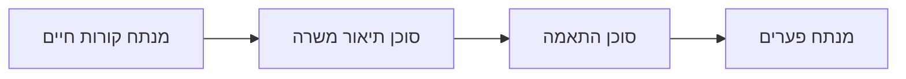
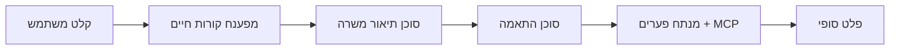

# מודול 4 - תבניות תאום

⏱️ ~10 דקות

במודול זה, תחקור את דפוסי התיאום בהם משתמש Evaluator התאמת משרה וקורות חיים ותלמד כיצד לקרוא, לשנות ולהרחיב את גרף זרימת העבודה. הבנת דפוסים אלה חיונית לאבחון בעיות זרימת נתונים ולבניית [זרימות עבודה מרובות סוכנים](https://learn.microsoft.com/agent-framework/workflows/) משלך.

---

## דפוס 1: שרשרת סידורית

הדפוס הבסיסי בזרימת העבודה הוא **שרשרת סידורית** - הפלט של כל סוכן זורם ישירות לסוכן הבא.


```mermaid
flowchart LR
    RP[מנתח קורות חיים] --> JD[סוכן תיאור משרה]
    JD --> MA[סוכן התאמה]
    MA --> GA[מנתח פערים]
```

בקוד, כל קריאה ל-`add_edge()` יוצרת שלב בשרשרת:

```python
.add_edge(resume_executor, jd_executor)       # פלט ResumeParser → סוכן JD
.add_edge(jd_executor, matching_executor)     # פלט סוכן JD → סוכן התאמה
.add_edge(matching_executor, gap_executor)    # פלט סוכן התאמה → מנתח פערים
```

> **מדוע סידורית, ולא פיזור/איסוף?** `WorkflowBuilder` משתמש ב**משמעות OR** לקשתות נכנסות: מפעיל במורד הזרם יופעל ברגע ש-**כל** מקדים יסתיים. אם ל-`matching_executor` היו שתי קשתות נכנסות (גם מ-`resume_executor` וגם מ-`jd_executor`), הוא היה מופעל פעמיים - פעם כאשר ResumeParser מסתיים ושוב כאשר JD Agent מסתיים - מה שיגרום ל-GapAnalyzer לפעול פעמיים ולהופעת הפלט פעמיים. הצינור הסידורית מונעת זאת לחלוטין.

## דפוס 2: העברת תוכן

מכיוון ש-`context_mode="last_agent"` אומר שכל מפעיל רואה רק את הפלט של **המקדים הישיר שלו**, סוכנים בשרשרת סידורית חייבים להעביר במפורש כל נתון שסוכנים במורד הזרם צריכים.

בזרימת העבודה הזו:
- **ResumeParser** מעתיק את תיאור המשרה במדויק ל-`[JOB DESCRIPTION PASS-THROUGH]` (כדי ש-JD Agent יוכל למצוא אותו).
- **JD Agent** מעתיק את `[PARSED RESUME]` במדויק ל-`[PARSED RESUME PASS-THROUGH]` (כדי ש-MatchingAgent יוכל להשוות בין שני הפרופילים).

```
ResumeParser output
└─ [PARSED RESUME]               ← extracted by JD Agent
└─ [JOB DESCRIPTION PASS-THROUGH] ← extracted by JD Agent

JD Agent output
└─ [JD REQUIREMENTS]             ← extracted by MatchingAgent
└─ [PARSED RESUME PASS-THROUGH]  ← extracted by MatchingAgent
```

כל קטע העברה חייב להיות מועתק **בדיוק כפי שהוא** - סיכום או פרפרזה שלו עלולים לשבור את הסוכן במורד הזרם שתלוי בו.

---

## הגרף המלא

שילוב דפוסי השרשרת הסידורית והעברת תוכן מייצר את זרימת העבודה המלאה:


```mermaid
flowchart LR
    U[קלט משתמש] --> RP[מפענח קורות חיים]
    RP --> JD[סוכן תיאור משרה]
    JD --> MA[סוכן התאמה]
    MA --> GA[מנתח פערים + MCP]
    GA --> O[פלט סופי]
```

Agent Inspector מציג את מבנה הגרף הזה כאשר הסוכן רץ מקומית. עיין ב-[מודול 5 - בדיקה מקומית](05-test-locally.md) עבור צילומי מסך.

---

## קריאת קוד WorkflowBuilder

הפונקציה המלאה `create_workflow()` נמצאת בקובץ [`PersonalCareerCopilot/main.py`](../../../../../workshop/lab02-multi-agent/PersonalCareerCopilot/main.py). שלוש הקריאות ל-`add_edge()` בונות את הצינור הסידורי:

| # | קשת | אפקט |
|---|-----|-------|
| 1 | `resume_executor → jd_executor` | JD Agent מקבל `[PARSED RESUME]` + `[JOB DESCRIPTION PASS-THROUGH]` |
| 2 | `jd_executor → matching_executor` | MatchingAgent מקבל `[JD REQUIREMENTS]` + `[PARSED RESUME PASS-THROUGH]` |
| 3 | `matching_executor → gap_executor` | GapAnalyzer מקבל דוח התאמה + רשימת פערים |

---

## שינוי הגרף

### הוספת סוכן חדש

להוספת סוכן חמישי (למשל, **InterviewPrepAgent** לאחר GapAnalyzer):

1. הגדר קבוע `INTERVIEW_PREP_INSTRUCTIONS`.
2. צור אובייקטים של `Agent` + `AgentExecutor` (אותו דפוס כארבעת הקיימים).
3. הוסף `.add_edge(gap_executor, interview_exec)` בתוך `WorkflowBuilder`.
4. עדכן `output_executors=[interview_exec]`.

> **חשוב:** `start_executor` הוא הסוכן היחיד שמקבל קלט ישיר מהמשתמש. כל שאר הסוכנים מקבלים פלט מהקשת שלהם כלפי מעלה.

---

## טעויות נפוצות בגרף

| טעות | סימפטום | תיקון |
|--------|---------|-------|
| חסר קשת ל-`output_executors` | הסוכן פועל אך הפלט ריק | וודא שיש נתיב מ-`start_executor` לכל סוכן ב-`output_executors` |
| תלות מעגלית | לולאה אינסופית או תום זמן | בדוק שאין סוכן שמזין חזרה לסוכן כלפי מעלה |
| סוכן ב-`output_executors` ללא קשת נכנסת | פלט ריק | הוסף לפחות קשת אחת `add_edge(source, that_agent)` |
| מספר `output_executors` ללא מיזוג תוצאות | הפלט מכיל תגובה של סוכן יחיד בלבד | השתמש בסוכן פלט בודד שמאגד, או אפשר קבלת מספר פלטים |
| חסר `start_executor` | `ValueError` בזמן הבנייה | תמיד הגדר `start_executor` ב-`WorkflowBuilder()` |

---

## איתור באגים בגרף

### שימוש ב-Agent Inspector

1. הפעל את הסוכן מקומית עם F5.
2. פתח את Agent Inspector (`Ctrl+Shift+P` → **Foundry Toolkit: Open Agent Inspector**).
3. שלח הודעת בדיקה.
4. בלוח התגובות של ה-Inspector, חפש את ה-**פלט בזרם** - הוא מציג את תרומת כל סוכן ברצף.


### שימוש בלוגים

הוסף לוגים ל-`main.py` כדי לעקוב אחר זרימת הנתונים:

```python
import logging
logger = logging.getLogger("resume-job-fit")

# בתוך main(), אחרי בניית זרימת העבודה:
logger.info("Workflow graph built with edges: RP→JD, JD→MA, MA→GA")
```

לוגי השרת מציגים את סדר ביצוע הסוכן וקריאות לכלי MCP:

```
INFO:agent_framework:Executing agent: ResumeParser
INFO:agent_framework:Executing agent: JobDescriptionAgent
INFO:agent_framework:Executing agent: MatchingAgent
INFO:agent_framework:Executing agent: GapAnalyzer
INFO:agent_framework:Tool call: search_microsoft_learn_for_plan(skill="Kubernetes")
POST https://learn.microsoft.com/api/mcp → 200
INFO:agent_framework:Tool call: search_microsoft_learn_for_plan(skill="Terraform")
POST https://learn.microsoft.com/api/mcp → 200
```

---

### נקודת בדיקה

- [ ] אתה יכול לזהות את שני דפוסי התיאום בזרימת העבודה: שרשרת סידורית והעברת תוכן
- [ ] אתה מבין מדוע `context_mode="last_agent"` מחייב העברת נתונים מפורשת בין סוכנים
- [ ] אתה יכול לקרוא את קוד `WorkflowBuilder` ולמפות כל קריאה ל-`add_edge()` לגרף החזותי
- [ ] אתה יודע כיצד להוסיף סוכן חדש לסוף הצינור
- [ ] אתה יכול לזהות טעויות נפוצות בגרף ואת הסימפטומים שלהן

---

**הקודם:** [03 - הגדרת סוכנים וסביבה](03-configure-agents.md) · **הבא:** [05 - בדיקה מקומית →](05-test-locally.md)

---

<!-- CO-OP TRANSLATOR DISCLAIMER START -->
**כתב ויתור**:
מסמך זה תורגם באמצעות שירות תרגום אוטומטי [Co-op Translator](https://github.com/Azure/co-op-translator). למרות שאנו שואפים לדיוק, יש לקחת בחשבון שתרגומים אוטומטיים עלולים להכיל שגיאות או אי-דיוקים. יש להחשיב את המסמך המקורי בשפתו הטבעית כמקור הסמכות. למידע קריטי מומלץ להשתמש בתרגום מקצועי על ידי מתרגם אדם. אנו לא אחראים לכל אי-הבנה או פירוש שגוי הנובע מהשימוש בתרגום זה.
<!-- CO-OP TRANSLATOR DISCLAIMER END -->