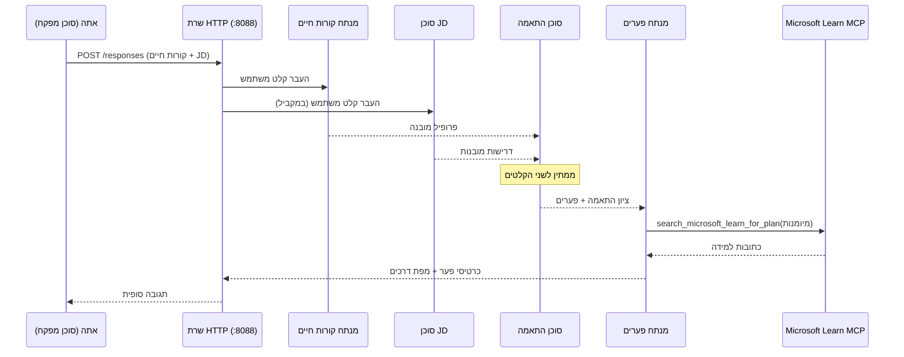
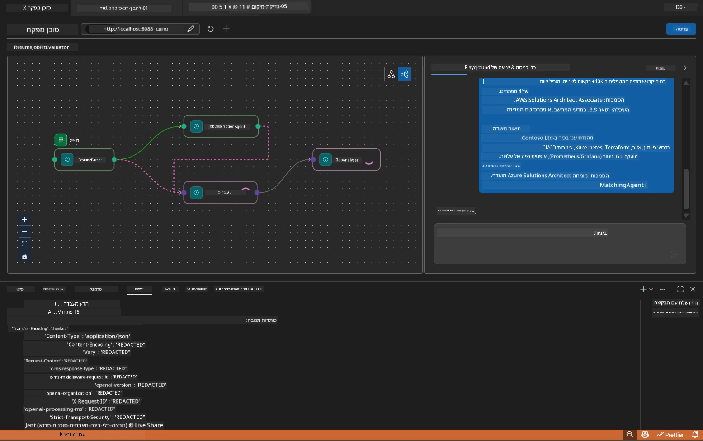

# מודול 5 - בדיקה מקומית (ריבוי סוכנים)

במודול זה, תריץ את זרימת העבודה של ריבוי הסוכנים באופן מקומי, תבחן אותה עם Agent Inspector, ותוודא שכל ארבעת הסוכנים וכלי MCP פועלים כראוי לפני הפריסה ל-Foundry.

### מה קורה במהלך הפעלת בדיקה מקומית


---

## שלב 1: הפעלת שרת הסוכן

### אפשרות א: שימוש במשימת VS Code (מומלץ)

1. לחץ `Ctrl+Shift+P` → הקלד **Tasks: Run Task** → בחר **Run Lab02 HTTP Server**.
2. המשימה מפעילה את השרת עם debugpy מחובר בפורט `5679` ואת הסוכן בפורט `8088`.
3. המתן להופעת התוצאה הבאה:

```
INFO:resume-job-fit:Starting Resume -> Job Fit Evaluator HTTP server...
INFO:resume-job-fit:Server running on http://localhost:8088
```

### אפשרות ב: הפעלה ידנית דרך הטרמינל

```powershell
cd workshop\lab02-multi-agent\PersonalCareerCopilot
```

הפעל את הסביבה הווירטואלית:

**PowerShell (Windows):**
```powershell
.\.venv\Scripts\Activate.ps1
```

**macOS/Linux:**
```bash
source .venv/bin/activate
```

הפעל את השרת:

```powershell
python -m debugpy --listen 127.0.0.1:5679 -m agentdev run main.py --verbose --port 8088
```

### אפשרות ג: שימוש ב-F5 (מצב ניפוי שגיאות)

1. לחץ `F5` או עבור ל- **Run and Debug** (`Ctrl+Shift+D`).
2. בחר את תצורת ההפעלה **Lab02 - Multi-Agent** מהרשימה הנפתחת.
3. השרת יתחיל עם תמיכה מלאה בנקודות עצירה.

> **טיפ:** מצב ניפוי השגיאות מאפשר לך להגדיר נקודות עצירה בתוך `search_microsoft_learn_for_plan()` כדי לבדוק תגובות MCP, או בתוך מחרוזות ההוראות של הסוכן כדי לראות מה כל סוכן מקבל.

---

## שלב 2: פתיחת Agent Inspector

1. לחץ `Ctrl+Shift+P` → הקלד **Foundry Toolkit: Open Agent Inspector**.
2. Agent Inspector יפתח בכרטיסייה בדפדפן בכתובת `http://localhost:5679`.
3. עליך לראות את ממשק הסוכן מוכן לקבל הודעות.

> **אם Agent Inspector לא נפתח:** ודא שהשרת הופעל במלואו (אתה רואה את הלוג "Server running"). אם הפורט 5679 תפוס, ראה [מודול 8 - פתרון תקלות](08-troubleshooting.md).

---

## שלב 3: הפעלת בדיקות עישון

הרץ את שלוש הבדיקות האלה לפי הסדר. כל אחת בודקת בהדרגה יותר ויותר בזרימת העבודה.

### בדיקה 1: קורות חיים בסיסיים + תיאור משרה

הדבק את הבאות ב-Agent Inspector:

```
Resume:
Jane Doe
Senior Software Engineer with 5 years of experience in Python, Django, and AWS.
Built microservices handling 10K+ requests/second. Led a team of 4 developers.
Certifications: AWS Solutions Architect Associate.
Education: B.S. Computer Science, State University.

Job Description:
Senior Cloud Engineer at Contoso Ltd.
Required: Python, Azure, Kubernetes, Terraform, CI/CD pipelines.
Preferred: Go, monitoring (Prometheus/Grafana), cost optimization.
Experience: 5+ years in cloud infrastructure.
Certifications: Azure Solutions Architect Expert preferred.
```

**מבנה הפלט המצופה:**

התגובה צריכה להכיל פלט מכל ארבעת הסוכנים ברצף:

1. **פלט מנתח הקורות חיים** - פרופיל מועמד מובנה עם כישורים מקובצים לפי קטגוריה
2. **פלט סוכן תיאור המשרה** - דרישות מובנות עם הפרדה בין כישורים דרושים למועדפים
3. **פלט סוכן ההתאמה** - ציון התאמה (0-100) עם פירוט, כישורים תואמים, כישורים חסרים, פערים
4. **פלט Gap Analyzer** - כרטיסי פער אישיים לכל כישור חסר, כל אחד עם קישורים ל-Microsoft Learn



### מה לבדוק בבדיקה 1

| בדיקה | מצופה | עבר? |
|-------|----------|-------|
| התגובה כוללת ציון התאמה | מספר בין 0 ל-100 עם פירוט | |
| רשימת כישורים תואמים | Python, CI/CD (חלקי), וכו' | |
| רשימת כישורים חסרים | Azure, Kubernetes, Terraform, וכו' | |
| כרטיסי פער קיימים לכל כישור חסר | כרטיס אחד לכל כישור | |
| קישורי Microsoft Learn קיימים | קישורים אמיתיים ל-learn.microsoft.com | |
| אין הודעות שגיאה בתגובה | פלט מובנה ונקי | |

### בדיקה 2: בדיקת הפעלת כלי MCP

בזמן שהבדיקה 1 רצה, בדוק את **טרמינל השרת** עבור רשומות יומן של MCP:

```
GET https://learn.microsoft.com/api/mcp → 405 (Method Not Allowed)
POST https://learn.microsoft.com/api/mcp → 200
DELETE https://learn.microsoft.com/api/mcp → 405 (Method Not Allowed)
```

| רשומת יומן | משמעות | צפוי? |
|------------|---------|---------|
| `GET ... → 405` | לקוח MCP מבצע בדיקת GET במהלך ההאתחול | כן - נורמלי |
| `POST ... → 200` | קריאה אמיתית לכלי בשרת Microsoft Learn MCP | כן - זה הקריאה האמיתית |
| `DELETE ... → 405` | לקוח MCP מבצע בדיקת DELETE במהלך הניקוי | כן - נורמלי |
| `POST ... → 4xx/5xx` | קריאת כלי נכשלה | לא - ראה [פתרון תקלות](08-troubleshooting.md) |

> **נקודה חשובה:** שורות `GET 405` ו-`DELETE 405` הן **התנהגות צפויה**. יש לדאוג רק אם קריאות `POST` מחזירות סטטוסים שאינם 200.

### בדיקה 3: מקרה קצה - מועמד בעל התאמה גבוהה

הדבק קורות חיים התואמים במדויק לתיאור המשרה כדי לוודא שה-GapAnalyzer מתמודד עם מקרים של התאמה גבוהה:

```
Resume:
Alex Chen
Senior Cloud Engineer with 7 years of experience.
Skills: Python, Azure (AKS, Functions, DevOps), Kubernetes, Terraform, CI/CD (GitHub Actions, Azure Pipelines), Go, Prometheus, Grafana, cost optimization.
Certifications: Azure Solutions Architect Expert, Azure DevOps Engineer Expert.
Led infrastructure migration to Azure for 3 enterprise clients.
Education: M.S. Computer Science, Tech University.

Job Description:
Senior Cloud Engineer at Contoso Ltd.
Required: Python, Azure, Kubernetes, Terraform, CI/CD pipelines.
Preferred: Go, monitoring (Prometheus/Grafana), cost optimization.
Experience: 5+ years in cloud infrastructure.
Certifications: Azure Solutions Architect Expert preferred.
```

**התנהגות צפויה:**
- ציון ההתאמה צריך להיות **80+** (רוב הכישורים תואמים)
- כרטיסי הפער יתמקדו בליטוש/הכנה לראיון במקום למידה בסיסית
- הוראות GapAnalyzer אומרות: "אם ההתאמה >= 80, התרכז בליטוש/הכנה לראיון"

---

## שלב 4: אימות שלמות הפלט

לאחר הרצת הבדיקות, ודא שהפלט עונה על הקריטריונים הבאים:

### רשימת בדיקה למבנה הפלט

| קטגוריה | סוכן | קיים? |
|---------|-------|----------|
| פרופיל מועמד | Resume Parser | |
| כישורים טכניים (מקובצים) | Resume Parser | |
| סקירת תפקיד | JD Agent | |
| דרושים מול מועדפים | JD Agent | |
| ציון התאמה עם פירוט | Matching Agent | |
| כישורים תואמים / חסרים / חלקיים | Matching Agent | |
| כרטיס פער לכל כישור חסר | Gap Analyzer | |
| קישורי Microsoft Learn בכרטיסי הפער | Gap Analyzer (MCP) | |
| סדר למידה (מספרים) | Gap Analyzer | |
| סיכום ציר זמן | Gap Analyzer | |

### בעיות נפוצות בשלב זה

| בעיה | סיבה | תיקון |
|-------|-------|-----|
| רק כרטיס פער אחד (שאר נחתך) | הוראות GapAnalyzer חסרות פסקת CRITICAL | הוסף את הפסקה `CRITICAL:` ל-GAP_ANALYZER_INSTRUCTIONS - ראה [מודול 3](03-configure-agents.md) |
| אין קישורי Microsoft Learn | נקודת הקצה MCP לא נגישה | בדוק חיבור לאינטרנט. אמת ש-MICROSOFT_LEARN_MCP_ENDPOINT ב-.env הוא `https://learn.microsoft.com/api/mcp` |
| תגובה ריקה | `PROJECT_ENDPOINT` או `MODEL_DEPLOYMENT_NAME` לא מוגדרים | בדוק ערכי קובץ `.env`. הרץ `echo $env:PROJECT_ENDPOINT` בטרמינל |
| ציון התאמה הוא 0 או חסר | MatchingAgent לא קיבל נתונים מ upstream | בדוק שיש `add_edge(resume_parser, matching_agent)` ו- `add_edge(jd_agent, matching_agent)` בתוך `create_workflow()` |
| הסוכן מתחיל ואז יוצא מיד | שגיאת ייבוא או תלות חסרה | הרץ `pip install -r requirements.txt` שוב. בדוק טרמינל עבור עקבות שגיאה |
| שגיאת `validate_configuration` | משתני סביבה חסרים | צור `.env` עם `PROJECT_ENDPOINT=<כתובת-הקצה-שלך>` ו- `MODEL_DEPLOYMENT_NAME=<המודל-שלך>` |

---

## שלב 5: בדיקה עם הנתונים שלך (אופציונלי)

נסה להדביק את קורות החיים שלך ואת תיאור המשרה האמיתי. זה עוזר לוודא:

- שהסוכנים מתמודדים עם פורמטים שונים של קורות חיים (כרונולוגיים, פונקציונליים, מעורבים)
- סוכן תיאור המשרה תומך בסגנונות שונים של תיאורים (נקודות, פסקאות, מובנה)
- כלי MCP מחזיר משאבים רלוונטיים לכישורים אמיתיים
- כרטיסי הפער מותאמים אישית לרקע הספציפי שלך

> **הערת פרטיות:** בבדיקה מקומית, הנתונים שלך נשארים במחשב שלך ונשלחים רק לפריסת Azure OpenAI שלך. הם לא מתועדים או מאוחסנים על ידי תשתית הסדנה. ניתן להשתמש בשמות דמה אם תרצה (למשל, "ג'יין דו" במקום שמך האמיתי).

---

### נקודת ביקורת

- [ ] השרת הופעל בהצלחה בפורט `8088` (הלוג מציג "Server running")
- [ ] Agent Inspector נפתח ומחובר לסוכן
- [ ] בדיקה 1: תגובה מלאה עם ציון התאמה, כישורים תואמים/חסרים, כרטיסי פער, וקישורי Microsoft Learn
- [ ] בדיקה 2: יומני MCP מציגים `POST ... → 200` (קריאות הכלי הצליחו)
- [ ] בדיקה 3: מועמד התאמה גבוהה מקבל ציון 80+ עם המלצות ממוקדות בליטוש
- [ ] כל כרטיסי הפער קיימים (אחד לכל כישור חסר, ללא קיצוץ)
- [ ] אין שגיאות או עקבות שגיאה בטרמינל השרת

---

**קודם:** [04 - דפוסי אורקסטרציה](04-orchestration-patterns.md) · **הבא:** [06 - פריסת Foundry →](06-deploy-to-foundry.md)

---

<!-- CO-OP TRANSLATOR DISCLAIMER START -->
**כתב ויתור**:  
מסמך זה תורגם באמצעות שירות תרגום מבוסס בינה מלאכותית [Co-op Translator](https://github.com/Azure/co-op-translator). למרות שאנו שואפים לדיוק, יש לקחת בחשבון כי תרגומים אוטומטיים עלולים להכיל שגיאות או אי-דיוקים. יש להתייחס למסמך המקורי בשפת המקור שלו כמקור הסמכות. עבור מידע חשוב, מומלץ להשתמש בתרגום מקצועי על ידי אדם. איננו אחראים לכל אי הבנה או פרשנות מוטעית הנובעת משימוש בתרגום זה.
<!-- CO-OP TRANSLATOR DISCLAIMER END -->