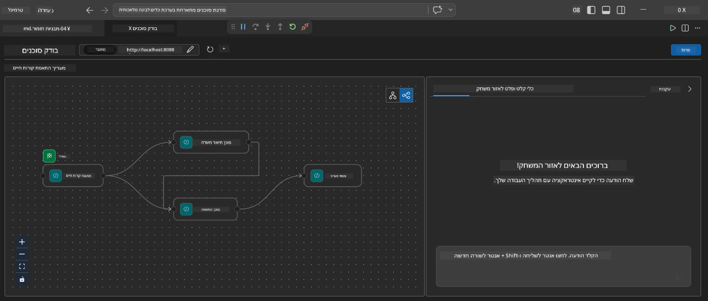
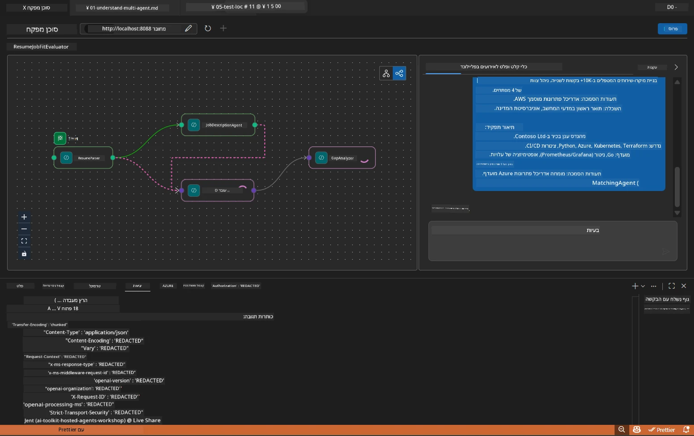
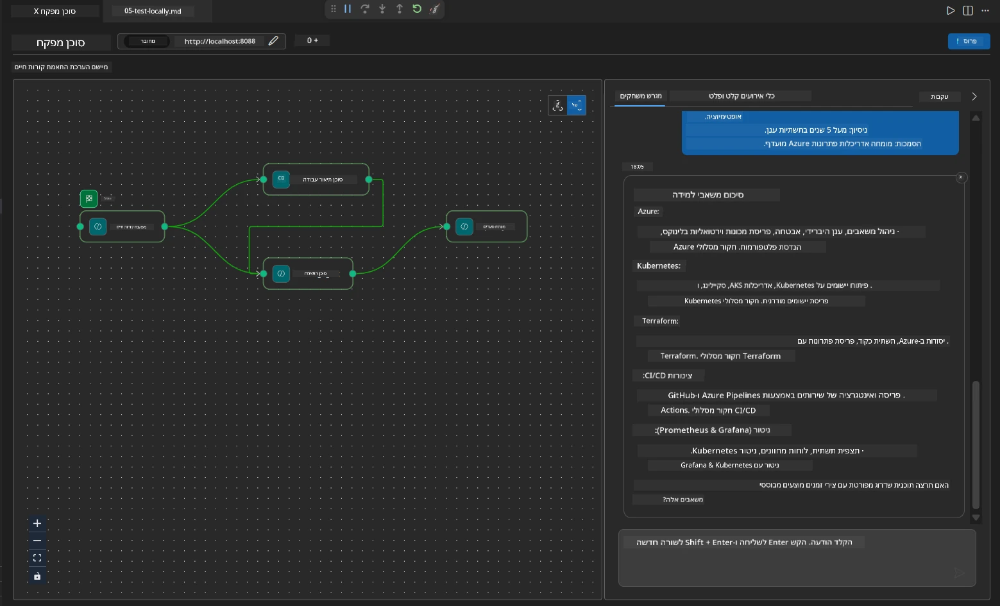

# מודול 5 - בדיקה מקומית  

⏱️ ~15 דקות  

במודול זה, אתה מריץ את תהליך העבודה מרובה הסוכנים באופן מקומי, בודק אותו עם Agent Inspector, ומוודא שכל ארבעת הסוכנים וכלי ה-MCP פועלים כראוי לפני פריסה.  

---  

## שלב 1: הפעלת שרת הסוכנים  

### אפשרות א: שימוש במשימת VS Code (מומלץ)  

1. פתח את התיקייה `workshop/lab02-multi-agent/PersonalCareerCopilot/` ב-VS Code שלך.  
2. לחץ `Ctrl+Shift+P` → הקלד **Tasks: Run Task** → בחר **Run Agent HTTP Server**.  
3. המשימה מפעילה את השרת עם debugpy מחובר בפורט `5679` והסוכן בפורט `8088`.  
4. המתן עד שהתוצאה תציג:  

```
INFO:resume-job-fit:Starting Resume -> Job Fit Evaluator HTTP server...
INFO:resume-job-fit:Server running on http://localhost:8088
```
  
### אפשרות ב: שימוש ב-F5 (מצב דיבאג)  

1. לחץ `F5` → בחר **Debug Local Agent HTTP Server**.  
2. השרת מתחיל עם תמיכה מלאה בנקודות עצירה - שימושי לבדיקת תגובות MCP או פלטי הסוכן.  

---  

## שלב 2: פתח את Agent Inspector  

1. לחץ `Ctrl+Shift+P` → הקלד **Foundry Toolkit: Open Agent Inspector**.  
2. Agent Inspector נפתח כנף ב-VS Code המחוברת ל-`http://localhost:8088`.  
3. עליך לראות את ממשק הסוכן מוכן לקבלת הודעות.  

  

> **אם Agent Inspector לא נפתח:** ודא שהשרת הושק במלואו (אתה רואה את הלוג "Server running"). אם הפורט 5679 תפוס, ראה [מודול 8 - פתרון תקלות](08-troubleshooting.md).  

---  

## שלב 2ב: (אופציונלי) פתח את Visualizer תהליך העבודה  

כלי Foundry כולל **Visualizer תהליך עבודה** בזמן אמת שמציג איך הסוכנים מתקשרים בזמן שהגרף רץ. זה שימושי במיוחד לדיבוג מרובה סוכנים.  

1. לחץ `Ctrl+Shift+P` → הקלד **Foundry Toolkit: Open Visualizer for Hosted Agents**.  
2. טאבה חדשה של VS Code נפתחת ומציגה את גרף הביצוע החי.  
3. כשאתה שולח הודעות ב-Agent Inspector, ה-visualizer מתעדכן אוטומטית - צמתים ירוקים מציינים סוכנים שהושלמו, וקווים מונפשים מראים זרימת נתונים ביניהם.  

> **התנגשויות פורט:** אם פורט ה-visualizer כבר בשימוש, שנה אותו בהגדרות VS Code → **Extensions** → **Microsoft Foundry Configuration** → **Hosted Agents: Visualizer Port**.  

---  

## שלב 3: הרץ בדיקות בסיסיות  

הרץ את שלוש הבדיקות האלה לפי סדר. כל אחת בודקת חלק גדול יותר מתהליך העבודה.  

### בדיקה 1: קורות חיים בסיסיים + תיאור תפקיד  

הדבק את הטקסט הבא ב-Agent Inspector:  

```
Resume:
Jane Doe
Senior Software Engineer with 5 years of experience in Python, Django, and AWS.
Built microservices handling 10K+ requests/second. Led a team of 4 developers.
Certifications: AWS Solutions Architect Associate.
Education: B.S. Computer Science, State University.

Job Description:
Senior Cloud Engineer at Contoso Ltd.
Required: Python, Azure, Kubernetes, Terraform, CI/CD pipelines.
Preferred: Go, monitoring (Prometheus/Grafana), cost optimization.
Experience: 5+ years in cloud infrastructure.
Certifications: Azure Solutions Architect Expert preferred.
```
  
**מבנה הפלט הצפוי:**  

התגובה צריכה להכיל פלט מכל ארבעת הסוכנים ברצף:  

1. **פלט מנתח קורות חיים** - שני חלקים מסומנים: `[PARSED RESUME]` (פרופיל מועמד עם כישורים מקובצים) ו-`[JOB DESCRIPTION PASS-THROUGH]` (טקסט JD במדויק שמועבר לסוכן ה-JD)  
2. **פלט סוכן JD** - דרישות מובנות עם הפרדה בין כישורים נדרשים למועדפים  
3. **פלט סוכן ההתאמה** - דירוג התאמה (0-100) עם פירוט, כישורים תואמים, כישורים חסרים, פערים  
4. **פלט מנתח הפערים** - כרטיסי פער אינדיבידואליים לכל כישור חסר, כל אחד עם קישורים מ-Microsoft Learn  

  

  

### מה לבדוק בבדיקה 1  

| בדיקה | צפוי | עבר? |  
|-------|----------|-------|  
| התגובה כוללת ניקוד התאמה | מספר בין 0 ל-100 עם פירוט | |  
| כישורים תואמים נרשמים | Python, CI/CD (חלקי), וכו' | |  
| כישורים חסרים נרשמים | Azure, Kubernetes, Terraform, וכו' | |  
| קיימים כרטיסי פער לכל כישור חסר | כרטיס אחד לכל כישור | |  
| קיימים קישורי Microsoft Learn | קישורים אמיתיים ל-`learn.microsoft.com` | |  
| אין הודעות שגיאה בתגובה | פלט מבני נקי | |  

### בדיקה 2: מקרה קצה - מועמד עם התאמה גבוהה  

הדבק קורות חיים התואמים מקרוב את ה-JD כדי לוודא ש-GapAnalyzer מטפל בתרחישים של התאמה גבוהה:  

```
Resume:
Alex Chen
Senior Cloud Engineer with 7 years of experience.
Skills: Python, Azure (AKS, Functions, DevOps), Kubernetes, Terraform, CI/CD (GitHub Actions, Azure Pipelines), Go, Prometheus, Grafana, cost optimization.
Certifications: Azure Solutions Architect Expert, Azure DevOps Engineer Expert.
Led infrastructure migration to Azure for 3 enterprise clients.
Education: M.S. Computer Science, Tech University.

Job Description:
Senior Cloud Engineer at Contoso Ltd.
Required: Python, Azure, Kubernetes, Terraform, CI/CD pipelines.
Preferred: Go, monitoring (Prometheus/Grafana), cost optimization.
Experience: 5+ years in cloud infrastructure.
Certifications: Azure Solutions Architect Expert preferred.
```
  
**התנהגות צפויה:**  
- ניקוד ההתאמה צריך להיות **80+** (רוב הכישורים תואמים)  
- כרטיסי הפער יתמקדו בליטוש/הכנה לראיון במקום בלמידה בסיסית  
- ההוראות של GapAnalyzer אומרות: "אם ההתאמה >= 80, להתמקד בליטוש/הכנה לראיון"  

---  

## שלב 4: בדוק עם הנתונים שלך (אופציונלי)  

נסה להדביק את קורות החיים שלך ותיאור תפקיד אמיתי. זה עוזר לוודא:  

- הסוכנים מטפלים בפורמטים שונים של קורות חיים (כרונולוגי, פונקציונלי, משולב)  
- סוכן ה-JD מטפל בסגנונות JD שונים (נקודות, פסקאות, מובנה)  
- כלי ה-MCP מחזיר משאבים רלוונטיים לכישורים אמיתיים  
- כרטיסי הפער מותאמים אישית לרקע הספציפי שלך  

> **פרטיות - נתיב א (Foundry בענן):** טקסט הקורות חיים ו-JD נשלחים לפריסת Azure OpenAI שלך לצורך אינפרנציה. הם אינם מתועדים או נשמרים בתשתית הסדנה. ניתן להשתמש בשמות בדויים (למשל "ג'יין דו") אם תרצה.  
>  
> **פרטיות - נתיב ב (Foundry מקומי):** כל ארבעת האינפרנציות של הסוכנים רצות כולה במכשיר שלך. טקסט הקורות חיים ותיאור התפקיד שלך **אינו עוזב את המחשב שלך**. הקריאה היוצאת היחידה היא כלי ה-MCP שמביא משאבים מ-`https://learn.microsoft.com/api/mcp`; השאילתה מכילה רק את שם הכישור, לא את המידע האישי שלך.  

---  

### נקודת בדיקה  

- [ ] השרת הופעל בהצלחה בפורט `8088` (הלוג מציג "Server running")  
- [ ] Agent Inspector נפתח והתחבר לסוכן  
- [ ] בדיקה 1: תגובה מלאה עם ניקוד התאמה, כישורים תואמים/חסרים, כרטיסי פער וקישורים ל-Microsoft Learn  
- [ ] בדיקה 2: מועמד עם התאמה גבוהה מקבל ציון 80+ עם המלצות ממוקדות בליטוש  
- [ ] כל כרטיסי הפער קיימים (אחד לכל כישור חסר, ללא קיצור)  
- [ ] אין שגיאות או עקבות תקלות במסוף השרת  

---  

**קודם:** [04 - דפוסי תזמור](04-orchestration-patterns.md) · **הבא:** [06 - פריסה ל-Foundry →](06-deploy-to-foundry.md)  

---

<!-- CO-OP TRANSLATOR DISCLAIMER START -->
**כתב ויתור**:
מסמך זה תורגם באמצעות שירות תרגום אוטומטי [Co-op Translator](https://github.com/Azure/co-op-translator). למרות שאנו שואפים לדיוק, יש לקחת בחשבון שתרגומים אוטומטיים עלולים להכיל שגיאות או אי-דיוקים. יש להחשיב את המסמך המקורי בשפתו הטבעית כמקור הסמכות. למידע קריטי מומלץ להשתמש בתרגום מקצועי על ידי מתרגם אדם. אנו לא אחראים לכל אי-הבנה או פירוש שגוי הנובע מהשימוש בתרגום זה.
<!-- CO-OP TRANSLATOR DISCLAIMER END -->