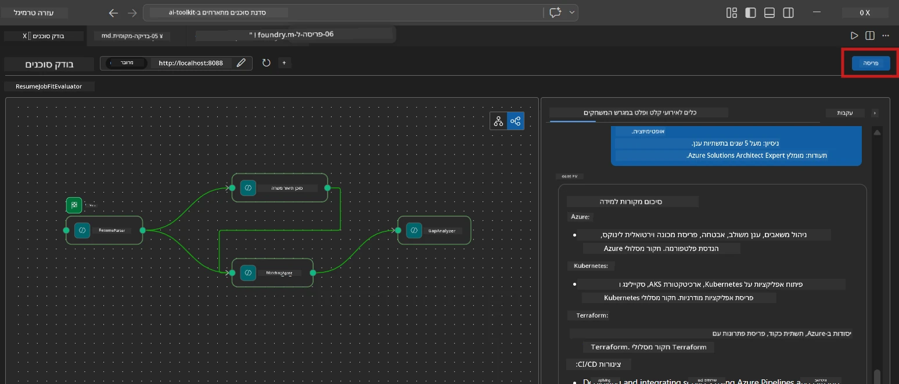
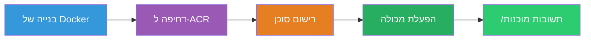
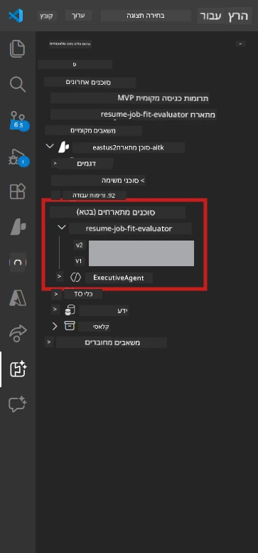

# מודול 6 - פריסה לשירות Foundry Agent

במודול זה, תפרוס את זרימת העבודה רב-הסוכנים שנבדקה מקומית ל-[Microsoft Foundry](https://learn.microsoft.com/azure/foundry/agents/concepts/hosted-agents) כסוכן **מאוחסן**. תהליך הפריסה בונה תמונת מכולה דוקר, דוחף אותה ל-[Azure Container Registry (ACR)](https://learn.microsoft.com/azure/container-registry/container-registry-intro), ויוצר גרסת סוכן מאוחסן ב-[Foundry Agent Service](https://learn.microsoft.com/azure/foundry/agents/how-to/publish-agent).

> **הבדל מרכזי מהמעבדה 01:** תהליך הפריסה זהה. Foundry מתייחס לזרימת העבודה רב-הסוכנים שלך כסוכן מאוחסן בודד - המורכבות נמצאת בתוך המכולה, אך ממשק הפריסה הוא אותו נקודת קצה `/responses`.

---

## בדיקת דרישות מוקדמות

לפני הפריסה, אימה כל אחד מהפריטים הבאים:

1. **הסוכן עובר בדיקות מקומיות:**
   - השלמת את כל 3 הבדיקות ב-[מודול 5](05-test-locally.md) וזרימת העבודה הפיקה פלט מלא עם כרטיסי פער וכתובות Microsoft Learn.

2. **יש לך תפקיד [Azure AI User](https://learn.microsoft.com/azure/foundry/concepts/rbac-foundry):**
   - הוקצה ב-[מעבדה 01, מודול 2](../../lab01-single-agent/docs/02-create-foundry-project.md). אמת ב:
   - [פורטל Azure](https://portal.azure.com) → משאב **הפרויקט** Foundry שלך → **בקרת גישה (IAM)** → **הקצאות תפקיד** → אשר ש-**[Azure AI User](https://aka.ms/foundry-ext-project-role)** מופיע עבור החשבון שלך.

3. **אתה מחובר ל-Azure ב-VS Code:**
   - בדוק את סמל החשבונות בתחתית-שמאלית של VS Code. שם החשבון שלך צריך להיות גלוי.

4. **`agent.yaml` מכיל ערכים נכונים:**
   - פתח `PersonalCareerCopilot/agent.yaml` ואמת:
     ```yaml
     environment_variables:
       - name: PROJECT_ENDPOINT
         value: ${PROJECT_ENDPOINT}
       - name: MODEL_DEPLOYMENT_NAME
         value: ${MODEL_DEPLOYMENT_NAME}
     ```
   - ערכים אלה חייבים להתאים למשתני הסביבה ש`main.py` שלך קורא.

5. **`requirements.txt` מכיל גרסאות נכונות:**
   ```
   agent-framework-azure-ai==1.0.0rc3
   agent-framework-core==1.0.0rc3
   azure-ai-agentserver-agentframework==1.0.0b16
   azure-ai-agentserver-core==1.0.0b16
   debugpy
   agent-dev-cli --pre
   ```

---

## שלב 1: התחל את הפריסה

### אפשרות א: פריסה מ-Agent Inspector (מומלץ)

אם הסוכן רץ באמצעות F5 עם Agent Inspector פתוח:

1. הסתכל בפינה הימנית-עליונה של פנל Agent Inspector.
2. לחץ על כפתור **Deploy** (אייקון ענן עם חץ למעלה ↑).
3. אשף הפריסה ייפתח.



### אפשרות ב: פריסה מ-Command Palette

1. לחץ `Ctrl+Shift+P` לפתיחת **Command Palette**.
2. הקלד: **Microsoft Foundry: Deploy Hosted Agent** ובחר בו.
3. אשף הפריסה ייפתח.

---

## שלב 2: הגדר את הפריסה

### 2.1 בחר את פרויקט היעד

1. יופיע תפריט נפתח עם פרויקטי Foundry שלך.
2. בחר את הפרויקט שבו השתמשת במהלך הסדנה (למשל, `workshop-agents`).

### 2.2 בחר את קובץ סוכן המכולה

1. תתבקש לבחור את נקודת הכניסה של הסוכן.
2. עבור ל-`workshop/lab02-multi-agent/PersonalCareerCopilot/` ובחר **`main.py`**.

### 2.3 הגדר משאבים

| הגדרה | ערך מומלץ | הערות |
|---------|-----------|---------|
| **CPU** | `0.25` | ברירת מחדל. זרימות עבודה רב-סוכנים אינן זקוקות ליותר CPU כי הקריאות למודלים הן I/O bound |
| **זיכרון** | `0.5Gi` | ברירת מחדל. הגדל ל-`1Gi` אם מוסיפים כלים לעיבוד נתונים גדולים |

---

## שלב 3: אשר ופרוס

1. האשף מציג סיכום פריסה.
2. סקור ולחץ על **Confirm and Deploy**.
3. עקוב אחרי ההתקדמות ב-VS Code.

### מה קורה במהלך הפריסה

צפה בפאנל **Output** של VS Code (בחר בתפריט הנפתח "Microsoft Foundry"):


1. **בניית Docker** - בונה את המכולה מה`Dockerfile` שלך:
   ```
   Step 1/6 : FROM python:3.14-slim
   Step 2/6 : WORKDIR /app
   ...
   Successfully built abc123def456
   ```

2. **דחיפת Docker** - דוחף את התמונה ל-ACR (1-3 דקות בפריסה ראשונה).

3. **רישום הסוכן** - Foundry יוצר סוכן מאוחסן תוך שימוש במטא-נתונים מתוך `agent.yaml`. שם הסוכן הוא `resume-job-fit-evaluator`.

4. **הפעלת המכולה** - המכולה מופעלת במבנה מנוהל של Foundry עם זהות מנוהלת על ידי המערכת.

> **הפריסה הראשונה איטית יותר** (Docker דוחף את כל השכבות). פריסות לאחר מכן משתמשות בשכבות שמורות ומהירות יותר.

### הערות ספציפיות לרב-סוכנים

- **כל ארבעת הסוכנים בתוך מכולה אחת.** Foundry רואה סוכן מאוחסן בודד. גרף WorkflowBuilder רץ פנימית.
- **קריאות MCP יוצאות החוצה.** המכולה זקוקה לגישה לאינטרנט כדי להגיע ל-`https://learn.microsoft.com/api/mcp`. תשתית Foundry המנוהלת מספקת זאת כברירת מחדל.
- **[Managed Identity](https://learn.microsoft.com/python/api/overview/azure/identity-readme#managed-identity-support).** בסביבה המאוחסנת, `get_credential()` ב-`main.py` מחזיר `ManagedIdentityCredential()` (כי `MSI_ENDPOINT` מוגדר). זה אוטומטי.

---

## שלב 4: אמת את מצב הפריסה

1. פתח את סרגל הצד של **Microsoft Foundry** (לחץ על סמל Foundry בסרגל הפעילות).
2. הרחב את **Hosted Agents (Preview)** תחת הפרויקט שלך.
3. מצא את **resume-job-fit-evaluator** (או שם הסוכן שלך).
4. לחץ על שם הסוכן → הרחב את הגרסאות (למשל, `v1`).
5. לחץ על הגרסה → בדוק **פרטי מכולה** → **סטטוס**:



| סטטוס | משמעות |
|--------|---------|
| **Started** / **Running** | המכולה רצה, הסוכן מוכן |
| **Pending** | המכולה מתחילה (המתן 30-60 שניות) |
| **Failed** | המכולה נכשלה בהפעלה (בדוק יומנים - ראה מטה) |

> **הפעלה של רב-סוכנים אורכת זמן רב יותר** מסוכן יחיד כי המכולה יוצרת 4 מופעי סוכן בהפעלה. מצב "Pending" עד שתי דקות הוא תקין.

---

## שגיאות פריסה נפוצות ותיקונן

### שגיאה 1: Permission denied - `agents/write`

```
Error: lacks the required data action 
Microsoft.CognitiveServices/accounts/AIServices/agents/write
```

**תיקון:** הקצה את תפקיד **[Azure AI User](https://learn.microsoft.com/azure/foundry/concepts/rbac-foundry)** ברמת **הפרויקט**. ראה [מודול 8 - פתרון תקלות](08-troubleshooting.md) להנחיות מפורטות.

### שגיאה 2: דוקר לא רץ

```
Error: Docker build failed / Cannot connect to Docker daemon
```

**תיקון:**
1. הפעל את Docker Desktop.
2. המתן ל-"Docker Desktop is running".
3. אמת: `docker info`
4. **Windows:** ודא ש-WSL 2 מופעל ב'הגדרות Docker Desktop'.
5. נסה שוב.

### שגיאה 3: התקנת pip נכשלת במהלך בניית Docker

```
Error: Could not find a version that satisfies the requirement agent-dev-cli
```

**תיקון:** הדגל `--pre` ב-`requirements.txt` מטופל אחרת בדוקר. ודא ש-`requirements.txt` שלך כולל:
```
agent-dev-cli --pre
```

אם Docker עדיין נכשל, צור קובץ `pip.conf` או העבר `--pre` כארגומנט בנייה. ראה [מודול 8](08-troubleshooting.md).

### שגיאה 4: כלי MCP נכשל בסוכן המאוחסן

אם מנחה הפער ("Gap Analyzer") מפסיק להפיק כתובות Microsoft Learn אחרי הפריסה:

**גורם שורש:** מדיניות רשת חוסמת יציאות HTTPS יוצאות מהמכולה.

**תיקון:**
1. בדרך כלל לא בעיה בתצורת ברירת המחדל של Foundry.
2. אם מתרחש, בדוק אם ל-Virtual Network של פרויקט Foundry יש NSG החוסם יציאות HTTPS.
3. לכלי MCP יש כתובות גיבוי מובנות, לכן הסוכן עדיין יפיק פלט (ללא כתובות חיות).

---

### נקודת ביקורת

- [ ] פקודת הפריסה הושלמה ללא שגיאות ב-VS Code
- [ ] הסוכן מופיע תחת **Hosted Agents (Preview)** בסרגל הצד של Foundry
- [ ] שם הסוכן הוא `resume-job-fit-evaluator` (או שם שבחרת)
- [ ] סטטוס המכולה מציג **Started** או **Running**
- [ ] (במקרה של שגיאות) זיהית את השגיאה, יישמת את התיקון ופרסת בהצלחה מחדש

---

**הקודם:** [05 - בדיקה מקומית](05-test-locally.md) · **הבא:** [07 - אימות ב-Playground →](07-verify-in-playground.md)

---

<!-- CO-OP TRANSLATOR DISCLAIMER START -->
**כתב ויתור**:  
מסמך זה תורגם באמצעות שירות תרגום מבוסס בינה מלאכותית [Co-op Translator](https://github.com/Azure/co-op-translator). אף שאנו שואפים לדייק, יש לקחת בחשבון כי תרגומים אוטומטיים עלולים לכלול שגיאות או אי-דיוקים. המסמך המקורי בשפת המקור שלו יש להחשב כמקור הסמכות. למידע קריטי מומלץ להיעזר בתרגום מקצועי על ידי אדם. אנו איננו אחראים לכל אי-הבנה או פרשנות מוטעה הנובעים משימוש בתרגום זה.
<!-- CO-OP TRANSLATOR DISCLAIMER END -->