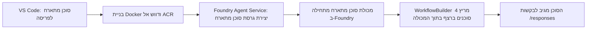
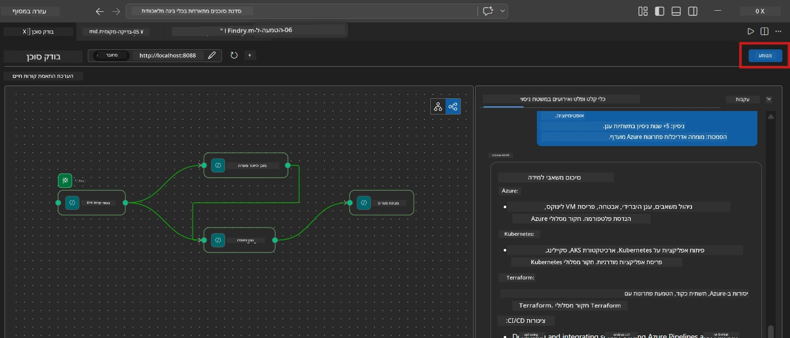
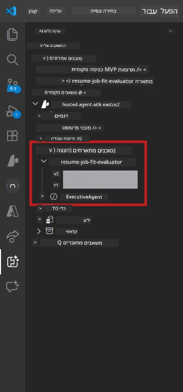

# מודול 6 - פריסה לשירות Foundry Agent

⏱️ ~10 דקות

במודול זה תפרוס את זרימת העבודה המרובה סוכנים שנבדקה מקומית ל-[Microsoft Foundry](https://learn.microsoft.com/azure/foundry/agents/concepts/hosted-agents) כסוכן **מאוחסן**. תהליך הפריסה בונה תמונת מכולת Docker, דוחף אותה ל-[Azure Container Registry (ACR)](https://learn.microsoft.com/azure/container-registry/container-registry-intro), ויוצר גרסת סוכן מאוחסן ב-[Foundry Agent Service](https://learn.microsoft.com/azure/foundry/agents/how-to/publish-agent).

> **הבדל מרכזי מהמעבדה 01:** תהליך הפריסה זהה. Foundry מתייחס לזרימת העבודה המרובה סוכנים כסוכן מאוחסן יחיד - המורכבות היא בתוך המכולה, אך ממשק הפריסה הוא אותו נקודת קצה `/responses`.

### צינור הפריסה


```mermaid
flowchart LR
    A[VS Code: סוכן מתארח לפריסה] --> B[בניית Docker ודווש אל ACR]
    B --> C[Foundry Agent Service: יצירת גרסת סוכן מתארח]
    C --> D[מכולת סוכן מתארח מתחילה ב-Foundry]
    D --> E[WorkflowBuilder מריץ 4 סוכנים ברצף בתוך המכולה]
    E --> F[הסוכן מגיב לבקשות /responses]
```

---

## בדיקת דרישות מוקדמות

לפני הפריסה, אמת שכל הפריטים הבאים:

1. **הסוכן עבר בהצלחה בדיקות מקומיות:**
   - השלמת את כל 3 הבדיקות ב-[מודול 5](05-test-locally.md) וזרימת העבודה הפיקה פלט מלא עם כרטיסיות פער וקישורי Microsoft Learn.

2. **יש לך את תפקיד [Foundry User](https://learn.microsoft.com/azure/foundry/concepts/rbac-foundry)** (כדי לפרוס, דרוש לפחות **Foundry Project Manager** ברמת הפרויקט):

   > **הערה:** תפקידי ה-RBAC של Foundry שונו לאחרונה בשמות - **Foundry User**, **Foundry Owner**, ו-**Foundry Project Manager** נקראו בעבר Azure AI User, Azure AI Owner, ו-Azure AI Project Manager. מזהי התפקיד וההרשאות לא השתנו.

   - אמת ב-[Azure Portal](https://portal.azure.com) → משאבי הפרויקט Foundry שלך → **Access control (IAM)** → **Role assignments** → וודא שהתפקיד **Foundry User** (או גבוה יותר) רשום לחשבון שלך.

3. **אתה מחובר ל-Azure ב-VS Code:**
   - בדוק את סמל החשבונות בפינה השמאלית התחתונה של VS Code. שם החשבון שלך צריך להיות גלוי.

4. **`agent.yaml` מכיל ערכים נכונים:**
   - פתח את `PersonalCareerCopilot/agent.yaml` ואמת:
     ```yaml
     environment_variables:
       - name: AZURE_AI_MODEL_DEPLOYMENT_NAME
         value: ${AZURE_AI_MODEL_DEPLOYMENT_NAME}
     ```
   - הערך `FOUNDRY_PROJECT_ENDPOINT` **לא** נמצא כאן - Foundry מכניס אותו בזמן ריצה. רק `AZURE_AI_MODEL_DEPLOYMENT_NAME` צריך להיות מוגדר.

5. **`requirements.txt` כולל גרסאות נכונות:**
   ```
   agent-framework-foundry
   agent-framework-foundry-hosting
   mcp<2,>=1.24.0
   debugpy
   ```

---

## שלב 1: התחלת הפריסה

### אפשרות א: פריסה מ-Agent Inspector (מומלץ)

אם הסוכן פועל באמצעות F5 כאשר Agent Inspector פתוח:

1. הביט בפינה הימנית העליונה של לוח Agent Inspector.
2. לחץ על כפתור **Deploy** (סמל ענן עם חץ למעלה ↑).
3. אשף הפריסה ייפתח.



### אפשרות ב: פריסה מ-Command Palette

1. לחץ `Ctrl+Shift+P` לפתיחת **Command Palette**.
2. הקלד: **Foundry Toolkit: Deploy Hosted Agent** ובחר.
3. אשף הפריסה ייפתח.

---

## שלב 2: קונפיגורציית הפריסה

### 2.1 בחר בפרויקט היעד

1. תפריט נפתח מציג את פרויקטי Foundry שלך.
2. בחר בפרויקט שבו השתמשת במהלך הסדנא (למשל, `workshop-agents`).

### 2.2 בחר בקובץ סוכן המכולה

1. תתבקש לבחור את נקודת הכניסה של הסוכן.
2. נווט ל-`workshop/lab02-multi-agent/PersonalCareerCopilot/` ובחר **`main.py`**.

### 2.3 קבע משאבים

| הגדרה | ערך מומלץ | הערות |
|---------|------------------|-------|
| **שיטת פריסה** | **מכולה** (מומלץ) או **קוד** | מכולה בונה תמונת Docker; קוד מעלה מקור כ-ZIP (בתצוגה מוקדמת) |
| **רישום מכולות** | **ACR ברירת מחדל** | Foundry יוצר ומנהל אחד עבורך |
| **CPU** | `0.25` | ברירת מחדל. זרימות עבודה מרובות סוכנים אינן זקוקות ליותר CPU מכיוון שהקריאות למודל חסומות בקלט/פלט |
| **זיכרון** | `0.5Gi` | ברירת מחדל. הגדל ל-`1Gi` אם מוסיפים כלים לעיבוד נתונים כבדים |

---

## שלב 3: אשר ופרוס

1. האשף מציג סיכום פריסה.
2. בדוק ולחץ על **Confirm and Deploy**.
3. צפה בהתקדמות ב-VS Code.

### מה קורה במהלך הפריסה

צפה בפאנל **Output** של VS Code (בחר בתפריט הנפתח "Microsoft Foundry"):

1. **בניית Docker** - בונה את המכולה מתוך `Dockerfile`
   ```
   Step 1/6 : FROM python:3.12-slim
   Step 2/6 : WORKDIR /app
   ...
   Successfully built abc123def456
   ```

2. **דחיפת Docker** - דוחף את התמונה ל-ACR (1-3 דקות בפריסה ראשונה).

3. **רישום סוכן** - Foundry יוצר סוכן מאוחסן באמצעות המטא-דאטה ב-`agent.yaml`. שם הסוכן הוא `resume-job-fit-evaluator`.

4. **הפעלה של המכולה** - המכולה מתחילה בתשתית מנוהלת של Foundry עם זהות מנוהלת מערכתית.

> **הפריסה הראשונה איטית יותר** (Docker דוחף את כל השכבות). פריסות הבאות משתמשות בשכבות מאוחסנות ומאיצות את התהליך.

### הערות ספציפיות לריבוי סוכנים

- **כל ארבעת הסוכנים נמצאים במכולה אחת.** Foundry רואה סוכן מאוחסן יחיד. גרף WorkflowBuilder פועל בתוך המכולה.
- **קריאות MCP יוצאות החוצה.** המכולה צריכה גישה לאינטרנט כדי להגיע ל-`https://learn.microsoft.com/api/mcp`. תשתית Foundry מספקת זאת כברירת מחדל.
- **[Managed Identity](https://learn.microsoft.com/azure/foundry/agents/concepts/agent-identity).** Foundry יוצר אוטומטית זהות Entra ייעודית לכל סוכן מאוחסן בזמן הפריסה. בסביבה המאוחסנת, `DefaultAzureCredential` מזהה אוטומטית את הזהות של הסוכן - אין צורך בקונפיגורציית זהות מנוהלת ידנית.

---

## שלב 4: אמת את מצב הפריסה

1. פתח את סרגל הצד של **Microsoft Foundry** (לחץ על סמל Foundry בסרגל הפעילות).
2. הרחב את **Hosted Agents (Preview)** תחת הפרויקט שלך.
3. מצא את **resume-job-fit-evaluator** (או שם הסוכן שלך).
4. לחץ על שם הסוכן → הרחב גרסאות (למשל, `v1`).
5. לחץ על הגרסה → בדוק **פרטי מכולה** → **סטטוס**:



| סטטוס | משמעות |
|--------|---------|
| **active** | הסוכן פועל ומוכן לקבל בקשות |
| **creating** | המכולה מתחילה לפעול (המתן 30–60 שניות) |
| **failed** | המכולה נכשלה בהפעלה (בדוק לוגים - ראו למטה) |

> **הערה:** סרגל הצד של VS Code עשוי להציג תוויות כמו "Running" או "Started" בעוד שהסטטוס ב-API הוא `active`/`creating`. כל תצוגה מייצגת את אותו מצב.

> **הפעלה של ריבוי סוכנים אורכת יותר זמן** מאשר סוכן יחיד כי המכולה יוצרת 4 מופעי סוכנים בהפעלה. `creating` עד 2 דקות הוא נורמלי.

---

## שגיאות נפוצות בפריסה ופתרונן

### שגיאה 1: Permission denied - `agents/write`

```
Error: lacks the required data action 
Microsoft.CognitiveServices/accounts/AIServices/agents/write
```

**תיקון:** השב את תפקיד **[Foundry User](https://learn.microsoft.com/azure/foundry/concepts/rbac-foundry)** (שנקרא קודם **Azure AI User**) ברמת **הפרויקט**. ראה [מודול 8 - פתרון תקלות](08-troubleshooting.md) להוראות מפורטות.

### שגיאה 2: Docker לא פועל

```
Error: Docker build failed / Cannot connect to Docker daemon
```

**תיקון:**
1. הפעל את Docker Desktop.
2. המתן להודעה "Docker Desktop is running".
3. אמת: `docker info`
4. **ב-Windows:** ודא ש-WSL 2 מאופשר בהגדרות Docker Desktop.
5. נסה שוב.

### שגיאה 3: התקנת pip נכשלת במהלך בניית Docker

```
Error: Could not find a version that satisfies the requirement agent-framework-foundry
```

**תיקון:** אמת ש-`requirements.txt` תואם ל:
```
agent-framework-foundry
agent-framework-foundry-hosting
mcp<2,>=1.24.0
debugpy
```

אם הבנייה עדיין נכשלה, ייתכן שרשת ה-Docker שלך חוסמת את PyPI. בדוק ב-`docker info` הגדרות פרוקסי.

### שגיאה 4: כלי MCP נכשל בסוכן המאוחסן

אם מגיש הפער (Gap Analyzer) מפסיק להפיק קישורי Microsoft Learn לאחר הפריסה:

**סיבת שורש:** מדיניות רשת עלולה לחסום HTTPS יוצא מהמכולה.

**תיקון:**
1. בדרך כלל זה לא בעיה בקונפיגורציית Foundry ברירת מחדל.
2. אם זה קורה, בדוק אם לרשת הוירטואלית של פרויקט Foundry יש NSG החוסם HTTPS יוצא.
3. לכלי MCP יש כתובות מגירה מפותחות, ולכן הסוכן עדיין יפיק פלט (ללא קישורים חיים).

---

### נקודות ביקורת

- [ ] פקודת הפריסה הושלמה ללא שגיאות ב-VS Code
- [ ] הסוכן מופיע תחת **Hosted Agents (Preview)** בסרגל הצד של Foundry
- [ ] שם הסוכן הוא `resume-job-fit-evaluator` (או השם שבחרת)
- [ ] סטטוס המכולה מציג **Started** או **Running**
- [ ] (אם היו שגיאות) זיהית את השגיאה, יישמת את התיקון ופרסת בהצלחה מחדש

---

**הקודם:** [05 - בדיקה מקומית](05-test-locally.md) · **הבא:** [07 - אמת ב-Playground →](07-verify-in-playground.md)

---

<!-- CO-OP TRANSLATOR DISCLAIMER START -->
**כתב ויתור**:
מסמך זה תורגם באמצעות שירות תרגום אוטומטי [Co-op Translator](https://github.com/Azure/co-op-translator). למרות שאנו שואפים לדיוק, יש לקחת בחשבון שתרגומים אוטומטיים עלולים להכיל שגיאות או אי-דיוקים. יש להחשיב את המסמך המקורי בשפתו הטבעית כמקור הסמכות. למידע קריטי מומלץ להשתמש בתרגום מקצועי על ידי מתרגם אדם. אנו לא אחראים לכל אי-הבנה או פירוש שגוי הנובע מהשימוש בתרגום זה.
<!-- CO-OP TRANSLATOR DISCLAIMER END -->