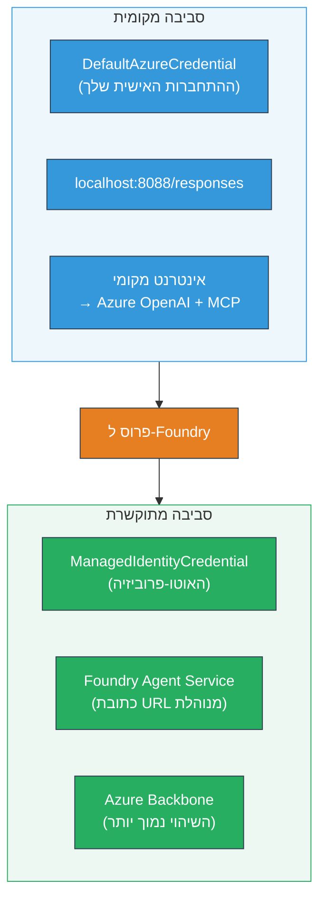

# מודול 7 - אימות ב-Playground

במודול זה, תבדוק את זרימת העבודה הרב-סוכנית שהפרסת הן ב-**VS Code** והן ב-**[Foundry Portal](https://ai.azure.com)**, ותוודא שהסוכן מתנהג זהה לבדיקות מקומיות.

---

## למה לאמת אחרי פריסה?

זרימת העבודה הרב-סוכנית שלך רצה בצורה מושלמת מקומית, אז למה לבדוק שוב? הסביבה המתארחת שונה בכמה מובנים:


| הבדל | מקומי | מתארח |
|-----------|-------|--------|
| **זהות** | [`DefaultAzureCredential`](https://learn.microsoft.com/azure/developer/python/sdk/authentication/credential-chains#defaultazurecredential-overview) (כניסה אישית שלך) | [`ManagedIdentityCredential`](https://learn.microsoft.com/python/api/overview/azure/identity-readme#managed-identity-support) (מוקצה אוטומטית) |
| **נקודת קצה** | `http://localhost:8088/responses` | נקודת קצה של [Foundry Agent Service](https://learn.microsoft.com/azure/foundry/agents/concepts/hosted-agents) (URL מנוהל) |
| **רשת** | מחשב מקומי → Azure OpenAI + MCP outbound | גב הרשת של Azure (עם השהיה נמוכה בין השירותים) |
| **חיבוריות MCP** | אינטרנט מקומי → `learn.microsoft.com/api/mcp` | יציאה מהמכולה → `learn.microsoft.com/api/mcp` |

אם משתנה סביבה כלשהו מוגדר בצורה שגויה, ה-RBAC שונה, או יציאת MCP חסומה, תתפס זאת כאן.

---

## אפשרות א: בדיקה ב-VS Code Playground (מומלץ ראשון)

[ההרחבה Foundry](https://marketplace.visualstudio.com/items?itemName=TeamsDevApp.vscode-ai-foundry) כוללת Playground משולב שמאפשר לך לשוחח עם הסוכן שהפרסת מבלי לצאת מ-VS Code.

### שלב 1: נווט לסוכן המתארח שלך

1. לחץ על סמל **Microsoft Foundry** בסרגל הפעילות של VS Code (סרגל צד שמאל) כדי לפתוח את לוח Foundry.
2. הרחב את הפרויקט המחובר שלך (למשל, `workshop-agents`).
3. הרחב את **Hosted Agents (Preview)**.
4. אמור להופיע שם הסוכן שלך (למשל, `resume-job-fit-evaluator`).

### שלב 2: בחר גרסה

1. לחץ על שם הסוכן כדי להרחיב את הגרסאות שלו.
2. לחץ על הגרסה שהפרסת (למשל, `v1`).
3. ייפתח **לוח פרטים** המראה פרטים על המכולה.
4. ודא שהסטטוס הוא **Started** או **Running**.

### שלב 3: פתח את ה-Playground

1. בלוח הפרטים, לחץ על כפתור **Playground** (או לחץ קליק ימני על הגרסה → **Open in Playground**).
2. ייפתח ממשק צ'אט בכרטיסייה של VS Code.

### שלב 4: הרץ את בדיקות העשן שלך

השתמש באותם 3 בדיקות מהמודול 5. הקלד כל הודעה בתיבת הקלט של ה-Playground ולחץ על **Send** (או **Enter**).

#### בדיקה 1 - קורות חיים מלאים + JD (זרימה סטנדרטית)

הדבק את פרומפט קורות החיים וה-JD המלא מהמודול 5, בדיקה 1 (Jane Doe + Senior Cloud Engineer ב-Contoso Ltd).

**צפוי:**
- ציון התאמה עם חישוב מפורק (סולם של 100 נקודות)
- מדור כישורים תואמים
- מדור כישורים חסרים
- **כרטיס פער אחד לכל כישור חסר** עם URLs של Microsoft Learn
- מסלול למידה עם ציר זמן

#### בדיקה 2 - בדיקה קצרה ומהירה (קלט מינימלי)

```
RESUME: 3 years Python developer, knows Django and PostgreSQL, no cloud experience.

JOB: Cloud DevOps Engineer requiring AWS, Kubernetes, Terraform, CI/CD. 5 years needed.
```

**צפוי:**
- ציון התאמה נמוך (< 40)
- הערכה כנה עם מסלול לימוד בשלבים
- מספר כרטיסי פער (AWS, Kubernetes, Terraform, CI/CD, פער ניסיון)

#### בדיקה 3 - מועמד עם התאמה גבוהה

```
RESUME:
10 years Azure Cloud Architect. AZ-305 certified. Expert in AKS, Terraform, Azure DevOps, 
Azure Functions, Helm, Prometheus, Grafana, Python, Go. Led platform team of 8.

JOB:
Senior Cloud Engineer. Required: AKS, Terraform, Azure DevOps, Python. Preferred: Helm, Go.
5+ years experience. AZ-305 preferred.
```

**צפוי:**
- ציון התאמה גבוה (≥ 80)
- דגש על מוכנות לראיון וליטוש
- מעט או בכלל אין כרטיסי פער
- ציר זמן קצר עם התמקדות בהכנה

### שלב 5: השווה לתוצאות מקומיות

פתח את ההערות שלך או את לשונית הדפדפן מהמודול 5 שבה שמרת תגובות מקומיות. עבור כל בדיקה:

- האם לתגובה יש **אותה מבנה** (ציון התאמה, כרטיסי פער, מסלול)?
- האם היא פועלת לפי **אותו קריטריון ניקוד** (פירוט של 100 נקודות)?
- האם **קישורי Microsoft Learn** עדיין מופיעים בכרטיסי הפער?
- האם יש **כרטיס פער אחד לכל כישור חסר** (לא מקוצר)?

> **הבדלים קלים בניסוח תקינים** - המודל אינו דטרמיניסטי. התמקד במבנה, בהתמדה בניקוד ובשימוש בכלי MCP.

---

## אפשרות ב: בדיקה בפורטל Foundry

[פורטל Foundry](https://ai.azure.com) מספק Playground מבוסס דפדפן, שימושי לשיתוף עם חברי צוות או בעלי עניין.

### שלב 1: פתח את פורטל Foundry

1. פתח את הדפדפן ונווט ל-[https://ai.azure.com](https://ai.azure.com).
2. היכנס עם אותו חשבון Azure שהשתמשת בו במהלך הסדנה.

### שלב 2: נווט לפרויקט שלך

1. בדף הבית, הסתכל בצד שמאל עבור **Recent projects**.
2. לחץ על שם הפרויקט שלך (למשל, `workshop-agents`).
3. אם אינך רואה אותו, לחץ על **All projects** וחפש אותו.

### שלב 3: מצא את הסוכן שהפרסת

1. בניווט בצד השמאלי של הפרויקט, לחץ על **Build** → **Agents** (או חפש את מדור ה-Agents).
2. אמור להופיע רשימת סוכנים. מצא את הסוכן שהפרסת (למשל, `resume-job-fit-evaluator`).
3. לחץ על שם הסוכן כדי לפתוח את דף הפרטים שלו.

### שלב 4: פתח את ה-Playground

1. בדף פרטי הסוכן, הסתכל על סרגל הכלים העליון.
2. לחץ על **Open in playground** (או **Try in playground**).
3. ייפתח ממשק צ'אט.

### שלב 5: הרץ את אותן בדיקות עשן

חזור על כל 3 הבדיקות מהסעיף של VS Code Playground למעלה. השווה כל תגובה הן לתוצאות המקומיות (מודול 5) והן לתוצאות ה-VS Code Playground (אפשרות א' לעיל).

---

## אימות ספציפי לרב-סוכנים

מעבר לבדיקה בסיסית של נכונות, אמת את ההתנהגויות הספציפיות לרב-סוכנים:

### הפעלת כלי MCP

| בדיקה | איך לאמת | תנאי מעבר |
|-------|---------------|----------------|
| קריאות MCP מצליחות | בכרטיסי פער יש URLs של `learn.microsoft.com` | URLs אמיתיים, לא הודעות גיבוי |
| קריאות MCP מרובות | לכל פער בעדיפות גבוהה/בינונית יש משאבים | לא רק כרטיס הפער הראשון |
| גיבוי MCP עובד | אם ה-URLs חסרים, בדוק טקסט גיבוי | הסוכן עדיין מייצר כרטיסי פער (עם או בלי URLs) |

### תיאום סוכן

| בדיקה | איך לאמת | תנאי מעבר |
|-------|---------------|----------------|
| כל 4 הסוכנים רצו | הפלט מכיל ציון התאמה ו-כרטיסי פער | הציון מגיע מ-MatchingAgent, הכרטיסים מ-GapAnalyzer |
| פיזור במקביל | זמן התגובה סביר (< 2 דקות) | אם יותר מ-3 דקות, ייתכן שההרצה המקבילית לא פועלת |
| שלמות זרימת הנתונים | כרטיסי הפער מתייחסים לכישורים מהדוח התואם | ללא כישורים מופרכים שאינם ב-JD |

---

## טבלת הערכת אימות

השתמש בטבלה זו להערכת התנהגות הסוכן הרב-סוכני המתארח:

| # | קריטריון | תנאי מעבר | עובר? |
|---|----------|---------------|-------|
| 1 | **נכונות פונקציונלית** | הסוכן משיב לקורות חיים + JD עם ציון התאמה וניתוח פערים | |
| 2 | **התמדה בניקוד** | ציון ההתאמה משתמש בסולם של 100 נקודות עם חישוב מפורק | |
| 3 | **מלאות כרטיסי פער** | כרטיס אחד לכל כישור חסר (לא מקוצר או משולב) | |
| 4 | **שילוב כלי MCP** | כרטיסי פער כוללים URLs אמיתיים של Microsoft Learn | |
| 5 | **התמדה מבנית** | מבנה הפלט תואם בין ריצות מקומיות ומאוחסנות | |
| 6 | **זמן תגובה** | הסוכן המתארח משיב תוך 2 דקות להערכה מלאה | |
| 7 | **ללא שגיאות** | אין שגיאות HTTP 500, ניתוקי זמן או תגובות ריקות | |

> "מעבר" משמעותו שכל 7 הקריטריונים מתקיימים בכל 3 בדיקות העשן לפחות באחד מה-Playground (VS Code או פורטל).

---

## פתרון בעיות ב-Playground

| סימפטום | סיבת סבירות | תיקון |
|---------|-------------|-----|
| ה-Playground לא נטען | סטטוס המכולה אינו "Started" | חזור ל-[מודול 6](06-deploy-to-foundry.md), אמת את סטטוס הפריסה. המתן אם "Pending" |
| הסוכן מחזיר תגובה ריקה | שם פריסת המודל שגוי | בדוק ב-`agent.yaml` → `environment_variables` → `MODEL_DEPLOYMENT_NAME` תואם למודל שהפרסת |
| הסוכן מחזיר הודעת שגיאה | חסר הרשאה ב-[RBAC](https://learn.microsoft.com/azure/foundry/concepts/rbac-foundry) | שנה הרשאת **[Azure AI User](https://aka.ms/foundry-ext-project-role)** בהקשר הפרויקט |
| אין URLs של Microsoft Learn בכרטיסי פער | יציאת MCP חסומה או שרת MCP אינו זמין | בדוק אם המכולה יכולה לגשת ל-`learn.microsoft.com`. ראה [מודול 8](08-troubleshooting.md) |
| רק כרטיס פער אחד (מקוצר) | בהוראות GapAnalyzer חסר בלוק "CRITICAL" | בדוק [מודול 3, שלב 2.4](03-configure-agents.md) |
| ציון התאמה שונה משמעותית מהמקומי | מודל שונה או הוראות שונות הופעלו | השווה משתני סביבה ב-`agent.yaml` עם `.env` מקומי. הפרס מחדש אם צריך |
| "Agent not found" בפורטל | הפריסה עדיין מתפשטת או נכשלת | המתן 2 דקות, רענן. אם עדיין חסר, הפרס מחדש מ-[מודול 6](06-deploy-to-foundry.md) |

---

### נקודת ביקורת

- [ ] נבדק הסוכן ב-VS Code Playground - כל 3 בדיקות העשן עברו
- [ ] נבדק הסוכן ב-[Foundry Portal](https://ai.azure.com) Playground - כל 3 בדיקות העשן עברו
- [ ] התגובות תואמות מבנית לבדיקות מקומיות (ציון התאמה, כרטיסי פער, מסלול)
- [ ] קישורי Microsoft Learn קיימים בכרטיסי הפער (כלי MCP פועל בסביבה המאוחסנת)
- [ ] כרטיס פער אחד לכל כישור חסר (ללא קיצור)
- [ ] אין שגיאות או ניתוקים במהלך הבדיקה
- [ ] טבלת האימות הושלמה (כל 7 הקריטריונים עברו)

---

**קודם:** [06 - Deploy to Foundry](06-deploy-to-foundry.md) · **הבא:** [08 - Troubleshooting →](08-troubleshooting.md)

---

<!-- CO-OP TRANSLATOR DISCLAIMER START -->
**כתב אגב**:  
מסמך זה תורגם באמצעות שירות תרגום מבוסס בינה מלאכותית [Co-op Translator](https://github.com/Azure/co-op-translator). למרות שאנו שואפים לדיוק, יש לקחת בחשבון שתרגומים אוטומטיים עלולים להכיל שגיאות או אי-דיוקים. המסמך המקורי בשפת המקור שלו אמור להיחשב כמקור הסמכותי. למידע קריטי מומלץ להשתמש בתרגום מקצועי של אדם. איננו אחראים להסתבכויות או אי-הבנות הנובעות משימוש בתרגום זה.
<!-- CO-OP TRANSLATOR DISCLAIMER END -->