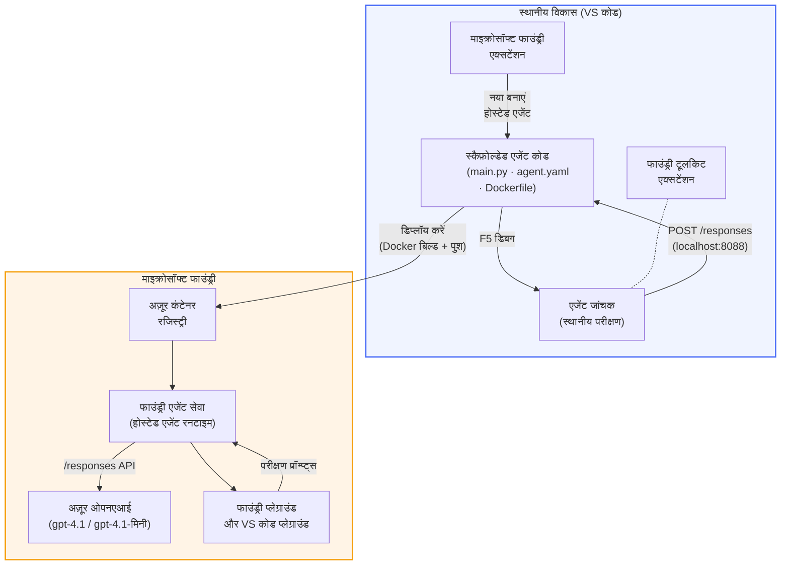

# Foundry Toolkit + Foundry Hosted Agents वर्कशॉप

[](https://www.python.org/)
[](https://github.com/microsoft/agents)
[](https://learn.microsoft.com/azure/ai-foundry/agents/concepts/hosted-agents/)
[](https://ai.azure.com/)
[](https://learn.microsoft.com/azure/ai-services/openai/)
[](https://learn.microsoft.com/cli/azure/install-azure-cli)
[](https://learn.microsoft.com/azure/developer/azure-developer-cli/install-azd)
[](https://www.docker.com/)
[](https://marketplace.visualstudio.com/items?itemName=ms-windows-ai-studio.windows-ai-studio)
[](LICENSE)

**Microsoft Foundry Agent Service** पर AI एजेंट बनाएँ, परीक्षण करें, और **Hosted Agents** के रूप में तैनात करें - पूरी तरह से VS Code से **Microsoft Foundry एक्सटेंशन** और **Foundry Toolkit** का उपयोग करके।

> **Hosted Agents वर्तमान में प्रीव्यू में हैं।** समर्थित क्षेत्र सीमित हैं - देखें [क्षेत्र उपलब्धता](https://learn.microsoft.com/azure/foundry/agents/concepts/hosted-agents#region-availability)।

> प्रत्येक लैब के अंदर `agent/` फोल्डर **Foundry एक्सटेंशन द्वारा स्वतः स्कैफ़ोल्ड किया जाता है** - इसके बाद आप कोड को कस्टमाइज़ करते हैं, लोकली टेस्ट करते हैं, और तैनात करते हैं।

<!-- CO-OP TRANSLATOR LANGUAGES TABLE START -->
[Arabic](../ar/README.md) | [Bengali](../bn/README.md) | [Bulgarian](../bg/README.md) | [Burmese (Myanmar)](../my/README.md) | [Chinese (Simplified)](../zh-CN/README.md) | [Chinese (Traditional, Hong Kong)](../zh-HK/README.md) | [Chinese (Traditional, Macau)](../zh-MO/README.md) | [Chinese (Traditional, Taiwan)](../zh-TW/README.md) | [Croatian](../hr/README.md) | [Czech](../cs/README.md) | [Danish](../da/README.md) | [Dutch](../nl/README.md) | [Estonian](../et/README.md) | [Finnish](../fi/README.md) | [French](../fr/README.md) | [German](../de/README.md) | [Greek](../el/README.md) | [Hebrew](../he/README.md) | [Hindi](./README.md) | [Hungarian](../hu/README.md) | [Indonesian](../id/README.md) | [Italian](../it/README.md) | [Japanese](../ja/README.md) | [Kannada](../kn/README.md) | [Khmer](../km/README.md) | [Korean](../ko/README.md) | [Lithuanian](../lt/README.md) | [Malay](../ms/README.md) | [Malayalam](../ml/README.md) | [Marathi](../mr/README.md) | [Nepali](../ne/README.md) | [Nigerian Pidgin](../pcm/README.md) | [Norwegian](../no/README.md) | [Persian (Farsi)](../fa/README.md) | [Polish](../pl/README.md) | [Portuguese (Brazil)](../pt-BR/README.md) | [Portuguese (Portugal)](../pt-PT/README.md) | [Punjabi (Gurmukhi)](../pa/README.md) | [Romanian](../ro/README.md) | [Russian](../ru/README.md) | [Serbian (Cyrillic)](../sr/README.md) | [Slovak](../sk/README.md) | [Slovenian](../sl/README.md) | [Spanish](../es/README.md) | [Swahili](../sw/README.md) | [Swedish](../sv/README.md) | [Tagalog (Filipino)](../tl/README.md) | [Tamil](../ta/README.md) | [Telugu](../te/README.md) | [Thai](../th/README.md) | [Turkish](../tr/README.md) | [Ukrainian](../uk/README.md) | [Urdu](../ur/README.md) | [Vietnamese](../vi/README.md)

> **स्थानीय रूप से क्लोन करना पसंद है?**
>
> इस रिपॉजिटरी में 50+ भाषाओं के अनुवाद शामिल हैं जो डाउनलोड साइज को काफी बढ़ा देते हैं। केवल मूल क्लोन करने के लिए स्पार्स चेकआउट का उपयोग करें:
>
> **Bash / macOS / Linux:**
> ```bash
> git clone --filter=blob:none --sparse https://github.com/microsoft-foundry/Foundry_Toolkit_for_VSCode_Lab.git
> cd Foundry_Toolkit_for_VSCode_Lab
> git sparse-checkout set --no-cone '/*' '!translations' '!translated_images'
> ```
>
> **CMD (Windows):**
> ```cmd
> git clone --filter=blob:none --sparse https://github.com/microsoft-foundry/Foundry_Toolkit_for_VSCode_Lab.git
> cd Foundry_Toolkit_for_VSCode_Lab
> git sparse-checkout set --no-cone "/*" "!translations" "!translated_images"
> ```
>
> यह आपको तेजी से डाउनलोड के साथ पूरा कोर्स पूरा करने के लिए सब कुछ देता है।
<!-- CO-OP TRANSLATOR LANGUAGES TABLE END -->

---

## आर्किटेक्चर


**फ्लो:** Foundry एक्सटेंशन एजेंट को स्कैफ़ोल्ड करता है → आप कोड और निर्देश कस्टमाइज़ करते हैं → Agent Inspector से लोकली टेस्ट करते हैं → Foundry पर डिप्लॉय करते हैं (Docker इमेज ACR में पुश की जाती है) → Playground में सत्यापन करते हैं।

---

## आप क्या बनाएंगे

| लैब | विवरण | स्थिति |
|-----|-------------|--------|
| **लैब 01 - सिंगल एजेंट** | **"Explain Like I'm an Executive" एजेंट** बनाएं, लोकली टेस्ट करें, और Foundry पर तैनात करें | ✅ उपलब्ध |
| **लैब 02 - मल्टी-एजेंट वर्कफ़्लो** | **"Resume → Job Fit Evaluator"** बनाएँ - 4 एजेंट मिलकर रिज़्यूमे फिट का स्कोर करते हैं और लर्निंग रोडमैप बनाते हैं | ✅ उपलब्ध |

---

## Executive Agent से मिलें

इस वर्कशॉप में आप **"Explain Like I'm an Executive" एजेंट** बनाएंगे - एक AI एजेंट जो जटिल तकनीकी शब्दों को सरल, बोर्डरूम-तैयार सारांशों में अनुवाद करता है। क्योंकि ईमानदारी से कहें तो C-स्टेट में कोई यह नहीं सुनना चाहता कि "v3.2 में जोड़े गए synchronous कॉल्स की वजह से थ्रेड पूल एक्सॉर्शन हुआ।"

मैंने यह एजेंट उस वक्त बनाया जब मेरी एकदम सही पोस्टमॉर्टम का जवाब था: *"तो... वेबसाइट डाउन है या नहीं?"*

### यह कैसे काम करता है

आप इसे तकनीकी अपडेट देते हैं। यह एक कार्यकारी सारांश लौटाता है - तीन बिंदु, कोई जार्गन नहीं, कोई स्टैक ट्रेस नहीं, कोई अस्तित्व संबंधी चिंता नहीं। बस **क्या हुआ**, **व्यवसाय पर प्रभाव**, और **आगे का कदम**।

### इसे क्रिया में देखें

**आप कहते हैं:**
> "API की लेटेंसी बढ़ी क्योंकि v3.2 में जोड़े गए synchronous कॉल्स के कारण थ्रेड पूल एक्सॉर्शन हुआ।"

**एजेंट जवाब देता है:**

> **कार्यकारी सारांश:**
> - **क्या हुआ:** नवीनतम रिलीज के बाद सिस्टम धीमा हो गया।
> - **व्यवसाय प्रभाव:** कुछ उपयोगकर्ताओं को सेवा उपयोग में देरी का सामना करना पड़ा।
> - **आगे का कदम:** परिवर्तन को वापस लिया गया है और पुनः तैनाती से पहले एक सुधार तैयार किया जा रहा है।

### यह एजेंट क्यों?

यह एक बिलकुल सरल, एकल-उद्देश्य एजेंट है - होस्टेड एजेंट वर्कफ़्लो को शुरू से अंत तक जानने के लिए परफेक्ट। और सच कहें तो? हर इंजीनियरी टीम को ऐसा एक एजेंट चाहिए।

---

## वर्कशॉप संरचना

```
📂 Foundry_Toolkit_for_VSCode_Lab/
├── 📄 README.md                      ← You are here
├── 📂 ExecutiveAgent/                ← Standalone hosted agent project
│   ├── agent.yaml
│   ├── Dockerfile
│   ├── main.py
│   └── requirements.txt
└── 📂 workshop/
    ├── 📂 lab01-single-agent/        ← Full lab: docs + agent code
    │   ├── README.md                 ← Hands-on lab instructions
    │   ├── 📂 docs/                  ← Step-by-step tutorial modules
    │   │   ├── 00-prerequisites.md
    │   │   ├── 01-install-foundry-toolkit.md
    │   │   ├── 02-create-foundry-project.md
    │   │   ├── 03-create-hosted-agent.md
    │   │   ├── 04-configure-and-code.md
    │   │   ├── 05-test-locally.md
    │   │   ├── 06-deploy-to-foundry.md
    │   │   ├── 07-verify-in-playground.md
    │   │   └── 08-troubleshooting.md
    │   └── 📂 agent/                 ← Reference solution (auto-scaffolded by Foundry extension)
    │       ├── agent.yaml
    │       ├── Dockerfile
    │       ├── main.py
    │       └── requirements.txt
    └── 📂 lab02-multi-agent/         ← Resume → Job Fit Evaluator
        ├── README.md                 ← Hands-on lab instructions (end-to-end)
        ├── 📂 docs/                  ← Step-by-step tutorial modules
        │   ├── 00-prerequisites.md
        │   ├── 01-understand-multi-agent.md
        │   ├── 02-scaffold-multi-agent.md
        │   ├── 03-configure-agents.md
        │   ├── 04-orchestration-patterns.md
        │   ├── 05-test-locally.md
        │   ├── 06-deploy-to-foundry.md
        │   ├── 07-verify-in-playground.md
        │   └── 08-troubleshooting.md
        └── 📂 PersonalCareerCopilot/ ← Reference solution (multi-agent workflow)
            ├── agent.yaml
            ├── Dockerfile
            ├── main.py
            └── requirements.txt
```

> **नोट:** प्रत्येक लैब के भीतर `agent/` फोल्डर वह होता है जो **Microsoft Foundry एक्सटेंशन** तब बनाता है जब आप कमांड पैलेट से `Microsoft Foundry: Create a New Hosted Agent` चलाते हैं। फाइलें फिर आपके एजेंट के निर्देश, टूल्स, और कॉन्फ़िगरेशन के अनुसार कस्टमाइज़ की जाती हैं। लैब 01 आपको इसे शुरू से बनाने का तरीका सिखाता है।

---

## शुरू करना

### 1. रिपॉजिटरी क्लोन करें

```bash
git clone https://github.com/microsoft-foundry/Foundry_Toolkit_for_VSCode_Lab.git
cd Foundry_Toolkit_for_VSCode_Lab
```

### 2. Python वर्चुअल एनवायरनमेंट सेट करें

```bash
python -m venv venv
```

इसे सक्रिय करें:

- **Windows (PowerShell):**
  ```powershell
  .\venv\Scripts\Activate.ps1
  ```
- **macOS / Linux:**
  ```bash
  source venv/bin/activate
  ```

### 3. निर्भरता इंस्टॉल करें

```bash
pip install -r workshop/lab01-single-agent/agent/requirements.txt
```

### 4. पर्यावरण वेरिएबल कॉन्फ़िगर करें

एजेंट फोल्डर के अंदर उदाहरण `.env` फाइल कॉपी करें और अपनी वैल्यूज़ भरें:

```bash
cp workshop/lab01-single-agent/agent/.env.example workshop/lab01-single-agent/agent/.env
```

`workshop/lab01-single-agent/agent/.env` को एडिट करें:

```env
AZURE_AI_PROJECT_ENDPOINT=https://<your-account>.services.ai.azure.com/api/projects/<your-project>
MODEL_DEPLOYMENT_NAME=<your-model-deployment-name>
```

### 5. वर्कशॉप लैब्स का पालन करें

प्रत्येक लैब अपने मापदंडों के साथ स्व-निहित है। मूल बातें सीखने के लिए **लैब 01** से शुरू करें, फिर मल्टी-एजेंट वर्कफ़्लो के लिए **लैब 02** पर जाएं।

#### लैब 01 - सिंगल एजेंट ([पूर्ण निर्देश](workshop/lab01-single-agent/README.md))

| # | मॉड्यूल | लिंक |
|---|--------|------|
| 1 | आवश्यकताएँ पढ़ें | [00-prerequisites.md](workshop/lab01-single-agent/docs/00-prerequisites.md) |
| 2 | Foundry Toolkit & Foundry एक्सटेंशन इंस्टॉल करें | [01-install-foundry-toolkit.md](workshop/lab01-single-agent/docs/01-install-foundry-toolkit.md) |
| 3 | Foundry प्रोजेक्ट बनाएं | [02-create-foundry-project.md](workshop/lab01-single-agent/docs/02-create-foundry-project.md) |
| 4 | होस्टेड एजेंट बनाएं | [03-create-hosted-agent.md](workshop/lab01-single-agent/docs/03-create-hosted-agent.md) |
| 5 | निर्देश और एनवायरनमेंट सेट करें | [04-configure-and-code.md](workshop/lab01-single-agent/docs/04-configure-and-code.md) |
| 6 | लोकली टेस्ट करें | [05-test-locally.md](workshop/lab01-single-agent/docs/05-test-locally.md) |
| 7 | Foundry पर डिप्लॉय करें | [06-deploy-to-foundry.md](workshop/lab01-single-agent/docs/06-deploy-to-foundry.md) |
| 8 | प्लेग्राउंड में सत्यापन करें | [07-verify-in-playground.md](workshop/lab01-single-agent/docs/07-verify-in-playground.md) |
| 9 | समस्या निवारण | [08-troubleshooting.md](workshop/lab01-single-agent/docs/08-troubleshooting.md) |

#### लैब 02 - मल्टी-एजेंट वर्कफ़्लो ([पूर्ण निर्देश](workshop/lab02-multi-agent/README.md))

| # | मॉड्यूल | लिंक |
|---|--------|------|
| 1 | आवश्यकताएँ (लैब 02) | [00-prerequisites.md](workshop/lab02-multi-agent/docs/00-prerequisites.md) |
| 2 | मल्टी-एजेंट आर्किटेक्चर समझें | [01-understand-multi-agent.md](workshop/lab02-multi-agent/docs/01-understand-multi-agent.md) |
| 3 | मल्टी-एजेंट प्रोजेक्ट स्कैफ़ोल्ड करें | [02-scaffold-multi-agent.md](workshop/lab02-multi-agent/docs/02-scaffold-multi-agent.md) |
| 4 | एजेंट और एनवायरनमेंट कॉन्फ़िगर करें | [03-configure-agents.md](workshop/lab02-multi-agent/docs/03-configure-agents.md) |
| 5 | ऑर्केस्ट्रेशन पैटर्न | [04-orchestration-patterns.md](workshop/lab02-multi-agent/docs/04-orchestration-patterns.md) |
| 6 | लोकली टेस्ट करें (मल्टी-एजेंट) | [05-test-locally.md](workshop/lab02-multi-agent/docs/05-test-locally.md) |
| 7 | फाउंड्री पर तैनात करें | [06-deploy-to-foundry.md](workshop/lab02-multi-agent/docs/06-deploy-to-foundry.md) |
| 8 | प्लेग्राउंड में सत्यापित करें | [07-verify-in-playground.md](workshop/lab02-multi-agent/docs/07-verify-in-playground.md) |
| 9 | समस्या समाधान (मल्टी-एजेंट) | [08-troubleshooting.md](workshop/lab02-multi-agent/docs/08-troubleshooting.md) |

---

## मेंटेनेर

<table>
<tr>
    <td align="center"><a href="https://github.com/ShivamGoyal03">
        <br />
        <sub><b>शिवम गोयल</b></sub>
    </a><br />
    </td>
</tr>
</table>

---

## आवश्यक अनुमतियाँ (त्वरित संदर्भ)

| परिदृश्य | आवश्यक भूमिकाएँ |
|----------|------------------|
| नया फाउंड्री प्रोजेक्ट बनाएँ | फाउंड्री संसाधन पर **Azure AI Owner** |
| मौजूदा प्रोजेक्ट में तैनात करें (नए संसाधन) | सब्सक्रिप्शन पर **Azure AI Owner** + **Contributor** |
| पूरी तरह से कॉन्फ़िगर किए गए प्रोजेक्ट में तैनात करें | अकाउंट पर **Reader** + प्रोजेक्ट पर **Azure AI User** |

> **महत्त्वपूर्ण:** Azure के `Owner` और `Contributor` रोल में केवल *प्रबंधन* अनुमतियाँ शामिल होती हैं, *विकास* (डेटा कार्रवाई) अनुमतियाँ शामिल नहीं हैं। एजेंट बनाने और तैनात करने के लिए आपको **Azure AI User** या **Azure AI Owner** की आवश्यकता होती है।

---

## संदर्भ

- [तुरंत-शुरुआत: अपना पहला होस्टेड एजेंट तैनात करें (VS Code)](https://learn.microsoft.com/azure/foundry/agents/quickstarts/quickstart-hosted-agent)
- [होस्टेड एजेंट क्या हैं?](https://learn.microsoft.com/azure/foundry/agents/concepts/hosted-agents)
- [VS Code में होस्टेड एजेंट वर्कफ़्लोज़ बनाएँ](https://learn.microsoft.com/azure/foundry/agents/how-to/vs-code-agents-workflow-pro-code)
- [होस्टेड एजेंट तैनात करें](https://learn.microsoft.com/azure/foundry/agents/how-to/deploy-hosted-agent)
- [Microsoft Foundry के लिए RBAC](https://learn.microsoft.com/azure/foundry/concepts/rbac-foundry)
- [आर्किटेक्चर रिव्यू एजेंट सैंपल](https://github.com/Azure-Samples/agent-architecture-review-sample) - MCP टूल्स, Excalidraw डायग्राम, और डुअल तैनाती वाला वास्तविक विश्व का होस्टेड एजेंट

---


## लाइसेंस

[MIT](../../LICENSE)

---

<!-- CO-OP TRANSLATOR DISCLAIMER START -->
**अस्वीकरण**:  
इस दस्तावेज़ का अनुवाद AI अनुवाद सेवा [Co-op Translator](https://github.com/Azure/co-op-translator) का उपयोग करके किया गया है। जबकि हम सटीकता के लिए प्रयास करते हैं, कृपया ध्यान दें कि स्वचालित अनुवादों में त्रुटियाँ या अक्षमताएँ हो सकती हैं। मूल दस्तावेज़ अपनी मूल भाषा में आधिकारिक स्रोत माना जाना चाहिए। महत्वपूर्ण जानकारी के लिए, पेशेवर मानव अनुवाद की सलाह दी जाती है। इस अनुवाद के उपयोग से उत्पन्न किसी भी गलतफहमी या गलत व्याख्या के लिए हम उत्तरदायी नहीं हैं।
<!-- CO-OP TRANSLATOR DISCLAIMER END -->