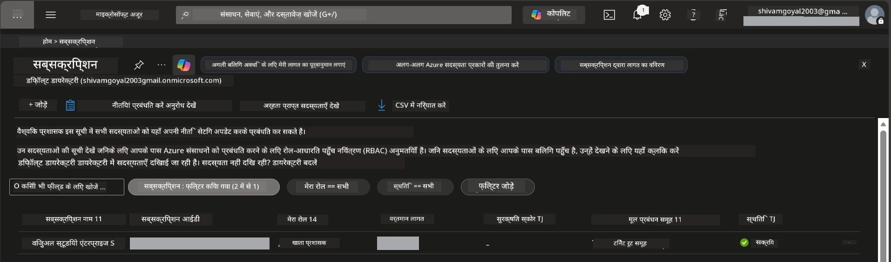

# Module 0 - पूर्व आवश्यकताएं

कार्यशाला शुरू करने से पहले, पुष्टि करें कि आपके पास निम्नलिखित उपकरण, एक्सेस और वातावरण तैयार हैं। नीचे दिए गए प्रत्येक चरण का पालन करें - कोई भी चरण छोड़ें नहीं।

---

## 1. Azure खाता और सदस्यता

### 1.1 अपनी Azure सदस्यता बनाएँ या सत्यापित करें

1. एक ब्राउज़र खोलें और [https://azure.microsoft.com/free/](https://azure.microsoft.com/free/) पर जाएं।
2. यदि आपके पास Azure खाता नहीं है, तो **Start free** पर क्लिक करें और साइन-अप प्रक्रिया का पालन करें। आपको Microsoft खाता (या एक बनाना होगा) और पहचान सत्यापन के लिए क्रेडिट कार्ड की आवश्यकता होगी।
3. यदि आपका खाता पहले से मौजूद है, तो [https://portal.azure.com](https://portal.azure.com) पर साइन इन करें।
4. पोर्टल में, बाईं नेविगेशन में **Subscriptions** ब्लेड पर क्लिक करें (या ऊपर के खोज बार में "Subscriptions" खोजें)।
5. सुनिश्चित करें कि आपके पास कम से कम एक **Active** सदस्यता है। **Subscription ID** नोट करें - आपको बाद में इसकी आवश्यकता होगी।



### 1.2 आवश्यक RBAC भूमिकाओं को समझें

[Hosted Agent](https://learn.microsoft.com/azure/foundry/agents/concepts/hosted-agents) तैनाती के लिए **data action** परमिशन चाहिए जो सामान्य Azure `Owner` और `Contributor` भूमिकाओं में शामिल नहीं होते। आपको इनमें से कोई एक [भूमिका संयोजन](https://learn.microsoft.com/azure/foundry/concepts/rbac-foundry#built-in-roles) चाहिए होगा:

| परिस्थिति | आवश्यक भूमिकाएँ | इन्हें कहाँ निर्दिष्ट करें |
|----------|---------------|----------------------|
| नया Foundry प्रोजेक्ट बनाना | Foundry संसाधन पर **Azure AI Owner** | Azure पोर्टल में Foundry संसाधन |
| मौजूदा प्रोजेक्ट (नए संसाधन) पर तैनाती | सदस्यता पर **Azure AI Owner** + **Contributor** | सदस्यता + Foundry संसाधन |
| पूरी तरह से कॉन्फ़िगर किए गए प्रोजेक्ट पर तैनाती | खाता पर **Reader** + प्रोजेक्ट पर **Azure AI User** | Azure पोर्टल में खाता + प्रोजेक्ट |

> **मुख्य बिंदु:** Azure `Owner` और `Contributor` भूमिकाएँ केवल *प्रबंधन* परमिशन (ARM संचालन) को कवर करती हैं। आपको एजेंट बनाने और तैनात करने के लिए आवश्यक *data actions* जैसे `agents/write` के लिए [**Azure AI User**](https://learn.microsoft.com/azure/foundry/concepts/rbac-foundry#built-in-roles) (या अधिक) चाहिए। आप ये भूमिकाएँ [Module 2](02-create-foundry-project.md) में असाइन करेंगे।

---

## 2. स्थानीय उपकरण स्थापित करें

नीचे दिए गए प्रत्येक उपकरण को इंस्टॉल करें। इंस्टॉल करने के बाद, चेक कमांड चलाकर सत्यापित करें कि यह काम करता है।

### 2.1 Visual Studio Code

1. [https://code.visualstudio.com/](https://code.visualstudio.com/) पर जाएं।
2. अपने OS (Windows/macOS/Linux) के लिए इंस्टॉलर डाउनलोड करें।
3. डिफ़ॉल्ट सेटिंग्स के साथ इंस्टॉलर चलाएं।
4. VS Code खोलें और पुष्टि करें कि यह लॉन्च होता है।

### 2.2 Python 3.10+

1. [https://www.python.org/downloads/](https://www.python.org/downloads/) पर जाएं।
2. Python 3.10 या बाद का संस्करण डाउनलोड करें (3.12+ अनुशंसित)।
3. **Windows:** इंस्टॉलेशन के दौरान पहली स्क्रीन पर **"Add Python to PATH"** चेक करें।
4. एक टर्मिनल खोलें और सत्यापित करें:

   ```powershell
   python --version
   ```

   अपेक्षित आउटपुट: `Python 3.10.x` या उच्चतर।

### 2.3 Azure CLI

1. [https://learn.microsoft.com/cli/azure/install-azure-cli](https://learn.microsoft.com/cli/azure/install-azure-cli) पर जाएं।
2. अपने OS के लिए इंस्टॉलेशन निर्देशों का पालन करें।
3. सत्यापित करें:

   ```powershell
   az --version
   ```

   अपेक्षित: `azure-cli 2.80.0` या उच्चतर।

4. साइन इन करें:

   ```powershell
   az login
   ```

### 2.4 Azure Developer CLI (azd)

1. [https://learn.microsoft.com/azure/developer/azure-developer-cli/install-azd](https://learn.microsoft.com/azure/developer/azure-developer-cli/install-azd) पर जाएं।
2. अपने OS के लिए इंस्टॉलेशन निर्देशों का पालन करें। विंडोज़ पर:

   ```powershell
   winget install microsoft.azd
   ```

3. सत्यापित करें:

   ```powershell
   azd version
   ```

   अपेक्षित: `azd version 1.x.x` या उच्चतर।

4. साइन इन करें:

   ```powershell
   azd auth login
   ```

### 2.5 Docker Desktop (वैकल्पिक)

Docker केवल तब आवश्यक है जब आप तैनाती से पहले कंटेनर इमेज को स्थानीय रूप से बनाना और परीक्षण करना चाहते हैं। Foundry एक्सटेंशन तैनाती के दौरान कंटेनर बिल्ड्स को स्वचालित रूप से संभालता है।

1. [https://docs.docker.com/get-docker/](https://docs.docker.com/get-docker/) पर जाएं।
2. अपने OS के लिए Docker Desktop डाउनलोड और इंस्टॉल करें।
3. **Windows:** इंस्टॉलेशन के दौरान WSL 2 बैकएंड चयनित हो यह सुनिश्चित करें।
4. Docker Desktop शुरू करें और सिस्टम ट्रे में आइकन के **"Docker Desktop is running"** दिखाने का इंतजार करें।
5. एक टर्मिनल खोलें और सत्यापित करें:

   ```powershell
   docker info
   ```

   यह त्रुटि के बिना Docker सिस्टम जानकारी प्रिंट करना चाहिए। यदि आप `Cannot connect to the Docker daemon` देखते हैं, तो Docker पूरी तरह से शुरू होने तक कुछ सेकंड और प्रतीक्षा करें।

---

## 3. VS Code एक्सटेंशन स्थापित करें

आपको तीन एक्सटेंशन की आवश्यकता है। कार्यशाला शुरू होने से **पहले** इन्हें इंस्टॉल करें।

### 3.1 Microsoft Foundry for VS Code

1. VS Code खोलें।
2. एक्सटेंशन पैनल खोलने के लिए `Ctrl+Shift+X` दबाएं।
3. खोज बॉक्स में **"Microsoft Foundry"** टाइप करें।
4. **Microsoft Foundry for Visual Studio Code** (प्रकाशक: Microsoft, ID: `TeamsDevApp.vscode-ai-foundry`) खोजें।
5. **Install** पर क्लिक करें।
6. इंस्टॉल होने के बाद, आपको एक्टिविटी बार (बाईं साइडबार) में **Microsoft Foundry** आइकन दिखना चाहिए।

### 3.2 Foundry Toolkit

1. एक्सटेंशन पैनल में (`Ctrl+Shift+X`) **"Foundry Toolkit"** खोजें।
2. **Foundry Toolkit** (प्रकाशक: Microsoft, ID: `ms-windows-ai-studio.windows-ai-studio`) खोजें।
3. **Install** पर क्लिक करें।
4. **Foundry Toolkit** आइकन एक्टिविटी बार में दिखना चाहिए।

### 3.3 Python

1. एक्सटेंशन पैनल में **"Python"** खोजें।
2. **Python** (प्रकाशक: Microsoft, ID: `ms-python.python`) खोजें।
3. **Install** पर क्लिक करें।

---

## 4. VS Code से Azure में साइन इन करें

[Microsoft Agent Framework](https://learn.microsoft.com/agent-framework/overview/) प्रमाणीकरण के लिए [`DefaultAzureCredential`](https://learn.microsoft.com/azure/developer/python/sdk/authentication/credential-chains#defaultazurecredential-overview) का उपयोग करता है। आपको VS Code में Azure में साइन इन होना जरूरी है।

### 4.1 VS Code के माध्यम से साइन इन करें

1. VS Code के बाईं निचली कोने में **Accounts** आइकन (व्यक्ति का सिल्हूट) पर क्लिक करें।
2. **Sign in to use Microsoft Foundry** (या **Sign in with Azure**) पर क्लिक करें।
3. एक ब्राउज़र विंडो खुलती है - उस Azure खाते से साइन इन करें जिसे आपकी सदस्यता तक पहुँच है।
4. VS Code पर वापस आएं। आपको बाईं निचली कोने में अपना खाता नाम दिखाई देगा।

### 4.2 (वैकल्पिक) Azure CLI के माध्यम से साइन इन करें

यदि आपने Azure CLI इंस्टॉल किया है और CLI आधारित प्रमाणीकरण पसंद करते हैं:

```powershell
az login
```

इससे साइन-इन के लिए ब्राउज़र खुलेगा। साइन-इन के बाद, सही सदस्यता सेट करें:

```powershell
az account set --subscription "<your-subscription-id>"
```

सत्यापित करें:

```powershell
az account show --query "{name:name, id:id, state:state}" --output table
```

आपको अपनी सदस्यता का नाम, ID और स्थिति = `Enabled` दिखेगा।

### 4.3 (वैकल्पिक) सेवा प्रिंसिपल प्रमाणीकरण

CI/CD या साझा वातावरण के लिए, इसके बजाय ये पर्यावरण चर सेट करें:

```powershell
$env:AZURE_TENANT_ID = "<your-tenant-id>"
$env:AZURE_CLIENT_ID = "<your-client-id>"
$env:AZURE_CLIENT_SECRET = "<your-client-secret>"
```

---

## 5. पूर्वावलोकन सीमाएं

आगे बढ़ने से पहले, वर्तमान सीमाओं के बारे में जान लें:

- [**Hosted Agents**](https://learn.microsoft.com/azure/foundry/agents/concepts/hosted-agents) अभी **सार्वजनिक पूर्वावलोकन** में हैं - उत्पादन वर्कलोड के लिए अनुशंसित नहीं।
- **समर्थित क्षेत्र सीमित हैं** - संसाधन बनाने से पहले [क्षेत्र उपलब्धता](https://learn.microsoft.com/azure/foundry/agents/concepts/hosted-agents#region-availability) जांचें। यदि आप असमर्थित क्षेत्र चुनते हैं, तो तैनाती विफल हो जाएगी।
- `azure-ai-agentserver-agentframework` पैकेज प्री-रिलीज़ (`1.0.0b16`) है - API में परिवर्तन हो सकता है।
- पैमाना सीमाएं: hosted agents 0-5 प्रतियों का समर्थन करते हैं (scale-to-zero सहित)।

---

## 6. प्रारंभिक जांच सूची

नीचे दिए गए प्रत्येक आइटम को चलाएं। यदि कोई भी चरण विफल होता है, तो जारी रखने से पहले वापस जाएं और ठीक करें।

- [ ] VS Code बिना किसी त्रुटि के खुलता है
- [ ] Python 3.10+ PATH में है (`python --version` `3.10.x` या उच्चतर प्रिंट करता है)
- [ ] Azure CLI इंस्टॉल है (`az --version` `2.80.0` या उच्चतर प्रिंट करता है)
- [ ] Azure Developer CLI इंस्टॉल है (`azd version` संस्करण जानकारी प्रिंट करता है)
- [ ] Microsoft Foundry एक्सटेंशन इंस्टॉल है (एक्टिविटी बार में आइकन दिखता है)
- [ ] Foundry Toolkit एक्सटेंशन इंस्टॉल है (एक्टिविटी बार में आइकन दिखता है)
- [ ] Python एक्सटेंशन इंस्टॉल है
- [ ] आप VS Code में Azure में साइन इन हैं (नीचे-बाएं Accounts आइकन देखें)
- [ ] `az account show` आपकी सदस्यता दिखाता है
- [ ] (वैकल्पिक) Docker Desktop चल रहा है (`docker info` त्रुटि रहित सिस्टम जानकारी दिखाता है)

### जांच बिंदु

VS Code की एक्टिविटी बार खोलें और पुष्टि करें कि आप दोनों **Foundry Toolkit** और **Microsoft Foundry** साइडबार व्यू देख पा रहे हैं। प्रत्येक पर क्लिक करें और सुनिश्चित करें कि वे बिना त्रुटि के लोड होते हैं।

---

**अगला:** [01 - Foundry Toolkit और Foundry एक्सटेंशन इंस्टॉल करें →](01-install-foundry-toolkit.md)

---

<!-- CO-OP TRANSLATOR DISCLAIMER START -->
**अस्वीकरण**:  
यह दस्तावेज़ एआई अनुवाद सेवा [Co-op Translator](https://github.com/Azure/co-op-translator) का उपयोग करके अनूदित किया गया है। जबकि हम सटीकता के लिए प्रयासरत हैं, कृपया ध्यान दें कि स्वचालित अनुवादों में त्रुटियाँ या असत्यताएँ हो सकती हैं। मूल भाषा में मूल दस्तावेज़ को आधिकारिक स्रोत माना जाना चाहिए। महत्वपूर्ण जानकारी के लिए, पेशेवर मानव अनुवाद की सिफारिश की जाती है। इस अनुवाद के उपयोग से उत्पन्न किसी भी गलतफहमी या गलत व्याख्या के लिए हम उत्तरदायी नहीं हैं।
<!-- CO-OP TRANSLATOR DISCLAIMER END -->