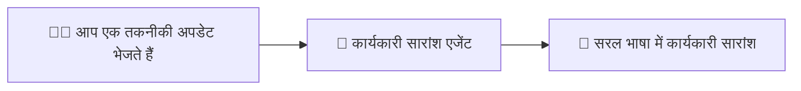

# मॉड्यूल 0 - परिचय

⏱️ ~10 मिनट

> [!WARNING]
> **पूर्वावलोकन और सीमाएं:** [Hosted Agents](https://learn.microsoft.com/azure/foundry/agents/concepts/hosted-agents) वर्तमान में **सार्वजनिक पूर्वावलोकन** में हैं - उत्पादन कार्यभार के लिए अनुशंसित नहीं हैं। कृपया निम्नलिखित बातों का ध्यान रखें:
> - **समर्थित क्षेत्र सीमित हैं** - संसाधन बनाने से पहले [क्षेत्र उपलब्धता](https://learn.microsoft.com/azure/foundry/agents/concepts/hosted-agents#region-availability) जांचें। यदि आप असमर्थित क्षेत्र चुनते हैं, तो तैनाती विफल हो जाएगी।
> - `azure-ai-agentserver-agentframework` पैकेज प्री-रिलीज़ है - संस्करणों के बीच API बदल सकते हैं।
> - स्केल सीमाएं: होस्टेड एजेंट 0–5 प्रतिकृतियों (स्केल-टू-जीरो सहित) का समर्थन करते हैं।
> - इस कार्यशाला में दिखाए गए कुछ फीचर सेवा के GA की ओर बढ़ने के साथ बदल सकते हैं।

## आप क्या बनाएंगे

इस कार्यशाला में, आप एक **"Explain Like I'm an Executive"** एजेंट बनाएंगे - एक होस्टेड AI एजेंट जो जटिल तकनीकी अपडेट्स को सरल अंग्रेज़ी कार्यकारी सारांशों में पुनः लिखता है।

```mermaid
flowchart LR
    A["🧑‍💻 आप एक तकनीकी अपडेट भेजते हैं"] --> B["🤖 कार्यकारी सारांश एजेंट"]
    B --> C["📝 सरल भाषा में कार्यकारी सारांश"]
```

**एजेंट उपयोग करता है:**
- **Microsoft Agent Framework** - एजेंट तर्क और संरचना के लिए
- **Foundry Toolkit for VS Code** - स्कैफ़ोल्ड, स्थानीय रूप से परीक्षण और तैनाती के लिए
- **एक AI मॉडल** (जैसे, `gpt-4.1-mini/gpt-5-mini`) - सारांश बनाने के लिए

इस प्रयोगशाला के अंत तक, आपके पास एक कार्यशील एजेंट होगा जिसे आप स्थानीय रूप से Agent Inspector के माध्यम से परीक्षण कर सकते हैं, और वैकल्पिक रूप से क्लाउड पर तैनात भी कर सकते हैं।

---

## होस्टेड एजेंट क्या हैं?

एक **होस्टेड एजेंट** एक AI एजेंट है जो Microsoft Foundry में एक प्रबंधित सेवा के रूप में चलता है। अपनी स्वयं की अवसंरचना प्रबंधित करने के बजाय, आप अपने एजेंट कोड को एक कंटेनर में पैकेज करते हैं और Foundry इसकी स्केलिंग, होस्टिंग, और इसे मानक HTTP एंडपॉइंट के जरिए उपलब्ध कराता है।

| अवधारणा | इसका मतलब क्या है |
|---------|--------------|
| **एजेंट** | आपका Python कोड जो उपयोगकर्ता संदेश प्राप्त करता है, AI मॉडल कॉल करता है, और संरचित प्रतिक्रिया देता है |
| **होस्टेड** | Foundry आपके लिए आपका कंटेनर चलाता है - कोई VM, कोई Kubernetes, कोई अवसंरचना प्रबंधन नहीं |
| **प्रतिक्रिया प्रोटोकॉल** | एक मानक HTTP API (`POST /responses`) जिसे कोई भी ग्राहक आपके एजेंट से इंटरैक्ट करने के लिए कॉल कर सकता है |
| **एजेंट इंस्पेक्टर** | एक स्थानीय परीक्षण UI (Foundry Toolkit में निर्मित) जो आपको तैनाती से पहले अपने एजेंट से बातचीत करने देता है |

इस कार्यशाला में, आप शून्य से एक पूर्ण होस्टेड एजेंट तक जाएंगे - या यदि चाहें तो केवल स्थानीय परीक्षण पर रुक सकते हैं।

---

## अपना मार्ग चुनें

> ⚠️ **आगे बढ़ने से पहले एक मार्ग चुनें।** आपका चयन यह निर्धारित करता है कि कौन से उपकरण स्थापित करने हैं और कौन से मॉड्यूल लागू होंगे। आप बाद में Path B → Path A में स्विच कर सकते हैं यदि आपके पास सब्सक्रिप्शन है।

<strong>🅰️ पथ A - Azure क्लाउड (Azure सब्सक्रिप्शन आवश्यक)</strong>

| | विवरण |
|---|---|
| **यह किसके लिए है?** | आपके पास एक सक्रिय Azure सब्सक्रिप्शन है और आप Foundry संसाधन बना सकते हैं |
| **मॉडल** | Foundry के माध्यम से Azure OpenAI (जैसे, `gpt-4.1-mini/gpt-5-mini`) |
| **कवर किए गए मॉड्यूल** | सभी मॉड्यूल (00–07) |
| **क्लाउड पर तैनात करें?** | ✅ हाँ - पूर्ण एंड-टू-एंड तैनाती |

<strong>🅱️ पथ B - स्थानीय / फ्री-टियर (Azure सब्सक्रिप्शन आवश्यक नहीं)</strong>

| | विवरण |
|---|---|
| **यह किसके लिए है?** | MVPs, छात्र, या जो कोई भी Azure एक्सेस के बिना है |
| **मॉडल** | **Foundry Local** (मुफ़्त, आपकी मशीन पर चलता है) |
| **कवर किए गए मॉड्यूल** | मॉड्यूल 00–04 (डिप्लॉय और क्लाउड वेरिफाई छोड़ें) |
| **क्लाउड पर तैनात करें?** | ❌ नहीं - केवल Agent Inspector के जरिए स्थानीय परीक्षण |

---

## सभी पथ: आवश्यक उपकरण

नीचे प्रत्येक उपकरण स्थापित करें। स्थापित करने के बाद, जांच कमांड चलाकर पुष्टि करें कि यह काम कर रहा है।

| # | उपकरण | संस्करण | स्थापना | सत्यापित करें (अपेक्षित आउटपुट) |
|---|------|---------|---------|---------------------------|
| 1 | **Visual Studio Code** | नवीनतम | [code.visualstudio.com](https://code.visualstudio.com/) | त्रुटि के बिना खुलता है |
| 2 | **Python** | 3.12 या उससे ऊपर| [python.org/downloads](https://www.python.org/downloads/) | `python --version` $\rightarrow$ `Python 3.12.x` |
| 3 | **Foundry Toolkit for VS Code** | नवीनतम | Extension ID: `ms-windows-ai-studio.windows-ai-studio` | Activity Bar में Foundry आइकन |
| 4 | **Python एक्सटेंशन फॉर VS Code** | नवीनतम | Extension ID: `ms-python.python` | Extensions पैनल में स्थापित |

> [!TIP]
> **स्थापना के लिए प्रो-टिप्स:**
> - **Python PATH (Windows):** Python इंस्टालर की पहली स्क्रीन पर हमेशा **"Add Python to PATH"** चेक करें। इसके बिना, आपके टर्मिनल में `python` मान्यता प्राप्त नहीं होगा।
> - **कई Python संस्करण:** यदि आपके पास Python 3.10 और 3.12 दोनों इंस्टॉल हैं, तो अपने वर्चुअल एनवायरनमेंट के लिए सही संस्करण सुनिश्चित करने के लिए `python3.12 -m venv .venv` का उपयोग करें।
> - **Docker WSL 2 (Windows):** Docker Desktop इंस्टॉलेशन के दौरान, सुनिश्चित करें कि **WSL 2 backend** चयनित है। Hyper-V के साथ Docker धीमा होता है और Foundry कंटेनर बिल्ड में समस्या उत्पन्न कर सकता है।
> - **Docker शुरू नहीं हो रहा?** Docker Desktop शुरू करने के बाद 30–60 सेकंड प्रतीक्षा करें। `docker info` चलाएं — यदि आप "Cannot connect to the Docker daemon" देखते हैं, तो Docker अभी प्रारंभ कर रहा है।
> - **VS Code एक्सटेंशनलोड नहीं हो रहे?** एक्सटेंशन स्थापित करने के बाद विंडो को रीलोड करें: `Ctrl+Shift+P` → `Developer: Reload Window`।

> **Windows उपयोगकर्ता:** Python इंस्टालेशन के दौरान **"Add Python to PATH"** चेक करें।

**अगला:** [01 - सेटअप →](01-setup.md)

---

<!-- CO-OP TRANSLATOR DISCLAIMER START -->
**अस्वीकरण**:
इस दस्तावेज़ का अनुवाद AI अनुवाद सेवा [Co-op Translator](https://github.com/Azure/co-op-translator) का उपयोग करके किया गया है। जबकि हम सटीकता के लिए प्रयास करते हैं, कृपया ध्यान दें कि स्वचालित अनुवादों में त्रुटियाँ या अशुद्धियाँ हो सकती हैं। मूल दस्तावेज़ अपनी मूल भाषा में ही प्रामाणिक स्रोत माना जाना चाहिए। महत्वपूर्ण जानकारी के लिए, पेशेवर मानव अनुवाद की सिफारिश की जाती है। इस अनुवाद के उपयोग से उत्पन्न किसी भी गलतफहमी या गलत व्याख्या के लिए हम उत्तरदायी नहीं हैं।
<!-- CO-OP TRANSLATOR DISCLAIMER END -->