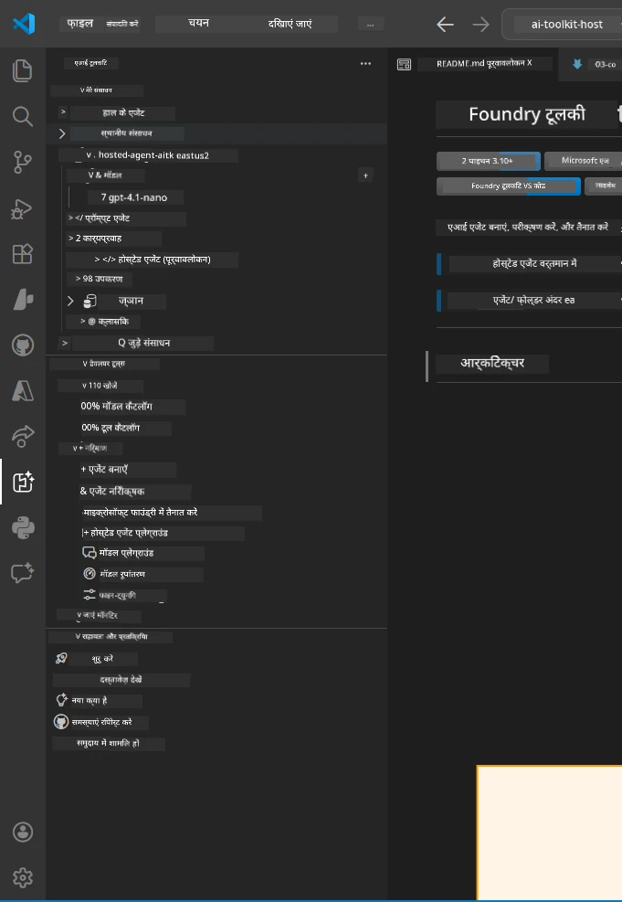
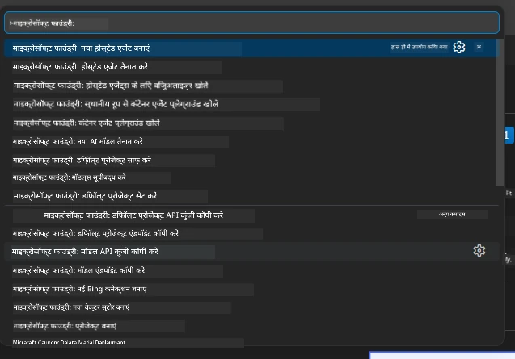

# Module 1 - Foundry Toolkit और Foundry Extension इंस्टॉल करें

यह मॉड्यूल आपको इस कार्यशाला के लिए दो मुख्य VS Code एक्सटेंशन इंस्टॉल करने और सत्यापित करने की प्रक्रिया से गुजरता है। यदि आपने इन्हें पहले [Module 0](00-prerequisites.md) के दौरान इंस्टॉल किया है, तो इस मॉड्यूल का उपयोग यह सुनिश्चित करने के लिए करें कि वे सही काम कर रहे हैं।

---

## Step 1: Microsoft Foundry Extension इंस्टॉल करें

**Microsoft Foundry for VS Code** एक्सटेंशन आपके Foundry प्रोजेक्ट बनाने, मॉडल तैनात करने, होस्टेड एजेंट्स के लिए स्कैफोल्डिंग करने, और VS Code से सीधे तैनाती करने का मुख्य उपकरण है।

1. VS Code खोलें।
2. `Ctrl+Shift+X` दबाएं ताकि **Extensions** पैनल खुल जाए।
3. ऊपर खोज बॉक्स में टाइप करें: **Microsoft Foundry**
4. परिणामों में देखें जिसका शीर्षक हो **Microsoft Foundry for Visual Studio Code**।
   - प्रकाशक: **Microsoft**
   - एक्सटेंशन ID: `TeamsDevApp.vscode-ai-foundry`
5. **Install** बटन पर क्लिक करें।
6. इंस्टॉलेशन पूरा होने तक प्रतीक्षा करें (आपको एक छोटा प्रगति संकेत दिखाई देगा)।
7. इंस्टॉलेशन के बाद, **Activity Bar** (VS Code के बाईं ओर लंबवत आइकन बार) देखें। आपको एक नया **Microsoft Foundry** आइकन दिखना चाहिए (हीरा/AI आइकन जैसा दिखने वाला)।
8. **Microsoft Foundry** आइकन पर क्लिक करें ताकि इसका साइडबार व्यू खुल जाए। आपको निम्नलिखित सेक्शन दिखने चाहिए:
   - **Resources** (या Projects)
   - **Agents**
   - **Models**

> **यदि आइकन नहीं दिखता है:** VS Code को पुनः लोड करने की कोशिश करें (`Ctrl+Shift+P` → `Developer: Reload Window`)।

---

## Step 2: Foundry Toolkit Extension इंस्टॉल करें

**Foundry Toolkit** एक्सटेंशन [**Agent Inspector**](https://learn.microsoft.com/azure/foundry/agents/how-to/vs-code-agents-workflow-pro-code) प्रदान करता है - जो एजेंट्स का स्थानीय परीक्षण और डीबगिंग के लिए एक दृश्य इंटरफ़ेस है - साथ ही प्लेग्राउंड, मॉडल प्रबंधन और मूल्यांकन उपकरण।

1. Extensions पैनल में (`Ctrl+Shift+X`), खोज बॉक्स साफ करें और टाइप करें: **Foundry Toolkit**
2. परिणामों में **Foundry Toolkit** खोजें।
   - प्रकाशक: **Microsoft**
   - एक्सटेंशन ID: `ms-windows-ai-studio.windows-ai-studio`
3. **Install** पर क्लिक करें।
4. इंस्टॉलेशन के बाद, **Foundry Toolkit** आइकन Activity Bar में दिखाई देगा (रोबोट/चमकदार आइकन जैसा दिखता है)।
5. **Foundry Toolkit** आइकन पर क्लिक करें ताकि इसका साइडबार व्यू खुल जाए। आपको Foundry Toolkit का स्वागत स्क्रीन दिखेगा जिसमें विकल्प होंगे:
   - **Models**
   - **Playground**
   - **Agents**

---

## Step 3: दोनों एक्सटेंशनों का कार्य करना सत्यापित करें

### 3.1 Microsoft Foundry Extension सत्यापित करें

1. Activity Bar में **Microsoft Foundry** आइकन पर क्लिक करें।
2. यदि आप Azure में साइन इन हैं (Module 0 से), तो आपको **Resources** के तहत अपने प्रोजेक्ट्स दिखने चाहिए।
3. यदि साइन इन करने के लिए कहा जाए, तो **Sign in** पर क्लिक करें और प्रमाणीकरण प्रक्रिया का पालन करें।
4. पुष्टि करें कि आप साइडबार को बिना त्रुटि के देख पा रहे हैं।

### 3.2 Foundry Toolkit Extension सत्यापित करें

1. Activity Bar में **Foundry Toolkit** आइकन पर क्लिक करें।
2. पुष्टि करें कि स्वागत दृश्य या मुख्य पैनल बिना त्रुटि के लोड होता है।
3. अभी कुछ कॉन्फ़िगर करने की ज़रूरत नहीं है - Agent Inspector का उपयोग हम [Module 5](05-test-locally.md) में करेंगे।

### 3.3 Command Palette के जरिए सत्यापित करें

1. `Ctrl+Shift+P` दबाएं ताकि Command Palette खुले।
2. टाइप करें **"Microsoft Foundry"** - आपको निम्नलिखित कमांड्स दिखनी चाहिए:
   - `Microsoft Foundry: Create a New Hosted Agent`
   - `Microsoft Foundry: Deploy Hosted Agent`
   - `Microsoft Foundry: Open Model Catalog`
3. कमांड पैलेट बंद करने के लिए `Escape` दबाएं।
4. फिर से Command Palette खोलें और टाइप करें **"Foundry Toolkit"** - आपको निम्नलिखित कमांड दिखें:
   - `Foundry Toolkit: Open Agent Inspector`

> यदि आपको ये कमांड्स नहीं दिखती हैं, तो संभव है कि एक्सटेंशन सही तरीके से इंस्टॉल न हुए हों। इन्हें अनइंस्टॉल करके फिर से इंस्टॉल करें।

---

## इस कार्यशाला में ये एक्सटेंशन क्या करते हैं

| एक्सटेंशन | यह क्या करता है | आप इसे कब उपयोग करेंगे |
|-----------|-----------------|-------------------------|
| **Microsoft Foundry for VS Code** | Foundry प्रोजेक्ट बनाना, मॉडल तैनात करना, **[hosted agents](https://learn.microsoft.com/azure/foundry/agents/concepts/hosted-agents)** के लिए स्कैफोल्ड (स्वतः `agent.yaml`, `main.py`, `Dockerfile`, `requirements.txt` बनाता है), [Foundry Agent Service](https://learn.microsoft.com/azure/foundry/agents/overview) पर तैनाती | Modules 2, 3, 6, 7 |
| **Foundry Toolkit** | एजेंट इंस्पेक्टर स्थानीय परीक्षण/डीबगिंग के लिए, प्लेग्राउंड UI, मॉडल प्रबंधन | Modules 5, 7 |

> **Foundry एक्सटेंशन इस कार्यशाला का सबसे महत्वपूर्ण उपकरण है।** यह पूरे जीवनचक्र को संभालता है: स्कैफोल्ड → कॉन्फ़िगर → तैनात → सत्यापित। Foundry Toolkit इसे पूरक करता है जो स्थानीय परीक्षण के लिए दृश्य Agent Inspector प्रदान करता है।

---

### चेकपॉइंट

- [ ] Activity Bar में Microsoft Foundry आइकन दिखाई दे रहा है
- [ ] उस पर क्लिक करने से साइडबार बिना त्रुटि के खुलता है
- [ ] Activity Bar में Foundry Toolkit आइकन दिखाई दे रहा है
- [ ] उस पर क्लिक करने से साइडबार बिना त्रुटि के खुलता है
- [ ] `Ctrl+Shift+P` → "Microsoft Foundry" टाइप करने पर उपलब्ध कमांड्स दिखती हैं
- [ ] `Ctrl+Shift+P` → "Foundry Toolkit" टाइप करने पर उपलब्ध कमांड्स दिखती हैं

---

**पिछला:** [00 - Prerequisites](00-prerequisites.md) · **अगला:** [02 - Create Foundry Project →](02-create-foundry-project.md)

---

<!-- CO-OP TRANSLATOR DISCLAIMER START -->
**अस्वीकरण**:  
इस दस्तावेज़ का अनुवाद AI अनुवादन सेवा [Co-op Translator](https://github.com/Azure/co-op-translator) का उपयोग करके किया गया है। जबकि हम सटीकता के लिए प्रयासरत हैं, कृपया ध्यान दें कि स्वचालित अनुवादों में त्रुटियां या अशुद्धियां हो सकती हैं। मूल दस्तावेज़ अपनी मूल भाषा में ही प्राधिकृत स्रोत माना जाना चाहिए। महत्वपूर्ण जानकारी के लिए व्यावसायिक मानव अनुवाद की सलाह दी जाती है। इस अनुवाद के उपयोग से उत्पन्न किसी भी गलतफहमी या गलत व्याख्या के लिए हम उत्तरदायी नहीं हैं।
<!-- CO-OP TRANSLATOR DISCLAIMER END -->