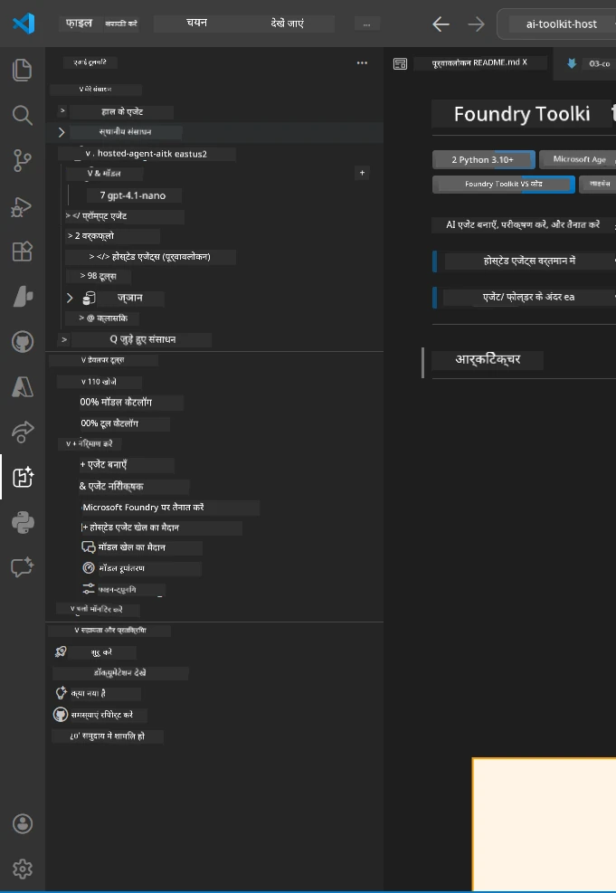
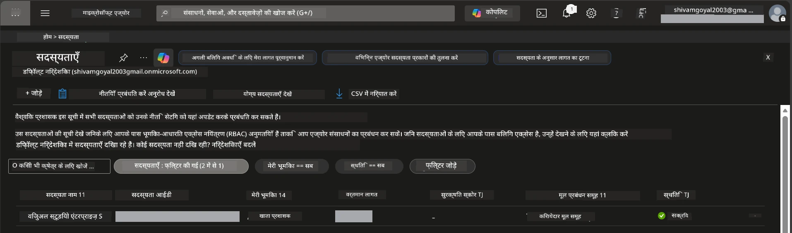
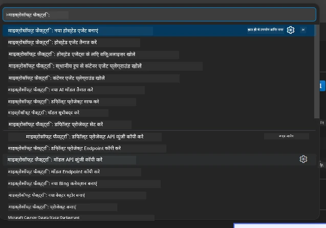
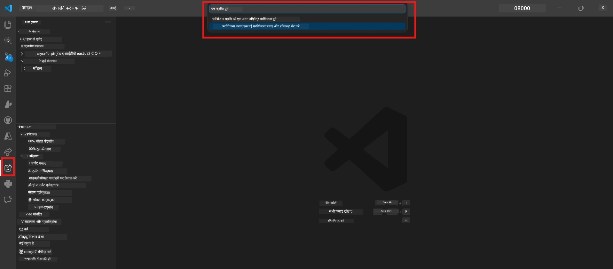
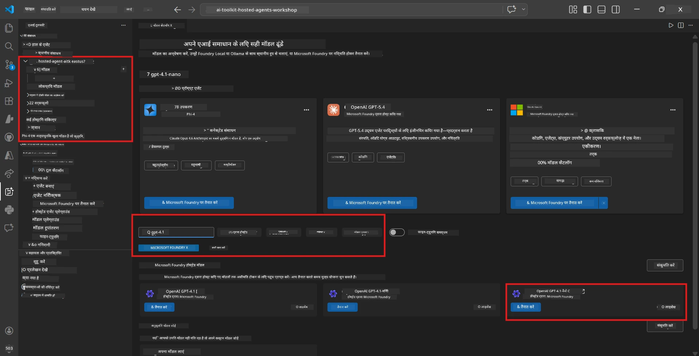
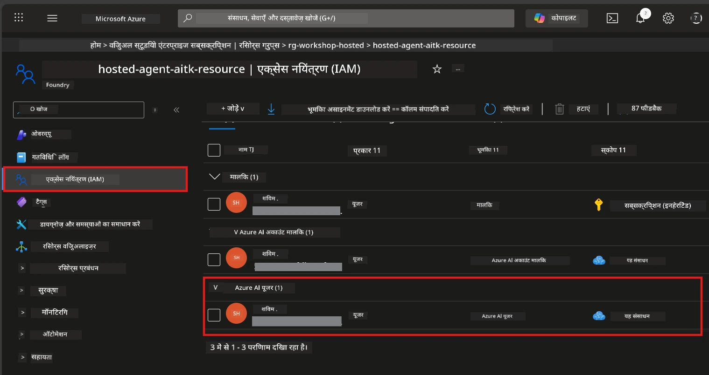

# सेटअप: एक्सटेंशन, प्रोजेक्ट और मॉडल

⏱️ ~15 मिनट

इस मॉड्यूल में, आप Foundry Toolkit एक्सटेंशन स्थापित और सत्यापित करते हैं, एक Foundry प्रोजेक्ट बनाते हैं (या उससे कनेक्ट होते हैं), और एक मॉडल तैनात करते हैं जिसका आपका एजेंट उपयोग करेगा।

## चरण 1: Foundry Toolkit इंस्टॉल करें

**Foundry Toolkit for VS Code** इस कार्यशाला के लिए प्रमुख एक्सटेंशन है। यह प्रोजेक्ट निर्माण, मॉडल तैनाती, एजेंट स्कैफोल्डिंग, स्थानीय परीक्षण (Agent Inspector), और क्लाउड तैनाती प्रदान करता है - सब कुछ VS Code से।

1. VS Code खोलें फिर `Ctrl+Shift+X` दबाकर **Extensions** पैनल खोलें।
2. **Foundry Toolkit** के लिए खोजें।
3. **Foundry Toolkit for VS Code** इंस्टॉल करें (प्रकाशक: Microsoft, ID: `ms-windows-ai-studio.windows-ai-studio`)।
4. इंस्टॉलेशन के बाद, **Foundry Toolkit** का आइकन Activity Bar (बाएं साइडबार) में दिखाई देगा।

> *नोट: Activity Bar पुराने एक्सटेंशन संस्करणों में "AI TOOLKIT" दिखा सकता है। कार्यक्षमता समान है।*



## चरण 2: अपनी पहुँच के आधार पर सेटअप करें

> **अपना रास्ता चुनें:** नीचे उस सेक्शन को विस्तार करें जो आपके सेटअप से मेल खाता हो। आपको केवल **एक** रास्ता पूरा करना होगा।

<details>
<summary><strong>🅰️ रास्ता A - Azure क्लाउड (Azure सदस्यता आवश्यक)</strong></summary>

### Azure CLI

1. [learn.microsoft.com/cli/azure/install-azure-cli](https://learn.microsoft.com/cli/azure/install-azure-cli) से इंस्टॉल करें।
2. सत्यापित करें: `az --version` (अपेक्षित 2.80.0+).
3. साइन इन करें: `az login`

### प्रमाणीकरण विकल्प

[Microsoft Agent Framework](https://learn.microsoft.com/agent-framework/overview/) [`DefaultAzureCredential`](https://learn.microsoft.com/azure/developer/python/sdk/authentication/credential-chains#defaultazurecredential-overview) का उपयोग करता है जो क्रम में कई प्रमाणीकरण विधियों का प्रयास करता है। अपने पर्यावरण के अनुसार चुनें:

#### विकल्प 1: VS Code खाते (वर्कशॉप के लिए अनुशंसित)
1. VS Code के नीचे-बाएं कोने में **Accounts** आइकन (व्यक्ति सिलोएट) पर क्लिक करें।
2. **Microsoft Foundry का उपयोग करने के लिए साइन इन करें** (या **Azure से साइन इन करें**) चुनें।
3. एक ब्राउज़र खुलेगा - Azure खाते से साइन इन करें जिसका आपकी सदस्यता तक पहुँच है।
4. VS Code पर लौटें। आपको नीचे-बाएं कोने में अपना खाता नाम दिखना चाहिए।

#### विकल्प 2: Azure CLI
```bash
az login
az account set --subscription "<your-subscription-id>"
```

#### विकल्प 3: सर्विस प्रिंसिपल (एंटरप्राइज/CI)
लॉक-डाउन वातावरण या CI/CD पाइपलाइनों के लिए, अपने `.env` फ़ाइल में ये पर्यावरण चर सेट करें:
```env
AZURE_TENANT_ID=<your-tenant-id>
AZURE_CLIENT_ID=<your-client-id>
AZURE_CLIENT_SECRET=<your-client-secret>
```

> **कैसे काम करता है `DefaultAzureCredential`:** यह सबसे पहले पर्यावरण चर आज़माता है, फिर प्रबंधित पहचान, फिर VS Code साइन-इन, फिर Azure CLI - और जो पहले सफल हो उसे उपयोग करता है। देखें [क्रेडेंशियल चेन दस्तावेज़](https://learn.microsoft.com/azure/developer/python/sdk/authentication/credential-chains#defaultazurecredential-overview)।

### Azure Developer CLI (azd)

1. इंस्टॉल करें: `winget install microsoft.azd` (Windows) या देखें [इंस्टॉल दस्तावेज़](https://learn.microsoft.com/azure/developer/azure-developer-cli/install-azd)।
2. सत्यापित करें: `azd version`
3. साइन इन करें: `azd auth login`

### Docker Desktop (वैकल्पिक)

Docker केवल तब आवश्यक है जब आप कंटेनर स्थानीय रूप से बनाना चाहते हैं। Foundry एक्सटेंशन तैनाती के दौरान स्वचालित रूप से बिल्ड करता है।

1. [docs.docker.com/get-docker](https://docs.docker.com/get-docker/) से इंस्टॉल करें।
2. सत्यापित करें: `docker info`

### Azure सदस्यता और RBAC

1. [portal.azure.com](https://portal.azure.com) पर साइन इन करें।
2. **Subscriptions** पर जाएं और सुनिश्चित करें कि कम से कम एक **Active** है।
3. अपनी **Subscription ID** नोट करें - आपको इसकी आवश्यकता मॉड्यूल 01 में होगी।



#### RBAC परिदृश्य तालिका

[Hosted Agent](https://learn.microsoft.com/azure/foundry/agents/concepts/hosted-agents) तैनाती के लिए उन **डेटा क्रियाओं** की अनुमति आवश्यक है जो मानक Azure `Owner` और `Contributor` भूमिकाओं में **शामिल नहीं** हैं। यह निर्णय करने के लिए नीचे तालिका देखें कि आपको कौन सी भूमिकाएँ चाहिए:

| परिदृश्य | आवश्यक भूमिकाएँ | जहां सौंपा जाए |
|----------|---------------|----------------------|
| नया Foundry प्रोजेक्ट बनाएं | Foundry संसाधन पर **Azure AI Owner** | Azure पोर्टल में Foundry संसाधन |
| मौजूदा प्रोजेक्ट में तैनात करें (नए संसाधन) | सदस्यता पर **Azure AI Owner** + **Contributor** | सदस्यता + Foundry संसाधन |
| पूरी तरह से कॉन्फ़िगर किए हुए प्रोजेक्ट में तैनात करें | खाते पर **Reader** + प्रोजेक्ट में **Azure AI User** | Azure पोर्टल में खाता + प्रोजेक्ट |
| केवल स्थानीय परीक्षण (कोई तैनाती नहीं) | प्रोजेक्ट में **Azure AI User** | Azure पोर्टल में प्रोजेक्ट |

> **मुख्य बात:** Azure `Owner` और `Contributor` भूमिकाएँ केवल *प्रबंधन* अनुमतियाँ प्रदान करती हैं (ARM ऑपरेशंस)। आपको *डेटा क्रियाओं* के लिए [**Azure AI User**](https://learn.microsoft.com/azure/foundry/concepts/rbac-foundry#built-in-roles) (या उच्चतर) की आवश्यकता है, जैसे `agents/write` जो एजेंट बनाने और तैनात करने के लिए आवश्यक है।

## Foundry प्रोजेक्ट से कनेक्ट करें या नया बनाएँ



1. `Ctrl+Shift+P` दबाएं → टाइप करें **Foundry Toolkit: Create Project** → इसे चुनें।
2. ड्रॉपडाउन से अपनी **Azure सदस्यता** चुनें।
3. एक **resource group** चुनें या बनाएं (जैसे, `rg-hosted-agents-workshop`)।
4. एक ऐसा **क्षेत्र** चुनें जो होस्टेड एजेंट्स का समर्थन करता हो: `East US`, `West US 2`, या `Sweden Central`। देखें [क्षेत्र उपलब्धता](https://learn.microsoft.com/azure/foundry/agents/concepts/hosted-agents#region-availability)।
5. प्रोजेक्ट का नाम दर्ज करें (जैसे, `workshop-agents`)।
6. प्रावधान के लिए 2–5 मिनट प्रतीक्षा करें। एक प्रगति सूचना VS Code में दिखाई देगी।
7. पूर्ण होने पर आपका प्रोजेक्ट **Foundry Toolkit** साइडबार में **MY RESOURCES** के तहत दिखाई देगा।



## मॉडल तैनात करें और RBAC असाइन करें

आपके होस्टेड एजेंट को प्रतिक्रियाएँ उत्पन्न करने के लिए एक AI मॉडल की आवश्यकता है।

#### मॉडल चयन मैट्रिक्स
अपनी आवश्यकताओं के आधार पर, आप विभिन्न मॉडल स्तरों में से चुन सकते हैं:

| मॉडल | उपयुक्त | लागत | नोट्स |
|-------|----------|------|-------|
| `gpt-4.1` | उच्च गुणवत्ता, सूक्ष्म प्रतिक्रियाएँ | अधिक | सर्वश्रेष्ठ परिणाम, अंतिम परीक्षण के लिए अनुशंसित |
| `gpt-4.1-mini/gpt-5-mini` | तेज़ पुनरावृत्ति, कम लागत | कम | कार्यशाला विकास और त्वरित परीक्षण के लिए अच्छा |
| `gpt-4.1-nano` | हल्के कार्य | सबसे कम | सबसे लागत-प्रभावी, लेकिन सरल प्रतिक्रियाएँ |

1. `Ctrl+Shift+P` दबाएं → **Foundry Toolkit: Open Model Catalog** (या साइडबार में DEVELOPER TOOLS के तहत **Model Catalog** पर क्लिक करें)।
2. कैटलॉग में **gpt-4.1** खोजें।
3. **OpenAI GPT-4.1-mini** (या बेहतर गुणवत्ता के लिए `gpt-5-mini`) खोजें और **Deploy** पर क्लिक करें।



4. तैनाती विन्यास में:
   - **तैनाती नाम:** डिफ़ॉल्ट छोड़ें या एक कस्टम नाम दर्ज करें। **इस नाम को याद रखें।**
   - **लक्ष्य:** **Deploy to Foundry Toolkit** चुनें → अपना प्रोजेक्ट चुनें।
5. **Deploy** पर क्लिक करें और 1–3 मिनट प्रतीक्षा करें।

> **अनुशंसा:** कार्यशाला के लिए `gpt-4.1-mini/gpt-5-mini` का उपयोग करें - तेज, किफायती, और अच्छे परिणाम देता है।

### अपनी मान दर्ज करें

तैनाती के बाद, इन दो मानों को नोट करें (जिनकी आपको मॉड्यूल 03 में आवश्यकता होगी):

| मान | कहां पाएँ |
|-------|-----------------|
| **प्रोजेक्ट एंडपॉइंट** | साइडबार में अपने प्रोजेक्ट पर क्लिक करें → विवरण में URL दिखता है (जैसे, `https://<account>.services.ai.azure.com/api/projects/<project>`) |
| **मॉडल तैनाती नाम** | प्रोजेक्ट विस्तृत करें → **Models** → आपके तैनात मॉडल के बगल में नाम (जैसे, `gpt-4.1-mini/gpt-5-mini`) |

### RBAC भूमिका असाइन करें

> ⚠️ **यह सबसे अक्सर याद किया जाने वाला कदम है।** सही भूमिका के बिना, मॉड्यूल 05 में तैनाती विफल होगी।

#### मुझे कौन सी भूमिका चाहिए?
आपकी परिदृश्य के अनुसार, आपको निम्न भूमिका संयोजनों की जरूरत है:

| परिदृश्य | आवश्यक भूमिकाएँ | जहां सौंपा जाए |
|----------|---------------|----------------------|
| नया Foundry प्रोजेक्ट बनाएं | Foundry संसाधन पर **Azure AI Owner** | Azure पोर्टल में Foundry संसाधन |
| मौजूदा प्रोजेक्ट में तैनात करें (नए संसाधन) | सदस्यता पर **Azure AI Owner** + **Contributor** | सदस्यता + Foundry संसाधन |
| पूरी तरह से कॉन्फ़िगर किए हुए प्रोजेक्ट में तैनात करें | खाते पर **Reader** + प्रोजेक्ट में **Azure AI User** | Azure पोर्टल में खाता + प्रोजेक्ट |

**मुख्य बात:** Azure `Owner` और `Contributor` भूमिकाएँ केवल *प्रबंधन* अनुमतियाँ प्रदान करती हैं। आपको *डेटा क्रियाओं* के लिए **Azure AI User** (या उच्चतर) की आवश्यकता है, जैसे `agents/write` जो एजेंट बनाने और तैनात करने के लिए आवश्यक है।

1. [portal.azure.com](https://portal.azure.com) खोलें।
2. अपने **Foundry प्रोजेक्ट** का नाम खोजें → **"Foundry Toolkit project"** प्रकार का परिणाम क्लिक करें (मूल खाता नहीं)।
3. बाएँ नेविगेशन में **Access control (IAM)** पर क्लिक करें।
4. **+ Add** → **Add role assignment** पर क्लिक करें।
5. **Role टैब:** **Azure AI User** खोजें, चयन करें, फिर **Next** पर क्लिक करें।
6. **Members टैब:** **User, group, or service principal** चुनें → **+ Select members** पर क्लिक करें → खुद को खोजें और चयन करें → **Select** पर क्लिक करें।
7. **Review + assign** पर क्लिक करें → फिर से **Review + assign**।
8. फैलाव के लिए **1–2 मिनट प्रतीक्षा करें**।

> **यह भूमिका क्यों?** Azure `Owner`/`Contributor` केवल प्रबंधन अनुमति देते हैं। **Azure AI User** भूमिका `agents/write` डेटा क्रिया प्रदान करती है जो एजेंट बनाने और तैनात करने के लिए आवश्यक है। देखें [Foundry RBAC दस्तावेज़](https://learn.microsoft.com/azure/foundry/concepts/rbac-foundry#built-in-roles)।



</details>

<details>
<summary><strong>🅱️ रास्ता B - स्थानीय / फ्री-टियर (कोई Azure सदस्यता आवश्यक नहीं)</strong></summary>

### Foundry Local

Foundry Local आपको अपने स्वयं के मशीन पर AI मॉडल चलाने देता है - किसी क्लाउड खाते की आवश्यकता नहीं। आप Foundry Toolkit के माध्यम से मॉडल कैटलॉग का उपयोग करके Foundry Local मॉडल तक पहुँच सकते हैं:

1. Foundry Toolkit एक्सटेंशन पर जाएं।
2. Foundry Toolkit नेविगेशन में **Developer Tools** > **Model Catalog** चुनें।
3. नई विंडो में, नेविगेशन बार से **local** चुनें।
4. नीचे स्क्रॉल करें **Phi 4 Mini**, और **add button** पर क्लिक करें, एक पॉप-अप दिखाई देगा जो दर्शाएगा कि मॉडल डाउनलोड हो रहा है।
5. एक बार मॉडल डाउनलोड हो जाने के बाद, आप अगले चरण पर आगे बढ़ सकते हैं।

</details>

### ✅ चेकपॉइंट


- [ ] `Ctrl+Shift+P` → "Foundry Toolkit" उपलब्ध कमांड दिखाए
- [ ] Foundry Toolkit एक्सटेंशन स्थापित और साइडबार बिना त्रुटि के लोड होता है
- [ ] VS Code खुलता है और सही ढंग से चलता है
- [ ] `python --version` 3.10+ दिखाता है
- [ ] Foundry Toolkit आइकन VS Code Activity Bar में दिखाई देता है
- [ ] **रास्ता A:** `az login` सफल है, सदस्यता सक्रिय है
- [ ] **रास्ता B:** Foundry Local चल रहा है (`foundry local status`)
- [ ] **रास्ता A:** Foundry प्रोजेक्ट साइडबार में दिखाई देता है, मॉडल तैनात है, Azure AI User भूमिका असाइन की गई है
- [ ] **रास्ता B:** Foundry Local मॉडल के साथ चल रहा है
- [ ] आपने अपना **एंडपॉइंट** और **मॉडल तैनाती नाम** नोट किया है


**पिछला:** [00 - पूर्वापेक्षाएँ](00-prerequisites.md) · **अगला:** [02 - होस्टेड एजेंट बनाएं →](02-create-hosted-agent.md)

---

<!-- CO-OP TRANSLATOR DISCLAIMER START -->
**अस्वीकरण**:
इस दस्तावेज़ का अनुवाद AI अनुवाद सेवा [Co-op Translator](https://github.com/Azure/co-op-translator) का उपयोग करके किया गया है। जबकि हम सटीकता के लिए प्रयास करते हैं, कृपया ध्यान दें कि स्वचालित अनुवादों में त्रुटियाँ या अशुद्धियाँ हो सकती हैं। मूल दस्तावेज़ अपनी मूल भाषा में ही प्रामाणिक स्रोत माना जाना चाहिए। महत्वपूर्ण जानकारी के लिए, पेशेवर मानव अनुवाद की सिफारिश की जाती है। इस अनुवाद के उपयोग से उत्पन्न किसी भी गलतफहमी या गलत व्याख्या के लिए हम उत्तरदायी नहीं हैं।
<!-- CO-OP TRANSLATOR DISCLAIMER END -->