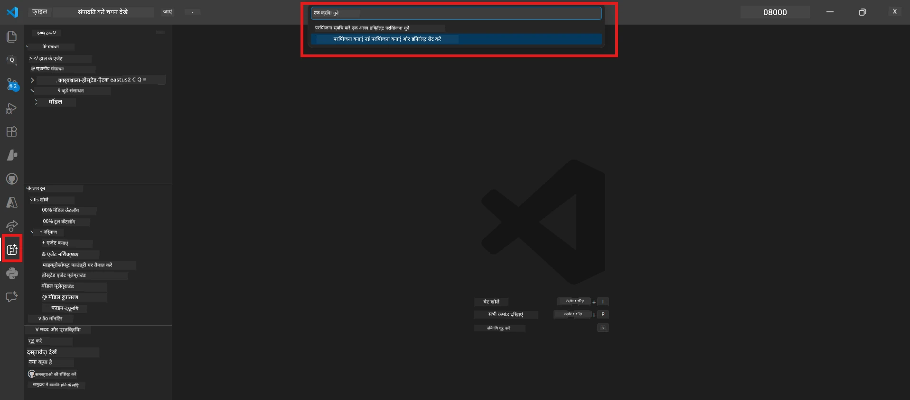
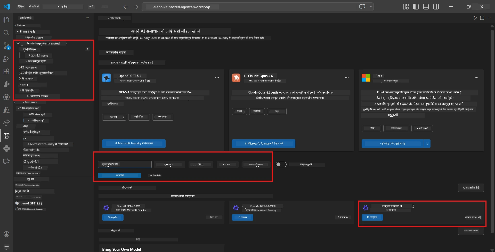
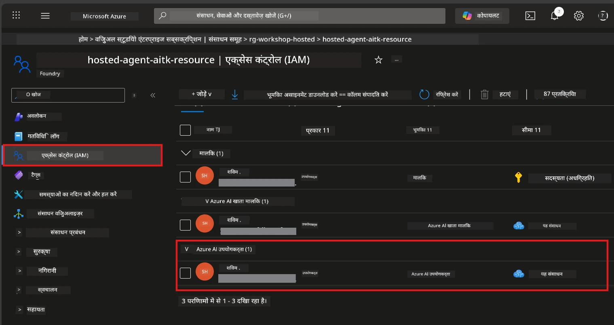

# Module 2 - एक Foundry प्रोजेक्ट बनाएं और एक मॉडल तैनात करें

इस मॉड्यूल में, आप एक Microsoft Foundry प्रोजेक्ट बनाएंगे (या चुनेंगे) और एक मॉडल तैनात करेंगे जिसका आपका एजेंट उपयोग करेगा। हर कदम स्पष्ट रूप से लिखा गया है - उन्हें क्रम में पालन करें।

> यदि आपके पास पहले से ही एक Foundry प्रोजेक्ट है जिसमें एक तैनात मॉडल है, तो [Module 3](03-create-hosted-agent.md) पर जाएं।

---

## Step 1: VS Code से Foundry प्रोजेक्ट बनाएं

आप Microsoft Foundry एक्सटेंशन का उपयोग करके VS Code छोड़े बिना प्रोजेक्ट बनाएंगे।

1. **Command Palette** खोलने के लिए `Ctrl+Shift+P` दबाएं।
2. टाइप करें: **Microsoft Foundry: Create Project** और इसे चुनें।
3. एक ड्रॉपडाउन खुलेगा - सूची से अपना **Azure सब्सक्रिप्शन** चुनें।
4. आपको एक **resource group** चुनने या बनाने के लिए कहा जाएगा:
   - नया बनाने के लिए: एक नाम टाइप करें (जैसे, `rg-hosted-agents-workshop`) और Enter दबाएं।
   - किसी मौजूदा का उपयोग करने के लिए: ड्रॉपडाउन से चुनें।
5. एक **region** चुनें। **महत्वपूर्ण:** ऐसा क्षेत्र चुनें जो होस्टेड एजेंट्स का समर्थन करता हो। [region availability](https://learn.microsoft.com/azure/foundry/agents/concepts/hosted-agents#region-availability) देखें - आम तौर पर `East US`, `West US 2`, या `Sweden Central` लोकप्रिय विकल्प हैं।
6. Foundry प्रोजेक्ट के लिए एक **नाम** दर्ज करें (जैसे, `workshop-agents`)।
7. Enter दबाएं और प्रोविजनिंग पूरा होने का इंतजार करें।

> **प्रोविजनिंग में 2-5 मिनट लगते हैं।** आप VS Code के निचले-दाएँ कोने में प्रगति नोटिफिकेशन देखेंगे। प्रोविजनिंग के दौरान VS Code बंद न करें।

8. पूर्ण होने पर, **Microsoft Foundry** साइडबार में आपका नया प्रोजेक्ट **Resources** के तहत दिखेगा।
9. प्रोजेक्ट नाम पर क्लिक करके इसे विस्तृत करें और पुष्टि करें कि इसमें **Models + endpoints** और **Agents** जैसे सेक्शन दिख रहे हैं।



### वैकल्पिक: Foundry पोर्टल के माध्यम से बनाएँ

यदि आप ब्राउज़र का उपयोग करना पसंद करते हैं:

1. [https://ai.azure.com](https://ai.azure.com) खोलें और साइन इन करें।
2. होम पेज पर **Create project** क्लिक करें।
3. प्रोजेक्ट नाम दर्ज करें, अपनी सब्सक्रिप्शन, resource group, और region चुनें।
4. **Create** पर क्लिक करें और प्रोविजनिंग समाप्त होने का इंतजार करें।
5. एक बार बनने के बाद, VS Code में वापस जाएं - Foundry साइडबार में प्रोजेक्ट रिफ्रेश (रिफ्रेश आइकन क्लिक करें) के बाद दिखना चाहिए।

---

## Step 2: एक मॉडल तैनात करें

आपके [hosted agent](https://learn.microsoft.com/azure/foundry/agents/concepts/hosted-agents) को प्रतिक्रिया उत्पन्न करने के लिए एक Azure OpenAI मॉडल की आवश्यकता है। आप अब [एक मॉडल तैनात करेंगे](https://learn.microsoft.com/azure/ai-foundry/openai/how-to/create-resource#deploy-a-model)।

1. `Ctrl+Shift+P` दबाकर **Command Palette** खोलें।
2. टाइप करें: **Microsoft Foundry: Open [Model Catalog](https://learn.microsoft.com/azure/ai-foundry/openai/concepts/models)** और इसे चुनें।
3. VS Code में Model Catalog व्यू खुलेगा। **gpt-4.1** खोजने के लिए ब्राउज़ करें या खोज बार का उपयोग करें।
4. **gpt-4.1** मॉडल कार्ड पर क्लिक करें (या यदि आप कम लागत पसंद करते हैं तो `gpt-4.1-mini`)।
5. **Deploy** पर क्लिक करें।


6. तैनाती विन्यास में:
   - **Deployment name**: डिफ़ॉल्ट (जैसे, `gpt-4.1`) छोड़ें या कस्टम नाम दर्ज करें। **इस नाम को याद रखें** - आपको Module 4 में इसकी आवश्यकता होगी।
   - **Target**: **Deploy to Microsoft Foundry** चुनें और अभी बनाया गया प्रोजेक्ट चुनें।
7. **Deploy** पर क्लिक करें और तैनाती पूरी होने का इंतजार करें (1-3 मिनट)।

### मॉडल चुनना

| मॉडल | सबसे अच्छा | लागत | नोट्स |
|-------|------------|-------|-------|
| `gpt-4.1` | उच्च गुणवत्ता, सूक्ष्म प्रतिक्रियाएँ | उच्च | सर्वोत्तम परिणाम, अंतिम परीक्षण के लिए अनुशंसित |
| `gpt-4.1-mini` | तेज़ पुनरावृत्ति, कम लागत | कम | कार्यशाला विकास और त्वरित परीक्षण के लिए अच्छा |
| `gpt-4.1-nano` | हल्का कार्य | सबसे कम | सबसे किफायती, लेकिन सरल प्रतिक्रियाएं |

> **इस कार्यशाला के लिए अनुशंसा:** विकास और परीक्षण के लिए `gpt-4.1-mini` का उपयोग करें। यह तेज़, सस्ता है, और व्यायामों के लिए अच्छे परिणाम देता है।

### मॉडल तैनाती सत्यापित करें

1. **Microsoft Foundry** साइडबार में, अपने प्रोजेक्ट को विस्तृत करें।
2. **Models + endpoints** (या इसी तरह के सेक्शन) के तहत देखें।
3. आपको तैनात मॉडल (जैसे, `gpt-4.1-mini`) स्थिति **Succeeded** या **Active** के साथ दिखना चाहिए।
4. मॉडल तैनाती पर क्लिक करके विवरण देखें।
5. ये दो मान नोट कर लें - आपको Module 4 में ज़रूरत होगी:

   | सेटिंग | कहां मिलेगा | उदाहरण मान |
   |---------|-------------|-------------|
   | **Project endpoint** | Foundry साइडबार में प्रोजेक्ट नाम पर क्लिक करें। विवरण व्यू में endpoint URL दिखेगा। | `https://<account>.services.ai.azure.com/api/projects/<project>` |
   | **Model deployment name** | तैनात मॉडल के पास दिखाया गया नाम। | `gpt-4.1-mini` |

---

## Step 3: आवश्यक RBAC भूमिकाएँ असाइन करें

यह सबसे अधिक गलती से छोड़ा गया कदम है। बिना सही भूमिकाओं के, Module 6 में तैनाती अनुमति त्रुटि के साथ विफल होगी।

### 3.1 खुद को Azure AI User भूमिका असाइन करें

1. ब्राउज़र खोलें और [https://portal.azure.com](https://portal.azure.com) पर जाएं।
2. शीर्ष खोज बार में अपने **Foundry प्रोजेक्ट** का नाम टाइप करें और परिणाम में उस पर क्लिक करें।
   - **महत्वपूर्ण:** **प्रोजेक्ट** संसाधन (प्रकार: "Microsoft Foundry project") पर जाएं, न कि पैरेंट खाता/हब संसाधन पर।
3. प्रोजेक्ट की बाईं नेविगेशन में, **Access control (IAM)** क्लिक करें।
4. शीर्ष पर **+ Add** बटन क्लिक करें → **Add role assignment** चुनें।
5. **Role** टैब में, [**Azure AI User**](https://learn.microsoft.com/azure/foundry/concepts/rbac-foundry#built-in-roles) खोजें और चुनें। फिर **Next** क्लिक करें।
6. **Members** टैब में:
   - **User, group, or service principal** चुनें।
   - **+ Select members** क्लिक करें।
   - अपना नाम या ईमेल खोजें, खुद को चुनें और **Select** क्लिक करें।
7. **Review + assign** क्लिक करें → पुष्टि के लिए फिर से **Review + assign** क्लिक करें।



### 3.2 (वैकल्पिक) Azure AI Developer भूमिका असाइन करें

यदि आपको प्रोजेक्ट में अतिरिक्त संसाधन बनाने या तैनाती प्रोग्रामेटिक रूप से प्रबंधित करने की आवश्यकता है:

1. ऊपर दिए गए कदम दोहराएं, लेकिन चरण 5 में **Azure AI Developer** चुनें।
2. यह Foundry संसाधन (खाता) स्तर पर असाइन करें, केवल प्रोजेक्ट स्तर पर नहीं।

### 3.3 अपनी भूमिका असाइनमेंट सत्यापित करें

1. प्रोजेक्ट के **Access control (IAM)** पृष्ठ पर, **Role assignments** टैब पर क्लिक करें।
2. अपना नाम खोजें।
3. आपको प्रोजेक्ट स्कोप के लिए कम से कम **Azure AI User** सूचीबद्ध दिखाई देना चाहिए।

> **क्यों यह महत्वपूर्ण है:** [`Azure AI User`](https://learn.microsoft.com/azure/foundry/concepts/rbac-foundry#built-in-roles) भूमिका `Microsoft.CognitiveServices/accounts/AIServices/agents/write` डेटा क्रिया देती है। इसके बिना, तैनाती के दौरान यह त्रुटि दिखाई देगी:
>
> ```
> Error: lacks the required data action 
> Microsoft.CognitiveServices/accounts/AIServices/agents/write 
> to perform POST /api/projects/{projectName}/assistants operation.
> ```
>
> अधिक जानकारी के लिए [Module 8 - Troubleshooting](08-troubleshooting.md) देखें।

---

### चेकपॉइंट

- [ ] Foundry प्रोजेक्ट अस्तित्व में है और VS Code में Microsoft Foundry साइडबार में दिख रहा है
- [ ] कम से कम एक मॉडल तैनात है (जैसे, `gpt-4.1-mini`) स्थिति **Succeeded** के साथ
- [ ] आपने **project endpoint** URL और **model deployment name** नोट कर लिया है
- [ ] आपके पास **Azure AI User** भूमिका प्रोजेक्ट स्तर पर असाइन है (Azure Portal → IAM → Role assignments में सत्यापित करें)
- [ ] प्रोजेक्ट होस्टेड एजेंट्स के [समर्थित क्षेत्र](https://learn.microsoft.com/azure/foundry/agents/concepts/hosted-agents#region-availability) में है

---

**पिछला:** [01 - Install Foundry Toolkit](01-install-foundry-toolkit.md) · **अगला:** [03 - Create a Hosted Agent →](03-create-hosted-agent.md)

---

<!-- CO-OP TRANSLATOR DISCLAIMER START -->
**अस्वीकरण**:  
इस दस्तावेज़ का अनुवाद एआई अनुवाद सेवा [Co-op Translator](https://github.com/Azure/co-op-translator) का उपयोग करके किया गया है। जबकि हम सटीकता के लिए प्रयासरत हैं, कृपया ध्यान रखें कि स्वचालित अनुवादों में त्रुटियाँ या असम्बद्धताएँ हो सकती हैं। मूल दस्तावेज़ अपनी स्वदेशी भाषा में प्राधिकार स्रोत माना जाना चाहिए। महत्वपूर्ण जानकारी के लिए पेशेवर मानव अनुवाद की सिफारिश की जाती है। इस अनुवाद के उपयोग से उत्पन्न किसी भी गलतफहमी या गलत व्याख्या के लिए हम उत्तरदायी नहीं हैं।
<!-- CO-OP TRANSLATOR DISCLAIMER END -->