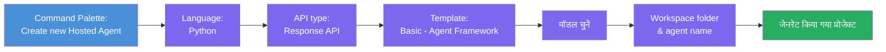
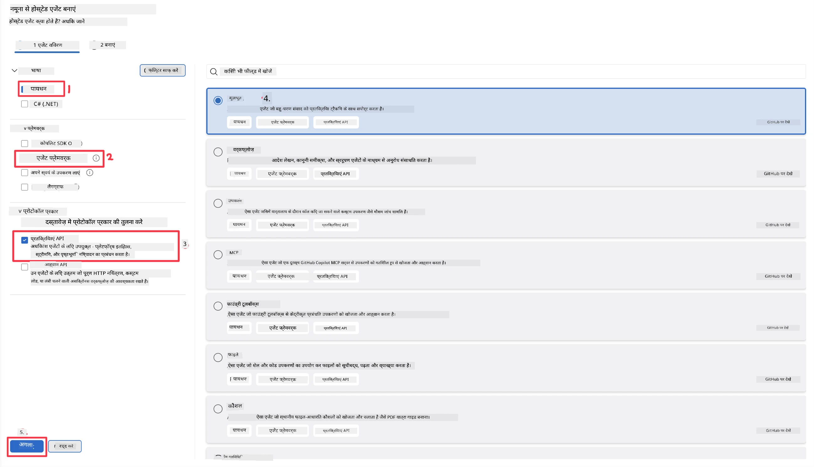
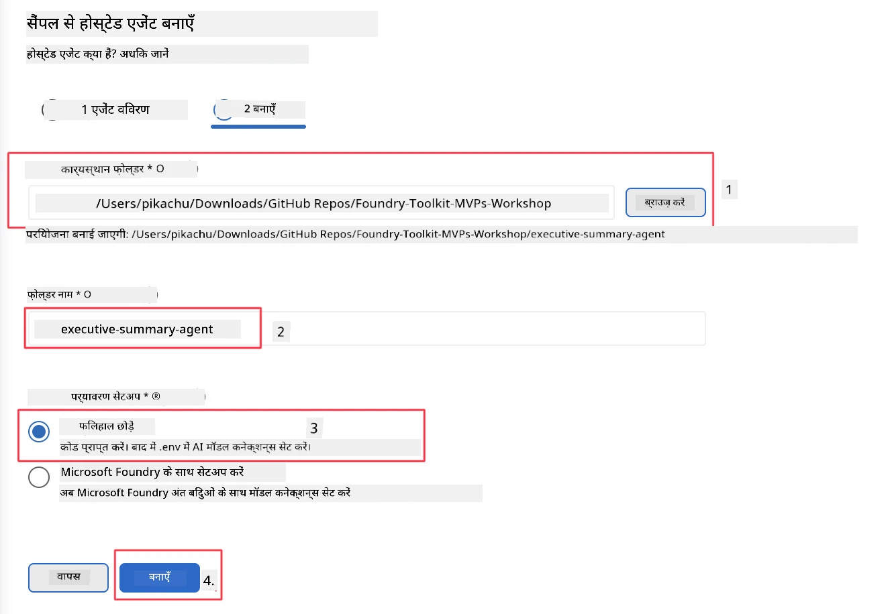

# मॉड्यूल 2 - एक नया होस्टेड एजेंट बनाएं

⏱️ ~5 मिनट

इस मॉड्यूल में, आप Foundry Toolkit का उपयोग करके **एक होस्टेड एजेंट प्रोजेक्ट स्कैफ़ोल्ड करते हैं**। स्कैफ़ोल्ड पूरा प्रोजेक्ट संरचना उत्पन्न करता है - `agent.yaml`, `main.py`, `Dockerfile`, `requirements.txt`, और VS Code डिबग कॉन्फ़िगरेशन - ताकि आप एजेंट के व्यवहार को अनुकूलित करने पर ध्यान केंद्रित कर सकें।

> **मुख्य अवधारणा:** इस लैब में `agent/` फ़ोल्डर Foundry Toolkit के उत्पन्न करने का एक उदाहरण है। आप ये फ़ाइलें शुरू से नहीं लिखते हैं।

### स्कैफ़ोल्ड विज़ार्ड फ्लो



---

## चरण 1: Create Hosted Agent विज़ार्ड खोलें

1. **Command Palette** खोलने के लिए `Ctrl+Shift+P` दबाएं।
2. टाइप करें: **Foundry Toolkit: Create new Hosted Agent** और इसे चुनें।

> **वैकल्पिक: Foundry Portal के माध्यम से बनाएं**
> यदि आप ब्राउज़र पसंद करते हैं, तो आप [https://ai.azure.com](https://ai.azure.com) पर अपना प्रोजेक्ट बना सकते हैं। प्रोजेक्ट प्रोविजन होने के बाद, VS Code पर वापस आएं और **Foundry Toolkit** साइडबार का उपयोग करके इससे कनेक्ट करें।

> **वैकल्पिक:** Foundry Toolkit साइडबार में **Hosted Agents (Preview)** के बगल में **+** आइकन पर क्लिक करें।

## चरण 2: सेटिंग्स चुनें



1. बाईं नेविगेशन/विकल्प अनुभाग में निम्नलिखित चुनें:

| मेनू | चयन | नोट्स |
|--------|-----------|-------|
| **Language** | Python | C# भी समर्थित है |
| **Framework** | Agent Framework | Agent Framework SDK का उपयोग करके सरल प्रारंभिक बिंदु |
| **API type** | Response API | `POST /responses` - बातचीतात्मक, प्लेटफ़ॉर्म-प्रबंधित इतिहास के साथ |
| **Template** | Basic | Agent Framework SDK का उपयोग करके सरल प्रारंभिक बिंदु |

2. चयन करने के बाद, **Next** पर क्लिक करें



3. अगले विंडो में निम्नलिखित चुनें:

| मेनू | चयन | नोट्स |
|--------|-----------|-------|
| **Workspace folder** | एक लक्षित फोल्डर चुनें | उदाहरण के लिए, `/workspace/Foundry_Toolkit_for_VSCode_Lab/` या इस रिपॉ में एक सबफ़ोल्डर |
| **Agent name** | एक नाम दर्ज करें | उदाहरण: `executive-summary-agent` |
| **Environment Setup** | अभी सेटअप छोड़ें |  |

हमारे एजेंट को बनाने के लिए **create** पर क्लिक करें। होस्टेड एजेंट नाम के साथ एक नया फोल्डर बनाया जाएगा।

## चरण 3: उत्पन्न प्रोजेक्ट का निरीक्षण करें

स्कैफ़ोल्डिंग पूरी होने के बाद, एक्सप्लोरर (`Ctrl+Shift+E`) में ये फ़ाइलें देखें:

```
📂 my-agent/
├── .env                ← Environment variables (placeholders)
├── .vscode/
│   ├── launch.json     ← Debug config (F5 → run + Agent Inspector)
│   └── tasks.json      ← VS Code task definitions
├── agent.yaml          ← Agent definition (kind: hosted)
├── Dockerfile          ← Container config for deployment
├── main.py             ← Agent entry point (your main code)
└── requirements.txt    ← Python dependencies
```

### प्रमुख फ़ाइलों की व्याख्या

| फ़ाइल | उद्देश्य |
|------|---------|
| `agent.yaml` | एजेंट को `kind: hosted` के रूप में घोषित करता है, पर्यावरण वेरिएबल्स मैप करता है, `/responses` प्रोटोकॉल को परिभाषित करता है |
| `main.py` | `FoundryChatClient` बनाता है → इसे निर्देशों के साथ `Agent` में लपेटता है → पोर्ट 8088 पर `ResponsesHostServer` के माध्यम से सेवा करता है |
| `Dockerfile` | `python:3.12-slim` का उपयोग करता है, निर्भरताएं स्थापित करता है, पोर्ट 8088 एक्सपोज़ करता है, `main.py` चलाता है |
| `requirements.txt` | `agent-framework-foundry`, `agent-framework-foundry-hosting`, `mcp`, `debugpy` |

> **महत्वपूर्ण:** स्कैफ़ोल्ड किए गए एजेंट फ़ोल्डर को सीधे VS Code में खोलें (खुद `agent/` फ़ोल्डर) ताकि `.vscode/launch.json` और `tasks.json` F5 डिबगिंग के लिए सही काम करें।

---

### ✅ चेकप्वॉइंट

- [ ] अपेक्षित सभी फ़ाइलों के साथ स्कैफ़ोल्डेड प्रोजेक्ट बनाया गया
- [ ] `agent.yaml` में `kind: hosted` और `protocol: responses` दिखाया गया है
- [ ] `main.py` में `Agent`, `FoundryChatClient`, `ResponsesHostServer` इम्पोर्ट हैं
- [ ] एजेंट फ़ोल्डर VS Code में कार्यक्षेत्र रूट के रूप में खुला है

---

**पिछला:** [01 - Setup](01-setup.md) · **अगला:** [03 - Configure & Code →](03-configure-and-code.md)

---

<!-- CO-OP TRANSLATOR DISCLAIMER START -->
**अस्वीकरण**:
इस दस्तावेज़ का अनुवाद AI अनुवाद सेवा [Co-op Translator](https://github.com/Azure/co-op-translator) का उपयोग करके किया गया है। जबकि हम सटीकता के लिए प्रयास करते हैं, कृपया ध्यान दें कि स्वचालित अनुवादों में त्रुटियाँ या अशुद्धियाँ हो सकती हैं। मूल दस्तावेज़ अपनी मूल भाषा में ही प्रामाणिक स्रोत माना जाना चाहिए। महत्वपूर्ण जानकारी के लिए, पेशेवर मानव अनुवाद की सिफारिश की जाती है। इस अनुवाद के उपयोग से उत्पन्न किसी भी गलतफहमी या गलत व्याख्या के लिए हम उत्तरदायी नहीं हैं।
<!-- CO-OP TRANSLATOR DISCLAIMER END -->