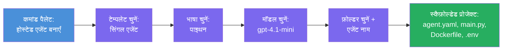

# Module 3 - नया होस्टेड एजेंट बनाएं (Foundry एक्सटेंशन द्वारा ऑटो-स्कैफोल्डेड)

इस मॉड्यूल में, आप Microsoft Foundry एक्सटेंशन का उपयोग करके **नया [hosted agent](https://learn.microsoft.com/azure/foundry/agents/concepts/hosted-agents) प्रोजेक्ट स्कैफोल्ड करते हैं**। एक्सटेंशन आपके लिए पूरे प्रोजेक्ट स्ट्रक्चर को जेनरेट करता है - जिसमें `agent.yaml`, `main.py`, `Dockerfile`, `requirements.txt`, एक `.env` फाइल, और VS कोड डिबग कॉन्फ़िगरेशन शामिल हैं। स्कैफोल्डिंग के बाद, आप इन फाइलों को अपने एजेंट के निर्देशों, टूल्स, और कॉन्फ़िगरेशन के साथ कस्टमाइज़ करते हैं।

> **मुख्य विचार:** इस लैब में `agent/` फ़ोल्डर Foundry एक्सटेंशन द्वारा स्कैफोल्ड कमांड चलाने पर जेनरेट की गई फ़ाइलों का एक उदाहरण है। आप ये फाइलें खुद से शुरुआत से नहीं लिखते - एक्सटेंशन उन्हें बनाता है, और फिर आप उन्हें संशोधित करते हैं।

### स्कैफोल्ड विज़ार्ड फ्लो


---

## चरण 1: Create Hosted Agent विज़ार्ड खोलें

1. `Ctrl+Shift+P` दबाएं ताकि **कमांड पैलेट** खुल जाए।
2. टाइप करें: **Microsoft Foundry: Create a New Hosted Agent** और इसे चुनें।
3. होस्टेड एजेंट निर्माण विज़ार्ड खुल जाएगा।

> **वैकल्पिक मार्ग:** आप Microsoft Foundry साइडबार → **Agents** के पास **+** आइकन पर क्लिक करके या राइट-क्लिक करके **Create New Hosted Agent** विकल्प चुनकर भी इस विज़ार्ड तक पहुंच सकते हैं।

---

## चरण 2: अपनी टेम्पलेट चुनें

विज़ार्ड आपसे एक टेम्पलेट चुनने के लिए कहेगा। आपको ये विकल्प दिखेंगे:

| टेम्पलेट | विवरण | कब उपयोग करें |
|----------|---------|--------------|
| **Single Agent** | एक एजेंट जिसका अपना मॉडल, निर्देश, और वैकल्पिक टूल्स होते हैं | यह वर्कशॉप (Lab 01) |
| **Multi-Agent Workflow** | कई एजेंट जो अनुक्रम में सहयोग करते हैं | Lab 02 |

1. **Single Agent** चुनें।
2. **Next** पर क्लिक करें (या चयन अपने आप आगे बढ़ेगा)।

---

## चरण 3: प्रोग्रामिंग भाषा चुनें

1. **Python** चुनें (इस वर्कशॉप के लिए अनुशंसित)।
2. **Next** पर क्लिक करें।

> **C# भी समर्थित है** यदि आप .NET पसंद करते हैं। स्कैफोल्ड स्ट्रक्चर समान है (यहाँ `Program.cs` का उपयोग होता है `main.py` की जगह)।

---

## चरण 4: अपना मॉडल चुनें

1. विज़ार्ड आपके Foundry प्रोजेक्ट में डिप्लॉय किए गए मॉडल दिखाएगा (Module 2 से)।
2. आपने जो मॉडल डिप्लॉय किया है उसे चुनें - जैसे, **gpt-4.1-mini**।
3. **Next** पर क्लिक करें।

> यदि आपको कोई मॉडल नहीं दिखाई देता है, तो पहले [Module 2](02-create-foundry-project.md) पर जाकर एक मॉडल डिप्लॉय करें।

---

## चरण 5: फ़ोल्डर स्थान और एजेंट का नाम चुनें

1. एक फ़ाइल डायलॉग खुलेगा - एक **target folder** चुनें जहां प्रोजेक्ट बनाया जाएगा। इस वर्कशॉप के लिए:
   - यदि नया शुरू कर रहे हैं: कोई भी फ़ोल्डर चुनें (जैसे, `C:\Projects\my-agent`)
   - यदि वर्कशॉप रेपो के अंदर काम कर रहे हैं: `workshop/lab01-single-agent/agent/` के अंतर्गत एक नया उपफ़ोल्डर बनाएं
2. होस्टेड एजेंट के लिए एक **नाम** दर्ज करें (जैसे, `executive-summary-agent` या `my-first-agent`)।
3. **Create** पर क्लिक करें (या Enter दबाएं)।

---

## चरण 6: स्कैफोल्डिंग पूरी होने का इंतजार करें

1. VS Code एक **नई विंडो** खोलेगा जिसमें स्कैफोल्डेड प्रोजेक्ट होगा।
2. प्रोजेक्ट के पूरी तरह लोड होने के लिए कुछ सेकंड प्रतीक्षा करें।
3. आपको Explorer पैनल (`Ctrl+Shift+E`) में निम्नलिखित फाइलें दिखनी चाहिए:

```
📂 my-first-agent/
├── .env                ← Environment variables (auto-generated with placeholders)
├── .vscode/
│   └── launch.json     ← Debug configuration (F5 to run + Agent Inspector)
├── agent.yaml          ← Agent definition (kind: hosted)
├── Dockerfile          ← Container configuration for deployment
├── main.py             ← Agent entry point (your main code file)
└── requirements.txt    ← Python dependencies
```

> **यह इसी संरचना जैसा है जो इस लैब के `agent/` फ़ोल्डर में है।** Foundry एक्सटेंशन ये फ़ाइलें स्वचालित रूप से जनरेट करता है - आपको मैन्युअली इन्हें बनाने की आवश्यकता नहीं है।

> **वर्कशॉप नोट:** इस वर्कशॉप रेपो में, `.vscode/` फ़ोल्डर **वर्कस्पेस रूट** पर होता है (प्रत्येक प्रोजेक्ट के अंदर नहीं)। इसमें एक साझा `launch.json` और `tasks.json` हैं जिनमें दो डिबग कॉन्फ़िगरेशन होते हैं - **"Lab01 - Single Agent"** और **"Lab02 - Multi-Agent"** - जो सही लैब के `cwd` की ओर पॉइंट करते हैं। जब आप F5 दबाते हैं, तो ड्रॉपडाउन से उस लैब के अनुरूप कॉन्फ़िगरेशन चुनें जिस पर आप काम कर रहे हैं।

---

## चरण 7: प्रत्येक जेनरेट की गई फ़ाइल को समझें

विज़ार्ड द्वारा बनाई गई प्रत्येक फ़ाइल को निरीक्षण करने के लिए कुछ समय लें। इन्हें समझना Module 4 (कस्टमाइज़ेशन) के लिए महत्वपूर्ण है।

### 7.1 `agent.yaml` - एजेंट परिभाषा

`agent.yaml` खोलें। यह इस प्रकार दिखता है:

```yaml
# yaml-language-server: $schema=https://raw.githubusercontent.com/microsoft/AgentSchema/refs/heads/main/schemas/v1.0/ContainerAgent.yaml

kind: hosted
name: my-first-agent
description: >
  A hosted agent deployed to Microsoft Foundry Agent Service.
metadata:
  authors:
    - Microsoft
  tags:
    - Azure AI AgentServer
    - Microsoft Agent Framework
    - Hosted Agent
protocols:
  - protocol: responses
    version: v1
environment_variables:
  - name: AZURE_AI_PROJECT_ENDPOINT
    value: ${PROJECT_ENDPOINT}
  - name: AZURE_AI_MODEL_DEPLOYMENT_NAME
    value: ${MODEL_DEPLOYMENT_NAME}
dockerfile_path: Dockerfile
resources:
  cpu: '0.25'
  memory: 0.5Gi
```

**मुख्य फ़ील्ड:**

| फ़ील्ड | उद्देश्य |
|--------|---------|
| `kind: hosted` | घोषित करता है कि यह एक होस्टेड एजेंट है (कंटेनर आधारित, [Foundry Agent Service](https://learn.microsoft.com/azure/foundry/agents/overview) में डिप्लॉय किया गया) |
| `protocols: responses v1` | एजेंट OpenAI-युक्त `/responses` HTTP एंडपॉइंट एक्सपोज़ करता है |
| `environment_variables` | `.env` वैल्यूज़ को डिप्लॉयमेंट समय पर कंटेनर env वेरिएबल्स से मैप करता है |
| `dockerfile_path` | कंटेनर इमेज बनाने के लिए प्रयुक्त Dockerfile की ओर पॉइंट करता है |
| `resources` | कंटेनर के लिए CPU और मेमोरी आवंटन (0.25 CPU, 0.5Gi मेमोरी) |

### 7.2 `main.py` - एजेंट एंट्री पॉइंट

`main.py` खोलें। यह मुख्य Python फ़ाइल है जहाँ आपका एजेंट लॉजिक रहता है। स्कैफोल्ड में शामिल है:

```python
from agent_framework.azure import AzureAIAgentClient
from azure.ai.agentserver.agentframework import from_agent_framework
from azure.identity.aio import DefaultAzureCredential
```

**मुख्य इम्पोर्ट्स:**

| इम्पोर्ट | उद्देश्य |
|----------|----------|
| `AzureAIAgentClient` | आपके Foundry प्रोजेक्ट से कनेक्ट होता है और `.as_agent()` के माध्यम से एजेंट बनाता है |
| [`DefaultAzureCredential`](https://learn.microsoft.com/azure/developer/python/sdk/authentication/credential-chains#defaultazurecredential-overview) | ऑथेंटिकेशन संभालता है (Azure CLI, VS Code साइन-इन, मैनेज्ड आइडेंटिटी, या सर्विस प्रिंसिपल) |
| `from_agent_framework` | एजेंट को एक HTTP सर्वर के रूप में रैप करता है जो `/responses` एंडपॉइंट एक्सपोज़ करता है |

मुख्य प्रवाह है:  
1. क्रेडेंशियल बनाएं → क्लाइंट बनाएं → `.as_agent()` कॉल करें (async context manager) → इसे सर्वर के रूप में रैप करें → रन करें

### 7.3 `Dockerfile` - कंटेनर इमेज

```dockerfile
FROM python:3.14-slim

WORKDIR /app

COPY ./ .

RUN pip install --upgrade pip && \
    if [ -f requirements.txt ]; then \
        pip install -r requirements.txt; \
    else \
        echo "No requirements.txt found" >&2; exit 1; \
    fi

EXPOSE 8088

CMD ["python", "main.py"]
```

**मुख्य विवरण:**  
- `python:3.14-slim` बेस इमेज के रूप में उपयोग करता है।  
- सभी प्रोजेक्ट फ़ाइलों को `/app` में कॉपी करता है।  
- `pip` को अपग्रेड करता है, `requirements.txt` से डिपेंडेंसीज़ इंस्टॉल करता है, और यदि वह फ़ाइल गायब है तो फेल हो जाता है।  
- **पोर्ट 8088 एक्सपोज़ करता है** - यह होस्टेड एजेंट्स के लिए आवश्यक पोर्ट है। इसे न बदलें।  
- एजेंट को `python main.py` से शुरू करता है।  

### 7.4 `requirements.txt` - निर्भरता

```
agent-framework-azure-ai==1.0.0rc3
agent-framework-core==1.0.0rc3
azure-ai-agentserver-agentframework==1.0.0b16
azure-ai-agentserver-core==1.0.0b16
debugpy
agent-dev-cli
```

| पैकेज | उद्देश्य |
|---------|---------|
| `agent-framework-azure-ai` | Microsoft Agent Framework के लिए Azure AI एकीकरण |
| `agent-framework-core` | एजेंट निर्माण के लिए कोर रनटाइम (जिसमें `python-dotenv` शामिल है) |
| `azure-ai-agentserver-agentframework` | Foundry Agent Service के लिए होस्टेड एजेंट सर्वर रनटाइम |
| `azure-ai-agentserver-core` | कोर एजेंट सर्वर अभिव्यक्तियाँ |
| `debugpy` | Python डिबगिंग सपोर्ट (VS Code में F5 डिबगिंग की अनुमति देता है) |
| `agent-dev-cli` | स्थानीय विकास CLI एजेंट्स के परीक्षण के लिए (डिबग/रन कॉन्फ़िगरेशन द्वारा उपयोग किया जाता है) |

---

## एजेंट प्रोटोकॉल को समझें

होस्टेड एजेंट्स **OpenAI Responses API** प्रोटोकॉल के माध्यम से संचार करते हैं। चलाने पर (लोकली या क्लाउड में), एजेंट एक ही HTTP एंडपॉइंट एक्सपोज़ करता है:

```
POST http://localhost:8088/responses
Content-Type: application/json

{
  "input": "Your prompt here",
  "stream": false
}
```

Foundry Agent Service इस एंडपॉइंट को उपयोगकर्ता प्रॉम्प्ट भेजने और एजेंट प्रतिक्रियाएँ प्राप्त करने के लिए कॉल करता है। यह वही प्रोटोकॉल है जो OpenAI API उपयोग करता है, इसलिए आपका एजेंट किसी भी क्लाइंट के साथ संगत है जो OpenAI Responses फॉर्मेट को समझता है।

---

### चेकपॉइंट

- [ ] स्कैफोल्ड विज़ार्ड सफलतापूर्वक पूरा हुआ और एक **नई VS Code विंडो** खुली
- [ ] आप सभी 5 फ़ाइलें देख सकते हैं: `agent.yaml`, `main.py`, `Dockerfile`, `requirements.txt`, `.env`
- [ ] `.vscode/launch.json` फ़ाइल मौजूद है (F5 डिबगिंग सक्षम करता है - इस वर्कशॉप में यह वर्कस्पेस रूट पर है जिसमें लैब-विशिष्ट कॉन्फ़िग शामिल हैं)
- [ ] आपने प्रत्येक फ़ाइल पढ़ ली है और उसका उद्देश्य समझा है
- [ ] आप समझते हैं कि पोर्ट `8088` आवश्यक है और `/responses` एंडपॉइंट प्रोटोकॉल है

---

**पिछला:** [02 - Create Foundry Project](02-create-foundry-project.md) · **अगला:** [04 - Configure & Code →](04-configure-and-code.md)

---

<!-- CO-OP TRANSLATOR DISCLAIMER START -->
**अस्वीकरण**:  
इस दस्तावेज़ का अनुवाद एआई अनुवाद सेवा [Co-op Translator](https://github.com/Azure/co-op-translator) का उपयोग करके किया गया है। जबकि हम सटीकता के लिए प्रयास करते हैं, कृपया ध्यान रखें कि स्वचालित अनुवादों में त्रुटियाँ या असत्यताएँ हो सकती हैं। मूल दस्तावेज़ अपनी मूल भाषा में प्रामाणिक स्रोत माना जाना चाहिए। महत्वपूर्ण जानकारी के लिए, पेशेवर मानवीय अनुवाद की सिफारिश की जाती है। इस अनुवाद के उपयोग से उत्पन्न किसी भी गलतफ़हमी या गलत व्याख्या के लिए हम जिम्मेदार नहीं हैं।
<!-- CO-OP TRANSLATOR DISCLAIMER END -->