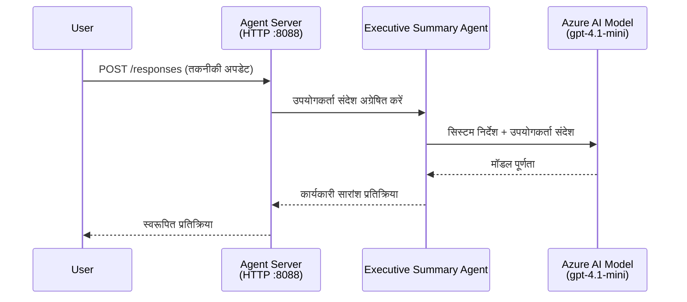
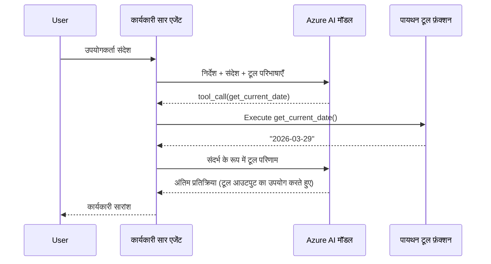

# Module 4 - निर्देशों को कॉन्फ़िगर करें, पर्यावरण और निर्भरताएं स्थापित करें

इस मॉड्यूल में, आप मॉड्यूल 3 से स्वतः-स्कैफल्ड एजेंट फ़ाइलों को अनुकूलित करते हैं। यहाँ आप सामान्य स्कैफोल्ड को **अपने** एजेंट में बदलते हैं - निर्देश लिखकर, पर्यावरण चर सेट करके, वैकल्पिक रूप से उपकरण जोड़कर, और निर्भरताएँ स्थापित करके।

> **स्मरण:** Foundry एक्सटेंशन ने आपके प्रोजेक्ट फ़ाइलों को स्वतः उत्पन्न किया। अब आप इसमें संशोधन करते हैं। एक पूरी कार्यशील कस्टम एजेंट के लिए [`agent/`](../../../../../workshop/lab01-single-agent/agent) फोल्डर देखें।

---

## घटक कैसे मेल खाते हैं

### अनुरोध जीवनचक्र (एकल एजेंट)


> **उपकरणों के साथ:** यदि एजेंट के पास पंजीकृत उपकरण हैं, तो मॉडल सीधे पूर्णता की बजाय एक टूल-कॉल लौटाने का निर्णय ले सकता है। फ्रेमवर्क उपकरण को स्थानीय रूप से निष्पादित करता है, परिणाम मॉडल को वापस देता है, और फिर मॉडल अंतिम उत्तर उत्पन्न करता है।


---

## चरण 1: पर्यावरण चर कॉन्फ़िगर करें

स्कैफोल्ड ने `.env` फ़ाइल बनाई थी जिसमें प्लेसहोल्डर मान थे। आपको मॉड्यूल 2 से वास्तविक मान भरने होंगे।

1. अपने स्कैफल्ड प्रोजेक्ट में, **`.env`** फ़ाइल खोलें (यह प्रोजेक्ट रूट में है)।
2. प्लेसहोल्डर मानों को अपनी वास्तविक Foundry प्रोजेक्ट जानकारी से बदलें:

   ```env
   PROJECT_ENDPOINT=https://<your-account>.services.ai.azure.com/api/projects/<your-project>
   MODEL_DEPLOYMENT_NAME=gpt-4.1-mini
   ```

3. फ़ाइल सहेजें।

### ये मान कहाँ मिलेंगे

| मान | इसे कैसे खोजें |
|-------|---------------|
| **प्रोजेक्ट एंडपॉइंट** | VS Code में **Microsoft Foundry** साइडबार खोलें → अपने प्रोजेक्ट पर क्लिक करें → विवरण दृश्य में एंडपॉइंट URL दिखाया जाएगा। यह `https://<account-name>.services.ai.azure.com/api/projects/<project-name>` जैसा दिखता है |
| **मॉडल डिप्लॉयमेंट नाम** | Foundry साइडबार में अपने प्रोजेक्ट को विस्तृत करें → **Models + endpoints** के नीचे देखें → डिप्लॉय किए गए मॉडल के बगल में नाम होगा (जैसे, `gpt-4.1-mini`) |

> **सुरक्षा:** `.env` फ़ाइल को वर्शन कंट्रोल में कभी कमिट न करें। यह डिफ़ॉल्ट रूप से `.gitignore` में शामिल है। यदि नहीं है, तो इसे जोड़ें:
> ```
> .env
> ```

### पर्यावरण चर कैसे प्रवाहित होते हैं

मैपिंग श्रृंखला है: `.env` → `main.py` (`os.getenv` के माध्यम से पढ़ता है) → `agent.yaml` (डिप्लॉय के समय कंटेनर के env vars से मानचित्रित करता है)।

`main.py` में, स्कैफोल्ड इन मानों को इस तरह पढ़ता है:

```python
PROJECT_ENDPOINT = os.getenv("AZURE_AI_PROJECT_ENDPOINT") or os.getenv("PROJECT_ENDPOINT")
MODEL_DEPLOYMENT_NAME = os.getenv("AZURE_AI_MODEL_DEPLOYMENT_NAME", os.getenv("MODEL_DEPLOYMENT_NAME", "gpt-4.1-mini"))
```

`AZURE_AI_PROJECT_ENDPOINT` और `PROJECT_ENDPOINT` दोनों स्वीकार्य हैं (लेकिन `agent.yaml` में `AZURE_AI_*` उपसर्ग का उपयोग होता है)।

---

## चरण 2: एजेंट निर्देश लिखें

यह सबसे महत्वपूर्ण अनुकूलन चरण है। निर्देश आपके एजेंट की व्यक्तिगतता, व्यवहार, आउटपुट प्रारूप, और सुरक्षा प्रतिबंधों को निर्दिष्ट करते हैं।

1. अपने प्रोजेक्ट में `main.py` खोलें।
2. निर्देशों की स्ट्रिंग खोजें (स्कैफोल्ड एक डिफ़ॉल्ट/सामान्य शामिल करता है)।
3. इसे विस्तृत, संरचित निर्देशों से बदलें।

### अच्छे निर्देशों में क्या शामिल होता है

| घटक | उद्देश्य | उदाहरण |
|-----------|---------|---------|
| **भूमिका** | एजेंट क्या है और करता है | "आप एक कार्यकारी सारांश एजेंट हैं" |
| **श्रोतागण** | उत्तर किसके लिए हैं | "तकनीकी पृष्ठभूमि सीमित वरिष्ठ नेता" |
| **इनपुट परिभाषा** | कौन से प्रकार के प्रॉम्प्ट को संभालता है | "तकनीकी घटना रिपोर्ट, परिचालन अपडेट" |
| **आउटपुट प्रारूप** | उत्तरों की सटीक संरचना | "कार्यकारी सारांश: - क्या हुआ: ... - व्यापार प्रभाव: ... - अगला कदम: ..." |
| **नियम** | प्रतिबंध और अस्वीकार करने की शर्तें | "जो दिया गया है उसका अतिरिक्त जानकारी न जोड़ें" |
| **सुरक्षा** | दुरुपयोग और भ्रम से रोकथाम | "यदि इनपुट अस्पष्ट है, तो स्पष्टीकरण मांगें" |
| **उदाहरण** | व्यवहार निर्धारित करने के लिए इनपुट/आउटपुट जोड़े | 2-3 उदाहरण जिनमें विभिन्न इनपुट शामिल हों |

### उदाहरण: कार्यकारी सारांश एजेंट निर्देश

यहाँ कार्यशाला के [`agent/main.py`](../../../../../workshop/lab01-single-agent/agent/main.py) में उपयोग किए गए निर्देश हैं:

```python
AGENT_INSTRUCTIONS = """You are an "Explain Like I'm an Executive" agent.

Purpose:
Your job is to translate complex technical or operational information into
clear, concise, and outcome-focused summaries that can be easily understood
by non-technical executives.

Audience:
Senior leaders with limited technical background who care about impact,
risk, and what happens next.

What you must do:
- Rephrase the input so it is understandable to a non-technical audience
- Prioritize clarity, brevity, and outcomes over technical accuracy
- Remove technical jargon, logs, metrics, stack traces, and deep root-cause details
- Translate technical causes into simple cause-and-effect statements
- Explicitly call out business impact
- Always include a clear next step or action
- Maintain a neutral, factual, and calm executive tone
- Do NOT add new facts or speculate beyond the input

Standard Output Structure (always use this wording):

Executive Summary:
- What happened: <plain-language description>
- Business impact: <clear, non-technical impact>
- Next step: <clear action or mitigation>

Rules:
- Keep responses under 100 words
- Do NOT add facts beyond the input
- If input is unclear, ask for clarification
"""
```

4. `main.py` में मौजूदा निर्देशों की स्ट्रिंग को अपनी कस्टम निर्देशों से बदलें।
5. फ़ाइल सहेजें।

---

## चरण 3: (वैकल्पिक) कस्टम उपकरण जोड़ें

होस्टेड एजेंट [टूल्स](https://learn.microsoft.com/azure/foundry/agents/concepts/tool-catalog) के रूप में **स्थानीय Python फ़ंक्शन** निष्पादित कर सकते हैं। यह कोड-आधारित होस्टेड एजेंटों का प्रॉम्प्ट-केवल एजेंटों पर एक प्रमुख लाभ है - आपका एजेंट मनमाने सर्वर-साइड लॉजिक चला सकता है।

### 3.1 एक टूल फ़ंक्शन परिभाषित करें

`main.py` में टूल फ़ंक्शन जोड़ें:

```python
from agent_framework import tool

@tool
def get_current_date() -> str:
    """Returns the current date in YYYY-MM-DD format."""
    from datetime import date
    return str(date.today())
```

`@tool` डेकोरेटर एक सामान्य Python फ़ंक्शन को एजेंट टूल में बदल देता है। डॉक्स्ट्रिंग टूल विवरण बन जाती है जिसे मॉडल देखता है।

### 3.2 एजेंट के साथ टूल पंजीकृत करें

जब आप `.as_agent()` कॉन्टेक्स्ट मैनेजर के माध्यम से एजेंट बना रहे हों, तो `tools` पैरामीटर में टूल पास करें:

```python
async with AzureAIAgentClient(
    project_endpoint=PROJECT_ENDPOINT,
    model_deployment_name=MODEL_DEPLOYMENT_NAME,
    credential=credential,
).as_agent(
    name="my-agent",
    instructions=AGENT_INSTRUCTIONS,
    tools=[get_current_date],
) as agent:
    server = from_agent_framework(agent)
    await server.run_async()
```

### 3.3 टूल कॉल कैसे काम करते हैं

1. उपयोगकर्ता एक प्रॉम्प्ट भेजता है।
2. मॉडल निर्णय लेता है कि टूल की आवश्यकता है या नहीं (प्रॉम्प्ट, निर्देश, और टूल विवरणों के आधार पर)।
3. यदि टूल की जरूरत है, तो फ्रेमवर्क आपके Python फ़ंक्शन को स्थानीय रूप से (कंटेनर के अंदर) कॉल करता है।
4. टूल का रिटर्न मान मॉडल को संदर्भ के रूप में वापस भेजा जाता है।
5. मॉडल अंतिम उत्तर उत्पन्न करता है।

> **टूल सर्वर-साइड निष्पादित होते हैं** - वे आपके कंटेनर के अंदर चलते हैं, उपयोगकर्ता के ब्राउज़र या मॉडल में नहीं। इसका मतलब है कि आप डेटाबेस, APIs, फ़ाइल सिस्टम, या किसी भी Python लाइब्रेरी तक पहुंच सकते हैं।

---

## चरण 4: वर्चुअल एनवायरनमेंट बनाएँ और सक्रिय करें

निर्भरता स्थापित करने से पहले एक पृथक Python वातावरण बनाएं।

### 4.1 वर्चुअल एनवायरनमेंट बनाएं

VS Code में टर्मिनल खोलें (`` Ctrl+` ``) और चलाएं:

```powershell
python -m venv .venv
```

यह आपके प्रोजेक्ट डायरेक्टरी में एक `.venv` फोल्डर बनाएगा।

### 4.2 वर्चुअल एनवायरनमेंट सक्रिय करें

**PowerShell (Windows):**

```powershell
.\.venv\Scripts\Activate.ps1
```

**Command Prompt (Windows):**

```cmd
.venv\Scripts\activate.bat
```

**macOS/Linux (Bash):**

```bash
source .venv/bin/activate
```

आपको टर्मिनल प्रॉम्प्ट की शुरुआत में `(.venv)` दिखाई देना चाहिए, जो वर्चुअल एनवायरनमेंट सक्रिय होने का संकेत है।

### 4.3 निर्भरता इंस्टॉल करें

वर्चुअल एनवायरनमेंट सक्रिय होने पर आवश्यक पैकेज इंस्टॉल करें:

```powershell
pip install -r requirements.txt
```

यह स्थापित करता है:

| पैकेज | उद्देश्य |
|---------|---------|
| `agent-framework-azure-ai==1.0.0rc3` | Azure AI इंटिग्रेशन के लिए [Microsoft Agent Framework](https://learn.microsoft.com/agent-framework/overview/) |
| `agent-framework-core==1.0.0rc3` | एजेंट निर्माण के लिए कोर रनटाइम (`python-dotenv` शामिल है) |
| `azure-ai-agentserver-agentframework==1.0.0b16` | [Foundry Agent Service](https://learn.microsoft.com/azure/foundry/agents/overview) के लिए होस्टेड एजेंट सर्वर रनटाइम |
| `azure-ai-agentserver-core==1.0.0b16` | कोर एजेंट सर्वर अमूर्तताएँ |
| `debugpy` | Python डिबगिंग (VS Code में F5 डिबगिंग सक्षम करता है) |
| `agent-dev-cli` | स्थानीय विकास CLI एजेंट परीक्षण के लिए |

### 4.4 स्थापना सत्यापित करें

```powershell
pip list | Select-String "agent-framework|agentserver"
```

अपेक्षित आउटपुट:
```
agent-framework-azure-ai   1.0.0rc3
agent-framework-core       1.0.0rc3
azure-ai-agentserver-agentframework 1.0.0b16
azure-ai-agentserver-core  1.0.0b16
```

---

## चरण 5: प्रमाणीकरण सत्यापित करें

एजेंट [`DefaultAzureCredential`](https://learn.microsoft.com/azure/developer/python/sdk/authentication/credential-chains#defaultazurecredential-overview) का उपयोग करता है, जो निम्न क्रम में कई प्रमाणीकरण विधियाँ आज़माता है:

1. **पर्यावरण चर** - `AZURE_CLIENT_ID`, `AZURE_TENANT_ID`, `AZURE_CLIENT_SECRET` (सर्विस प्रिंसिपल)
2. **Azure CLI** - आपका `az login` सत्र उठाता है
3. **VS Code** - उस खाते का उपयोग करता है जिससे आप VS Code में साइन इन हैं
4. **Managed Identity** - जब Azure में चल रहा हो (डिप्लॉयमेंट समय पर)

### 5.1 स्थानीय विकास के लिए सत्यापन

कम से कम इनमें से एक काम करना चाहिए:

**विकल्प A: Azure CLI (अनुशंसित)**

```powershell
az account show --query "{name:name, id:id}" --output table
```

अपेक्षित: आपकी सब्सक्रिप्शन नाम और ID दिखाता है।

**विकल्प B: VS Code साइन-इन**

1. VS Code के बाईं निचली कोने में **Accounts** आइकन देखें।
2. यदि आपका खाता नाम दिखाई दे, तो आप प्रमाणीकृत हैं।
3. अगर नहीं, आइकन पर क्लिक करें → **Microsoft Foundry का उपयोग करने के लिए साइन इन करें**।

**विकल्प C: सर्विस प्रिंसिपल (CI/CD के लिए)**

```powershell
$env:AZURE_TENANT_ID = "<your-tenant-id>"
$env:AZURE_CLIENT_ID = "<your-client-id>"
$env:AZURE_CLIENT_SECRET = "<your-client-secret>"
```

### 5.2 आम प्रमाणीकरण समस्या

यदि आप कई Azure खातों में साइन इन हैं, तो सुनिश्चित करें कि सही सब्सक्रिप्शन चुना गया है:

```powershell
az account set --subscription "<your-subscription-id>"
```

---

### चेकपॉइंट

- [ ] `.env` फ़ाइल में मान्य `PROJECT_ENDPOINT` और `MODEL_DEPLOYMENT_NAME` हैं (प्लेसहोल्डर नहीं)
- [ ] एजेंट निर्देश `main.py` में अनुकूलित हैं - जिसमें भूमिका, श्रोतागण, आउटपुट प्रारूप, नियम, और सुरक्षा प्रतिबंध शामिल हैं
- [ ] (वैकल्पिक) कस्टम उपकरण परिभाषित और पंजीकृत हैं
- [ ] वर्चुअल एनवायरनमेंट बनाया और सक्रिय किया गया है (`(.venv)` टर्मिनल प्रॉम्प्ट में दिखाई देता है)
- [ ] `pip install -r requirements.txt` बिना त्रुटि के सफलतापूर्वक पूरा हुआ
- [ ] `pip list | Select-String "azure-ai-agentserver"` पैकेज स्थापित दिखाता है
- [ ] प्रमाणीकरण वैध है - `az account show` आपकी सदस्यता लौटाता है या आप VS Code में साइन इन हैं

---

**पिछला:** [03 - होस्टेड एजेंट बनाएँ](03-create-hosted-agent.md) · **अगला:** [05 - स्थानीय रूप से परीक्षण करें →](05-test-locally.md)

---

<!-- CO-OP TRANSLATOR DISCLAIMER START -->
**अस्वीकरण**:  
इस दस्तावेज़ का अनुवाद AI अनुवाद सेवा [Co-op Translator](https://github.com/Azure/co-op-translator) का उपयोग करके किया गया है। जबकि мы सटीकता के लिए प्रयासरत हैं, कृपया ध्यान दें कि स्वचालित अनुवादों में त्रुटियां या असत्यताएं हो सकती हैं। मूल दस्तावेज़ को उसकी मूल भाषा में अधिकृत स्रोत माना जाना चाहिए। महत्वपूर्ण जानकारी के लिए, पेशेवर मानव अनुवाद की सिफारिश की जाती है। इस अनुवाद के उपयोग से उत्पन्न किसी भी गलतफहमी या गलत व्याख्या के लिए हम जिम्मेदार नहीं हैं।
<!-- CO-OP TRANSLATOR DISCLAIMER END -->