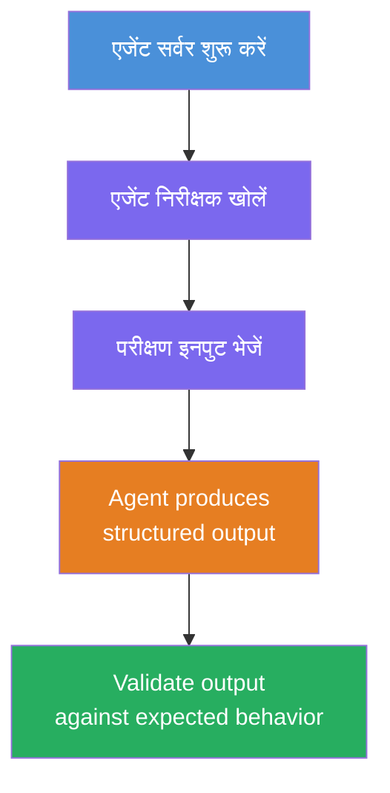
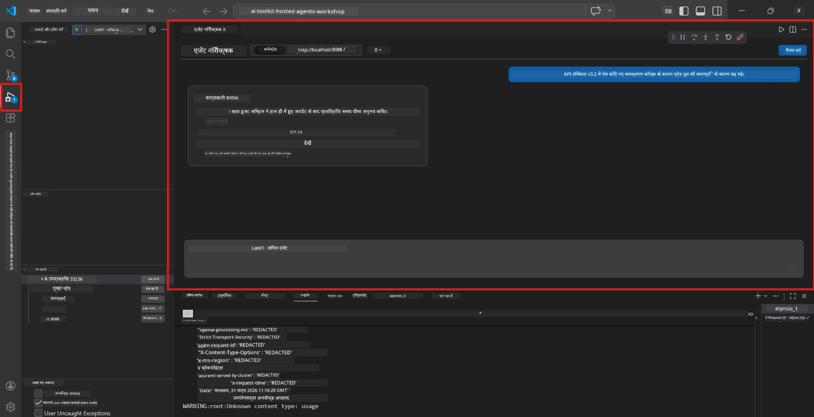
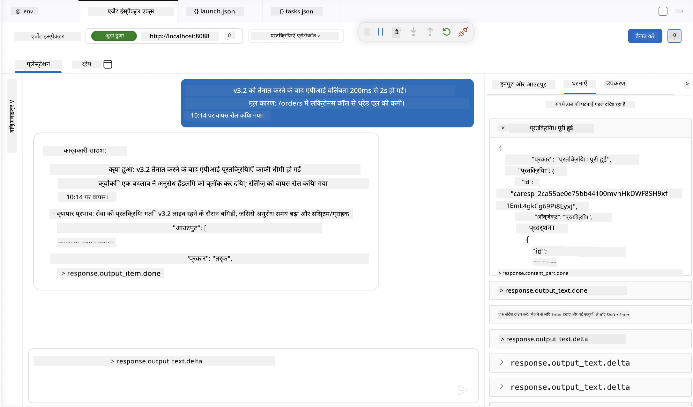

# मॉड्यूल 4 - स्थानीय रूप से परीक्षण करें

⏱️ ~10 मिनट

इस मॉड्यूल में, आप अपने एजेंट को स्थानीय रूप से चलाते हैं और जांचते हैं कि यह सही तरीके से काम करता है या नहीं, **खुशहाल-रास्ता कार्यात्मक परीक्षणों** का उपयोग करके। आप एजेंट इंस्पेक्टर (दृश्य UI) या सीधे HTTP कॉल का उपयोग करके पुष्टि करेंगे कि एजेंट संरचित, सटीक प्रतिक्रियाएं उत्पन्न करता है।

### स्थानीय परीक्षण प्रवाह



---

## विकल्प 1: F5 दबाएं - एजेंट इंस्पेक्टर के साथ डीबग करें (सिफारिश की गई)

### डीबगर शुरू करें

1. **executive-summary-agent/** फ़ोल्डर को सीधे VS कोड में खोलें (`File → Open Folder`)।
2. **रन और डीबग** पैनल खोलें (`Ctrl+Shift+D`)।
3. ड्रॉपडाउन से **Debug Local Agent Server** चुनें।
4. **F5** दबाएं (या ▶ स्टार्ट डीबगिंग पर क्लिक करें)।

> ⚠️ **महत्वपूर्ण: अपने Python इंटरप्रेटर को चुनें**
> यदि आपको "ModuleNotFoundError" मिलता है या डीबगर शुरू नहीं होता है, तो आपको VS कोड को अपने वर्चुअल वातावरण का उपयोग करने के लिए बताना होगा:
>   1. `Ctrl+Shift+P` दबाएं और टाइप करें **Python: Select Interpreter**।
>   2. अपने प्रोजेक्ट के `.venv` फ़ोल्डर में स्थित इंटरप्रेटर चुनें (जैसे Windows पर `.\.venv\Scripts\python.exe`)।
>   3. डीबग सेशन को पुनः प्रारंभ करें।
> यदि आपको अभी भी त्रुटियाँ मिल रही हैं, तो मैन्युअली अपनी फ़ाइल `tasks.json` को इस प्रकार अपडेट करें:
>   1. `.vscode/tasks.json` फ़ाइल पर जाएँ
>   2. उस कमांड को खोजें जिसका नाम है: `Run Agent/Workflow HTTP Server`
>   3. कमांड मान को इस प्रकार अपडेट करें: `"value": "${workspaceFolder}/.venv/bin/python",`

### क्या होता है

1. HTTP सर्वर `http://localhost:8088/responses` पर शुरू होता है।
2. **एजेंट इंस्पेक्टर** पैनल स्वचालित रूप से खुलता है - परीक्षण के लिए एक दृश्य चैट इंटरफ़ेस।
3. `main.py` में ब्रेकपॉइंट सक्षम होते हैं।

टर्मिनल देखें:
```
Starting executive summary hosted agent
Executive agent server running on http://localhost:8088
```

> **यदि एजेंट इंस्पेक्टर नहीं खुलता:** `Ctrl+Shift+P` दबाएं → **Foundry Toolkit: Open Agent Inspector**।



> *स्क्रीनशॉट में पुराना 'AI TOOLKIT' ब्रांडिंग दिख सकता है जो पहले के एक्सटेंशन संस्करण का है।*

---

## विकल्प 2: टर्मिनल के माध्यम से परीक्षण करें (वैकल्पिक)

एक टर्मिनल में एजेंट शुरू करें, दूसरे से अनुरोध भेजें:

```bash
# टर्मिनल 1: एजेंट शुरू करें
cd executive-summary-agent/
source .venv/bin/activate
python main.py
```

```bash
# टर्मिनल 2: परीक्षण भेजें (कर्ल)
curl -sS -X POST http://localhost:8088/responses \
  -H "Content-Type: application/json" \
  -d '{"input": "The API latency increased due to thread pool exhaustion caused by sync calls in v3.2.", "stream": false}'
```

---

## परिदृश्य परीक्षण: खुशहाल-रास्ता कार्यात्मक सत्यापन

नीचे दिए गए **तीनों** परिदृश्यों को चलाएं। ये सत्यापित करते हैं कि आपका एजेंट यथार्थवादी इनपुट के लिए सही, संरचित आउटपुट उत्पन्न करता है।



### परिदृश्य 1: आईटी घटना - API विलंबता में वृद्धि

**इनपुट:**
```
The API latency increased from 200ms to 2s after deploying v3.2.
Root cause: thread pool starvation from synchronous calls in /orders.
Rolled back at 10:14.
```

**अपेक्षित व्यवहार:**
- ✅ "Executive Summary" संरचना का पालन करता है (क्या हुआ / व्यावसायिक प्रभाव / अगला कदम)
- ✅ कोई तकनीकी शब्दजाल नहीं (कोई "thread pool", "/orders", या "v3.2" नहीं)
- ✅ स्पष्ट रूप से व्यावसायिक प्रभाव बताता है (जैसे, उपयोगकर्ताओं को देरी का सामना करना पड़ा)
- ✅ एक अगला कदम शामिल है (जैसे, फिक्स लागू हो चुका है, निगरानी स्थापित है)

---

### परिदृश्य 2: डेटा पाइपलाइन - ETL विफलता

**इनपुट:**
```
The nightly ETL job failed because the upstream schema changed. APAC dashboards show missing data.
```

**अपेक्षित व्यवहार:**
- ✅ डेटा रिफ्रेश विफलता का सरल भाषा में सारांश
- ✅ APAC डैशबोर्ड प्रभाव का उल्लेख
- ✅ सुधारात्मक अगला कदम शामिल है
- ✅ "ETL", "schema", या अन्य तकनीकी शर्तों का उल्लेख नहीं

---

### परिदृश्य 3: सुरक्षा - खुलासा हुआ क्रेडेंशियल

**इनपुट:**
```
Static analysis flagged a hardcoded secret in the repository.
The secret may have been exposed in commit history.
```

**अपेक्षित व्यवहार:**
- ✅ एक क्रेडेंशियल/सुरक्षा मुद्दे को कार्यकारी अनुकूल भाषा में वर्णित करता है
- ✅ संभावित जोखिम (अनधिकृत पहुंच) को बुलाता है
- ✅ सुधारात्मक कार्रवाई बताता है (क्रेडेंशियल रोटेशन, ऑडिट)
- ✅ "static analysis", "commit history", या "hardcoded" जैसे शब्द शामिल नहीं करता

---

## सत्यापन मानदंड

प्रत्येक परिदृश्य के लिए, जांचें:

| # | मानदंड | पास होने की स्थिति |
|---|----------|---------------|
| 1 | **संरचना** | प्रतिक्रिया "Executive Summary" प्रारूप का उपयोग करती है जिसमें तीनों बुलेट मौजूद हैं |
| 2 | **सीधी भाषा** | कोई तकनीकी शब्दजाल नहीं जो एक कार्यकारी समझ न पाए |
| 3 | **सटीकता** | सारांश इनपुट को दर्शाता है - कोई बनाई गई जानकारी नहीं |
| 4 | **संक्षिप्तता** | प्रतिक्रिया 100 शब्दों से कम है |
| 5 | **अगला कदम** | स्पष्ट कार्रवाई या रोकथाम बताई गई है |

---

## डीबगिंग सुझाव

| समस्या | समाधान |
|-------|-----|
| एजेंट शुरू नहीं होता | `.env` मान जांचें, venv सक्रिय है या नहीं यह सत्यापित करें, `pip install -r requirements.txt` चलाएँ |
| खाली या सामान्य प्रतिक्रिया | `main.py` में निर्देश पढ़ें - सुनिश्चित करें कि आउटपुट फॉर्मेट निर्दिष्ट हो |
| प्रतिक्रिया में शब्दजाल शामिल है | निर्देशों में "तकनीकी शब्द हटाएं" नियम मजबूत करें |
| एजेंट इंस्पेक्टर नहीं खुलता | `Ctrl+Shift+P` → **Foundry Toolkit: Open Agent Inspector** |
| टर्मिनल में मॉडल त्रुटियां | सुनिश्चित करें कि `AZURE_AI_MODEL_DEPLOYMENT_NAME` सटीक मेल खाता है (केस-संवेदनशील) |

---

### ✅ चेकपॉइंट

- [ ] एजेंट स्थानीय स्तर पर बिना त्रुटि के शुरू होता है
- [ ] एजेंट इंस्पेक्टर खुलता है और चैट इंटरफ़ेस दिखाता है (यदि F5 का उपयोग कर रहे हैं)
- [ ] **परिदृश्य 1** (आईटी घटना) - संरचित कार्यकारी सारांश, बिना शब्दजाल के
- [ ] **परिदृश्य 2** (डेटा पाइपलाइन) - व्यावसायिक प्रभाव के साथ प्रासंगिक सारांश
- [ ] **परिदृश्य 3** (सुरक्षा अलर्ट) - उपयुक्त जोखिम संचार
- [ ] सभी प्रतिक्रियाएँ परिभाषित आउटपुट संरचना का पालन करती हैं

> **अपनी प्रतिक्रियाएँ सुरक्षित करें** (कॉपी या स्क्रीनशॉट लें) - आप इन्हें मॉड्यूल 06 में क्लाउड परिणामों से तुलना करेंगे।

---

**पिछला:** [03 - कॉन्फ़िगर और कोड करें](03-configure-and-code.md) · **अगला:** [05 - Foundry पर तैनात करें →](05-deploy-to-foundry.md)

---

<!-- CO-OP TRANSLATOR DISCLAIMER START -->
**अस्वीकरण**:
इस दस्तावेज़ का अनुवाद AI अनुवाद सेवा [Co-op Translator](https://github.com/Azure/co-op-translator) का उपयोग करके किया गया है। जबकि हम सटीकता के लिए प्रयास करते हैं, कृपया ध्यान दें कि स्वचालित अनुवादों में त्रुटियाँ या अशुद्धियाँ हो सकती हैं। मूल दस्तावेज़ अपनी मूल भाषा में ही प्रामाणिक स्रोत माना जाना चाहिए। महत्वपूर्ण जानकारी के लिए, पेशेवर मानव अनुवाद की सिफारिश की जाती है। इस अनुवाद के उपयोग से उत्पन्न किसी भी गलतफहमी या गलत व्याख्या के लिए हम उत्तरदायी नहीं हैं।
<!-- CO-OP TRANSLATOR DISCLAIMER END -->