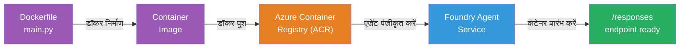
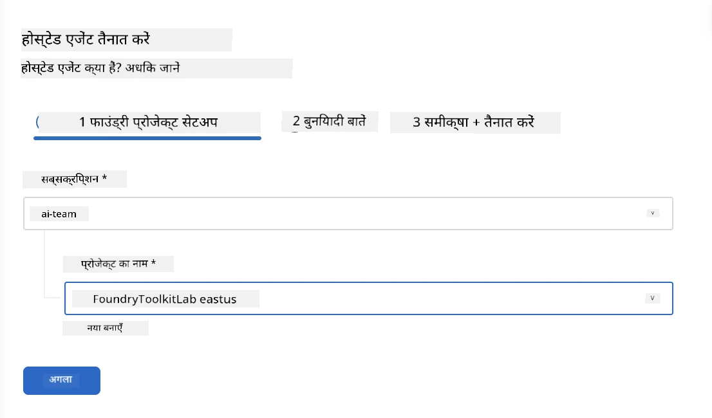
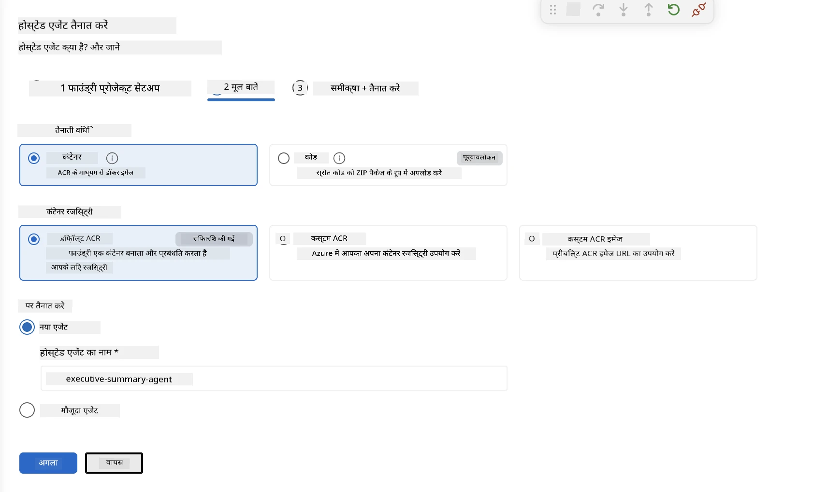
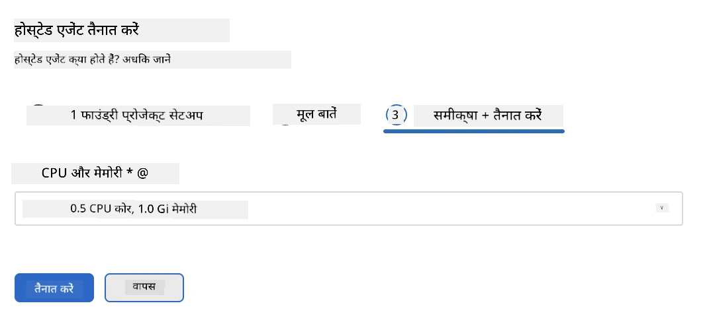
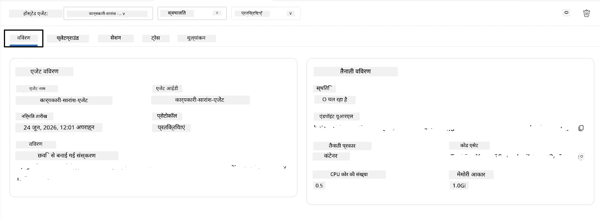

# मॉड्यूल 5 - Foundry एजेंट सेवा में डिप्लॉय करें

⏱️ ~10 मिनट

> ⚠️ **पाथ B उपयोगकर्ता:** इस मॉड्यूल के लिए Foundry सब्सक्रिप्शन आवश्यक है। यदि आप Foundry Local का उपयोग कर रहे हैं, तो [मॉड्यूल 07 - सारांश](07-summary.md) पर जाएं। आपने स्थानीय विकास कार्यप्रवाह सफलतापूर्वक पूरा कर लिया है!

इस मॉड्यूल में, आप अपने स्थानीय परीक्षण किए गए एजेंट को Microsoft Foundry में **Hosted Agent** के रूप में डिप्लॉय करते हैं। यह डिप्लॉयमेंट एक कंटेनर इमेज बनाता है, इसे Azure Container Registry पर पुश करता है, और Foundry के प्रबंधित इन्फ्रास्ट्रक्चर में एजेंट को शुरू करता है।

### डिप्लॉयमेंट पाइपलाइन

---

## पूर्वापेक्षाएँ जांचें

डिप्लॉयमेंट से पहले सत्यापित करें:

- [ ] एजेंट [मॉड्यूल 04](04-test-locally.md) के सभी 3 स्थानीय परिदृश्यों में सफल रहता है
- [ ] आपके पास परियोजना स्तर पर **Azure AI User** भूमिका है ([मॉड्यूल 01, आरबीएसी असाइन करें](01-setup.md#deploy-a-model--assign-rbac))
- [ ] आप VS कोड में Azure के लिए साइन इन हैं (Accounts आइकन में आपका नाम दिख रहा है)

---

## चरण 1: डिप्लॉयमेंट प्रारंभ करें

### विकल्प A: एजेंट इंस्पेक्टर से डिप्लॉय करें (सिफारिश की गई)

यदि एजेंट इंस्पेक्टर खुला है (परीक्षण से):
1. ऊपर-दाएं कोने में **Deploy** बटन पर क्लिक करें (क्लाउड आइकन ↑)।

### विकल्प B: कमांड पैलेट से डिप्लॉय करें

1. `Ctrl+Shift+P` दबाएं → **Foundry Toolkit: Deploy Hosted Agent** चुनें।

---

## चरण 2: डिप्लॉयमेंट कॉन्फ़िगर करें

विजार्ड आपसे पूछता है:

| संकेत | चयन |
|--------|-----------|
| **सब्सक्रिप्शन** | आपकी Azure सब्सक्रिप्शन |
| **लक्ष्य परियोजना** | आपकी Foundry परियोजना (जैसे, `workshop-agents`) |

अपना एजेंट कॉन्फ़िगर करने के लिए **next** पर क्लिक करें।

| संकेत | चयन |
|--------|-----------|
| **डिप्लॉयमेंट विधि** | कंटेनर |
| **कंटेनर रजिस्ट्री** | **डिफ़ॉल्ट ACR** (Microsoft Foundry आपके लिए एक बनाता और प्रबंधित करता है) |
| **डिप्लॉय करने के लिए** | नया एजेंट (नाम, `executive-summary-agent`) |

अपना एजेंट समीक्षा और डिप्लॉय करने के लिए **next** पर क्लिक करें।

| संकेत | चयन |
|--------|-----------|
| **CPU और मेमोरी** | **0.25 CPU कोर, 0.5 Gi मेमोरी** (कार्यशाला के लिए पर्याप्त) |

---

## चरण 3: डिप्लॉय करें और निगरानी करें

1. **Deploy** पर क्लिक करें।
2. **Output** पैनल देखें (ड्रॉपडाउन से **Microsoft Foundry** चुनें)।
3. डिप्लॉयमेंट निम्नलिखित चरणों से गुजरता है:
   - **Docker build** - आपके Dockerfile से कंटेनर बनाता है
   - **Docker push** - इमेज को ACR पर पुश करता है (पहली बार डिप्लॉय में 1–3 मिनट)
   - **Agent registration** - Foundry में होस्टेड एजेंट बनाता है
   - **Container start** - सिस्टम-प्रबंधित पहचान के साथ शुरू करता है

4. पूरा होने पर, एक सूचना प्रकट होती है:
   > **my-agent सफलतापूर्वक डिप्लॉय हो गया है।** `View logs` `Run agent`

5. एजेंट प्लेग्राउंड खोलने के लिए **Run agent** पर क्लिक करें।

### डिप्लॉयमेंट स्थिति मान

| स्थिति | अर्थ |
|--------|---------|
| **Running** | कंटेनर तैयार, एजेंट प्रतिक्रिया दे रहा है |
| **Pending** | कंटेनर शुरू हो रहा है - 30–60 सेकंड प्रतीक्षा करें |
| **Failed** | लॉग जांचें (नीचे समस्या निवारण देखें) |

---

## सामान्य डिप्लॉयमेंट त्रुटियाँ

| त्रुटि | मूल कारण | समाधान |
|-------|-----------|-----|
| `agents/write` अनुमति अस्वीकृत | परियोजना स्तर पर **Azure AI User** भूमिका गायब है | [मॉड्यूल 01, आरबीएसी असाइन करें](01-setup.md#deploy-a-model--assign-rbac) |
| Docker चल नहीं रहा | Docker Desktop शुरू नहीं हुआ | Docker Desktop शुरू करें → `docker info` सत्यापित करें |
| ACR प्राधिकरण | प्रबंधित पहचान इमेज को खींच नहीं सकती | देखें [मॉड्यूल 08 - समस्या निवारण](08-troubleshooting.md) |

---

### ✅ चेकपॉइंट

- [ ] डिप्लॉयमेंट बिना त्रुटियों के पूरा हुआ
- [ ] Foundry साइडबार में **Hosted Agents (Preview)** के अंतर्गत एजेंट दिखाई देता है
- [ ] कंटेनर स्थिति **Running** दिखा रही है
- [ ] एजेंट प्लेग्राउंड टैब खुला है जिसमें एजेंट विवरण और एंडपॉइंट URL दिख रहा है

---

**पिछला:** [04 - स्थानीय परीक्षण](04-test-locally.md) · **अगला:** [06 - प्लेग्राउंड में सत्यापन →](06-verify-in-playground.md)

---

<!-- CO-OP TRANSLATOR DISCLAIMER START -->
**अस्वीकरण**:
इस दस्तावेज़ का अनुवाद AI अनुवाद सेवा [Co-op Translator](https://github.com/Azure/co-op-translator) का उपयोग करके किया गया है। जबकि हम सटीकता के लिए प्रयास करते हैं, कृपया ध्यान दें कि स्वचालित अनुवादों में त्रुटियाँ या अशुद्धियाँ हो सकती हैं। मूल दस्तावेज़ अपनी मूल भाषा में ही प्रामाणिक स्रोत माना जाना चाहिए। महत्वपूर्ण जानकारी के लिए, पेशेवर मानव अनुवाद की सिफारिश की जाती है। इस अनुवाद के उपयोग से उत्पन्न किसी भी गलतफहमी या गलत व्याख्या के लिए हम उत्तरदायी नहीं हैं।
<!-- CO-OP TRANSLATOR DISCLAIMER END -->