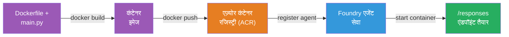
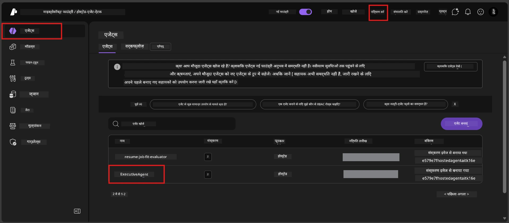

# Module 6 - Foundry Agent Service पर डिप्लॉय करें

इस मॉड्यूल में, आप अपने लोकल में टेस्ट किए गए एजेंट को Microsoft Foundry पर [**Hosted Agent**](https://learn.microsoft.com/azure/foundry/agents/concepts/hosted-agents) के रूप में डिप्लॉय करते हैं। डिप्लॉयमेंट प्रक्रिया आपके प्रोजेक्ट से एक Docker कंटेनर इमेज बनाती है, इसे [Azure Container Registry (ACR)](https://learn.microsoft.com/azure/container-registry/container-registry-intro) में पुश करती है, और [Foundry Agent Service](https://learn.microsoft.com/azure/foundry/agents/overview) में एक होस्टेड एजेंट संस्करण बनाती है।

### डिप्लॉयमेंट पाइपलाइन


---

## आवश्यकताओं की जांच

डिप्लॉयमेंट से पहले, नीचे दिए गए हर आइटम की पुष्टि करें। इन्हें स्किप करना डिप्लॉयमेंट विफलताओं का सबसे आम कारण है।

1. **एजेंट लोकल स्मोक टेस्ट पास करता है:**
   - आपने [Module 5](05-test-locally.md) में दिए गए सभी 4 टेस्ट पूरे किए हैं और एजेंट सही प्रतिक्रिया देता है।

2. **आपके पास [Azure AI User](https://learn.microsoft.com/azure/foundry/concepts/rbac-foundry#built-in-roles) भूमिका है:**
   - यह [Module 2, Step 3](02-create-foundry-project.md) में असाइन किया गया था। यदि आप निश्चित नहीं हैं, तो अब जांचें:
   - Azure Portal → आपके Foundry **प्रोजेक्ट** संसाधन → **Access control (IAM)** → **Role assignments** टैब → अपना नाम खोजें → पुष्टि करें कि **Azure AI User** सूचीबद्ध है।

3. **आप VS Code में Azure में साइन इन हैं:**
   - VS Code के बॉटम-लेफ्ट में Accounts आइकन देखें। आपका अकाउंट नाम दिखना चाहिए।

4. **(वैकल्पिक) Docker Desktop चल रहा है:**
   - Docker केवल तब आवश्यक है जब Foundry एक्सटेंशन आपको लोकल बिल्ड के लिए कहे। अधिकांश मामलों में, एक्सटेंशन डिप्लॉयमेंट के दौरान कंटेनर बिल्ड अपने आप संभालता है।
   - यदि आपके पास Docker इंस्टॉल है, तो जांचें कि यह चल रहा है: `docker info`

---

## Step 1: डिप्लॉयमेंट शुरू करें

डिप्लॉय करने के दो तरीके हैं - दोनों का परिणाम समान होता है।

### विकल्प A: Agent Inspector से डिप्लॉय करें (सिफारिश की गई)

यदि आप एजेंट को डिबगर (F5) के साथ चला रहे हैं और Agent Inspector खुला हुआ है:

1. Agent Inspector पैनल के **उपरी-दाएँ कोने** को देखें।
2. **Deploy** बटन (क्लाउड आइकन जिसमें ऊपर की तरफ तीर ↑) पर क्लिक करें।
3. डिप्लॉयमेंट विज़ार्ड खुल जाएगा।

### विकल्प B: Command Palette से डिप्लॉय करें

1. `Ctrl+Shift+P` दबाकर **Command Palette** खोलें।
2. टाइप करें: **Microsoft Foundry: Deploy Hosted Agent** और इसे चुनें।
3. डिप्लॉयमेंट विज़ार्ड खुल जाएगा।

---

## Step 2: डिप्लॉयमेंट कॉन्फ़िगर करें

डिप्लॉयमेंट विज़ार्ड आपको कॉन्फ़िगरेशन के लिए गाइड करेगा। प्रत्येक प्रांप्ट भरें:

### 2.1 लक्ष्य प्रोजेक्ट चुनें

1. एक ड्रॉपडाउन आपके Foundry प्रोजेक्ट दिखाता है।
2. वह प्रोजेक्ट चुनें जो आपने Module 2 में बनाया था (जैसे, `workshop-agents`)।

### 2.2 कंटेनर एजेंट फाइल चुनें

1. आपसे एजेंट एंट्री पॉइंट चुनने के लिए कहा जाएगा।
2. **`main.py`** (Python) चुनें - यह फाइल विज़ार्ड आपके एजेंट प्रोजेक्ट की पहचान के लिए उपयोग करता है।

### 2.3 संसाधन कॉन्फ़िगर करें

| सेटिंग | सिफारिश की गई मान | नोट्स |
|---------|------------------|-------|
| **CPU** | `0.25` | डिफ़ॉल्ट, वर्कशॉप के लिए पर्याप्त। प्रोडक्शन वर्कलोड के लिए बढ़ाएं |
| **Memory** | `0.5Gi` | डिफ़ॉल्ट, वर्कशॉप के लिए पर्याप्त |

ये `agent.yaml` में दिए गए मानों से मेल खाते हैं। आप डिफ़ॉल्ट मान स्वीकार कर सकते हैं।

---

## Step 3: पुष्टि करें और डिप्लॉय करें

1. विज़ार्ड एक डिप्लॉयमेंट सारांश दिखाता है जिसमें:
   - लक्ष्य प्रोजेक्ट नाम
   - एजेंट नाम (`agent.yaml` से)
   - कंटेनर फाइल और संसाधन
2. सारांश की समीक्षा करें और **Confirm and Deploy** (या **Deploy**) पर क्लिक करें।
3. प्रगति VS Code में देखें।

### डिप्लॉयमेंट के दौरान क्या होता है (कदम दर कदम)

डिप्लॉयमेंट एक बहु-चरण प्रक्रिया है। VS Code के **Output** पैनल में (ड्रॉपडाउन से "Microsoft Foundry" चुनें) होकर साथ-साथ देखें:

1. **Docker build** - VS Code आपके `Dockerfile` से एक Docker कंटेनर इमेज बनाता है। आप Docker लेयर संदेश देखेंगे:
   ```
   Step 1/6 : FROM python:<version>-slim
   Step 2/6 : WORKDIR /app
   ...
   Successfully built abc123def456
   ```

2. **Docker push** - इमेज आपके Foundry प्रोजेक्ट से जुड़ी **Azure Container Registry (ACR)** में पुश की जाती है। पहली बार डिप्लॉय करने पर यह 1-3 मिनट ले सकता है (बेस इमेज >100MB होती है)।

3. **एजेंट रजिस्ट्रेशन** - Foundry Agent Service एक नया होस्टेड एजेंट बनाता है (या यदि एजेंट पहले से है तो नया संस्करण बनाता है)। `agent.yaml` से एजेंट मेटाडेटा का उपयोग होता है।

4. **कंटेनर शुरू करना** - कंटेनर Foundry के मैनेज्ड इन्फ्रास्ट्रक्चर में शुरू होता है। प्लेटफ़ॉर्म एक [सिस्टम-मैनेज्ड आइडेंटिटी](https://learn.microsoft.com/azure/foundry/agents/concepts/agent-identity) असाइन करता है और `/responses` एंडपॉइंट एक्सपोज़ करता है।

> **पहला डिप्लॉयमेंट धीमा होता है** (Docker को सभी लेयर पुश करनी पड़ती हैं)। बाद के डिप्लॉयमेंट तेज़ होते हैं क्योंकि Docker अनचेंज्ड लेयर को कैश करता है।

---

## Step 4: डिप्लॉयमेंट स्थिति सत्यापित करें

डिप्लॉयमेंट कमांड पूरा होने के बाद:

1. गतिविधि बार में Foundry आइकन पर क्लिक करके **Microsoft Foundry** साइडबार खोलें।
2. अपने प्रोजेक्ट के अंतर्गत **Hosted Agents (Preview)** सेक्शन को एक्सपैंड करें।
3. आपको अपने एजेंट का नाम दिखना चाहिए (जैसे, `ExecutiveAgent` या `agent.yaml` से नाम)।
4. **एजेंट नाम पर क्लिक करें** और उसे विस्तृत करें।
5. आपको एक या अधिक **संस्करण** (जैसे, `v1`) दिखाई देंगे।
6. संस्करण पर क्लिक करके **Container Details** देखें।
7. **Status** फील्ड जांचें:

   | स्थिति | अर्थ |
   |--------|---------|
   | **Started** या **Running** | कंटेनर चल रहा है और एजेंट तैयार है |
   | **Pending** | कंटेनर शुरू हो रहा है (30-60 सेकंड प्रतीक्षा करें) |
   | **Failed** | कंटेनर शुरू करने में विफल (लॉग्स देखें - नीचे ट्रबलशूटिंग देखें) |



> **यदि "Pending" 2 मिनट से अधिक समय तक दिखे:** कंटेनर बेस इमेज खींच रहा हो सकता है। थोड़ा और प्रतीक्षा करें। यदि यह लगातार पेंडिंग रहता है, तो कंटेनर लॉग्स जांचें।

---

## सामान्य डिप्लॉयमेंट त्रुटियां और समाधान

### त्रुटि 1: अनुमति अस्वीकृत - `agents/write`

```
Error: lacks the required data action 
Microsoft.CognitiveServices/accounts/AIServices/agents/write 
to perform POST /api/projects/{projectName}/assistants operation.
```

**मूल कारण:** आपके पास **प्रोजेक्ट** स्तर पर `Azure AI User` भूमिका नहीं है।

**समाधान कदम दर कदम:**

1. [https://portal.azure.com](https://portal.azure.com) खोलें।
2. खोज बार में अपने Foundry **प्रोजेक्ट** नाम को टाइप करें और उस पर क्लिक करें।
   - **महत्वपूर्ण:** सुनिश्चित करें कि आप **प्रोजेक्ट** संसाधन ("Microsoft Foundry project" टाइप) पर जा रहे हैं, न कि पेरेंट अकाउंट/हब संसाधन पर।
3. बाईं नेविगेशन में **Access control (IAM)** पर क्लिक करें।
4. **+ Add** → **Add role assignment** क्लिक करें।
5. **Role** टैब में [**Azure AI User**](https://learn.microsoft.com/azure/foundry/concepts/rbac-foundry#built-in-roles) खोजें और इसे चुनें। **Next** पर क्लिक करें।
6. **Members** टैब में, **User, group, or service principal** चुनें।
7. **+ Select members** पर क्लिक करें, अपना नाम/ईमेल खोजें, खुद को चुनें, और **Select** क्लिक करें।
8. **Review + assign** → फिर से **Review + assign** क्लिक करें।
9. भूमिका असाइनमेंट के प्रभाव दिखने में 1-2 मिनट लग सकते हैं।
10. Step 1 से डिप्लॉयमेंट पुनः प्रयास करें।

> भूमिका **प्रोजेक्ट** स्तर पर होनी चाहिए, केवल अकाउंट स्कोप पर नहीं। यह डिप्लॉयमेंट विफलताओं का सबसे आम कारण है।

### त्रुटि 2: Docker चल नहीं रहा

```
Error: Docker build failed / Cannot connect to Docker daemon
```

**समाधान:**
1. Docker Desktop शुरू करें (स्टार्ट मेनू या सिस्टम ट्रे में ढूंढ़ें)।
2. जब तक यह "Docker Desktop is running" न दिखाए, 30-60 सेकंड प्रतीक्षा करें।
3. परीक्षण करें: टर्मिनल में `docker info` चलाएं।
4. **Windows के लिए:** Docker Desktop सेटिंग्स में WSL 2 backend सक्षम करें → **General** → **Use the WSL 2 based engine**।
5. डिप्लॉयमेंट पुनः प्रयास करें।

### त्रुटि 3: ACR प्रमाणीकृत नहीं - `AcrPullUnauthorized`

```
Error: AcrPullUnauthorized
```

**मूल कारण:** Foundry प्रोजेक्ट की मैनेज्ड आइडेंटिटी को कंटेनर रजिस्ट्री तक पुल एक्सेस नहीं है।

**समाधान:**
1. Azure Portal में, अपने **[Container Registry](https://learn.microsoft.com/azure/container-registry/container-registry-intro)** (जो आपके Foundry प्रोजेक्ट के समान संसाधन समूह में है) पर जाएं।
2. **Access control (IAM)** → **Add** → **Add role assignment** जाएं।
3. **[AcrPull](https://learn.microsoft.com/azure/container-registry/container-registry-roles)** भूमिका चुनें।
4. **Members** के अंतर्गत, **Managed identity** चुनें → Foundry प्रोजेक्ट की मैनेज्ड आइडेंटिटी ढूंढ़ें।
5. **Review + assign** करें।

> यह आमतौर पर Foundry एक्सटेंशन द्वारा अपने आप सेट किया जाता है। यह त्रुटि होने पर स्वचालित सेटअप विफल हो सकता है।

### त्रुटि 4: कंटेनर प्लेटफॉर्म मेल न खाना (Apple Silicon)

Apple Silicon Mac (M1/M2/M3) से डिप्लॉय करते समय, कंटेनर को `linux/amd64` के लिए बिल्ड किया जाना चाहिए:

```bash
docker build --platform linux/amd64 -t myagent:v1 .
```

> Foundry एक्सटेंशन अधिकतर उपयोगकर्ताओं के लिए इसे अपने आप संभालता है।

---

### चेकपॉइंट

- [ ] डिप्लॉयमेंट कमांड बिना त्रुटि के VS Code में पूरा हुआ
- [ ] एजेंट Foundry साइडबार में **Hosted Agents (Preview)** के तहत दिख रहा है
- [ ] आपने एजेंट पर क्लिक किया → एक संस्करण चुना → **Container Details** देखें
- [ ] कंटेनर की स्थिति **Started** या **Running** दिखा रही है
- [ ] (अगर त्रुटि हुई) त्रुटि पहचानी, समाधान लागू किया, और सफलतापूर्वक पुनः डिप्लॉय किया

---

**पिछला:** [05 - Test Locally](05-test-locally.md) · **अगला:** [07 - Verify in Playground →](07-verify-in-playground.md)

---

<!-- CO-OP TRANSLATOR DISCLAIMER START -->
**अस्वीकरण**:  
इस दस्तावेज़ का अनुवाद AI अनुवाद सेवा [Co-op Translator](https://github.com/Azure/co-op-translator) का उपयोग करके किया गया है। जबकि हम सटीकता के लिए प्रयासरत हैं, कृपया ध्यान दें कि स्वचालित अनुवादों में त्रुटियाँ या गलतियाँ हो सकती हैं। मूल दस्तावेज़ अपनी मातृ भाषा में अधिकृत स्रोत माना जाना चाहिए। महत्वपूर्ण जानकारी के लिए, पेशेवर मानव अनुवाद की सलाह दी जाती है। इस अनुवाद के उपयोग से उत्पन्न किसी भी गलतफहमी या गलत व्याख्या के लिए हम उत्तरदायी नहीं हैं।
<!-- CO-OP TRANSLATOR DISCLAIMER END -->