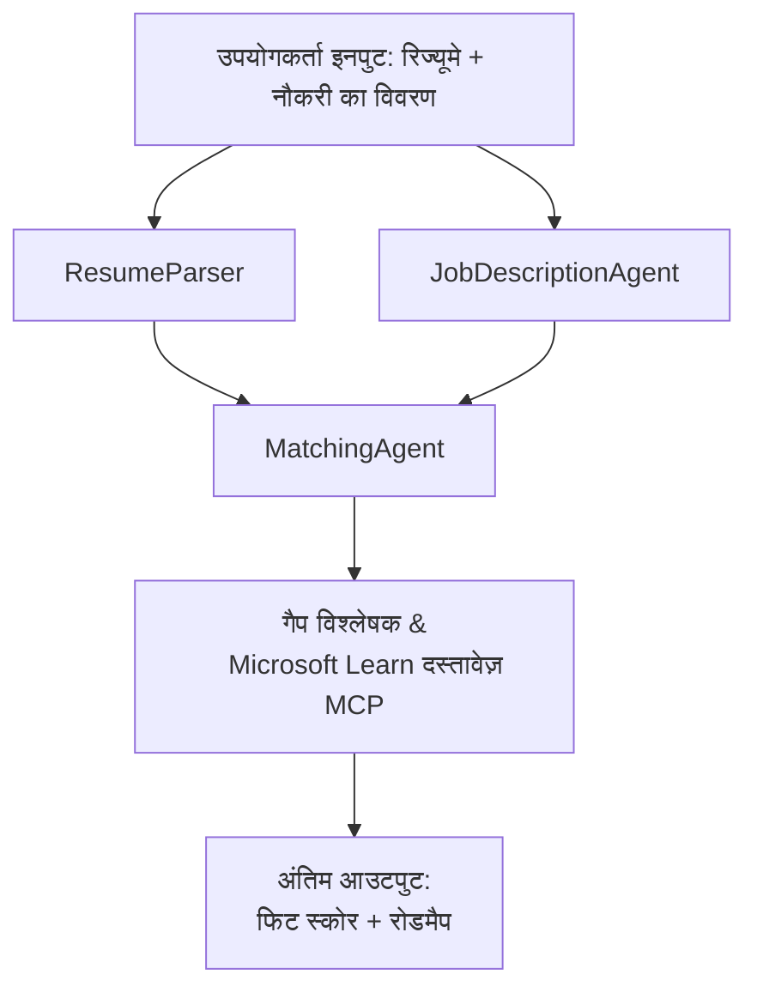

# PersonalCareerCopilot - रिज्यूमे → नौकरी फिट मूल्यांकनकर्ता

एक बहु-एजेंट वर्कफ़्लो जो यह मूल्यांकन करता है कि रिज्यूमे नौकरी के विवरण से कितना मेल खाता है, फिर अंतर को पाटने के लिए एक व्यक्तिगत सीखने का रोडमैप बनाता है।

---

## एजेंट

| एजेंट | भूमिका | उपकरण |
|-------|---------|-------|
| **ResumeParser** | रिज्यूमे टेक्स्ट से संरचित कौशल, अनुभव, प्रमाणपत्र निकालता है | - |
| **JobDescriptionAgent** | JD से आवश्यक/पसंदीदा कौशल, अनुभव, प्रमाणपत्र निकालता है | - |
| **MatchingAgent** | प्रोफ़ाइल बनाम आवश्यकताओं की तुलना करता है → फिट स्कोर (0-100) + मेल खाए गए/गायब कौशल | - |
| **GapAnalyzer** | Microsoft Learn संसाधनों के साथ एक व्यक्तिगत सीखने का रोडमैप बनाता है | `search_microsoft_learn_for_plan` (MCP) |

## वर्कफ़्लो


---

## त्वरित शुरुआत

### 1. पर्यावरण सेट करें

```powershell
cd workshop\lab02-multi-agent\PersonalCareerCopilot
python -m venv .venv
.\.venv\Scripts\Activate.ps1          # विंडोज़ पॉवरशेल
# source .venv/bin/activate            # मैकओएस / लिनक्स
pip install -r requirements.txt
```

### 2. क्रेडेंशियल्स कॉन्फ़िगर करें

उदाहरण env फ़ाइल कॉपी करें और अपनी Foundry प्रोजेक्ट विवरण भरें:

```powershell
cp .env.example .env
```

संपादित करें `.env`:

```env
PROJECT_ENDPOINT=https://<your-account>.services.ai.azure.com/api/projects/<your-project>
MODEL_DEPLOYMENT_NAME=gpt-4.1-mini
```

| मान | इसे कहाँ पाएँ |
|------|----------------|
| `PROJECT_ENDPOINT` | VS Code में Microsoft Foundry साइडबार → अपने प्रोजेक्ट पर राइट-क्लिक करें → **Copy Project Endpoint** |
| `MODEL_DEPLOYMENT_NAME` | Foundry साइडबार → प्रोजेक्ट विस्तृत करें → **Models + endpoints** → डिप्लॉयमेंट नाम |

### 3. स्थानीय रूप से चलाएँ

```powershell
python -m debugpy --listen 127.0.0.1:5679 -m agentdev run main.py --verbose --port 8088
```

या VS Code टास्क का उपयोग करें: `Ctrl+Shift+P` → **Tasks: Run Task** → **Run Lab02 HTTP Server**।

### 4. एजेंट इंस्पेक्टर के साथ परीक्षण करें

एजेंट इंस्पेक्टर खोलें: `Ctrl+Shift+P` → **Foundry Toolkit: Open Agent Inspector**।

यह परीक्षण प्रॉम्प्ट पेस्ट करें:

```
Resume:
Jane Doe
Senior Software Engineer with 5 years of experience in Python, Django, and AWS.
Built microservices handling 10K+ requests/second. Led a team of 4 developers.
Certifications: AWS Solutions Architect Associate.
Education: B.S. Computer Science, State University.

Job Description:
Senior Cloud Engineer at Contoso Ltd.
Required: Python, Azure, Kubernetes, Terraform, CI/CD pipelines.
Preferred: Go, monitoring (Prometheus/Grafana), cost optimization.
Experience: 5+ years in cloud infrastructure.
Certifications: Azure Solutions Architect Expert preferred.
```

**अपेक्षित:** एक फिट स्कोर (0-100), मेल खाए गए/गायब कौशल, और Microsoft Learn यूआरएल के साथ एक व्यक्तिगत सीखने का रोडमैप।

### 5. Foundry पर डिप्लॉय करें

`Ctrl+Shift+P` → **Microsoft Foundry: Deploy Hosted Agent** → अपना प्रोजेक्ट चुनें → पुष्टि करें।

---

## प्रोजेक्ट संरचना

```
PersonalCareerCopilot/
├── .env.example        ← Template for environment variables
├── .env                ← Your credentials (git-ignored)
├── agent.yaml          ← Hosted agent definition (name, resources, env vars)
├── Dockerfile          ← Container image for Foundry deployment
├── main.py             ← 4-agent workflow (instructions, MCP tool, WorkflowBuilder)
└── requirements.txt    ← Python dependencies
```

## प्रमुख फ़ाइलें

### `agent.yaml`

Foundry Agent Service के लिए होस्टेड एजेंट को परिभाषित करता है:
- `kind: hosted` - प्रबंधित कंटेनर के रूप में चलता है
- `protocols: [responses v1]` - `/responses` HTTP एंडपॉइंट को खुले रूप में प्रदान करता है
- `environment_variables` - `PROJECT_ENDPOINT` और `MODEL_DEPLOYMENT_NAME` डिप्लॉय के समय इंजेक्ट किए जाते हैं

### `main.py`

शामिल है:
- **एजेंट निर्देश** - चार `*_INSTRUCTIONS` कॉन्स्टेंट, प्रत्येक एजेंट के लिए एक
- **MCP टूल** - `search_microsoft_learn_for_plan()` Streamable HTTP के माध्यम से `https://learn.microsoft.com/api/mcp` को कॉल करता है
- **एजेंट निर्माण** - `create_agents()` कॉन्टेक्स्ट मैनेजर `AzureAIAgentClient.as_agent()` का उपयोग करता है
- **वर्कफ़्लो ग्राफ़** - `create_workflow()` एजेंटों को फैन-आउट/फैन-इन/क्रमिक पैटर्न के साथ जोड़ता है `WorkflowBuilder` का उपयोग करके
- **सर्वर स्टार्टअप** - `from_agent_framework(agent).run_async()` पोर्ट 8088 पर

### `requirements.txt`

| पैकेज | संस्करण | उद्देश्य |
|--------|---------|---------|
| `agent-framework-azure-ai` | `1.0.0rc3` | Microsoft Agent Framework के लिए Azure AI एकीकरण |
| `agent-framework-core` | `1.0.0rc3` | कोर रनटाइम (WorkflowBuilder शामिल) |
| `azure-ai-agentserver-agentframework` | `1.0.0b16` | होस्टेड एजेंट सर्वर रनटाइम |
| `azure-ai-agentserver-core` | `1.0.0b16` | कोर एजेंट सर्वर अब्स्ट्रैक्शन |
| `debugpy` | नवीनतम | Python डिबगिंग (VS Code में F5) |
| `agent-dev-cli` | `--pre` | लोकल डेव CLI + एजेंट इंस्पेक्टर बैकएंड |

---

## समस्या शमन

| समस्या | समाधान |
|---------|---------|
| `RuntimeError: Missing required environment variable(s)` | `.env` बनाएँ जिसमें `PROJECT_ENDPOINT` और `MODEL_DEPLOYMENT_NAME` हो |
| `ModuleNotFoundError: No module named 'agent_framework'` | venv सक्रिय करें और `pip install -r requirements.txt` चलाएँ |
| आउटपुट में Microsoft Learn यूआरएल नहीं | इंटरनेट कनेक्टिविटी जांचें `https://learn.microsoft.com/api/mcp` तक |
| केवल 1 गैप कार्ड (कट गया) | सत्यापित करें कि `GAP_ANALYZER_INSTRUCTIONS` में `CRITICAL:` ब्लॉक शामिल है |
| पोर्ट 8088 उपयोग में है | अन्य सर्वरों को बंद करें: `netstat -ano \| findstr :8088` |

विस्तृत समस्या निवारण के लिए देखें [Module 8 - Troubleshooting](../docs/08-troubleshooting.md)।

---

**पूर्ण वॉकथ्रू:** [Lab 02 Docs](../docs/README.md) · **वापस:** [Lab 02 README](../README.md) · [कार्यशाला होम](../../../README.md)

---

<!-- CO-OP TRANSLATOR DISCLAIMER START -->
**अस्वीकरण**:
इस दस्तावेज़ का अनुवाद AI अनुवाद सेवा [Co-op Translator](https://github.com/Azure/co-op-translator) का उपयोग करके किया गया है। जबकि हम सटीकता के लिए प्रयासरत हैं, कृपया ध्यान दें कि स्वचालित अनुवादों में त्रुटियाँ या असमानताएँ हो सकती हैं। मूल दस्तावेज़ अपनी मूल भाषा में आधिकारिक स्रोत माना जाना चाहिए। महत्वपूर्ण जानकारी के लिए, पेशेवर मानव अनुवाद की सिफारिश की जाती है। इस अनुवाद के उपयोग से उत्पन्न किसी भी गलतफहमी या गलत व्याख्या के लिए हम उत्तरदायी नहीं हैं।
<!-- CO-OP TRANSLATOR DISCLAIMER END -->