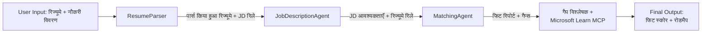

# PersonalCareerCopilot - रिज्यूमे → नौकरी उपयुक्तता मूल्यांकनकर्ता

एक वर्कफ़्लो-प्रथम मल्टी-एजेंट ऐप जो यह मूल्यांकन करता है कि एक रिज्यूमे नौकरी विवरण से कितना मेल खाता है, फिर व्यक्तिगत सीखने के रोडमैप को उत्पन्न करता है ताकि कमियों को दूर किया जा सके।

---

## एजेंट

| एजेंट | भूमिका | उपकरण |
|-------|------|-------|
| **ResumeParser** | रिज्यूमे टेक्स्ट से संरचित कौशल, अनुभव, प्रमाणपत्र निकालता है | - |
| **JobDescriptionAgent** | एक JD से आवश्यक/अधिमानित कौशल, अनुभव, प्रमाणपत्र निकालता है | - |
| **MatchingAgent** | प्रोफ़ाइल की तुलना आवश्यकताओं से करता है → फिट स्कोर (0-100) + मेल खाते / गुम कौशल | - |
| **GapAnalyzer** | Microsoft Learn संसाधनों के साथ एक व्यक्तिगत सीखने का रोडमैप बनाता है | `search_microsoft_learn_for_plan` (MCP) |

## वर्कफ़्लो


```mermaid
flowchart LR
    UserInput["User Input: रिज्यूमे + नौकरी विवरण"] --> ResumeParser
    ResumeParser -- "पार्स किया हुआ रिज्यूमे + JD रिले" --> JobDescriptionAgent
    JobDescriptionAgent -- "JD आवश्यकताएँ + रिज्यूमे रिले" --> MatchingAgent
    MatchingAgent -- "फिट रिपोर्ट + गैप्स" --> GapAnalyzerMCP["गैप विश्लेषक +\nMicrosoft Learn MCP"]
    GapAnalyzerMCP --> FinalOutput["Final Output:\nफिट स्कोर + रोडमैप"]
```

---

## त्वरित आरंभ

### 1. पर्यावरण सेटअप करें

यह फ़ोल्डर वर्कफ़्लो-आधारित लैब 02 स्कैफ़ोल्ड के लिए संदर्भ कार्यान्वयन है। इसका `main.py` मौजूदा प्रॉम्प्ट ब्लॉक्स के साथ-साथ `WorkflowBuilder` का उपयोग करके चार एजेंटों को एक साथ जोड़ता है।

```powershell
cd workshop\lab02-multi-agent\PersonalCareerCopilot
python -m venv .venv
.\.venv\Scripts\Activate.ps1          # विंडोज़ पावरशेल
# स्रोत .venv/bin/activate            # मैकओएस / लिनक्स
pip install -r requirements.txt
```

### 2. क्रेडेंशियल कॉन्फ़िगर करें

इस फ़ोल्डर में `.env` फाइल बनाएँ:

```powershell
copy .env .env.bak 2>$null; echo $null > .env
```

`.env` संपादित करें:

```env
FOUNDRY_PROJECT_ENDPOINT=https://<your-account>.services.ai.azure.com/api/projects/<your-project>
AZURE_AI_MODEL_DEPLOYMENT_NAME=gpt-4.1-mini
```

| मान | कहाँ पाएँ |
|-------|------------------|
| `FOUNDRY_PROJECT_ENDPOINT` | Foundry Toolkit साइडबार → अपने प्रोजेक्ट पर राइट-क्लिक करें → **Copy Project Endpoint** |
| `AZURE_AI_MODEL_DEPLOYMENT_NAME` | Foundry साइडबार → प्रोजेक्ट को बढ़ाएं → **Models + endpoints** → डिप्लॉयमेंट नाम |

### 3. स्थानीय रूप से चलाएं

```powershell
python -m debugpy --listen 127.0.0.1:5679 main.py --port 8088
```

या VS कोड टास्क का उपयोग करें: `Ctrl+Shift+P` → **Tasks: Run Task** → **Run Agent HTTP Server**।

F5 डिबगिंग के लिए, **Debug Local Agent HTTP Server** का उपयोग करें।

### 4. एजेंट निरीक्षक के साथ परीक्षण करें

एजेंट निरीक्षक खोलें: `Ctrl+Shift+P` → **Foundry Toolkit: Open Agent Inspector**।

यह परीक्षण प्रॉम्प्ट पेस्ट करें:

```
Resume:
Jane Doe
Senior Software Engineer with 5 years of experience in Python, Django, and AWS.
Built microservices handling 10K+ requests/second. Led a team of 4 developers.
Certifications: AWS Solutions Architect Associate.
Education: B.S. Computer Science, State University.

Job Description:
Senior Cloud Engineer at Contoso Ltd.
Required: Python, Azure, Kubernetes, Terraform, CI/CD pipelines.
Preferred: Go, monitoring (Prometheus/Grafana), cost optimization.
Experience: 5+ years in cloud infrastructure.
Certifications: Azure Solutions Architect Expert preferred.
```

**अपेक्षित:** एक फिट स्कोर (0-100), मेल खाते/गुम कौशल, और Microsoft Learn URLs के साथ एक व्यक्तिगत सीखने का रोडमैप।

### 5. Foundry पर तैनात करें

`Ctrl+Shift+P` → **Foundry Toolkit: Deploy Hosted Agent** → अपना प्रोजेक्ट चुनें → पुष्टि करें।

---

## प्रोजेक्ट संरचना

```
PersonalCareerCopilot/
├── .env                ← Your credentials (git-ignored)
├── agent.yaml          ← Hosted agent definition (name, resources, env vars)
├── Dockerfile          ← Container image for Foundry deployment
├── main.py             ← 4-agent workflow (instructions, MCP tool, WorkflowBuilder)
└── requirements.txt    ← Python dependencies
```

## मुख्य फ़ाइलें

### `agent.yaml`

Foundry एजेंट सेवा के लिए होस्टेड एजेंट को परिभाषित करता है:
- `kind: hosted` - प्रबंधित कंटेनर के रूप में चलता है
- `protocols` - `responses` प्रोटोकॉल के साथ `version: 1.0.0`, `/responses` HTTP एंडपॉइंट उजागर करता है
- `environment_variables` - यहाँ `AZURE_AI_MODEL_DEPLOYMENT_NAME` घोषित है; `FOUNDRY_PROJECT_ENDPOINT` स्वतः डिप्लॉय के समय इंजेक्ट किया जाता है

### `main.py`

इसमें शामिल हैं:
- **एजेंट निर्देश** - चार `*_INSTRUCTIONS` स्थिरांक, प्रत्येक एजेंट के लिए एक
- **MCP टूल** - `search_microsoft_learn_for_plan()` `https://learn.microsoft.com/api/mcp` को Streamable HTTP के माध्यम से कॉल करता है
- **एजेंट निर्माण** - चार `Agent()` + `AgentExecutor()` उदाहरण जो एक `FoundryChatClient` साझा करते हैं
- **वर्कफ़्लो ग्राफ़** - `WorkflowBuilder` एजेंटों को एक क्रमिक पाइपलाइन के रूप में जोड़ता है: ResumeParser → JD Agent → MatchingAgent → GapAnalyzer
- **सर्वर स्टार्टअप** - `ResponsesHostServer` पोर्ट 8088 पर चलता है

### `requirements.txt`

| पैकेज | उद्देश्य |
|---------|----------|
| `agent-framework-foundry` | कोर रनटाइम: `Agent`, `AgentExecutor`, `WorkflowBuilder`, `@tool`, `FoundryChatClient` |
| `agent-framework-foundry-hosting` | `ResponsesHostServer` + Foundry होस्टिंग एकीकरण |
| `mcp<2,>=1.24.0` | GapAnalyzer के लिए MCP क्लाइंट (`streamable_http_client`) |
| `debugpy` | पायथन डिबगिंग (VS कोड में F5) |

---

## समस्या निवारण

| समस्या | समाधान |
|-------|-----|
| `KeyError: 'FOUNDRY_PROJECT_ENDPOINT'` या `KeyError: 'AZURE_AI_MODEL_DEPLOYMENT_NAME'` | `.env` बनाएँ जिसमें दोनों `FOUNDRY_PROJECT_ENDPOINT` और `AZURE_AI_MODEL_DEPLOYMENT_NAME` सेट हों |
| `ModuleNotFoundError: No module named 'agent_framework'` | venv सक्रिय करें और `pip install -r requirements.txt` चलाएँ |
| आउटपुट में कोई Microsoft Learn URLs नहीं | `https://learn.microsoft.com/api/mcp` के लिए इंटरनेट कनेक्टिविटी जांचें |
| केवल 1 गेप कार्ड (कट-ऑफ) | सुनिश्चित करें कि `GAP_ANALYZER_INSTRUCTIONS` में `CRITICAL:` ब्लॉक शामिल है |
| पोर्ट 8088 उपयोग में है | अन्य सर्वर बंद करें: `netstat -ano \| findstr :8088` |

विस्तृत समस्या निवारण के लिए देखें [Module 8 - Troubleshooting](../docs/08-troubleshooting.md)।

---

**पूर्ण वॉकथ्रू:** [Lab 02 Docs](../docs/README.md) · **वापस जाएं:** [Lab 02 README](../README.md) · [कार्यशाला होम](../../../README.md)

---

<!-- CO-OP TRANSLATOR DISCLAIMER START -->
**अस्वीकरण**:
इस दस्तावेज़ का अनुवाद AI अनुवाद सेवा [Co-op Translator](https://github.com/Azure/co-op-translator) का उपयोग करके किया गया है। जबकि हम सटीकता के लिए प्रयास करते हैं, कृपया ध्यान दें कि स्वचालित अनुवादों में त्रुटियाँ या अशुद्धियाँ हो सकती हैं। मूल दस्तावेज़ अपनी मूल भाषा में ही प्रामाणिक स्रोत माना जाना चाहिए। महत्वपूर्ण जानकारी के लिए, पेशेवर मानव अनुवाद की सिफारिश की जाती है। इस अनुवाद के उपयोग से उत्पन्न किसी भी गलतफहमी या गलत व्याख्या के लिए हम उत्तरदायी नहीं हैं।
<!-- CO-OP TRANSLATOR DISCLAIMER END -->