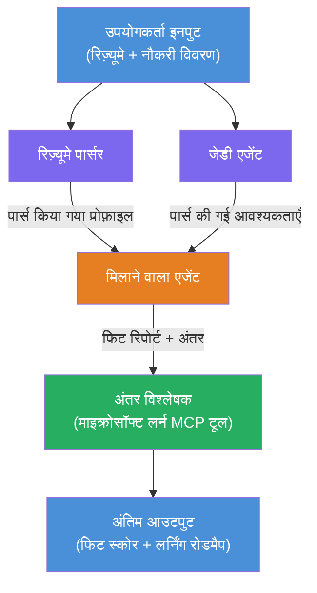

# लैब 02 - मल्टी-एजेंट वर्कफ़्लो: रिज्यूमे → जॉब फिट इवैल्युएटर

---

## आप क्या बनाएंगे

एक **रिज्यूमे → जॉब फिट इवैल्युएटर** - एक मल्टी-एजेंट वर्कफ़्लो जहाँ चार विशेषज्ञ एजेंट सहयोग करते हैं यह आकलन करने के लिए कि एक उम्मीदवार का रिज्यूमे नौकरी के विवरण से कितना मेल खाता है, फिर व्यक्तिगत लर्निंग रोडमैप बनाते हैं ताकि कमियों को पूरा किया जा सके।

### एजेंट्स

| एजेंट | भूमिका |
|-------|---------|
| **रिज्यूमे पार्सर** | रिज्यूमे टेक्स्ट से संरचित कौशल, अनुभव, प्रमाणपत्र निकालता है |
| **जॉब डिस्क्रिप्शन एजेंट** | एक नौकरी विवरण से आवश्यक/अभिरुचि वाले कौशल, अनुभव, प्रमाणपत्र निकालता है |
| **मैचिंग एजेंट** | प्रोफ़ाइल बनाम आवश्यकताओं की तुलना करता है → फिट स्कोर (0-100) + मेल खाते/मिसिंग कौशल |
| **गैप एनालाइजर** | संसाधन, टाइमलाइन और त्वरित परियोजनाओं के साथ एक व्यक्तिगत लर्निंग रोडमैप बनाता है |

### डेमो फ्लो

एक **रिज्यूमे + नौकरी विवरण** अपलोड करें → प्राप्त करें **फिट स्कोर + मिसिंग कौशल** → प्राप्त करें **व्यक्तिगत लर्निंग रोडमैप**।

### वर्कफ़्लो आर्किटेक्चर

> पर्पल = समानांतर एजेंट्स | ऑरेंज = समेकन बिंदु | ग्रीन = उपकरणों के साथ अंतिम एजेंट। विस्तृत आरेख और डेटा फ्लो के लिए देखें [Module 1 - Understand the Architecture](docs/01-understand-multi-agent.md) और [Module 4 - Orchestration Patterns](docs/04-orchestration-patterns.md)।

### शामिल विषय

- **WorkflowBuilder** का उपयोग करके मल्टी-एजेंट वर्कफ़्लो बनाना
- एजेंट भूमिकाओं और आयोजन प्रवाह (समानांतर + अनुक्रमिक) को परिभाषित करना
- एजेंट्स के बीच संचार पैटर्न
- एजेंट इंस्पेक्टर के साथ स्थानीय परीक्षण
- Foundry Agent Service पर मल्टी-एजेंट वर्कफ़्लो डिप्लॉय करना

---

## पूर्वापेक्षाएँ

पहले लैब 01 पूरा करें:

- [Lab 01 - Single Agent](../lab01-single-agent/README.md)

---

## शुरू करें

पूर्ण सेटअप निर्देश, कोड वॉकथ्रू, और परीक्षण कमांड देखें:

- [Lab 2 Docs - Prerequisites](docs/00-prerequisites.md)
- [Lab 2 Docs - Full Learning Path](docs/README.md)
- [PersonalCareerCopilot run guide](PersonalCareerCopilot/README.md)

## आयोजन पैटर्न (एजेंटिक विकल्प)

लैब 2 में डिफ़ॉल्ट **पैरलल → एग्रीगेटर → प्लानर** फ्लो शामिल है, और डॉक्यूमेंट्स वैकल्पिक पैटर्न भी वर्णित करते हैं ताकि अधिक मजबूत एजेंटिक व्यवहार का प्रदर्शन हो सके:

- **फैन-आउट/फैन-इन वेटेड कंसेंसस के साथ**
- **अंतिम रोडमैप से पहले रिव्युअर/क्रिटिक पास**
- **कंडीशनल राउटर** (फिट स्कोर और मिसिंग स्किल्स के आधार पर पथ चयन)

देखें [docs/04-orchestration-patterns.md](docs/04-orchestration-patterns.md)।

---

**पिछला:** [Lab 01 - Single Agent](../lab01-single-agent/README.md) · **वापस जाएं:** [Workshop Home](../../README.md)

---

<!-- CO-OP TRANSLATOR DISCLAIMER START -->
**अस्वीकरण**:  
यह दस्तावेज़ [Co-op Translator](https://github.com/Azure/co-op-translator) नामक एआई अनुवाद सेवा का उपयोग करके अनुवादित किया गया है। यद्यपि हम सटीकता के लिए प्रयास करते हैं, कृपया यह ध्यान रखें कि स्वचालित अनुवादों में त्रुटियाँ या असत्यताएं हो सकती हैं। मूल दस्तावेज़ अपनी मूल भाषा में प्रामाणिक स्रोत माना जाना चाहिए। महत्वपूर्ण जानकारी के लिए पेशेवर मानव अनुवाद की सिफारिश की जाती है। इस अनुवाद के उपयोग से उत्पन्न किसी भी गलतफहमी या गलत व्याख्या के लिए हम उत्तरदायी नहीं हैं।
<!-- CO-OP TRANSLATOR DISCLAIMER END -->