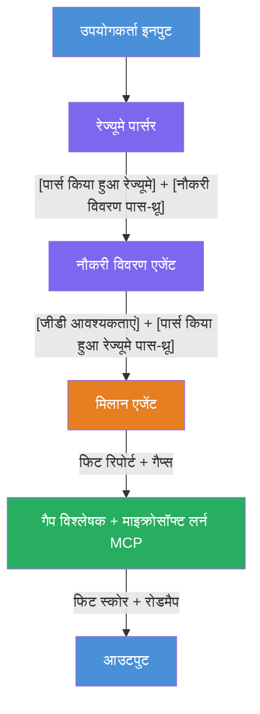

# लॅब 02 - मल्टी-एजेंट वर्कफ़्लो: रिज़्यूमे → नौकरी उपयुक्तता मूल्यांकनकर्ता

## अवलोकन

इस व्यावहारिक प्रयोगशाला में, आप VS कोड में Foundry Toolkit का उपयोग करके एक **वर्कफ़्लो-प्रथम मल्टी-एजेंट ऐप** बनाएंगे और इसे Microsoft Foundry Agent Service में तैनात करेंगे।

**आप क्या बनाएंगे:** एक रिज़्यूमे → नौकरी उपयुक्तता मूल्यांकनकर्ता जो रिज़्यूमे और नौकरी विवरण को पार्स करता है, मेल का स्कोर करता है, और Microsoft Learn संसाधनों का उपयोग करके एक व्यक्तिगत लर्निंग रोडमैप बनाता है।

---

## वास्तुकला

```mermaid
flowchart TD
    A["उपयोगकर्ता इनपुट"] --> B["रेज्यूमे पार्सर"]
    B -->|"[पार्स किया हुआ रेज्यूमे] + [नौकरी विवरण पास-थ्रू]"| C["नौकरी विवरण एजेंट"]
    C -->|"[जीडी आवश्यकताएं] + [पार्स किया हुआ रेज्यूमे पास-थ्रू]"| D["मिलान एजेंट"]
    D -->|फिट रिपोर्ट + गैप्स| E["गैप विश्लेषक + माइक्रोसॉफ्ट लर्न MCP"]
    E -->|फिट स्कोर + रोडमैप| F["आउटपुट"]

    style A fill:#4A90D9,color:#fff
    style B fill:#7B68EE,color:#fff
    style C fill:#7B68EE,color:#fff
    style D fill:#E67E22,color:#fff
    style E fill:#27AE60,color:#fff
    style F fill:#4A90D9,color:#fff
```

**यह कैसे काम करता है:**
1. उपयोगकर्ता एक रिज़्यूमे और नौकरी विवरण पेस्ट करता है।
2. **ResumeParser** रिज़्यूमे को पार्स करता है और नौकरी विवरण को बिल्कुल वैसे ही `[JOB DESCRIPTION PASS-THROUGH]` सेक्शन में कॉपी करता है।
3. **JD Agent** पास-थ्रू से संरचित आवश्यकताएँ निकालता है, फिर `[PARSED RESUME]` को आगे `[PARSED RESUME PASS-THROUGH]` के रूप में भेजता है।
4. **MatchingAgent** `[PARSED RESUME PASS-THROUGH]` की तुलना `[JD REQUIREMENTS]` से करता है और उपयुक्तता स्कोर बनाता है।
5. **GapAnalyzer** अंतराल को व्यावहारिक रोडमैप में बदलता है और MCP के माध्यम से वास्तविक Microsoft Learn लिंक प्राप्त करता है।

---

## आवश्यकताएँ

पहले लॅब 01 पूरा करें:

- [Lab 01 - Single Agent](../lab01-single-agent/README.md)

---

## भाग 1: मॉड्यूल को क्रम में पढ़ें

पूर्ण लर्निंग पाथ देखें:

- [Lab 2 Docs - Prerequisites](docs/00-prerequisites.md)
- [Lab 2 Docs - Full Learning Path](docs/README.md)
- [PersonalCareerCopilot run guide](PersonalCareerCopilot/README.md)

---

## भाग 2: वर्कफ़्लो बनाएं और परीक्षण करें

1. Foundry Toolkit विज़ार्ड का उपयोग करके वर्कफ़्लो-आधारित प्रोजेक्ट स्कैफोल्ड करें।
2. `PersonalCareerCopilot/main.py` से प्रॉम्प्ट ब्लॉक्स और वर्कफ़्लो ग्राफ़ को कॉपी करके अपने कार्यक्षेत्र में चिपकाएं।
3. एजेंट इंस्पेक्टर के साथ स्थानीय रूप से चलाएं और सभी चार एजेंट्स के साथ-साथ MCP टूल सत्यापित करें।
4. स्थानीय परीक्षण सफल होने पर होस्टेड एजेंट को Foundry पर तैनात करें।

---

## संचालन पैटर्न

लॅब 02 में डिफ़ॉल्ट **फैन-आउट → फैन-इन → अनुक्रमिक** प्रवाह शामिल है, और डॉक्स वैकल्पिक संचालन पैटर्न का भी वर्णन करते हैं जो प्रयोग के लिए हैं।

- **भारित सहमति के साथ फैन-आउट/फैन-इन**
- **अंतिम रोडमैप से पहले समीक्षक/आलोचक पास**
- **फिट स्कोर और लापता कौशल के आधार पर सशर्त राउटर**

देखें [docs/04-orchestration-patterns.md](docs/04-orchestration-patterns.md)।

---

**पिछला:** [Lab 01 - Single Agent](../lab01-single-agent/README.md) · **वापस जाएं:** [Workshop Home](../../README.md)

---

<!-- CO-OP TRANSLATOR DISCLAIMER START -->
**अस्वीकरण**:
इस दस्तावेज़ का अनुवाद AI अनुवाद सेवा [Co-op Translator](https://github.com/Azure/co-op-translator) का उपयोग करके किया गया है। जबकि हम सटीकता के लिए प्रयास करते हैं, कृपया ध्यान दें कि स्वचालित अनुवादों में त्रुटियाँ या अशुद्धियाँ हो सकती हैं। मूल दस्तावेज़ अपनी मूल भाषा में ही प्रामाणिक स्रोत माना जाना चाहिए। महत्वपूर्ण जानकारी के लिए, पेशेवर मानव अनुवाद की सिफारिश की जाती है। इस अनुवाद के उपयोग से उत्पन्न किसी भी गलतफहमी या गलत व्याख्या के लिए हम उत्तरदायी नहीं हैं।
<!-- CO-OP TRANSLATOR DISCLAIMER END -->