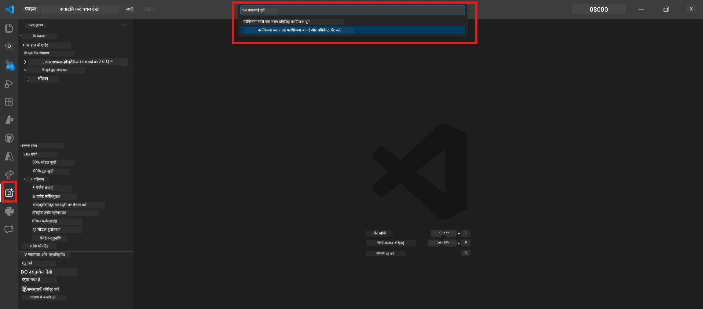

# Module 0 - पूर्वापेक्षाएँ

Lab 02 शुरू करने से पहले, पुष्टि करें कि आपने निम्नलिखित पूरा कर लिया है। यह लैब सीधे Lab 01 पर आधारित है - इसे न छोड़ें।

---

## 1. Lab 01 पूरा करें

Lab 02 यह मानता है कि आपने पहले ही:

- [x] [Lab 01 - Single Agent](../../lab01-single-agent/README.md) के सभी 8 मॉड्यूल पूरे किए हैं
- [x] सफलतापूर्वक एक एकल एजेंट को Foundry Agent Service पर तैनात किया है
- [x] पुष्टि की है कि एजेंट स्थानीय Agent Inspector और Foundry Playground दोनों में काम करता है

यदि आपने Lab 01 पूरा नहीं किया है, तो वापस जाएं और अभी इसे पूरा करें: [Lab 01 दस्तावेज](../../lab01-single-agent/docs/00-prerequisites.md)

---

## 2. मौजूदा सेटअप सत्यापित करें

Lab 01 के सभी उपकरण अभी भी इंस्टॉल और काम कर रहे होने चाहिए। ये त्वरित जांच चलाएं:

### 2.1 Azure CLI

```powershell
az account show --query "{name:name, id:id}" --output table
```

अपेक्षित: आपकी सदस्यता का नाम और ID दिखाता है। यदि यह विफल होता है, तो [`az login`](https://learn.microsoft.com/cli/azure/authenticate-azure-cli-interactively) चलाएं।

### 2.2 VS Code एक्सटेंशन

1. `Ctrl+Shift+P` दबाएँ → टाइप करें **"Microsoft Foundry"** → पुष्टि करें कि आप कमांड देखते हैं (जैसे, `Microsoft Foundry: Create a New Hosted Agent`)।
2. `Ctrl+Shift+P` दबाएँ → टाइप करें **"Foundry Toolkit"** → पुष्टि करें कि आप कमांड देखते हैं (जैसे, `Foundry Toolkit: Open Agent Inspector`)।

### 2.3 Foundry परियोजना और मॉडल

1. VS Code Activity Bar में **Microsoft Foundry** आइकन पर क्लिक करें।
2. पुष्टि करें कि आपकी परियोजना सूचीबद्ध है (जैसे, `workshop-agents`)।
3. परियोजना को विस्तारित करें → सत्यापित करें कि एक तैनात मॉडल मौजूद है (जैसे, `gpt-4.1-mini`) जिसका स्टेटस **Succeeded** है।

> **यदि आपका मॉडल तैनाती समाप्त हो गई है:** कुछ मुफ्त-स्तर की तैनातियाँ स्वयं समाप्त हो जाती हैं। [Model Catalog](https://learn.microsoft.com/azure/foundry/foundry-models/concepts/models-sold-directly-by-azure) से पुनः तैनात करें (`Ctrl+Shift+P` → **Microsoft Foundry: Open Model Catalog**)।



### 2.4 RBAC भूमिकाएँ

पुष्टि करें कि आपके पास आपकी Foundry परियोजना पर **Azure AI User** है:

1. [Azure Portal](https://portal.azure.com) → आपकी Foundry **परियोजना** संसाधन → **Access control (IAM)** → **[Role assignments](https://learn.microsoft.com/azure/foundry/concepts/rbac-foundry)** टैब।
2. अपना नाम खोजें → पुष्टि करें कि **[Azure AI User](https://aka.ms/foundry-ext-project-role)** सूचीबद्ध है।

---

## 3. मल्टी-एजेंट अवधारणाओं को समझें (Lab 02 के लिए नया)

Lab 02 उन अवधारणाओं को प्रस्तुत करता है जिनका कवर Lab 01 में नहीं हुआ था। आगे बढ़ने से पहले इन्हें पढ़ें:

### 3.1 मल्टी-एजेंट वर्कफ़्लो क्या है?

एक एजेंट के सब कुछ संभालने की बजाय, एक **मल्टी-एजेंट वर्कफ़्लो** कार्य को कई विशेषीकृत एजेंट्स में विभाजित करता है। प्रत्येक एजेंट के पास होता है:

- उसका अपना **निर्देशन** (सिस्टम प्रॉम्प्ट)
- उसकी अपनी **भूमिका** (जिसके लिए वह जिम्मेदार है)
- वैकल्पिक **उपकरण** (फंक्शन जिन्हें वह कॉल कर सकता है)

एजेंट एक **ऑर्केस्ट्रेशन ग्राफ़** के माध्यम से संचार करते हैं जो परिभाषित करता है कि डेटा उनके बीच कैसे चलता है।

### 3.2 WorkflowBuilder

`agent_framework` का [`WorkflowBuilder`](https://learn.microsoft.com/agent-framework/workflows/agents-in-workflows) क्लास SDK घटक है जो एजेंट्स को जोड़ता है:

```python
from agent_framework import WorkflowBuilder

workflow = (
    WorkflowBuilder(
        name="MyWorkflow",
        start_executor=agent_a,
        output_executors=[agent_d],
    )
    .add_edge(agent_a, agent_b)
    .add_edge(agent_a, agent_c)
    .add_edge(agent_b, agent_d)
    .add_edge(agent_c, agent_d)
    .build()
)
```

- **`start_executor`** - पहला एजेंट जो उपयोगकर्ता इनपुट प्राप्त करता है
- **`output_executors`** - वह एजेंट (या एजेंट्स) जिनका आउटपुट अंतिम प्रतिक्रिया बनता है
- **`add_edge(source, target)`** - यह परिभाषित करता है कि `target` को `source` का आउटपुट मिलता है

### 3.3 MCP (मॉडल कॉन्टेक्सट प्रोटोकॉल) उपकरण

Lab 02 एक **MCP उपकरण** का उपयोग करता है जो Microsoft Learn API को कॉल करके सीखने के संसाधन प्राप्त करता है। [MCP (Model Context Protocol)](https://modelcontextprotocol.io/introduction) एक मानकीकृत प्रोटोकॉल है जो AI मॉडल्स को बाहरी डेटा स्रोतों और टूल्स से जोड़ता है।

| शब्द | परिभाषा |
|------|---------|
| **MCP सर्वर** | एक सेवा जो [MCP प्रोटोकॉल](https://learn.microsoft.com/azure/foundry/agents/how-to/tools/model-context-protocol) के माध्यम से टूल्स/संसाधन प्रदान करती है |
| **MCP क्लाइंट** | आपका एजेंट कोड जो MCP सर्वर से जुड़ता है और इसके टूल्स को कॉल करता है |
| **[Streamable HTTP](https://learn.microsoft.com/agent-framework/agents/tools/hosted-mcp-tools)** | MCP सर्वर के साथ संचार करने का परिवहन तरीका |

### 3.4 Lab 02 और Lab 01 में क्या फर्क है

| पहलू | Lab 01 (सिंगल एजेंट) | Lab 02 (मल्टी-एजेंट) |
|--------|----------------------|---------------------|
| एजेंट | 1 | 4 (विशेषीकृत भूमिकाएँ) |
| ऑर्केस्ट्रेशन | कोई नहीं | WorkflowBuilder (समानांतर + क्रमिक) |
| टूल्स | वैकल्पिक `@tool` फंक्शन | MCP टूल (बाहरी API कॉल) |
| जटिलता | सरल प्रॉम्प्ट → प्रतिक्रिया | रिज़्यूमे + JD → फिट स्कोर → रोडमैप |
| संदर्भ प्रवाह | सीधे | एजेंट-से-एजेंट हस्तांतरण |

---

## 4. Lab 02 के लिए वर्कशॉप रिपॉजिटरी संरचना

पक्का करें कि आप जानते हैं कि Lab 02 की फाइलें कहाँ हैं:

```
workshop/
└── lab02-multi-agent/
    ├── README.md                       ← Lab overview
    ├── docs/                           ← You are here
    │   ├── README.md                   ← Learning path index
    │   ├── 00-prerequisites.md         ← This file
    │   ├── 01-understand-multi-agent.md
    │   ├── ...
    │   └── 08-troubleshooting.md
    └── PersonalCareerCopilot/          ← The agent project
        ├── agent.yaml                  ← Agent definition
        ├── main.py                     ← 4-agent workflow code
        ├── Dockerfile                  ← Container configuration
        └── requirements.txt            ← Python dependencies
```

---

### चेकपॉइंट

- [ ] Lab 01 पूरी तरह से पूरा हो (सभी 8 मॉड्यूल, एजेंट तैनात और सत्यापित)
- [ ] `az account show` आपकी सदस्यता लौटाता है
- [ ] Microsoft Foundry और Foundry Toolkit एक्सटेंशन इंस्टॉल और रिस्पॉन्ड कर रहे हैं
- [ ] Foundry परियोजना में तैनात मॉडल है (जैसे, `gpt-4.1-mini`)
- [ ] आपके पास परियोजना पर **Azure AI User** भूमिका है
- [ ] आपने ऊपर मल्टी-एजेंट अवधारणाओं वाले सेक्शन को पढ़ा है और WorkflowBuilder, MCP, और एजेंट ऑर्केस्ट्रेशन को समझते हैं

---

**अगला:** [01 - मल्टी-एजेंट आर्किटेक्चर को समझें →](01-understand-multi-agent.md)

---

<!-- CO-OP TRANSLATOR DISCLAIMER START -->
**अस्वीकरण**:  
इस दस्तावेज़ का अनुवाद AI अनुवाद सेवा [Co-op Translator](https://github.com/Azure/co-op-translator) का उपयोग करके किया गया है। जबकि हम सटीकता के लिए प्रयासरत हैं, कृपया ध्यान दें कि स्वचालित अनुवाद में त्रुटियाँ या असंगतियाँ हो सकती हैं। मूल दस्तावेज़ अपनी मूल भाषा में प्रामाणिक स्रोत माना जाना चाहिए। महत्वपूर्ण जानकारी के लिए पेशेवर मानव अनुवाद की सिफारिश की जाती है। हम इस अनुवाद के उपयोग से उत्पन्न किसी भी गलतफहमी या व्याख्या के लिए जिम्मेदार नहीं हैं।
<!-- CO-OP TRANSLATOR DISCLAIMER END -->