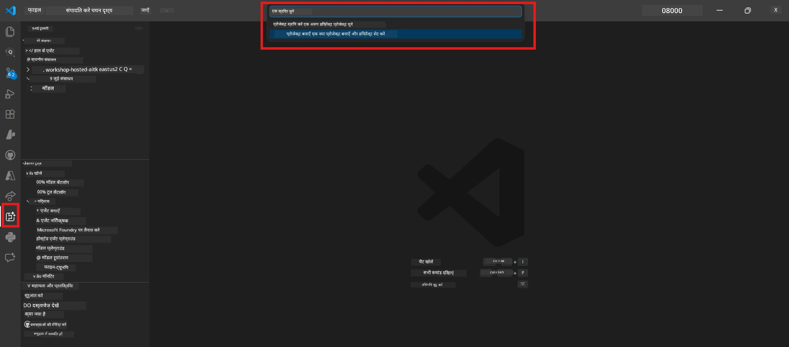

# मॉड्यूल 0 - परिचय

⏱️ ~10 मिनट

> [!WARNING]
> **पूर्वावलोकन और सीमाएँ:** [Hosted Agents](https://learn.microsoft.com/azure/foundry/agents/concepts/hosted-agents) वर्तमान में **सार्वजनिक पूर्वावलोकन** में हैं - उत्पादन कार्यभार के लिए अनुशंसित नहीं। इस कार्यशाला में दिखाए गए कुछ फीचर सेवा के GA की ओर बढ़ने के साथ बदल सकते हैं।

## आप क्या बनाएंगे

इस लैब में, आप Lab 01 से एकल एजेंट कौशल को बढ़ाकर एक **मल्टी-एजेंट वर्कफ़्लो** बनेगें - Resume → Job Fit Evaluator.

आप एक **resume** और एक **job description** चिपकाते हैं। चार विशिष्ट एजेंट इनपुट को क्रमशः संसाधित करते हैं, फिर लौटाते हैं:
- एक फिट स्कोर (0–100 के साथ स्कोरिंग विभाजन)
- एक कौशल और प्रमाणपत्र गैप सूची
- प्रत्येक गैप के लिए वास्तविक Microsoft Learn लिंक के साथ एक वैयक्तिकृत सीखने का रोडमैप

**वर्कफ़्लो उपयोग करता है:**
- **Microsoft Agent Framework** - `WorkflowBuilder` क्रमिक पाइपलाइन ऑर्केस्ट्रेशन के लिए
- **Foundry Toolkit for VS Code** - स्कैफोल्ड, लोकल परीक्षण, तैनाती
- **एक AI मॉडल** (जैसे, `gpt-4.1-mini`) - सभी चार एजेंटों द्वारा उपयोग किया जाता है
- **Microsoft Learn MCP सर्वर** - प्रत्येक कौशल गैप के लिए वास्तविक सीखने के संसाधन लिंक प्रदान करता है

---

## अपनी राह चुनें

> ⚠️ **वही रास्ता जारी रखें जिसे आपने Lab 01 में उपयोग किया था।**

<details open>
<summary><strong>🅰️ पथ A - Azure क्लाउड (Azure सदस्यता आवश्यक)</strong></summary>

| | विवरण |
|---|---|
| **यह किसके लिए है?** | आपने Lab 01 को Azure सदस्यता का उपयोग करके पूरा किया |
| **मॉडल** | Foundry के माध्यम से Azure OpenAI (जैसे, `gpt-4.1-mini`) |
| **आवरण किए गए मॉड्यूल** | सभी मॉड्यूल (00–09) |
| **क्लाउड पर तैनात करें?** | ✅ हाँ - पूर्ण एंड-टू-एंड तैनाती |

</details>

<details open>
<summary><strong>🅱️ पथ B - Foundry लोकल (कोई Azure सदस्यता आवश्यक नहीं)</strong></summary>

| | विवरण |
|---|---|
| **यह किसके लिए है?** | आपने Lab 01 को Foundry Local का उपयोग करके पूरा किया |
| **मॉडल** | Foundry Local (मुफ़्त, आपकी मशीन पर चलता है) |
| **आवरण किए गए मॉड्यूल** | मॉड्यूल 00–05 (06–07 छोड़ें - तैनाती और क्लाउड सत्यापन) |
| **क्लाउड पर तैनात करें?** | ❌ नहीं - केवल Agent Inspector के माध्यम से स्थानीय परीक्षण |

</details>

---

## Lab 01 जांच

Lab 02 सीधे Lab 01 पर आधारित है। यहां शुरू करने से पहले Lab 01 पूरा करें।

Lab 01 अभी तक नहीं किया? यहां से शुरू करें: [Lab 01 - परिचय](../../lab01-single-agent/docs/00-prerequisites.md)

<details open>
<summary><strong>🅰️ पथ A - Azure क्लाउड</strong></summary>

```powershell
az account show --query "{name:name, id:id}" --output table
```

यदि यह विफल होता है, तो `az login` चलाएं। फिर VS Code में सत्यापित करें:

1. `Ctrl+Shift+P` → टाइप करें **Foundry Toolkit** → पुष्टि करें कि कमांड दिखाई दें।
2. **Foundry Toolkit** आइकन पर क्लिक करें → आपका प्रोजेक्ट और तैनात मॉडल **Succeeded** दिखाते हैं।



> **RBAC:** आपने Lab 01 में **Foundry User** असाइन किया था। यदि आपको इसे पुनः असाइन करना है, तो देखें [Lab 01, मॉड्यूल 1](../../lab01-single-agent/docs/01-setup.md#deploy-a-model--assign-rbac)। भूमिका पहले **Azure AI User** नामित थी - समान अनुमतियाँ।

</details>

<details open>
<summary><strong>🅱️ पथ B - Foundry लोकल</strong></summary>

```powershell
Invoke-WebRequest -Uri "http://localhost:5273/v1/health" -UseBasicParsing | Select-Object StatusCode
```

अपेक्षित: `StatusCode: 200`। यदि ऐसा नहीं है, तो Foundry Toolkit साइडबार से Foundry Local को पुनः प्रारंभ करें।

> सभी अनुमान आपके मशीन पर चलते हैं। केवल आउटबाउंड कॉल MCP टूल द्वारा `https://learn.microsoft.com/api/mcp` को है।

</details>

---

## Lab 02 में नया क्या है

| | Lab 01 | Lab 02 |
|--|--------|--------|
| एजेंट | 1 | 4 (WorkflowBuilder के साथ चेन) |
| स्कैफोल्ड टेम्पलेट | मूल - Agent Framework | वर्कफ़्लोज़ - Agent Framework |
| नया पैकेज | - | `mcp` |
| ऑर्केस्ट्रेशन | एकल संवादात्मक एजेंट | क्रमिक पाइपलाइन (WorkflowBuilder) |
| नया टूल | - | `search_microsoft_learn_for_plan` (MCP) |

---

**अगला:** [01 - आर्किटेक्चर को समझना →](01-understand-multi-agent.md)

---

<!-- CO-OP TRANSLATOR DISCLAIMER START -->
**अस्वीकरण**:
इस दस्तावेज़ का अनुवाद AI अनुवाद सेवा [Co-op Translator](https://github.com/Azure/co-op-translator) का उपयोग करके किया गया है। जबकि हम सटीकता के लिए प्रयास करते हैं, कृपया ध्यान दें कि स्वचालित अनुवादों में त्रुटियाँ या अशुद्धियाँ हो सकती हैं। मूल दस्तावेज़ अपनी मूल भाषा में ही प्रामाणिक स्रोत माना जाना चाहिए। महत्वपूर्ण जानकारी के लिए, पेशेवर मानव अनुवाद की सिफारिश की जाती है। इस अनुवाद के उपयोग से उत्पन्न किसी भी गलतफहमी या गलत व्याख्या के लिए हम उत्तरदायी नहीं हैं।
<!-- CO-OP TRANSLATOR DISCLAIMER END -->