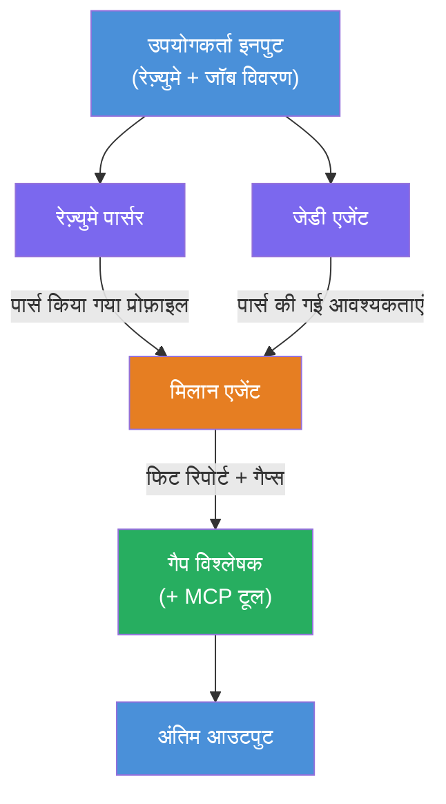
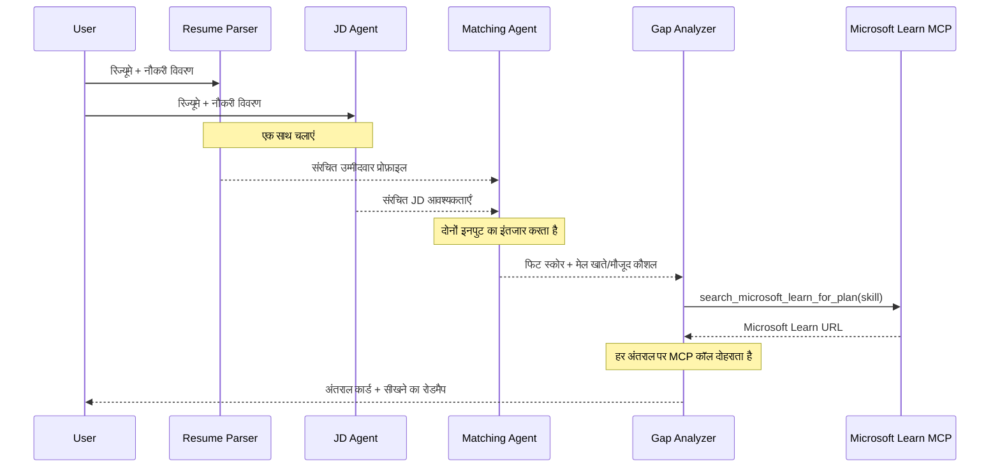
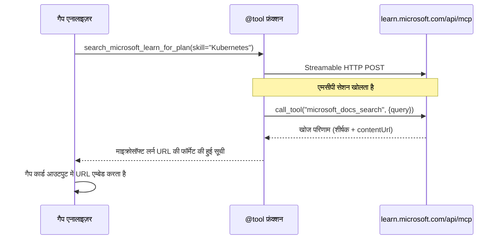

# Module 1 - मल्टी-एजेंट आर्किटेक्चर को समझना

इस मॉड्यूल में, आप Resume → Job Fit Evaluator की आर्किटेक्चर को कोड लिखने से पहले सीखते हैं। ऑर्केस्ट्रेशन ग्राफ, एजेंट भूमिकाओं, और डेटा फ्लो को समझना [मल्टी-एजेंट वर्कफ़्लोज़](https://learn.microsoft.com/azure/architecture/ai-ml/idea/multiple-agent-workflow-automation) के डिबगिंग और विस्तार के लिए महत्वपूर्ण है।

---

## यह समस्या क्या हल करता है

एक रिज़्यूमे को नौकरी विवरण से मिलाना कई अलग-अलग क्षमताओं को शामिल करता है:

1. **पार्सिंग** - असंरचित टेक्स्ट (रिज़्यूमे) से संरचित डेटा निकालना
2. **विश्लेषण** - नौकरी विवरण से आवश्यकताएँ निकालना
3. **तुलना** - दोनों के बीच मेल का स्कोरिंग करना
4. **योजना बनाना** - अंतर को पूरा करने के लिए सीखने का रोडमैप बनाना

एक ही एजेंट जो इन चारों कार्यों को एक प्रॉम्प्ट में करता है, अक्सर यह बनाता है:
- अधूरा निष्कर्षण (स्कोर के लिए पार्सिंग जल्दी से पूरा करता है)
- सतही स्कोरिंग (कोई साक्ष्य आधारित विभाजन नहीं)
- सामान्य रोडमैप (विशिष्ट अंतर के लिए अनुकूलित नहीं)

**चार विशेषज्ञ एजेंटों** में विभाजित करके, प्रत्येक अपने कार्य पर समर्पित निर्देशों के साथ ध्यान केंद्रित करता है, प्रत्येक चरण में उच्च गुणवत्ता वाला आउटपुट प्रदान करता है।

---

## चार एजेंट

प्रत्येक एजेंट एक पूर्ण [Microsoft Foundry](https://learn.microsoft.com/azure/foundry/agents/concepts/hosted-agents) एजेंट है जो `AzureAIAgentClient.as_agent()` के माध्यम से बनाया गया है। ये सभी एक ही मॉडल डिप्लॉयमेंट साझा करते हैं लेकिन उनके निर्देश और (वैकल्पिक रूप से) उपकरण अलग हैं।

| # | एजेंट का नाम | भूमिका | इनपुट | आउटपुट |
|---|-----------|------|-------|--------|
| 1 | **ResumeParser** | रिज़्यूमे टेक्स्ट से संरचित प्रोफ़ाइल निकालता है | कच्चा रिज़्यूमे टेक्स्ट (यूजर से) | उम्मीदवार प्रोफ़ाइल, तकनीकी कौशल, सॉफ्ट स्किल्स, प्रमाणपत्र, डोमेन अनुभव, उपलब्धियां |
| 2 | **JobDescriptionAgent** | नौकरी विवरण से संरचित आवश्यकताएँ निकालता है | कच्चा JD टेक्स्ट (यूजर से, ResumeParser के माध्यम से अग्रेषित) | भूमिका का अवलोकन, आवश्यक कौशल, पसंदीदा कौशल, अनुभव, प्रमाणपत्र, शिक्षा, जिम्मेदारियाँ |
| 3 | **MatchingAgent** | साक्ष्य-आधारित फिट स्कोर गणना करता है | ResumeParser + JobDescriptionAgent के आउटपुट | फिट स्कोर (0-100 के साथ ब्रेकडाउन), मेल खाते कौशल, गायब कौशल, अंतर |
| 4 | **GapAnalyzer** | व्यक्तिगत सीखने का रोडमैप बनाता है | MatchingAgent से आउटपुट | अंतर कार्ड (प्रत्येक कौशल के लिए), सीखने का क्रम, समयरेखा, Microsoft Learn से संसाधन |

---

## ऑर्केस्ट्रेशन ग्राफ

वर्कफ़्लो **समानांतर फैन्-आउट** का उपयोग करता है उसके बाद **क्रमिक एकत्रीकरण** होता है:


> **लीजेंड:** बैंगनी = समानांतर एजेंट, नारंगी = एकत्रीकरण बिंदु, हरा = उपकरणों के साथ अंतिम एजेंट

### डेटा कैसे प्रवाहित होता है


1. **यूजर भेजता है** एक संदेश जिसमें रिज़्यूमे और नौकरी विवरण शामिल है।
2. **ResumeParser** पूरा यूजर इनपुट प्राप्त करता है और एक संरचित उम्मीदवार प्रोफ़ाइल निकालता है।
3. **JobDescriptionAgent** समानांतर में यूजर इनपुट प्राप्त करता है और संरचित आवश्यकताएँ निकालता है।
4. **MatchingAgent** ResumeParser और JobDescriptionAgent दोनों के आउटपुट प्राप्त करता है (फ्रेमवर्क दोनों के पूर्ण होने का इंतजार करता है इसके बाद MatchingAgent चलाता है)।
5. **GapAnalyzer** MatchingAgent का आउटपुट प्राप्त करता है और प्रत्येक अंतर के लिए Microsoft Learn MCP टूल को कॉल करता है ताज़ा सीखने के संसाधन प्राप्त करने के लिए।
6. **अंतिम आउटपुट** GapAnalyzer की प्रतिक्रिया है, जिसमें फिट स्कोर, अंतर कार्ड, और पूरा सीखने का रोडमैप शामिल है।

### क्यों समानांतर फैन्-आउट महत्वपूर्ण है

ResumeParser और JobDescriptionAgent **समानांतर** चलते हैं क्योंकि ये एक-दूसरे पर निर्भर नहीं हैं। इससे:
- कुल लेटेंसी कम होती है (दोनों एक साथ चलते हैं न कि क्रमिक रूप से)
- यह स्वाभाविक विभाजन है (रिज़्यूमे पार्सिंग vs. JD पार्सिंग स्वतंत्र कार्य हैं)
- यह एक सामान्य मल्टी-एजेंट पैटर्न को दर्शाता है: **फैन्-आउट → एकत्रीकरण → क्रियान्वयन**

---

## कोड में WorkflowBuilder

यहाँ ऊपर के ग्राफ को `main.py` में [`WorkflowBuilder`](https://learn.microsoft.com/agent-framework/workflows/agents-in-workflows) API कॉल से कैसे मैप किया गया है:

```python
from agent_framework import WorkflowBuilder

workflow = (
    WorkflowBuilder(
        name="ResumeJobFitEvaluator",
        start_executor=resume_parser,       # उपयोगकर्ता इनपुट प्राप्त करने वाला पहला एजेंट
        output_executors=[gap_analyzer],     # अंतिम एजेंट जिसका आउटपुट वापस किया जाता है
    )
    .add_edge(resume_parser, jd_agent)      # रिज्यूमपार्सर → जॉबडिस्क्रिप्शनएजेंट
    .add_edge(resume_parser, matching_agent) # रिज्यूमपार्सर → मैचिंगएजेंट
    .add_edge(jd_agent, matching_agent)      # जॉबडिस्क्रिप्शनएजेंट → मैचिंगएजेंट
    .add_edge(matching_agent, gap_analyzer)  # मैचिंगएजेंट → गैपएनालाइजर
    .build()
)
```

**किनारों की समझ:**

| किनारा | इसका मतलब |
|------|--------------|
| `resume_parser → jd_agent` | JD Agent ResumeParser के आउटपुट को प्राप्त करता है |
| `resume_parser → matching_agent` | MatchingAgent ResumeParser के आउटपुट को प्राप्त करता है |
| `jd_agent → matching_agent` | MatchingAgent JD Agent के आउटपुट को भी प्राप्त करता है (यह दोनों के लिए इंतजार करता है) |
| `matching_agent → gap_analyzer` | GapAnalyzer MatchingAgent का आउटपुट प्राप्त करता है |

चूंकि `matching_agent` के पास **दो इनकमिंग किनारे** (`resume_parser` और `jd_agent`) हैं, फ्रेमवर्क दोनों के पूर्ण होने तक इंतजार करता है फिर Matching Agent चलाता है।

---

## MCP टूल

GapAnalyzer एजेंट के पास एक टूल है: `search_microsoft_learn_for_plan`। यह एक **[MCP टूल](https://learn.microsoft.com/agent-framework/agents/tools/hosted-mcp-tools)** है जो Microsoft Learn API को कॉल करता है ताकि क्यूरेटेड सीखने के संसाधनों को प्राप्त किया जा सके।

### यह कैसे काम करता है

```python
@tool
async def search_microsoft_learn_for_plan(
    skill: str, role: str = "", max_results: int = 5
) -> str:
    """Search Microsoft Learn MCP and return curated official links."""
    # Streamable HTTP के माध्यम से https://learn.microsoft.com/api/mcp से जुड़ता है
    # MCP सर्वर पर 'microsoft_docs_search' टूल को कॉल करता है
    # Microsoft Learn URL की स्वरूपित सूची लौटाता है
```

### MCP कॉल फ्लो


1. GapAnalyzer निर्णय लेता है कि किसी कौशल (जैसे "Kubernetes") के लिए सीखने के संसाधनों की आवश्यकता है
2. फ्रेमवर्क `search_microsoft_learn_for_plan(skill="Kubernetes")` को कॉल करता है
3. यह फ़ंक्शन एक [स्ट्रीम करने योग्य HTTP](https://learn.microsoft.com/agent-framework/agents/tools/hosted-mcp-tools) कनेक्शन खोलता है `https://learn.microsoft.com/api/mcp` से
4. यह [MCP सर्वर](https://learn.microsoft.com/azure/foundry/agents/how-to/tools/model-context-protocol) पर `microsoft_docs_search` टूल को कॉल करता है
5. MCP सर्वर खोज परिणाम (शीर्षक + URL) लौटाता है
6. फ़ंक्शन परिणाम स्वरूप प्रारूपित करता है और स्ट्रिंग के रूप में लौटाता है
7. GapAnalyzer लौटाए गए URL अपने अंतर कार्ड आउटपुट में उपयोग करता है

### अपेक्षित MCP लॉग

जब टूल चलता है, तो आप लॉग प्रविष्टियाँ देखेंगे जैसे:

```
GET https://learn.microsoft.com/api/mcp → 405 (Method Not Allowed)
POST https://learn.microsoft.com/api/mcp → 200
DELETE https://learn.microsoft.com/api/mcp → 405 (Method Not Allowed)
```

**ये सामान्य हैं।** MCP क्लाइंट आरंभ में GET और DELETE के साथ जांच करता है - 405 वापस आना अपेक्षित व्यवहार है। वास्तविक टूल कॉल POST का उपयोग करता है और 200 लौटाता है। केवल तभी चिंता करें जब POST कॉल विफल हों।

---

## एजेंट निर्माण पैटर्न

प्रत्येक एजेंट **[`AzureAIAgentClient.as_agent()`](https://learn.microsoft.com/python/api/overview/azure/ai-agents-readme) असिंक कॉन्टेक्स्ट मैनेजर** का उपयोग करके बनाया जाता है। यह Foundry SDK पैटर्न है जो एजेंट बनाता है जो स्वचालित रूप से साफ़ हो जाते हैं:

```python
async with (
    get_credential() as credential,
    AzureAIAgentClient(
        project_endpoint=PROJECT_ENDPOINT,
        model_deployment_name=MODEL_DEPLOYMENT_NAME,
        credential=credential,
    ).as_agent(
        name="ResumeParser",
        instructions=RESUME_PARSER_INSTRUCTIONS,
    ) as resume_parser,
    # ... प्रत्येक एजेंट के लिए दोहराएं ...
):
    # यहां सभी 4 एजेंट मौजूद हैं
    workflow = create_workflow(resume_parser, jd_agent, matching_agent, gap_analyzer)
```

**मुख्य बिंदु:**
- प्रत्येक एजेंट को अपना `AzureAIAgentClient` इंस्टेंस मिलता है (SDK एजेंट नाम को क्लाइंट के अंतर्गत स्कोप करने की आवश्यकता होती है)
- सभी एजेंट एक ही `credential`, `PROJECT_ENDPOINT`, और `MODEL_DEPLOYMENT_NAME` साझा करते हैं
- `async with` ब्लॉक सुनिश्चित करता है कि जब सर्वर बंद हो तो सभी एजेंट साफ़ हो जाएँ
- GapAnalyzer अतिरिक्त रूप से `tools=[search_microsoft_learn_for_plan]` प्राप्त करता है

---

## सर्वर स्टार्टअप

एजेंट बनाने और वर्कफ़्लो बनाने के बाद, सर्वर शुरू होता है:

```python
from azure.ai.agentserver.agentframework import from_agent_framework

agent = create_workflow(resume_parser, jd_agent, matching_agent, gap_analyzer)
await from_agent_framework(agent).run_async()
```

`from_agent_framework()` वर्कफ़्लो को एक HTTP सर्वर के रूप में लपेटता है जो पोर्ट 8088 पर `/responses` एंडपॉइंट को एक्सपोज़ करता है। यह Lab 01 के समान पैटर्न है, लेकिन "एजेंट" अब पूरा [वर्कफ़्लो ग्राफ](https://learn.microsoft.com/agent-framework/workflows/as-agents) है।

---

### चेकपॉइंट

- [ ] आप 4-एजेंट आर्किटेक्चर और प्रत्येक एजेंट की भूमिका समझते हैं
- [ ] आप डेटा फ्लो को ट्रेस कर सकते हैं: उपयोगकर्ता → ResumeParser → (समानांतर) JD Agent + MatchingAgent → GapAnalyzer → आउटपुट
- [ ] आप समझते हैं कि MatchingAgent क्यों दोनों ResumeParser और JD Agent का इंतजार करता है (दो इनकमिंग किनारे)
- [ ] आप MCP टूल को समझते हैं: यह क्या करता है, इसे कैसे कॉल किया जाता है, और GET 405 लॉग सामान्य हैं
- [ ] आप `AzureAIAgentClient.as_agent()` पैटर्न को समझते हैं और क्यों प्रत्येक एजेंट का अपना क्लाइंट इंस्टेंस होता है
- [ ] आप `WorkflowBuilder` कोड पढ़ सकते हैं और इसे दृश्य ग्राफ से जोड़ सकते हैं

---

**पिछला:** [00 - Prerequisites](00-prerequisites.md) · **अगला:** [02 - Scaffold the Multi-Agent Project →](02-scaffold-multi-agent.md)

---

<!-- CO-OP TRANSLATOR DISCLAIMER START -->
**अस्वीकरण**:  
यह दस्तावेज़ AI अनुवाद सेवा [Co-op Translator](https://github.com/Azure/co-op-translator) का उपयोग करके अनूदित किया गया है। जबकि हम सटीकता के लिए प्रयासरत हैं, कृपया ध्यान दें कि स्वचालित अनुवाद में त्रुटियाँ या असंगतियां हो सकती हैं। मूल दस्तावेज़ अपनी मूल भाषा में अधिकारिक स्रोत माना जाना चाहिए। संवेदनशील जानकारी के लिए, पेशेवर मानव अनुवाद की सिफारिश की जाती है। इस अनुवाद के उपयोग से उत्पन्न किसी भी गलतफहमी या गलत व्याख्या के लिए हम जिम्मेदार नहीं हैं।
<!-- CO-OP TRANSLATOR DISCLAIMER END -->