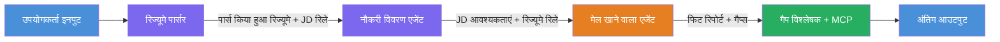

# मॉड्यूल 1 - आर्किटेक्चर को समझें

⏱️ ~5 मिनट

कोई कोड लिखने से पहले, यहाँ एक त्वरित अवलोकन है कि आप क्या बना रहे हैं और यह कैसे काम करता है।

---

## आप क्या बना रहे हैं

आप एक **रेज़्यूमे** और एक **नौकरी विवरण** चिपकाते हैं। वर्कफ़्लो निम्नलिखित लौटाता है:

- एक फिट स्कोर (0–100 के साथ विश्लेषण)
- कौशल और प्रमाणपत्र की कमी की सूची
- प्रत्येक कमी के लिए Microsoft Learn लिंक के साथ एक व्यक्तिगत लर्निंग रोडमैप

---

## चार एजेंट

एकल एजेंट जो एक साथ पार्स, स्कोर और योजना बनाने की कोशिश करता है, जल्दी करता है और सतही आउटपुट देता है। कार्य को चार विशेषज्ञ एजेंटों में विभाजित करने से बेहतर परिणाम मिलते हैं:

| एजेंट | यह क्या करता है |
|-------|-------------|
| **ResumeParser** | रिज़्यूमे को पार्स करता है; JD को अक्षरशः `[JOB DESCRIPTION PASS-THROUGH]` में कॉपी करता है ताकि बाद के एजेंट इसका उपयोग कर सकें |
| **JobDescriptionAgent** | पास-थ्रू से JD आवश्यकताओं को निकालता है; `[PARSED RESUME]` को `[PARSED RESUME PASS-THROUGH]` के रूप में आगे भेजता है |
| **MatchingAgent** | दोनों लेबल वाले सेक्शंस की तुलना करता है; 0–100 फिट स्कोर और कमी की सूची बनाता है |
| **GapAnalyzer** | एक लर्निंग रोडमैप बनाता है; प्रत्येक कमी के लिए Microsoft Learn खोजता है |

---

## ऑर्केस्ट्रेशन ग्राफ़

वर्कफ़्लो एक **क्रमिक पाइपलाइन** है - प्रत्येक एजेंट अपना आउटपुट अगले को देता है:


```mermaid
flowchart LR
    A["उपयोगकर्ता इनपुट"] --> B["रिज्यूमे पार्सर"]
    B -- "पार्स किया हुआ रिज्यूमे + JD रिले" --> C["नौकरी विवरण एजेंट"]
    C -- "JD आवश्यकताएं + रिज्यूमे रिले" --> D["मेल खाने वाला एजेंट"]
    D -- "फिट रिपोर्ट + गैप्स" --> E["गैप विश्लेषक + MCP"]
    E --> F["अंतिम आउटपुट"]

    style A fill:#4A90D9,color:#fff
    style B fill:#7B68EE,color:#fff
    style C fill:#7B68EE,color:#fff
    style D fill:#E67E22,color:#fff
    style E fill:#27AE60,color:#fff
    style F fill:#4A90D9,color:#fff
```

1. **ResumeParser** उपयोगकर्ता इनपुट प्राप्त करता है, रिज़्यूमे को पार्स करता है, और JD को `[JOB DESCRIPTION PASS-THROUGH]` में कॉपी करता है।
2. **JD एजेंट** संरचित आवश्यकताओं को निकालता है और `[PARSED RESUME PASS-THROUGH]` को आगे बढ़ाता है।
3. **MatchingAgent** दोनों सेक्शन की तुलना करता है और फिट स्कोर एवं कमी सूची बनाता है।
4. **GapAnalyzer** रोडमैप बनाता है और प्रत्येक कमी के लिए Microsoft Learn MCP टूल को कॉल करता है।

---

## यह कोड से कैसे मेल खाता है

`main.py` में, आप इस ग्राफ़ का वर्णन `WorkflowBuilder` के साथ करते हैं:

```python
workflow_agent = (
    WorkflowBuilder(
        start_executor=resume_executor,       # उपयोगकर्ता इनपुट प्राप्त करने वाला पहला एजेंट
        output_executors=[gap_executor],      # अंतिम एजेंट - इसका आउटपुट प्रतिक्रिया है
    )
    .add_edge(resume_executor, jd_executor)       # ResumeParser → JD एजेंट
    .add_edge(jd_executor, matching_executor)     # JD एजेंट → MatchingAgent
    .add_edge(matching_executor, gap_executor)    # MatchingAgent → GapAnalyzer
    .build()
    .as_agent()
)
```

प्रत्येक `Agent` को `AgentExecutor` में लपेटा जाता है। `add_edge()` कॉल एक कड़ाई से क्रमिक पाइपलाइन को परिभाषित करते हैं - प्रत्येक एजेंट केवल अपने सीधे पूर्ववर्ती का आउटपुट प्राप्त करता है।

> `context_mode="last_agent"` का मतलब है कि प्रत्येक एक्ज़िक्यूटर केवल अपने सीधे पूर्ववर्ती का आउटपुट देखता है। ResumeParser और JD एजेंट लेबल वाले सेक्शंस में डेटा आगे भेजते हैं ताकि प्रत्येक डाउनस्ट्रीम एजेंट को बिल्कुल वही मिले जिसकी उसे ज़रूरत है।

---

## MCP टूल

GapAnalyzer के पास एक टूल है: `search_microsoft_learn_for_plan`। यह `https://learn.microsoft.com/api/mcp` से जुड़ता है और प्रत्येक कौशल कमी के लिए वास्तविक Microsoft Learn लिंक लौटाता है।

जब टूल चलता है तो आप ये लॉग देखेंगे - ये सभी अपेक्षित हैं:

```
GET  https://learn.microsoft.com/api/mcp → 405   ← connection probe, normal
POST https://learn.microsoft.com/api/mcp → 200   ← actual tool call
DELETE https://learn.microsoft.com/api/mcp → 405 ← cleanup probe, normal
```

केवल तब चिंता करें जब `POST` एक त्रुटि लौटाता है।

---

**पिछला:** [00 - आवश्यकताएँ](00-prerequisites.md) · **अगला:** [02 - प्रोजेक्ट का स्कैफोल्ड →](02-scaffold-multi-agent.md)

---

<!-- CO-OP TRANSLATOR DISCLAIMER START -->
**अस्वीकरण**:
इस दस्तावेज़ का अनुवाद AI अनुवाद सेवा [Co-op Translator](https://github.com/Azure/co-op-translator) का उपयोग करके किया गया है। जबकि हम सटीकता के लिए प्रयास करते हैं, कृपया ध्यान दें कि स्वचालित अनुवादों में त्रुटियाँ या अशुद्धियाँ हो सकती हैं। मूल दस्तावेज़ अपनी मूल भाषा में ही प्रामाणिक स्रोत माना जाना चाहिए। महत्वपूर्ण जानकारी के लिए, पेशेवर मानव अनुवाद की सिफारिश की जाती है। इस अनुवाद के उपयोग से उत्पन्न किसी भी गलतफहमी या गलत व्याख्या के लिए हम उत्तरदायी नहीं हैं।
<!-- CO-OP TRANSLATOR DISCLAIMER END -->