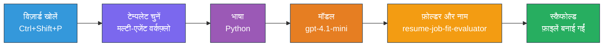
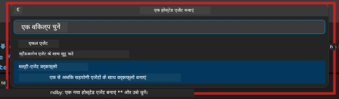

# Module 2 - मल्टी-एजेंट प्रोजेक्ट का स्कैफोल्ड बनाना

इस मॉड्यूल में, आप [Microsoft Foundry एक्सटेंशन](https://marketplace.visualstudio.com/items?itemName=TeamsDevApp.vscode-ai-foundry) का उपयोग करके **मल्टी-एजेंट वर्कफ़्लो प्रोजेक्ट स्कैफोल्ड करते हैं**। एक्सटेंशन पूरी प्रोजेक्ट संरचना जेनरेट करता है - `agent.yaml`, `main.py`, `Dockerfile`, `requirements.txt`, `.env`, और डिबग कॉन्फ़िगरेशन। फिर आप मॉड्यूल 3 और 4 में इन फाइलों को कस्टमाइज़ करते हैं।

> **नोट:** इस लैब में `PersonalCareerCopilot/` फ़ोल्डर एक पूर्ण, काम करने वाला कस्टमाइज़्ड मल्टी-एजेंट प्रोजेक्ट का उदाहरण है। आप या तो एक नया प्रोजेक्ट स्कैफोल्ड कर सकते हैं (सीखने के लिए अनुशंसित) या मौजूदा कोड को सीधे अध्ययन कर सकते हैं।

---

## चरण 1: क्रिएट होस्टेड एजेंट विज़ार्ड खोलें


1. `Ctrl+Shift+P` दबाएं ताकि **कमांड पैलेट** खुल जाए।
2. टाइप करें: **Microsoft Foundry: Create a New Hosted Agent** और इसे चुनें।
3. होस्टेड एजेंट निर्माण विज़ार्ड खुल जाएगा।

> **वैकल्पिक:** एक्टिविटी बार में **Microsoft Foundry** आइकन पर क्लिक करें → **Agents** के बगल में **+** आइकन पर क्लिक करें → **Create New Hosted Agent** चुनें।

---

## चरण 2: मल्टी-एजेंट वर्कफ़्लो टेम्पलेट चुनें

विज़ार्ड आपको एक टेम्पलेट चुनने के लिए कहता है:

| टेम्पलेट | विवरण | उपयोग कब करें |
|----------|-------------|-------------|
| सिंगल एजेंट | एक एजेंट जिसमें निर्देश और वैकल्पिक टूल्स शामिल हैं | लैब 01 |
| **मल्टी-एजेंट वर्कफ़्लो** | कई एजेंट जो WorkflowBuilder के माध्यम से सहयोग करते हैं | **यह लैब (लैब 02)** |

1. **मल्टी-एजेंट वर्कफ़्लो** चुनें।
2. **Next** पर क्लिक करें।



---

## चरण 3: प्रोग्रामिंग भाषा चुनें

1. **Python** चुनें।
2. **Next** पर क्लिक करें।

---

## चरण 4: अपना मॉडल चुनें

1. विज़ार्ड आपके Foundry प्रोजेक्ट में तैनात मॉडलों को दिखाता है।
2. वही मॉडल चुनें जो आपने लैब 01 में इस्तेमाल किया था (जैसे, **gpt-4.1-mini**)।
3. **Next** पर क्लिक करें।

> **टिप:** [`gpt-4.1-mini`](https://learn.microsoft.com/azure/foundry/foundry-models/concepts/models-sold-directly-by-azure#gpt-41-series) विकास के लिए अनुशंसित है - यह तेज, सस्ता, और मल्टी-एजेंट वर्कफ़्लो को अच्छी तरह संभालता है। यदि आप उच्च गुणवत्ता वाला आउटपुट चाहते हैं तो अंतिम प्रोडक्शन डिप्लॉयमेंट के लिए `gpt-4.1` पर स्विच करें।

---

## चरण 5: फ़ोल्डर स्थान और एजेंट नाम चुनें

1. एक फ़ाइल डायलॉग खुलता है। एक लक्ष्य फ़ोल्डर चुनें:
   - यदि आप वर्कशॉप रिपॉजिटरी के साथ आगे बढ़ रहे हैं: `workshop/lab02-multi-agent/` में जाएं और एक नया सबफ़ोल्डर बनाएं
   - यदि आप नया शुरू कर रहे हैं: कोई भी फ़ोल्डर चुनें
2. होस्टेड एजेंट के लिए एक **नाम** दर्ज करें (जैसे, `resume-job-fit-evaluator`)।
3. **Create** पर क्लिक करें।

---

## चरण 6: स्कैफोल्डिंग पूर्ण होने का इंतजार करें

1. VS Code एक नया विंडो खोलता है (या वर्तमान विंडो अपडेट होती है) जिसमें स्कैफोल्डेड प्रोजेक्ट होता है।
2. आपको इस फ़ाइल संरचना को देखना चाहिए:

```
resume-job-fit-evaluator/
├── .env                ← Environment variables (placeholders)
├── .vscode/
│   └── launch.json     ← Debug configuration
├── agent.yaml          ← Agent definition (kind: hosted)
├── Dockerfile          ← Container configuration
├── main.py             ← Multi-agent workflow code (scaffold)
└── requirements.txt    ← Python dependencies
```

> **वर्कशॉप नोट:** वर्कशॉप रिपॉजिटरी में `.vscode/` फ़ोल्डर **वर्कस्पेस रूट** पर होता है जिसमें साझा `launch.json` और `tasks.json` शामिल हैं। लैब 01 और लैब 02 के डिबग कॉन्फ़िगरेशन दोनों शामिल हैं। जब आप F5 दबाते हैं, तो ड्रॉपडाउन से **"Lab02 - Multi-Agent"** चुनें।

---

## चरण 7: स्कैफोल्डेड फाइलें समझें (मल्टी-एजेंट विशिष्टताएं)

मल्टी-एजेंट स्कैफोल्ड सिंगल-एजेंट स्कैफोल्ड से कई महत्वपूर्ण मामलों में भिन्न होता है:

### 7.1 `agent.yaml` - एजेंट परिभाषा

```yaml
kind: hosted
name: resume-job-fit-evaluator
description: >
  A multi-agent workflow that evaluates resume-to-job fit.
metadata:
  authors:
    - Microsoft
  tags:
    - Multi-Agent Workflow
    - Resume Evaluator
protocols:
  - protocol: responses
    version: v1
environment_variables:
  - name: PROJECT_ENDPOINT
    value: ${PROJECT_ENDPOINT}
  - name: MODEL_DEPLOYMENT_NAME
    value: ${MODEL_DEPLOYMENT_NAME}
```

**लैब 01 से मुख्य अंतर:** `environment_variables` सेक्शन में MCP एंडपॉइंट या अन्य टूल कॉन्फ़िगरेशन के लिए अतिरिक्त वेरिएबल्स हो सकते हैं। `name` और `description` मल्टी-एजेंट उपयोग केस को दर्शाते हैं।

### 7.2 `main.py` - मल्टी-एजेंट वर्कफ़्लो कोड

स्कैफोल्ड में शामिल हैं:
- **कई एजेंट निर्देश स्ट्रिंग्स** (प्रति एजेंट एक const)
- **कई [`AzureAIAgentClient.as_agent()`](https://learn.microsoft.com/python/api/overview/azure/ai-agents-readme) कॉन्टेक्स्ट मैनेजर** (प्रति एजेंट एक)
- एजेंटों को जोड़ने के लिए **[`WorkflowBuilder`](https://learn.microsoft.com/agent-framework/workflows/agents-in-workflows)**
- HTTP एंडपॉइंट के रूप में वर्कफ़्लो को सर्व करने के लिए **`from_agent_framework()`**

```python
from agent_framework import WorkflowBuilder, tool
from agent_framework.azure import AzureAIAgentClient
from azure.ai.agentserver.agentframework import from_agent_framework
```

अतिरिक्त इम्पोर्ट [`WorkflowBuilder`](https://learn.microsoft.com/agent-framework/workflows/agents-in-workflows) लैब 01 के मुकाबले नया है।

### 7.3 `requirements.txt` - अतिरिक्त निर्भरताएँ

मल्टी-एजेंट प्रोजेक्ट लैब 01 के समान बेस पैकेज का उपयोग करता है, इसके साथ ही MCP से संबंधित पैकेज भी शामिल हैं:

```
agent-framework-azure-ai==1.0.0rc3
agent-framework-core==1.0.0rc3
azure-ai-agentserver-agentframework==1.0.0b16
azure-ai-agentserver-core==1.0.0b16
debugpy
agent-dev-cli --pre
```

> **महत्वपूर्ण संस्करण नोट:** `agent-dev-cli` पैकेज को `requirements.txt` में नवीनतम पूर्वावलोकन संस्करण स्थापित करने के लिए `--pre` फ्लैग की आवश्यकता होती है। यह Agent Inspector की `agent-framework-core==1.0.0rc3` के साथ संगतता के लिए आवश्यक है। संस्करण विवरण के लिए [Module 8 - Troubleshooting](08-troubleshooting.md) देखें।

| पैकेज | संस्करण | उद्देश्य |
|---------|---------|---------|
| [`agent-framework-azure-ai`](https://learn.microsoft.com/agent-framework/overview/) | `1.0.0rc3` | [Microsoft Agent Framework](https://github.com/microsoft/agent-framework) के लिए Azure AI इंटीग्रेशन |
| [`agent-framework-core`](https://learn.microsoft.com/agent-framework/overview/) | `1.0.0rc3` | कोर रनटाइम (जिसमें WorkflowBuilder शामिल है) |
| `azure-ai-agentserver-agentframework` | `1.0.0b16` | होस्टेड एजेंट सर्वर रनटाइम |
| `azure-ai-agentserver-core` | `1.0.0b16` | कोर एजेंट सर्वर अमूर्तताएं |
| `debugpy` | नवीनतम | पायथन डिबगिंग (VS Code में F5) |
| `agent-dev-cli` | `--pre` | लोकल डेवलप CLI + एजेंट इंस्पेक्टर बैकेंड |

### 7.4 `Dockerfile` - लैब 01 जैसा ही

Dockerfile लैब 01 के समान है - यह फाइलें कॉपी करता है, `requirements.txt` से निर्भरताएँ इंस्टॉल करता है, पोर्ट 8088 एक्सपोज़ करता है, और `python main.py` चलाता है।

```dockerfile
FROM python:3.14-slim
WORKDIR /app
COPY ./ .
RUN pip install --upgrade pip && \
    if [ -f requirements.txt ]; then \
        pip install -r requirements.txt; \
    else \
      echo "No requirements.txt found" >&2; exit 1; \
    fi
EXPOSE 8088
CMD ["python", "main.py"]
```

---

### चेकपॉइंट

- [ ] स्कैफोल्ड विज़ार्ड पूरा हुआ → नई प्रोजेक्ट संरचना दिखाई दे रही है
- [ ] सभी फाइलें दिखाई दे रही हैं: `agent.yaml`, `main.py`, `Dockerfile`, `requirements.txt`, `.env`
- [ ] `main.py` में `WorkflowBuilder` इम्पोर्ट शामिल है (पुष्टि करता है कि मल्टी-एजेंट टेम्पलेट चुना गया था)
- [ ] `requirements.txt` में दोनों `agent-framework-core` और `agent-framework-azure-ai` शामिल हैं
- [ ] आप समझते हैं कि मल्टी-एजेंट स्कैफोल्ड सिंगल-एजेंट स्कैफोल्ड से कैसे भिन्न है (कई एजेंट, WorkflowBuilder, MCP टूल्स)

---

**पिछला:** [01 - मल्टी-एजेंट आर्किटेक्चर समझें](01-understand-multi-agent.md) · **अगला:** [03 - एजेंट और पर्यावरण कॉन्फ़िगर करें →](03-configure-agents.md)

---

<!-- CO-OP TRANSLATOR DISCLAIMER START -->
**अस्वीकरण**:  
इस दस्तावेज़ का अनुवाद AI अनुवाद सेवा [Co-op Translator](https://github.com/Azure/co-op-translator) का उपयोग करके किया गया है। जबकि हम सटीकता के लिए प्रयास करते हैं, कृपया ध्यान दें कि स्वचालित अनुवाद में त्रुटियाँ या अशुद्धियाँ हो सकती हैं। मूल दस्तावेज़ अपनी मूल भाषा में अधिकृत स्रोत माना जाना चाहिए। महत्वपूर्ण जानकारी के लिए, पेशेवर मानव अनुवाद की सिफारिश की जाती है। इस अनुवाद के उपयोग से उत्पन्न किसी भी गलतफहमी या गलत व्याख्या के लिए हम उत्तरदायी नहीं हैं।
<!-- CO-OP TRANSLATOR DISCLAIMER END -->