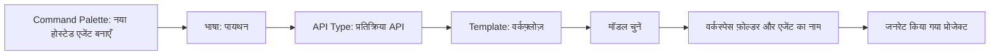
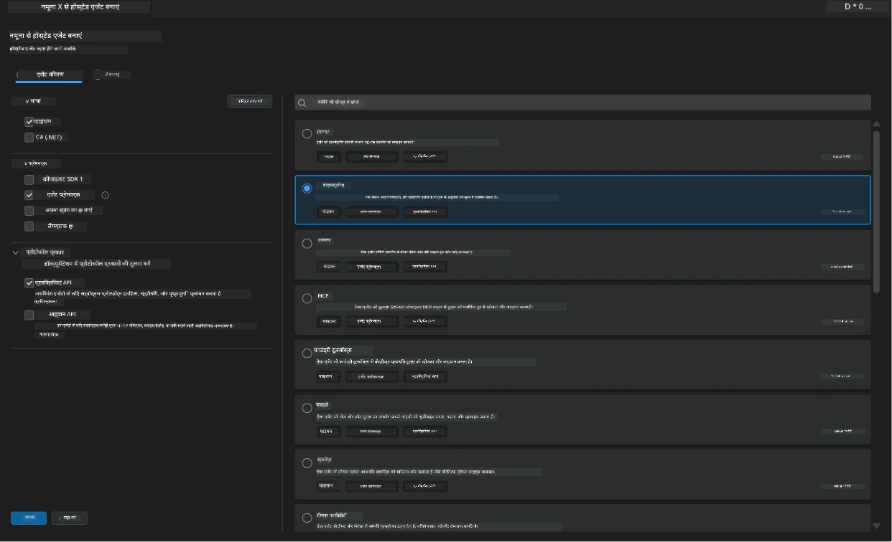
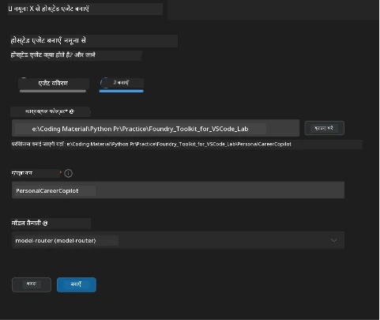

# मॉड्यूल 2 - मल्टी-एजेंट प्रोजेक्ट को स्कैफोल्ड करें

⏱️ ~5 मिनट

इस मॉड्यूल में, आप [Foundry Toolkit for VS Code](https://aka.ms/foundrytk) का उपयोग करके **मल्टी-एजेंट प्रोजेक्ट स्कैफोल्ड** करते हैं। विज़ार्ड `agent.yaml`, `main.py`, `Dockerfile`, `requirements.txt`, `.env`, और VS Code डिबग कॉन्फ़िगरेशन बनाता है - ताकि आप मॉड्यूल 3 में 4-एजेंट वर्कफ़्लो को वायर करने पर ध्यान केंद्रित कर सकें।

> **मुख्य अवधारणा:** स्कैफोल्ड एक कार्यशील स्टब है जिसमें एक एजेंट होता है। आप प्लेसहोल्डर लॉजिक को मॉड्यूल 3 में `WorkflowBuilder` ग्राफ़ से बदलते हैं। आप बायलरप्लेट को शून्य से नहीं लिखते हैं।

> **संदर्भ कार्यान्वयन:** [`PersonalCareerCopilot/`](../../../../../workshop/lab02-multi-agent/PersonalCareerCopilot) एक पूर्ण कार्यशील उदाहरण है। इसे अपनी प्रगति की तुलना के लिए उपयोग करें।

### स्कैफोल्ड विज़ार्ड फ्लो


```mermaid
flowchart LR
    A[Command Palette: नया होस्टेड एजेंट बनाएँ] --> B[भाषा: पायथन]
    B --> C[API Type: प्रतिक्रिया API]
    C --> D[Template: वर्कफ़्लोज़]
    D --> E[मॉडल चुनें]
    E --> F[वर्कस्पेस फ़ोल्डर और एजेंट का नाम]
    F --> G[जनरेट किया गया प्रोजेक्ट]
```

---

## चरण 1: Create Hosted Agent विज़ार्ड खोलें

1. `Ctrl+Shift+P` दबाएं ताकि **Command Palette** खुले।
2. टाइप करें: **Foundry Toolkit: Create a New Hosted Agent** और उसे चुनें।
3. विज़ार्ड **Agent Details** टैब पर खुलता है।

> **वैकल्पिक:** एक्टिविटी बार में **Foundry Toolkit** आइकन पर क्लिक करें → **Hosted Agents** के बगल में **+** आइकन पर क्लिक करें → **Create New Hosted Agent**।

---

## चरण 2: सेटिंग्स चुनें



1. लॉन्ग नेविगेशन/विकल्प अनुभाग में निम्न चुनें:

| मेनू | चयन | नोट्स |
|--------|-----------|-------|
| **भाषा** | Python | C# (.NET) भी समर्थित है |
| **फ्रेमवर्क** | Agent Framework | प्रदान करता है `Agent`, `AgentExecutor`, `WorkflowBuilder` |
| **API प्रकार** | Response API | `POST /responses` - प्लेटफ़ॉर्म-प्रबंधित इतिहास, स्ट्रीमिंग समर्थन |
| **टेम्पलेट** | **Workflows** | कई एजेंट्स के माध्यम से अनुरोधों को क्रमबद्ध करता है |

2. चयन करने के बाद, **Next** पर क्लिक करें



3. अगली विंडो में निम्न चुनें:

| मेनू | चयन | नोट्स |
|--------|-----------|-------|
| **वर्कस्पेस फ़ोल्डर** | लक्षित फ़ोल्डर ब्राउज़ करें | उदाहरण के लिए, इस रिपॉजिटरी में `workshop/lab02-multi-agent/` |
| **एजेंट नाम** | `PersonalCareerCopilot` | यह प्रोजेक्ट डायरेक्टरी नाम बन जाएगा |
| **मॉडल तैनाती** | अपना तैनात मॉडल चुनें | उदाहरण के लिए, लैब 01 से `gpt-4.1-mini` |

4. **Create** पर क्लिक करें ताकि प्रोजेक्ट स्कैफोल्ड हो सके। VS Code फ़ाइलें बनाता है और फ़ोल्डर खोलता है।

> **टिप:** [`gpt-4.1-mini`](https://learn.microsoft.com/azure/foundry/foundry-models/concepts/models-sold-directly-by-azure#gpt-41-series) मल्टी-एजेंट विकास के लिए गति और गुणवत्ता का अच्छा समंजन प्रदान करता है।

---

## चरण 3: जनरेट किए गए प्रोजेक्ट का निरीक्षण करें

स्कैफोल्डिंग समाप्त होने के बाद, सुनिश्चित करें कि आपको एक्सप्लोरर (`Ctrl+Shift+E`) में ये फाइलें दिखाई दें:

```
📂 <your-agent-name>/
├── .azdignore          ← Files excluded from Azure Developer CLI deployments
├── .dockerignore       ← Files excluded from Docker builds
├── .env                ← Environment variables (placeholders - fill in Module 3)
├── .vscode/
│   ├── launch.json     ← Debug config (F5 → run + Agent Inspector)
│   └── tasks.json      ← VS Code task definitions
├── agent.yaml          ← Agent definition (kind: hosted, protocol: responses)
├── Dockerfile          ← Container config for deployment
├── main.py             ← Stub agent entry point (replace with WorkflowBuilder in Module 3)
└── requirements.txt    ← Python dependencies
```

> **महत्वपूर्ण:** इस स्कैफोल्ड किया गया फ़ोल्डर सीधे VS Code में खोलें ताकि `.vscode/launch.json` और `tasks.json` सही ढंग से F5 डिबगिंग के लिए लागू हों।

### प्रमुख फाइलें समझाई गईं

| फाइल | उद्देश्य |
|------|---------|
| `agent.yaml` | घोषित करता है `kind: hosted`, env vars मैप करता है, `/responses` प्रोटोकॉल परिभाषित करता है |
| `main.py` | स्टब: एक `FoundryChatClient` → `Agent` → `ResponsesHostServer`। आप इसे मॉड्यूल 3 में 4 एजेंट्स + `WorkflowBuilder` से बदलेंगे |
| `Dockerfile` | `python:3.12-slim`, `requirements.txt` इंस्टॉल करता है, पोर्ट 8088 एक्सपोज़ करता है, `python main.py` चलाता है |
| `requirements.txt` | `agent-framework-foundry`, `agent-framework-foundry-hosting`, `mcp<2,>=1.24.0`, `debugpy` |

> **संदर्भ:** पूरा जनरेट किया गया कंटेंट देखिए [`PersonalCareerCopilot/agent.yaml`](../../../../../workshop/lab02-multi-agent/PersonalCareerCopilot/agent.yaml) और [`PersonalCareerCopilot/requirements.txt`](../../../../../workshop/lab02-multi-agent/PersonalCareerCopilot/requirements.txt) में।

---

### ✅ चेकपॉइंट

- [ ] स्कैफोल्ड विज़ार्ड पूर्ण हुआ - नया प्रोजेक्ट फ़ोल्डर एक्सप्लोरर में दिखाई देता है
- [ ] सभी अपेक्षित फाइलें मौजूद हैं: `agent.yaml`, `main.py`, `Dockerfile`, `requirements.txt`, `.env`
- [ ] `agent.yaml` में `kind: hosted` और `protocol: responses` दिखता है
- [ ] `main.py` में `Agent`, `FoundryChatClient`, `ResponsesHostServer` इम्पोर्ट होते हैं
- [ ] स्कैफोल्ड किया गया फ़ोल्डर VS Code वर्कस्पेस रूट के रूप में खुला है
- [ ] आप समझते हैं कि `main.py` एक स्टब है - `WorkflowBuilder` मॉड्यूल 3 में जोड़ा जाएगा

---

**पिछला:** [01 - मल्टी-एजेंट आर्किटेक्चर समझना](01-understand-multi-agent.md) · **अगला:** [03 - एजेंट्स और वातावरण कॉन्फ़िगर करें →](03-configure-agents.md)

---

<!-- CO-OP TRANSLATOR DISCLAIMER START -->
**अस्वीकरण**:
इस दस्तावेज़ का अनुवाद AI अनुवाद सेवा [Co-op Translator](https://github.com/Azure/co-op-translator) का उपयोग करके किया गया है। जबकि हम सटीकता के लिए प्रयास करते हैं, कृपया ध्यान दें कि स्वचालित अनुवादों में त्रुटियाँ या अशुद्धियाँ हो सकती हैं। मूल दस्तावेज़ अपनी मूल भाषा में ही प्रामाणिक स्रोत माना जाना चाहिए। महत्वपूर्ण जानकारी के लिए, पेशेवर मानव अनुवाद की सिफारिश की जाती है। इस अनुवाद के उपयोग से उत्पन्न किसी भी गलतफहमी या गलत व्याख्या के लिए हम उत्तरदायी नहीं हैं।
<!-- CO-OP TRANSLATOR DISCLAIMER END -->