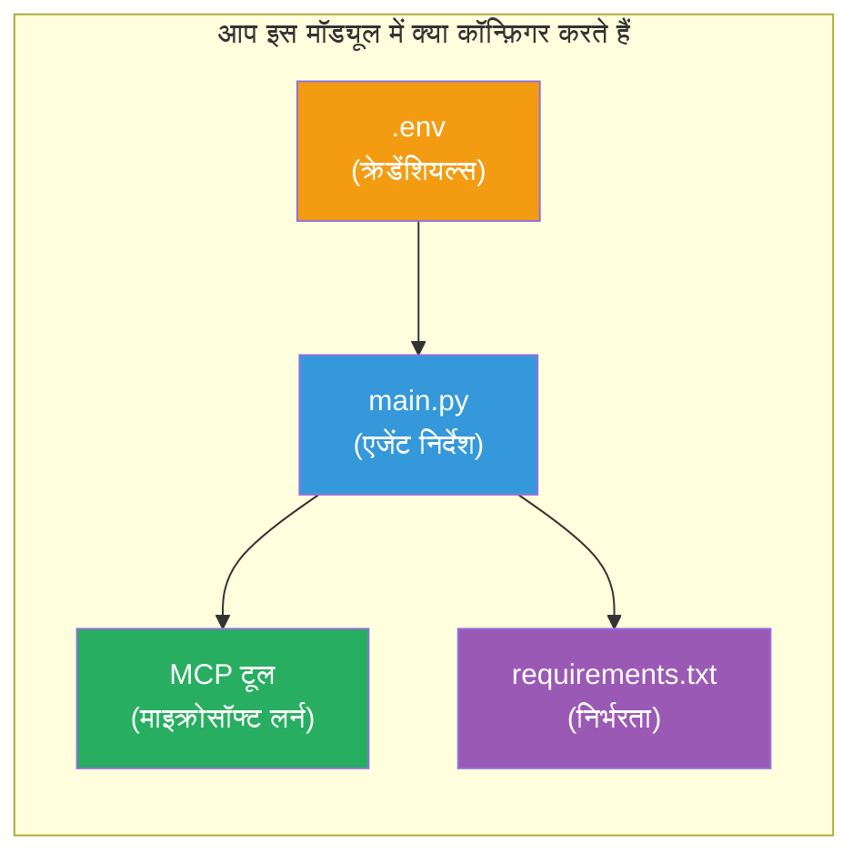

# Module 3 - एजेंट्स, MCP टूल और एनवायरनमेंट कॉन्फ़िगर करें

इस मॉड्यूल में, आप स्कैफोल्ड किए गए मल्टी-एजेंट प्रोजेक्ट को कस्टमाइज़ करेंगे। आप चारों एजेंट्स के लिए निर्देश लिखेंगे, Microsoft Learn के लिए MCP टूल सेटअप करेंगे, पर्यावरण वेरिएबल्स कॉन्फ़िगर करेंगे, और डिपेंडेंसियों को इंस्टॉल करेंगे।


> **संदर्भ:** पूरी कार्यशील कोड [`PersonalCareerCopilot/main.py`](../../../../../workshop/lab02-multi-agent/PersonalCareerCopilot/main.py) में है। अपनी खुद की निर्माण करते समय इसे संदर्भ के रूप में उपयोग करें।

---

## चरण 1: पर्यावरण वेरिएबल्स कॉन्फ़िगर करें

1. अपने प्रोजेक्ट की रूट में **`.env`** फ़ाइल खोलें।
2. अपने Foundry प्रोजेक्ट विवरण भरें:

   ```env
   PROJECT_ENDPOINT=https://<your-account>.services.ai.azure.com/api/projects/<your-project>
   MODEL_DEPLOYMENT_NAME=gpt-4.1-mini
   ```

3. फ़ाइल सहेजें।

### ये मान कहां से प्राप्त करें

| मान | इसे कैसे खोजें |
|-------|---------------|
| **प्रोजेक्ट एंडपॉइंट** | Microsoft Foundry साइडबार → अपने प्रोजेक्ट पर क्लिक करें → डिटेल व्यू में एंडपॉइंट URL |
| **मॉडल डिप्लॉयमेंट नाम** | Foundry साइडबार → प्रोजेक्ट विस्तार करें → **मॉडल्स + एंडपॉइंट्स** → तैनात मॉडल के पास नाम |

> **सुरक्षा:** `.env` को वर्शन कंट्रोल में कभी कमिट न करें। यदि यह पहले से `.gitignore` में नहीं है तो इसे जोड़ें।

### पर्यावरण वेरिएबल मैपिंग

मल्टी-एजेंट `main.py` मानक और वर्कशॉप-विशिष्ट एंव var नाम दोनों पढ़ता है:

```python
PROJECT_ENDPOINT = os.getenv("AZURE_AI_PROJECT_ENDPOINT") or os.getenv("PROJECT_ENDPOINT")
MODEL_DEPLOYMENT_NAME = os.getenv(
    "AZURE_AI_MODEL_DEPLOYMENT_NAME",
    os.getenv("MODEL_DEPLOYMENT_NAME", "gpt-4.1-mini"),
)
MICROSOFT_LEARN_MCP_ENDPOINT = os.getenv(
    "MICROSOFT_LEARN_MCP_ENDPOINT", "https://learn.microsoft.com/api/mcp"
)
```

MCP एंडपॉइंट के लिए एक समझदार डिफ़ॉल्ट होता है - आपको इसे `.env` में सेट करने की ज़रूरत नहीं है जब तक आप इसे ओवरराइड न करना चाहें।

---

## चरण 2: एजेंट निर्देश लिखें

यह सबसे महत्वपूर्ण चरण है। प्रत्येक एजेंट को सावधानीपूर्वक तैयार किए गए निर्देशों की आवश्यकता होती है जो उसकी भूमिका, आउटपुट फ़ॉर्मेट और नियमों को परिभाषित करते हैं। `main.py` खोलें और निर्देश स्थिरांक बनाएं (या संशोधित करें)।

### 2.1 रिज्यूमे पार्सर एजेंट

```python
RESUME_PARSER_INSTRUCTIONS = """\
You are the Resume Parser.
Extract resume text into a compact, structured profile for downstream matching.

Output exactly these sections:
1) Candidate Profile
2) Technical Skills (grouped categories)
3) Soft Skills
4) Certifications & Awards
5) Domain Experience
6) Notable Achievements

Rules:
- Use only explicit or strongly implied evidence.
- Do not invent skills, titles, or experience.
- Keep concise bullets; no long paragraphs.
- If input is not a resume, return a short warning and request resume text.
"""
```

**ये सेक्शन क्यों?** MatchingAgent को स्कोर करने के लिए संरचित डेटा चाहिए। सुसंगत अनुभाग क्रॉस-एजेंट हैंडऑफ़ को विश्वसनीय बनाते हैं।

### 2.2 जॉब डिस्क्रिप्शन एजेंट

```python
JOB_DESCRIPTION_INSTRUCTIONS = """\
You are the Job Description Analyst.
Extract a structured requirement profile from a JD.

Output exactly these sections:
1) Role Overview
2) Required Skills
3) Preferred Skills
4) Experience Required
5) Certifications Required
6) Education
7) Domain / Industry
8) Key Responsibilities

Rules:
- Keep required vs preferred clearly separated.
- Only use what the JD states; do not invent hidden requirements.
- Flag vague requirements briefly.
- If input is not a JD, return a short warning and request JD text.
"""
```

**आवश्यक और पसंदीदा क्यों अलग?** MatchingAgent हर एक के लिए अलग वजन का उपयोग करता है (आवश्यक कौशल = 40 अंक, पसंदीदा कौशल = 10 अंक)।

### 2.3 मैचिंग एजेंट

```python
MATCHING_AGENT_INSTRUCTIONS = """\
You are the Matching Agent.
Compare parsed resume output vs JD output and produce an evidence-based fit report.

Scoring (100 total):
- Required Skills 40
- Experience 25
- Certifications 15
- Preferred Skills 10
- Domain Alignment 10

Output exactly these sections:
1) Fit Score (with breakdown math)
2) Matched Skills
3) Missing Skills
4) Partially Matched
5) Experience Alignment
6) Certification Gaps
7) Overall Assessment

Rules:
- Be objective and evidence-only.
- Keep partial vs missing separate.
- Keep Missing Skills precise; it feeds roadmap planning.
"""
```

**स्पष्ट स्कोरिंग क्यों?** पुनरुत्पादक स्कोरिंग रन की तुलना करना और डिबग करना संभव बनाती है। 100-पॉइंट स्केल अंत उपयोगकर्ताओं के लिए समझना आसान है।

### 2.4 गैप एनालाइज़र एजेंट

```python
GAP_ANALYZER_INSTRUCTIONS = """\
You are the Gap Analyzer and Roadmap Planner.
Create a practical upskilling plan from the matching report.

Microsoft Learn MCP usage (required):
- For EVERY High and Medium priority gap, call tool `search_microsoft_learn_for_plan`.
- Use returned Learn links in Suggested Resources.
- Prefer Microsoft Learn for free resources.

CRITICAL: You MUST produce a SEPARATE detailed gap card for EVERY skill listed in
the Missing Skills and Certification Gaps sections of the matching report. Do NOT
skip or combine gaps. Do NOT summarize multiple gaps into one card.

Output format:
1) Personalized Learning Roadmap for [Role Title]
2) One DETAILED card per gap (produce ALL cards, not just the first):
   - Skill
   - Priority (High/Medium/Low)
   - Current Level
   - Target Level
   - Suggested Resources (include Learn URL from tool results)
   - Estimated Time
   - Quick Win Project
3) Recommended Learning Order (numbered list)
4) Timeline Summary (week-by-week)
5) Motivational Note

Rules:
- Produce every gap card before writing the summary sections.
- Keep it specific, realistic, and actionable.
- Tailor to candidate's existing stack.
- If fit >= 80, focus on polish/interview readiness.
- If fit < 40, be honest and provide a staged path.
"""
```

**"CRITICAL" ज़ोर क्यों?** सभी गैप कार्ड उत्पन्न करने के लिए स्पष्ट निर्देशों के बिना, मॉडल आमतौर पर केवल 1-2 कार्ड बनाता है और बाकी सारांशित करता है। "CRITICAL" ब्लॉक इस संक्षेप को रोकता है।

---

## चरण 3: MCP टूल परिभाषित करें

GapAnalyzer एक टूल का उपयोग करता है जो [Microsoft Learn MCP सर्वर](https://learn.microsoft.com/azure/foundry/agents/how-to/tools/model-context-protocol) को कॉल करता है। इसे `main.py` में जोड़ें:

```python
import json
from agent_framework import tool
from mcp.client.session import ClientSession
from mcp.client.streamable_http import streamable_http_client

@tool
async def search_microsoft_learn_for_plan(
    skill: str, role: str = "", max_results: int = 5
) -> str:
    """Search Microsoft Learn MCP and return curated official links for roadmap planning."""
    query = " ".join(part for part in [skill, role, "learning path module"] if part).strip()
    query = query or "job skills learning path"

    try:
        async with streamable_http_client(MICROSOFT_LEARN_MCP_ENDPOINT) as (
            read_stream, write_stream, _,
        ):
            async with ClientSession(read_stream, write_stream) as session:
                await session.initialize()
                result = await session.call_tool(
                    "microsoft_docs_search", {"query": query}
                )

        if not result.content:
            return (
                "No results returned from Microsoft Learn MCP. "
                "Fallback: https://learn.microsoft.com/training/support/catalog-api"
            )

        payload_text = getattr(result.content[0], "text", "")
        data = json.loads(payload_text) if payload_text else {}
        items = data.get("results", [])[:max(1, min(max_results, 10))]

        if not items:
            return f"No direct Microsoft Learn results found for '{skill}'."

        lines = [f"Microsoft Learn resources for '{skill}':"]
        for i, item in enumerate(items, start=1):
            title = item.get("title") or item.get("url") or "Microsoft Learn Resource"
            url = item.get("url") or item.get("link") or ""
            lines.append(f"{i}. {title} - {url}".rstrip(" -"))
        return "\n".join(lines)
    except Exception as ex:
        return (
            f"Microsoft Learn MCP lookup unavailable. Reason: {ex}. "
            "Fallbacks: https://learn.microsoft.com/api/mcp"
        )
```

### टूल कैसे काम करता है

| चरण | क्या होता है |
|------|-------------|
| 1 | GapAnalyzer तय करता है कि एक कौशल (जैसे "Kubernetes") के लिए संसाधनों की आवश्यकता है |
| 2 | फ्रेमवर्क `search_microsoft_learn_for_plan(skill="Kubernetes")` कॉल करता है |
| 3 | फ़ंक्शन [Streamable HTTP](https://learn.microsoft.com/agent-framework/agents/tools/hosted-mcp-tools) कनेक्शन खोलता है `https://learn.microsoft.com/api/mcp` से |
| 4 | [MCP सर्वर](https://learn.microsoft.com/azure/foundry/agents/how-to/tools/model-context-protocol) पर `microsoft_docs_search` कॉल करता है |
| 5 | MCP सर्वर खोज परिणाम (शीर्षक + URL) वापस करता है |
| 6 | फ़ंक्शन परिणामों को क्रमांकित सूची के रूप में फॉर्मेट करता है |
| 7 | GapAnalyzer URL को गैप कार्ड में शामिल करता है |

### MCP निर्भरताएँ

MCP क्लाइंट लाइब्रेरी [`agent-framework-core`](https://learn.microsoft.com/agent-framework/overview/) के माध्यम से पारगमन रूप से शामिल हैं। आपको इन्हें अलग से `requirements.txt` में जोड़ने की आवश्यकता नहीं है। यदि आपको इम्पोर्ट त्रुटियाँ मिलती हैं, तो सुनिश्चित करें:

```powershell
pip list | Select-String "mcp"
```

अपेक्षित: `mcp` पैकेज स्थापित है (संस्करण 1.x या बाद का)।

---

## चरण 4: एजेंट्स और वर्कफ़्लो को वायर करें

### 4.1 कॉन्टेक्स्ट मैनेजर के साथ एजेंट बनाएं

```python
from contextlib import asynccontextmanager

@asynccontextmanager
async def create_agents():
    async with (
        get_credential() as credential,
        AzureAIAgentClient(
            project_endpoint=PROJECT_ENDPOINT,
            model_deployment_name=MODEL_DEPLOYMENT_NAME,
            credential=credential,
        ).as_agent(
            name="ResumeParser",
            instructions=RESUME_PARSER_INSTRUCTIONS,
        ) as resume_parser,
        AzureAIAgentClient(
            project_endpoint=PROJECT_ENDPOINT,
            model_deployment_name=MODEL_DEPLOYMENT_NAME,
            credential=credential,
        ).as_agent(
            name="JobDescriptionAgent",
            instructions=JOB_DESCRIPTION_INSTRUCTIONS,
        ) as jd_agent,
        AzureAIAgentClient(
            project_endpoint=PROJECT_ENDPOINT,
            model_deployment_name=MODEL_DEPLOYMENT_NAME,
            credential=credential,
        ).as_agent(
            name="MatchingAgent",
            instructions=MATCHING_AGENT_INSTRUCTIONS,
        ) as matching_agent,
        AzureAIAgentClient(
            project_endpoint=PROJECT_ENDPOINT,
            model_deployment_name=MODEL_DEPLOYMENT_NAME,
            credential=credential,
        ).as_agent(
            name="GapAnalyzer",
            instructions=GAP_ANALYZER_INSTRUCTIONS,
            tools=[search_microsoft_learn_for_plan],
        ) as gap_analyzer,
    ):
        yield resume_parser, jd_agent, matching_agent, gap_analyzer
```

**मुख्य बिंदु:**
- प्रत्येक एजेंट का अपना `AzureAIAgentClient` इंस्टेंस होता है
- केवल GapAnalyzer को `tools=[search_microsoft_learn_for_plan]` मिलता है
- `get_credential()` Azure में [`ManagedIdentityCredential`](https://learn.microsoft.com/python/api/overview/azure/identity-readme#managed-identity-support), लोकली [`DefaultAzureCredential`](https://learn.microsoft.com/azure/developer/python/sdk/authentication/credential-chains#defaultazurecredential-overview) लौटाता है

### 4.2 वर्कफ़्लो ग्राफ़ बनाएं

```python
def create_workflow(resume_parser, jd_agent, matching_agent, gap_analyzer):
    workflow = (
        WorkflowBuilder(
            name="ResumeJobFitEvaluator",
            start_executor=resume_parser,
            output_executors=[gap_analyzer],
        )
        .add_edge(resume_parser, jd_agent)
        .add_edge(resume_parser, matching_agent)
        .add_edge(jd_agent, matching_agent)
        .add_edge(matching_agent, gap_analyzer)
        .build()
    )
    return workflow.as_agent()
```

> `.as_agent()` पैटर्न को समझने के लिए [Workflows as Agents](https://learn.microsoft.com/agent-framework/workflows/as-agents) देखें।

### 4.3 सर्वर प्रारंभ करें

```python
async def main() -> None:
    validate_configuration()
    async with create_agents() as (resume_parser, jd_agent, matching_agent, gap_analyzer):
        agent = create_workflow(resume_parser, jd_agent, matching_agent, gap_analyzer)
        from azure.ai.agentserver.agentframework import from_agent_framework
        await from_agent_framework(agent).run_async()

if __name__ == "__main__":
    asyncio.run(main())
```

---

## चरण 5: वर्चुअल एनवायरनमेंट बनाएं और सक्रिय करें

### 5.1 एनवायरनमेंट बनाएं

```powershell
cd workshop\lab02-multi-agent\PersonalCareerCopilot
python -m venv .venv
```

### 5.2 इसे सक्रिय करें

**PowerShell (Windows):**
```powershell
.\.venv\Scripts\Activate.ps1
```

**macOS/Linux:**
```bash
source .venv/bin/activate
```

### 5.3 डिपेंडेंसियां इंस्टॉल करें

```powershell
pip install -r requirements.txt
```

> **नोट:** `requirements.txt` में `agent-dev-cli --pre` पंक्ति सुनिश्चित करती है कि नवीनतम प्रीव्यू संस्करण इंस्टॉल हो। यह `agent-framework-core==1.0.0rc3` के साथ संगतता के लिए आवश्यक है।

### 5.4 इंस्टॉलेशन सत्यापित करें

```powershell
pip list | Select-String "agent-framework|agentserver|agent-dev"
```

अपेक्षित आउटपुट:
```
agent-dev-cli                  0.0.1b260316
agent-framework-azure-ai       1.0.0rc3
agent-framework-core            1.0.0rc3
azure-ai-agentserver-agentframework 1.0.0b16
azure-ai-agentserver-core      1.0.0b16
```

> **अगर `agent-dev-cli` पुराना वर्शन दिखाता है** (जैसे `0.0.1b260119`), तो एजेंट इंस्पेक्टर 403/404 त्रुटियों के साथ विफल होगा। अपग्रेड करें: `pip install agent-dev-cli --pre --upgrade`

---

## चरण 6: प्रमाणीकरण सत्यापित करें

Lab 01 से वही ऑथ जांच चलाएं:

```powershell
az account show --query "{name:name, id:id}" --output table
```

अगर यह विफल हो, तो [`az login`](https://learn.microsoft.com/cli/azure/authenticate-azure-cli-interactively) चलाएं।

मल्टी-एजेंट वर्कफ़्लोज़ के लिए, सभी चार एजेंट्स एक ही क्रेडेंशियल साझा करते हैं। यदि एक के लिए प्रमाणीकरण काम करता है, तो सभी के लिए काम करता है।

---

### चेकपॉइंट

- [ ] `.env` में वैध `PROJECT_ENDPOINT` और `MODEL_DEPLOYMENT_NAME` मान हैं
- [ ] सभी 4 एजेंट निर्देश स्थिरांक `main.py` में परिभाषित हैं (ResumeParser, JD Agent, MatchingAgent, GapAnalyzer)
- [ ] `search_microsoft_learn_for_plan` MCP टूल GapAnalyzer के साथ परिभाषित और रजिस्टर्ड है
- [ ] `create_agents()` चारों एजेंट्स को व्यक्तिगत `AzureAIAgentClient` इंस्टेंस के साथ बनाता है
- [ ] `create_workflow()` `WorkflowBuilder` के साथ सही ग्राफ बनाता है
- [ ] वर्चुअल एनवायरनमेंट बनाया और सक्रिय किया गया है (`(.venv)` दृश्य)
- [ ] `pip install -r requirements.txt` त्रुटि बिना पूरी हुआ
- [ ] `pip list` सभी अपेक्षित पैकेज सही वर्शनों (rc3 / b16) पर दिखाता है
- [ ] `az account show` आपकी सदस्यता वापस करता है

---

**पिछला:** [02 - Scaffold Multi-Agent Project](02-scaffold-multi-agent.md) · **अगला:** [04 - Orchestration Patterns →](04-orchestration-patterns.md)

---

<!-- CO-OP TRANSLATOR DISCLAIMER START -->
**अस्वीकरण**:  
इस दस्तावेज़ का अनुवाद AI अनुवाद सेवा [Co-op Translator](https://github.com/Azure/co-op-translator) का उपयोग करके किया गया है। जबकि हम सटीकता के लिए प्रयास करते हैं, कृपया ध्यान दें कि स्वचालित अनुवाद में त्रुटियाँ या गलतियाँ हो सकती हैं। मूल दस्तावेज़ को उसकी मूल भाषा में आधिकारिक स्रोत माना जाना चाहिए। महत्वपूर्ण जानकारी के लिए, पेशेवर मानव अनुवाद की सिफारिश की जाती है। इस अनुवाद के उपयोग से उत्पन्न किसी भी गलतफहमी या गलत व्याख्या के लिए हम जिम्मेदारी नहीं लेते हैं।
<!-- CO-OP TRANSLATOR DISCLAIMER END -->