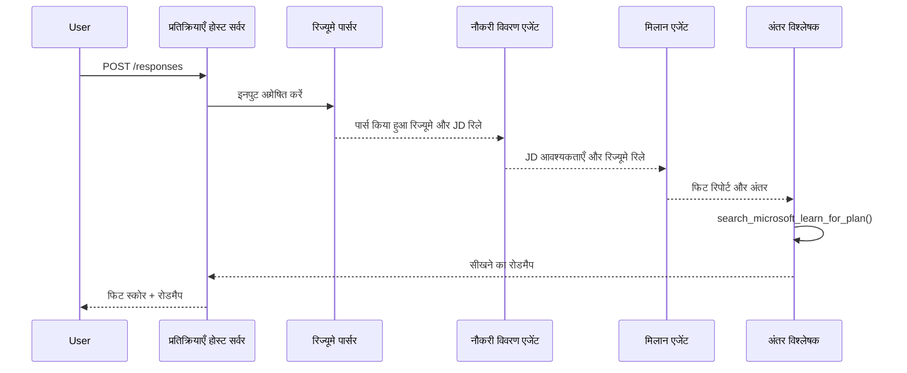

# मॉड्यूल 3 - निर्देशों, पर्यावरण और निर्भरताओं को कॉन्फ़िगर करें और इंस्टॉल करें

⏱️ ~15 मिनट

इस मॉड्यूल में, आप स्कैफोल्डेड स्टब को **अपने** मल्टी-एजेंट वर्कफ़्लो में बदलते हैं - पर्यावरण चर सेट करके, एजेंट निर्देश लिखकर, MCP टूल जोड़कर, वर्कफ़्लो ग्राफ़ कनेक्ट करके, और निर्भरताओं को इंस्टॉल करके।

> **संदर्भ:** पूर्ण कार्यशील कोड [`PersonalCareerCopilot/main.py`](../../../../../workshop/lab02-multi-agent/PersonalCareerCopilot/main.py) में है। अपना वर्कफ़्लो ग्राफ़ और प्रॉम्प्ट ब्लॉक बनाते समय इसे संदर्भ के रूप में उपयोग करें।

---

## चार एजेंट एक साथ कैसे फिट होते हैं


```mermaid
sequenceDiagram
    participant User
    participant Server as प्रतिक्रियाएँ होस्ट सर्वर
    participant RP as रिज्यूमे पार्सर
    participant JD as नौकरी विवरण एजेंट
    participant MA as मिलान एजेंट
    participant GA as अंतर विश्लेषक

    User->>Server: POST /responses
    Server->>RP: इनपुट अग्रेषित करें
    RP-->>JD: पार्स किया हुआ रिज्यूमे और JD रिले
    JD-->>MA: JD आवश्यकताएँ और रिज्यूमे रिले
    MA-->>GA: फिट रिपोर्ट और अंतर
    GA->>GA: search_microsoft_learn_for_plan()
    GA-->>Server: सीखने का रोडमैप
    Server-->>User: फिट स्कोर + रोडमैप
```

---

## चरण 1: पर्यावरण चर कॉन्फ़िगर करें

1. अपने प्रोजेक्ट रूट में **`.env`** फ़ाइल खोलें (जो स्कैफोल्ड विजार्ड द्वारा बनाई गई है)।
2. प्लेसहोल्डर को लैब 01 से अपने वास्तविक मानों से बदलें।

<details open>
<summary><strong>🅰️ पथ A - Foundry सदस्यता</strong></summary>

```env
FOUNDRY_PROJECT_ENDPOINT=https://<your-account>.services.ai.azure.com/api/projects/<your-project>
AZURE_AI_MODEL_DEPLOYMENT_NAME=gpt-4.1-mini
```

> **मान कहाँ से प्राप्त करें:** देखें [Lab 01, Module 1](../../lab01-single-agent/docs/01-setup.md#deploy-a-model--assign-rbac)।

</details>

<details open>
<summary><strong>🅱️ पथ B - Foundry लोकल</strong></summary>

```env
FOUNDRY_PROJECT_ENDPOINT=http://localhost:5273/v1
AZURE_AI_MODEL_DEPLOYMENT_NAME=phi-4-mini
```

> सभी अनुमान आपके मशीन पर चलाए जाते हैं - कोई डेटा आपके डिवाइस से बाहर नहीं जाता। सटीक मॉडल उपनाम की पुष्टि के लिए `foundry model list` चलाएँ। एकमात्र आउटबाउंड अनुरोध MCP टूल का कॉल है जो `https://learn.microsoft.com/api/mcp` पर जाता है।

> **मान कहाँ से प्राप्त करें:** देखें [Lab 01, Module 1 - local path](../../lab01-single-agent/docs/01-setup.md#step-2-set-up-based-on-your-access)।

</details>

> **सुरक्षा:** `.env` को कभी संस्करण नियंत्रण में कमिट न करें। इसे पहले से ही `.gitignore` में होना चाहिए।

---

## चरण 2: एजेंट निर्देश लिखें

निर्देश प्रत्येक एजेंट की भूमिका, आउटपुट प्रारूप और नियमों को परिभाषित करते हैं। `main.py` खोलें और चार निर्देश स्थिरांक परिभाषित करें (या बदलें) - पूर्ण स्ट्रिंग्स [`PersonalCareerCopilot/main.py`](../../../../../workshop/lab02-multi-agent/PersonalCareerCopilot/main.py) में हैं।

### 2.1 `RESUME_PARSER_INSTRUCTIONS`
रिज़्यूमे को संरचित उम्मीदवार प्रोफ़ाइल में पार्स करता है **और** नौकरी विवरण को ठीक वैसे ही `[JOB DESCRIPTION PASS-THROUGH]` में कॉपी करता है। दोनों लेबल वाले खंड आउटपुट में दिखने चाहिए।

> **पास-थ्रू क्यों?** `context_mode="last_agent"` के साथ, ResumeParser **एकमात्र** एजेंट है जो मूल उपयोगकर्ता संदेश देखता है। यदि यह JD आगे कॉपी नहीं करता, तो डाउनस्ट्रीम एजेंट कभी नहीं देख पाते हैं।

### 2.2 `JOB_DESCRIPTION_INSTRUCTIONS`
ResumeParser आउटपुट से `[PARSED RESUME]` और `[JOB DESCRIPTION PASS-THROUGH]` पढ़ता है। आउटपुट करता है `[JD REQUIREMENTS]` (संरचित आवश्यकताएँ) और `[PARSED RESUME PASS-THROUGH]` (मैचिंग एजेंट के लिए वर्बेटिम रिज़्यूमे कॉपी)।

### 2.3 `MATCHING_AGENT_INSTRUCTIONS`
`[JD REQUIREMENTS]` और `[PARSED RESUME PASS-THROUGH]` पढ़ता है। एक स्कोर किया हुआ फिट रिपोर्ट (0–100) बनाता है जिसमें गणना, मिलान कौशल, गायब कौशल, और अनुभव संरेखण शामिल है।

### 2.4 `GAP_ANALYZER_INSTRUCTIONS`
फिट रिपोर्ट पढ़ता है। **हर** गायब कौशल के लिए, `search_microsoft_learn_for_plan` कॉल करता है ताकि Microsoft Learn संसाधन प्राप्त कर सके। प्रत्येक कौशल के लिए एक विस्तृत गैप कार्ड और सप्ताह-दर-सप्ताह सीखने का रोडमैप बनाता है।

---

## चरण 3: MCP टूल जोड़ें

GapAnalyzer [Microsoft Learn MCP सर्वर](https://learn.microsoft.com/azure/foundry/agents/how-to/tools/model-context-protocol) को कॉल करता है ताकि प्रत्येक कौशल गैप के लिए वास्तविक सीखने के संसाधन प्राप्त किए जा सकें। पूर्ण `search_microsoft_learn_for_plan` फ़ंक्शन [`PersonalCareerCopilot/main.py`](../../../../../workshop/lab02-multi-agent/PersonalCareerCopilot/main.py) में है।

एजेंट बनाते समय GapAnalyzer पर टूल पंजीकृत करें:

```python
gap_analyzer = Agent(
    client=client,
    instructions=GAP_ANALYZER_INSTRUCTIONS,
    name="GapAnalyzer",
    tools=[search_microsoft_learn_for_plan],
)
```

> पूर्ण `WorkflowBuilder` ग्राफ़ के लिए देखें [`PersonalCareerCopilot/main.py`](../../../../../workshop/lab02-multi-agent/PersonalCareerCopilot/main.py) जिसमें `FoundryChatClient`, `AgentExecutor` और सभी `add_edge()` कॉल शामिल हैं।

---

## चरण 4: वर्चुअल पर्यावरण बनाएं और निर्भरताएं स्थापित करें

> ⚠️ **इस चरण को मत छोड़ें।** निर्भरताएं इंस्टॉल किए बिना, F5 डिबगिंग विफल हो जाएगी।

### 4.1 वर्चुअल पर्यावरण बनाएं

```powershell
python -m venv .venv
```

### 4.2 इसे सक्रिय करें

| OS | कमांड |
|----|---------|
| **Windows (PowerShell)** | `.\.venv\Scripts\Activate.ps1` |
| **Windows (CMD)** | `.venv\Scripts\activate.bat` |
| **macOS / Linux** | `source .venv/bin/activate` |

आपको अपने टर्मिनल प्रॉम्प्ट में `(.venv)` दिखाई देना चाहिए।

### 4.3 निर्भरताएं स्थापित करें

```powershell
pip install -r requirements.txt
```

### 4.4 सत्यापित करें

```powershell
pip list | Select-String "agent-framework|mcp|debugpy"
```

अपेक्षित: `agent-framework-foundry`, `agent-framework-foundry-hosting`, `mcp`, और `debugpy` सूचीबद्ध हैं।

---

## चरण 5: प्रमाणिकरण सत्यापित करें

<details open>
<summary><strong>🅰️ पथ A - Azure क्रेडेंशियल</strong></summary>

```powershell
az account show --query "{name:name, id:id}" --output table
```

यदि यह विफल हो, तो [`az login`](https://learn.microsoft.com/cli/azure/authenticate-azure-cli-interactively) चलाएँ।

सभी चार एजेंट एक `FoundryChatClient` और एक `DefaultAzureCredential` साझा करते हैं। यदि प्रमाणिकरण एक के लिए काम करता है, तो सभी के लिए काम करता है।

</details>

<details open>
<summary><strong>🅱️ पथ B - Foundry लोकल</strong></summary>

लोकल परीक्षण के लिए कोई प्रमाणिकरण आवश्यक नहीं है।

</details>

---

### ✅ चेकपाइंट

> Module 04 पर आगे न बढ़ें जब तक: **(1)** आपके प्रांप्ट में `(.venv)` न दिखे AND **(2)** `pip install -r requirements.txt` सफलतापूर्वक पूरा न हो।

- [ ] `.env` में मान्य एंडपॉइंट और मॉडल डिप्लॉयमेंट नाम हैं (प्लेसहोल्डर नहीं)
- [ ] सभी 4 एजेंट निर्देश स्थिरांक `main.py` में परिभाषित हैं (ResumeParser, JD एजेंट, MatchingAgent, GapAnalyzer)
- [ ] `search_microsoft_learn_for_plan` MCP टूल परिभाषित और GapAnalyzer पर पंजीकृत है
- [ ] `FoundryChatClient` + 4 `Agent` + 4 `AgentExecutor` वस्तुएं `main()` में बनाई गई हैं
- [ ] `WorkflowBuilder` सभी 3 `add_edge()` कॉल के साथ सही अनुमानित ग्राफ बनाता है
- [ ] वर्चुअल पर्यावरण बनाया और सक्रिय किया गया (`(.venv)` प्रांप्ट में दिखता है)
- [ ] `pip install -r requirements.txt` बिना त्रुटि के पूरा हुआ
- [ ] **पथ A:** `az account show` सफल OR VS Code Accounts आइकन साइन-इन खाता दिखाता है

---

**पिछला:** [02 - मल्टी-एजेंट प्रोजेक्ट स्कैफोल्ड करें](02-scaffold-multi-agent.md) · **अगला:** [04 - ऑर्केस्ट्रेशन पैटर्न्स →](04-orchestration-patterns.md)

---

<!-- CO-OP TRANSLATOR DISCLAIMER START -->
**अस्वीकरण**:
इस दस्तावेज़ का अनुवाद AI अनुवाद सेवा [Co-op Translator](https://github.com/Azure/co-op-translator) का उपयोग करके किया गया है। जबकि हम सटीकता के लिए प्रयास करते हैं, कृपया ध्यान दें कि स्वचालित अनुवादों में त्रुटियाँ या अशुद्धियाँ हो सकती हैं। मूल दस्तावेज़ अपनी मूल भाषा में ही प्रामाणिक स्रोत माना जाना चाहिए। महत्वपूर्ण जानकारी के लिए, पेशेवर मानव अनुवाद की सिफारिश की जाती है। इस अनुवाद के उपयोग से उत्पन्न किसी भी गलतफहमी या गलत व्याख्या के लिए हम उत्तरदायी नहीं हैं।
<!-- CO-OP TRANSLATOR DISCLAIMER END -->