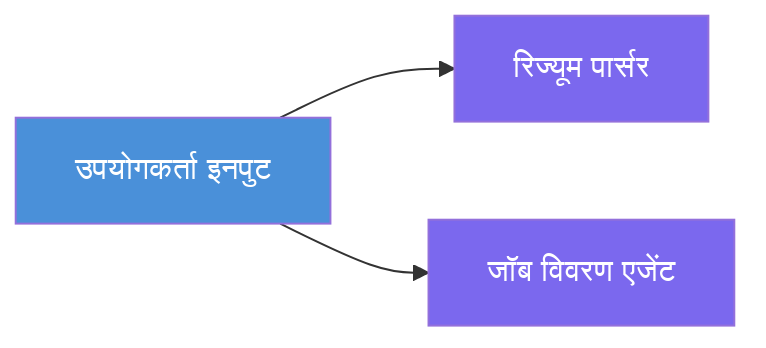
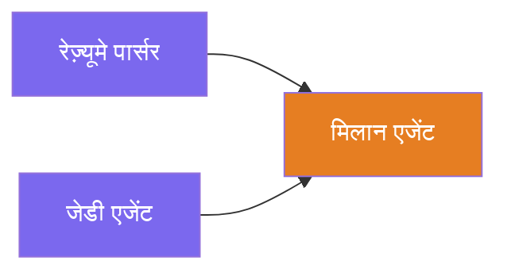
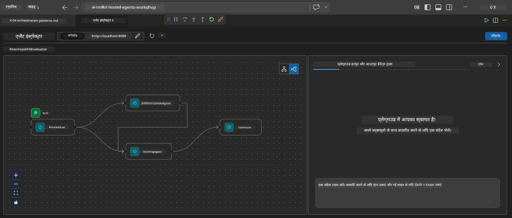
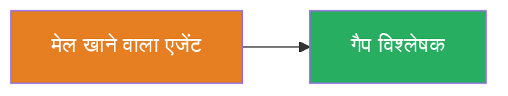
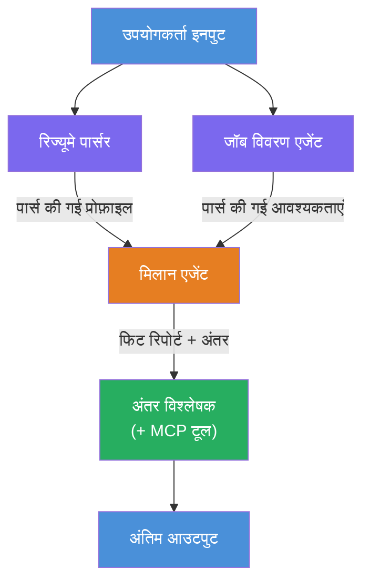
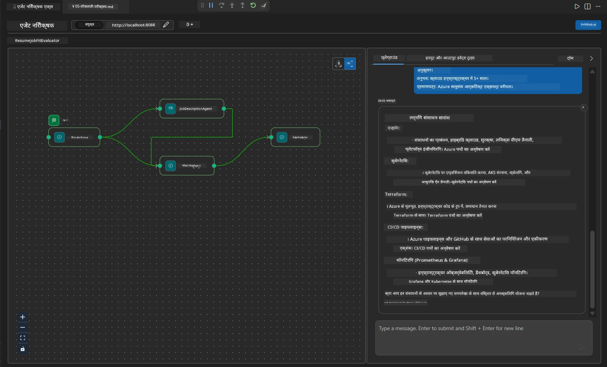

# Module 4 - ऑर्केस्ट्रेशन पैटर्न

इस मॉड्यूल में, आप Resume Job Fit Evaluator में उपयोग किए गए ऑर्केस्ट्रेशन पैटर्न का पता लगाते हैं और सीखते हैं कि वर्कफ़्लो ग्राफ़ को कैसे पढ़ें, संशोधित करें और विस्तृत करें। इन पैटर्न को समझना डेटा फ्लो समस्याओं को डिबग करने और अपने खुद के [मल्टी-एजेंट वर्कफ़्लो](https://learn.microsoft.com/agent-framework/workflows/) बनाने के लिए आवश्यक है।

---

## पैटर्न 1: फैन-आउट (समांतर विभाजन)

वर्कफ़्लो में पहला पैटर्न है **फैन-आउट** - एकल इनपुट एक साथ कई एजेंटों को भेजा जाता है।


कोड में, यह इसलिए होता है क्योंकि `resume_parser` `start_executor` है - यह सबसे पहले उपयोगकर्ता संदेश प्राप्त करता है। फिर, क्योंकि दोनों `jd_agent` और `matching_agent` के पास `resume_parser` से एज हैं, फ्रेमवर्क `resume_parser` के आउटपुट को दोनों एजेंटों तक रूट करता है:

```python
.add_edge(resume_parser, jd_agent)         # ResumeParser आउटपुट → JD एजेंट
.add_edge(resume_parser, matching_agent)   # ResumeParser आउटपुट → MatchingAgent
```

**यह काम क्यों करता है:** ResumeParser और JD Agent एक ही इनपुट के विभिन्न पहलुओं को संसाधित करते हैं। उन्हें समानांतर चलाने से कुल विलंब क्रमिक रूप से चलाने की तुलना में कम हो जाता है।

### फैन-आउट कब उपयोग करें

| उपयोग मामला | उदाहरण |
|----------|---------|
| स्वतंत्र उपकार्य | रिज्यूमे पार्सिंग बनाम JD पार्सिंग |
| पुनरावृत्ति / मतदान | दो एजेंट एक ही डेटा का विश्लेषण करते हैं, तीसरा सबसे अच्छा उत्तर चुनता है |
| मल्टी-फॉर्मेट आउटपुट | एक एजेंट टेक्स्ट उत्पन्न करता है, दूसरा संरचित JSON उत्पन्न करता है |

---

## पैटर्न 2: फैन-इन (संक्षेपण)

दूसरा पैटर्न है **फैन-इन** - कई एजेंट आउटपुट को एकत्र किया जाता है और एक एकल डाउनस्ट्रीम एजेंट को भेजा जाता है।


कोड में:

```python
.add_edge(resume_parser, matching_agent)   # ResumeParser आउटपुट → MatchingAgent
.add_edge(jd_agent, matching_agent)        # JD Agent आउटपुट → MatchingAgent
```

**मुख्य व्यवहार:** जब किसी एजेंट के पास **दो या अधिक इनकमिंग एज** होते हैं, तो फ्रेमवर्क स्वचालित रूप से **सभी** अपस्ट्रीम एजेंटों के पूरा होने के लिए इंतजार करता है, फिर डाउनस्ट्रीम एजेंट चलाता है। MatchingAgent तब तक शुरू नहीं होता जब तक ResumeParser और JD Agent दोनों समाप्त न हो जाएं।

### MatchingAgent क्या प्राप्त करता है

फ्रेमवर्क सभी अपस्ट्रीम एजेंटों से आउटपुट को संयोजित करता है। MatchingAgent का इनपुट इस प्रकार दिखता है:

```
[ResumeParser output]
---
Candidate Profile:
  Name: Jane Doe
  Technical Skills: Python, Azure, Kubernetes, ...
  ...

[JobDescriptionAgent output]
---
Role Overview: Senior Cloud Engineer
Required Skills: Python, Azure, Terraform, ...
...
```

> **ध्यान दें:** सटीक संयोजन प्रारूप फ्रेमवर्क संस्करण पर निर्भर करता है। एजेंट के निर्देश इस बात को संभालने के लिए लिखे जाने चाहिए कि अपस्ट्रीम आउटपुट संरचित हो या असंरचित।



---

## पैटर्न 3: अनुक्रमिक चेनिंग

तीसरा पैटर्न है **अनुक्रमिक चेनिंग** - एक एजेंट का आउटपुट सीधे अगले में इनपुट के रूप में जाता है।


कोड में:

```python
.add_edge(matching_agent, gap_analyzer)    # MatchingAgent आउटपुट → GapAnalyzer
```

यह सबसे सरल पैटर्न है। GapAnalyzer MatchingAgent के फिट स्कोर, मेल खाती/अनुपस्थित कौशल, और गैप्स प्राप्त करता है। फिर यह प्रत्येक गैप के लिए Microsoft Learn संसाधनों को प्राप्त करने के लिए [MCP उपकरण](https://learn.microsoft.com/azure/foundry/agents/how-to/tools/model-context-protocol) को कॉल करता है।

---

## पूर्ण ग्राफ

तीनों पैटर्न को मिलाकर पूरा वर्कफ़्लो बनता है:


### निष्पादन समयसीमा

```mermaid
gantt
    title एजेंट निष्पादन समयरेखा
    dateFormat X
    axisFormat %s

    section Parallel
    Resume Parser       :rp, 0, 3
    JD Agent            :jd, 0, 2

    section Sequential
    Matching Agent      :ma, 3, 5
    Gap Analyzer        :ga, 5, 9
```


> कुल दीवार-घड़ी समय लगभग `max(ResumeParser, JD Agent) + MatchingAgent + GapAnalyzer` होता है। GapAnalyzer सामान्यतः सबसे धीमा होता है क्योंकि यह प्रत्येक गैप के लिए कई MCP टूल कॉल करता है।

---

## WorkflowBuilder कोड पढ़ना

यहाँ `main.py` से पूरा `create_workflow()` फ़ंक्शन है, एनोटेटेड:

```python
def create_workflow(resume_parser, jd_agent, matching_agent, gap_analyzer):
    workflow = (
        WorkflowBuilder(
            name="ResumeJobFitEvaluator",

            # उपयोगकर्ता इनपुट प्राप्त करने वाला पहला एजेंट
            start_executor=resume_parser,

            # वह एजेंट(एजेंट) जिनका आउटपुट अंतिम प्रतिक्रिया बनता है
            output_executors=[gap_analyzer],
        )
        # फैन-आउट: ResumeParser आउटपुट दोनों JD एजेंट और MatchingAgent को जाता है
        .add_edge(resume_parser, jd_agent)
        .add_edge(resume_parser, matching_agent)

        # फैन-इन: MatchingAgent दोनों ResumeParser और JD एजेंट का इंतजार करता है
        .add_edge(jd_agent, matching_agent)

        # अनुक्रमिक: MatchingAgent आउटपुट GapAnalyzer को फीड करता है
        .add_edge(matching_agent, gap_analyzer)

        .build()
    )
    return workflow.as_agent()
```

### एज सारांश तालिका

| # | एज | पैटर्न | प्रभाव |
|---|------|---------|--------|
| 1 | `resume_parser → jd_agent` | फैन-आउट | JD Agent ResumeParser का आउटपुट (साथ ही मूल उपयोगकर्ता इनपुट) प्राप्त करता है |
| 2 | `resume_parser → matching_agent` | फैन-आउट | MatchingAgent ResumeParser का आउटपुट प्राप्त करता है |
| 3 | `jd_agent → matching_agent` | फैन-इन | MatchingAgent JD Agent का आउटपुट भी प्राप्त करता है (दोनों का इंतजार करता है) |
| 4 | `matching_agent → gap_analyzer` | अनुक्रमिक | GapAnalyzer फिट रिपोर्ट + गैप सूची प्राप्त करता है |

---

## ग्राफ़ संशोधित करना

### नया एज जोड़ना

पांचवा एज जोड़ने के लिए (जैसे, एक **InterviewPrepAgent** जो गैप विश्लेषण के आधार पर साक्षात्कार प्रश्न उत्पन्न करता है):

```python
# 1. निर्देश परिभाषित करें
INTERVIEW_PREP_INSTRUCTIONS = """\
You are the Interview Prep Agent.
Given a gap analysis and fit report, generate 10 targeted interview questions
the candidate should prepare for.
"""

# 2. एजेंट बनाएं (async with ब्लॉक के अंदर)
AzureAIAgentClient(
    project_endpoint=PROJECT_ENDPOINT,
    model_deployment_name=MODEL_DEPLOYMENT_NAME,
    credential=credential,
).as_agent(
    name="InterviewPrepAgent",
    instructions=INTERVIEW_PREP_INSTRUCTIONS,
) as interview_prep,

# 3. create_workflow() में एज जोड़ें
.add_edge(matching_agent, interview_prep)   # फिट रिपोर्ट प्राप्त करता है
.add_edge(gap_analyzer, interview_prep)     # गैप कार्ड भी प्राप्त करता है

# 4. output_executors अपडेट करें
output_executors=[interview_prep],  # अब अंतिम एजेंट
```

### निष्पादन क्रम बदलना

JD Agent को ResumeParser के **बाद** चलाने के लिए (समांतर के बजाय अनुक्रमिक):

```python
# हटाएं: .add_edge(resume_parser, jd_agent)  ← पहले से मौजूद है, इसे रखें
# अप्रत्यक्ष समानांतर को हटाएं जिससे jd_agent सीधे उपयोगकर्ता इनपुट न प्राप्त करे
# start_executor सबसे पहले resume_parser को भेजता है, और jd_agent केवल प्राप्त करता है
# resume_parser का आउटपुट एज के माध्यम से। यह उन्हें अनुक्रमिक बनाता है।
```

> **महत्वपूर्ण:** `start_executor` ही एकमात्र एजेंट होता है जो कच्चा उपयोगकर्ता इनपुट प्राप्त करता है। सभी अन्य एजेंट उनके अपस्ट्रीम एज से आउटपुट प्राप्त करते हैं। यदि आप चाहते हैं कि कोई एजेंट कच्चा उपयोगकर्ता इनपुट भी प्राप्त करे, तो उसके पास `start_executor` से एक एज होना चाहिए।

---

## सामान्य ग्राफ़ गलतियाँ

| गलती | लक्षण | सुधार |
|---------|---------|-----|
| `output_executors` के लिए एज गायब | एजेंट चलता है लेकिन आउटपुट खाली है | सुनिश्चित करें कि `start_executor` से `output_executors` के हर एजेंट तक एक मार्ग है |
| परिपत्र निर्भरता | अनंत लूप या टाइमआउट | जांचें कि कोई एजेंट अपस्ट्रीम एजेंट को फीड न करे |
| `output_executors` में एजेंट के पास कोई इनकमिंग एज नहीं | आउटपुट खाली है | कम से कम एक `add_edge(source, that_agent)` जोड़ें |
| कई `output_executors` बिना फैन-इन | आउटपुट में केवल एक एजेंट का उत्तर होता है | एक आउटपुट एजेंट का उपयोग करें जो संकलन करता है, या कई आउटपुट स्वीकार करें |
| `start_executor` गायब | निर्माण के समय `ValueError` | हमेशा `WorkflowBuilder()` में `start_executor` निर्दिष्ट करें |

---

## ग्राफ़ डिबगिंग

### Agent Inspector का उपयोग करना

1. एजेंट को लोकली शुरू करें (F5 या टर्मिनल - देखें [Module 5](05-test-locally.md))।
2. Agent Inspector खोलें (`Ctrl+Shift+P` → **Foundry Toolkit: Open Agent Inspector**)।
3. एक टेस्ट संदेश भेजें।
4. Inspector के प्रतिक्रिया पैनल में, **स्ट्रीमिंग आउटपुट** देखें - यह प्रत्येक एजेंट का योगदान अनुक्रम में दिखाता है।



### लॉगिंग का उपयोग करना

डेटा फ्लो ट्रेस करने के लिए `main.py` में लॉगिंग जोड़ें:

```python
import logging
logger = logging.getLogger("resume-job-fit")

# create_workflow() में, निर्माण के बाद:
logger.info("Workflow graph built with edges: RP→JD, RP→MA, JD→MA, MA→GA")
```

सर्वर लॉग्स एजेंट निष्पादन क्रम और MCP टूल कॉल दिखाते हैं:

```
INFO:resume-job-fit:Starting Resume -> Job Fit Evaluator HTTP server...
INFO:resume-job-fit:Server running on http://localhost:8088
INFO:agent_framework:Executing agent: ResumeParser
INFO:agent_framework:Executing agent: JobDescriptionAgent
INFO:agent_framework:Waiting for upstream agents: ResumeParser, JobDescriptionAgent
INFO:agent_framework:Executing agent: MatchingAgent
INFO:agent_framework:Executing agent: GapAnalyzer
INFO:agent_framework:Tool call: search_microsoft_learn_for_plan(skill="Kubernetes")
POST https://learn.microsoft.com/api/mcp → 200
INFO:agent_framework:Tool call: search_microsoft_learn_for_plan(skill="Terraform")
POST https://learn.microsoft.com/api/mcp → 200
```

---

### चेकपॉइंट

- [ ] आप वर्कफ़्लो में तीन ऑर्केस्ट्रेशन पैटर्नों की पहचान कर सकते हैं: फैन-आउट, फैन-इन, और अनुक्रमिक चेन
- [ ] आप समझते हैं कि जिन एजेंटों के कई इनकमिंग एज होते हैं वे सभी अपस्ट्रीम एजेंटों के पूरा होने तक प्रतीक्षा करते हैं
- [ ] आप `WorkflowBuilder` कोड पढ़ सकते हैं और प्रत्येक `add_edge()` कॉल को दृश्य ग्राफ़ से मेल कर सकते हैं
- [ ] आप निष्पादन समयसीमा समझते हैं: समांतर एजेंट पहले चलते हैं, फिर संकलन, फिर अनुक्रमिक
- [ ] आप जानते हैं कि ग्राफ में नया एज कैसे जोड़ना है (निर्देश परिभाषित करना, एजेंट बनाना, एज जोड़ना, आउटपुट अपडेट करना)
- [ ] आप सामान्य ग्राफ़ गलतियाँ और उनके लक्षण पहचान सकते हैं

---

**पिछला:** [03 - एजेंट और पर्यावरण विन्यास](03-configure-agents.md) · **अगला:** [05 - लोकली टेस्ट करें →](05-test-locally.md)

---

<!-- CO-OP TRANSLATOR DISCLAIMER START -->
**अस्वीकरण**:  
यह दस्तावेज़ AI अनुवाद सेवा [Co-op Translator](https://github.com/Azure/co-op-translator) का उपयोग करके अनुवादित किया गया है। जबकि हम सटीकता के लिए प्रयासरत हैं, कृपया ध्यान दें कि स्वचालित अनुवाद में त्रुटियाँ या असंगतियाँ हो सकती हैं। मूल दस्तावेज़ उसकी मूल भाषा में अधिकृत स्रोत माना जाना चाहिए। महत्वपूर्ण जानकारी के लिए, पेशेवर मानव अनुवाद की सलाह दी जाती है। इस अनुवाद के उपयोग से उत्पन्न किसी भी गलतफहमी या गलत व्याख्या के लिए हम जिम्मेदार नहीं हैं।
<!-- CO-OP TRANSLATOR DISCLAIMER END -->