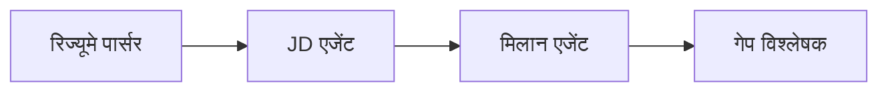
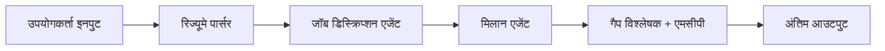

# मॉड्यूल 4 - ऑर्केस्ट्रेशन पैटर्न

⏱️ ~10 मिनट

इस मॉड्यूल में, आप Resume Job Fit Evaluator में उपयोग किए जाने वाले ऑर्केस्ट्रेशन पैटर्न की खोज करते हैं और सीखते हैं कि वर्कफ़्लो ग्राफ़ को कैसे पढ़ना, संशोधित करना और विस्तारित करना है। इन पैटर्न को समझना डेटा फ़्लो मुद्दों को डीबग करने और अपनी स्वयं की [मल्टी-एजेंट वर्कफ़्लोज़](https://learn.microsoft.com/agent-framework/workflows/) बनाने के लिए आवश्यक है।

---

## पैटर्न 1: अनुक्रमिक श्रृंखला

वर्कफ़्लो में मौलिक पैटर्न एक **अनुक्रमिक श्रृंखला** है - प्रत्येक एजेंट का आउटपुट सीधे अगले में जाता है।


```mermaid
flowchart LR
    RP[रिज्यूमे पार्सर] --> JD[JD एजेंट]
    JD --> MA[मिलान एजेंट]
    MA --> GA[गेप विश्लेषक]
```

कोड में, प्रत्येक `add_edge()` कॉल श्रृंखला में एक चरण बनाता है:

```python
.add_edge(resume_executor, jd_executor)       # ResumeParser आउटपुट → JD एजेंट
.add_edge(jd_executor, matching_executor)     # JD एजेंट आउटपुट → MatchingAgent
.add_edge(matching_executor, gap_executor)    # MatchingAgent आउटपुट → GapAnalyzer
```

> **क्यों अनुक्रमिक, न कि फैन-आउट/फैन-इन?** `WorkflowBuilder` आने वाली एजों के लिए **OR-semantic** का उपयोग करता है: जब भी कोई भी पूर्ववर्ती पूरा होता है, तो डाउनस्ट्रीम निष्पादक सक्रिय हो जाता है। यदि `matching_executor` के दो इनकमिंग एज (दोनों `resume_executor` और `jd_executor` से) होते, तो यह दो बार ट्रिगर होता - एक बार ResumeParser के खत्म होने पर और फिर JD Agent के खत्म होने पर - जिससे GapAnalyzer भी दो बार चलता और आउटपुट दो बार दिखाई देता। अनुक्रमिक पाइपलाइन इसे पूरी तरह से टालती है।

## पैटर्न 2: सामग्री रिले

क्योंकि `context_mode="last_agent"` का मतलब है कि प्रत्येक निष्पादक केवल अपने **प्रत्यक्ष पूर्ववर्ती का आउटपुट** देखता है, अनुक्रमिक श्रृंखला में एजेंटों को स्पष्ट रूप से वह डाटा आगे भेजना पड़ता है जो डाउनस्ट्रीम एजेंटों को चाहिए।

इस वर्कफ़्लो में:
- **ResumeParser** JD को यथावत `[JOB DESCRIPTION PASS-THROUGH]` में कॉपी करता है (ताकि JD Agent इसे खोज सके)।
- **JD Agent** `[PARSED RESUME]` को यथावत `[PARSED RESUME PASS-THROUGH]` में कॉपी करता है (ताकि MatchingAgent दोनों प्रोफाइल की तुलना कर सके)।

```
ResumeParser output
└─ [PARSED RESUME]               ← extracted by JD Agent
└─ [JOB DESCRIPTION PASS-THROUGH] ← extracted by JD Agent

JD Agent output
└─ [JD REQUIREMENTS]             ← extracted by MatchingAgent
└─ [PARSED RESUME PASS-THROUGH]  ← extracted by MatchingAgent
```

प्रत्येक रिले सेक्शन को **शब्दशः** कॉपी करना चाहिए - इसे सारांशित या शब्दों को बदलना उस डाउनस्ट्रीम एजेंट को तोड़ता है जो उस पर निर्भर करता है।

---

## पूर्ण ग्राफ़

अनुक्रमिक श्रृंखला और सामग्री रिले पैटर्न को मिलाकर पूर्ण वर्कफ़्लो बनता है:


```mermaid
flowchart LR
    U[उपयोगकर्ता इनपुट] --> RP[रिज्यूमे पार्सर]
    RP --> JD[जॉब डिस्क्रिप्शन एजेंट]
    JD --> MA[मिलान एजेंट]
    MA --> GA[गैप विश्लेषक + एमसीपी]
    GA --> O[अंतिम आउटपुट]
```

एजेंट इंस्पेक्टर इस समान ग्राफ संरचना को तब दिखाता है जब एजेंट स्थानीय रूप से चल रहा होता है। स्क्रीनशॉट के लिए देखें [मॉड्यूल 5 - लोकली टेस्ट करें](05-test-locally.md)।

---

## WorkflowBuilder कोड पढ़ना

पूरा `create_workflow()` फ़ंक्शन [`PersonalCareerCopilot/main.py`](../../../../../workshop/lab02-multi-agent/PersonalCareerCopilot/main.py) में है। तीनों `add_edge()` कॉल अनुक्रमिक पाइपलाइन बनाते हैं:

| # | एज | प्रभाव |
|---|------|--------|
| 1 | `resume_executor → jd_executor` | JD Agent को `[PARSED RESUME]` + `[JOB DESCRIPTION PASS-THROUGH]` मिलता है |
| 2 | `jd_executor → matching_executor` | MatchingAgent को `[JD REQUIREMENTS]` + `[PARSED RESUME PASS-THROUGH]` मिलता है |
| 3 | `matching_executor → gap_executor` | GapAnalyzer को फिट रिपोर्ट + गैप सूची मिलती है |

---

## ग्राफ को संशोधित करना

### नया एजेंट जोड़ना

एक पाँचवां एजेंट जोड़ने के लिए (जैसे GapAnalyzer के बाद एक **InterviewPrepAgent**):

1. एक `INTERVIEW_PREP_INSTRUCTIONS` कंसटैंट परिभाषित करें।
2. `Agent` + `AgentExecutor` ऑब्जेक्ट बनाएं (मौजूदा चार एजेंटों के समान पैटर्न)।
3. `WorkflowBuilder` में `.add_edge(gap_executor, interview_exec)` जोड़ें।
4. `output_executors=[interview_exec]` अपडेट करें।

> **महत्वपूर्ण:** `start_executor` ही एकमात्र एजेंट है जो कच्चा उपयोगकर्ता इनपुट प्राप्त करता है। अन्य सभी एजेंट उपरस्त एज से आउटपुट प्राप्त करते हैं।

---

## सामान्य ग्राफ़ गलतियाँ

| गलती | लक्षण | सुधार |
|---------|---------|-----|
| `output_executors` के लिए एज गायब | एजेंट चलता है लेकिन आउटपुट खाली है | सुनिश्चित करें कि `start_executor` से `output_executors` के हर एजेंट तक रास्ता हो |
| वृत्ताकार निर्भरता | अनंत लूप या टाइमआउट | देखें कि कोई एजेंट ऊपर के एजेंट को फीड न करे |
| `output_executors` में एजेंट के लिए कोई इनकमिंग एज नहीं | आउटपुट खाली है | कम से कम एक `add_edge(source, that_agent)` जोड़ें |
| फैन-इन के बिना कई `output_executors` | आउटपुट में केवल एक एजेंट का जवाब होता है | एक एकल आउटपुट एजेंट का उपयोग करें जो सभी को मिलाता है, या कई आउटपुट स्वीकार करें |
| `start_executor` गायब है | निर्माण के समय `ValueError` | हमेशा `WorkflowBuilder()` में `start_executor` निर्दिष्ट करें |

---

## ग्राफ को डीबग करना

### एजेंट इंस्पेक्टर का उपयोग करना

1. एजेंट को लोकली F5 से शुरू करें।
2. एजेंट इंस्पेक्टर खोलें (`Ctrl+Shift+P` → **Foundry Toolkit: Open Agent Inspector**)।
3. एक टेस्ट संदेश भेजें।
4. इंस्पेक्टर की प्रतिक्रिया पैनल में, **स्ट्रीमिंग आउटपुट** देखें - यह क्रम में प्रत्येक एजेंट का योगदान दिखाता है।


### लॉगिंग का उपयोग करना

डेटा फ्लो को ट्रेस करने के लिए `main.py` में लॉगिंग जोड़ें:

```python
import logging
logger = logging.getLogger("resume-job-fit")

# मुख्य() में, वर्कफ़्लो बनाने के बाद:
logger.info("Workflow graph built with edges: RP→JD, JD→MA, MA→GA")
```

सर्वर लॉग एजेंट निष्पादन क्रम और MCP टूल कॉल दिखाते हैं:

```
INFO:agent_framework:Executing agent: ResumeParser
INFO:agent_framework:Executing agent: JobDescriptionAgent
INFO:agent_framework:Executing agent: MatchingAgent
INFO:agent_framework:Executing agent: GapAnalyzer
INFO:agent_framework:Tool call: search_microsoft_learn_for_plan(skill="Kubernetes")
POST https://learn.microsoft.com/api/mcp → 200
INFO:agent_framework:Tool call: search_microsoft_learn_for_plan(skill="Terraform")
POST https://learn.microsoft.com/api/mcp → 200
```

---

### चेकपॉइंट

- [ ] आप वर्कफ़्लो में दो ऑर्केस्ट्रेशन पैटर्न: अनुक्रमिक श्रृंखला और सामग्री रिले की पहचान कर सकते हैं
- [ ] आप समझते हैं कि `context_mode="last_agent"` के कारण एजेंटों के बीच स्पष्ट डेटा रिले आवश्यक है
- [ ] आप `WorkflowBuilder` कोड पढ़ सकते हैं और प्रत्येक `add_edge()` कॉल को विज़ुअल ग्राफ़ के साथ मैप कर सकते हैं
- [ ] आप पाइपलाइन के अंत में नया एजेंट जोड़ना जानते हैं
- [ ] आप सामान्य ग्राफ गलतियों और उनके लक्षणों की पहचान कर सकते हैं

---

**पिछला:** [03 - एजेंट्स और पर्यावरण को कॉन्फ़िगर करें](03-configure-agents.md) · **अगला:** [05 - लोकली टेस्ट करें →](05-test-locally.md)

---

<!-- CO-OP TRANSLATOR DISCLAIMER START -->
**अस्वीकरण**:
इस दस्तावेज़ का अनुवाद AI अनुवाद सेवा [Co-op Translator](https://github.com/Azure/co-op-translator) का उपयोग करके किया गया है। जबकि हम सटीकता के लिए प्रयास करते हैं, कृपया ध्यान दें कि स्वचालित अनुवादों में त्रुटियाँ या अशुद्धियाँ हो सकती हैं। मूल दस्तावेज़ अपनी मूल भाषा में ही प्रामाणिक स्रोत माना जाना चाहिए। महत्वपूर्ण जानकारी के लिए, पेशेवर मानव अनुवाद की सिफारिश की जाती है। इस अनुवाद के उपयोग से उत्पन्न किसी भी गलतफहमी या गलत व्याख्या के लिए हम उत्तरदायी नहीं हैं।
<!-- CO-OP TRANSLATOR DISCLAIMER END -->