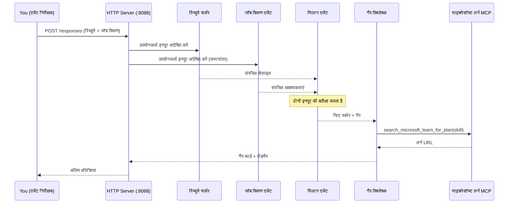
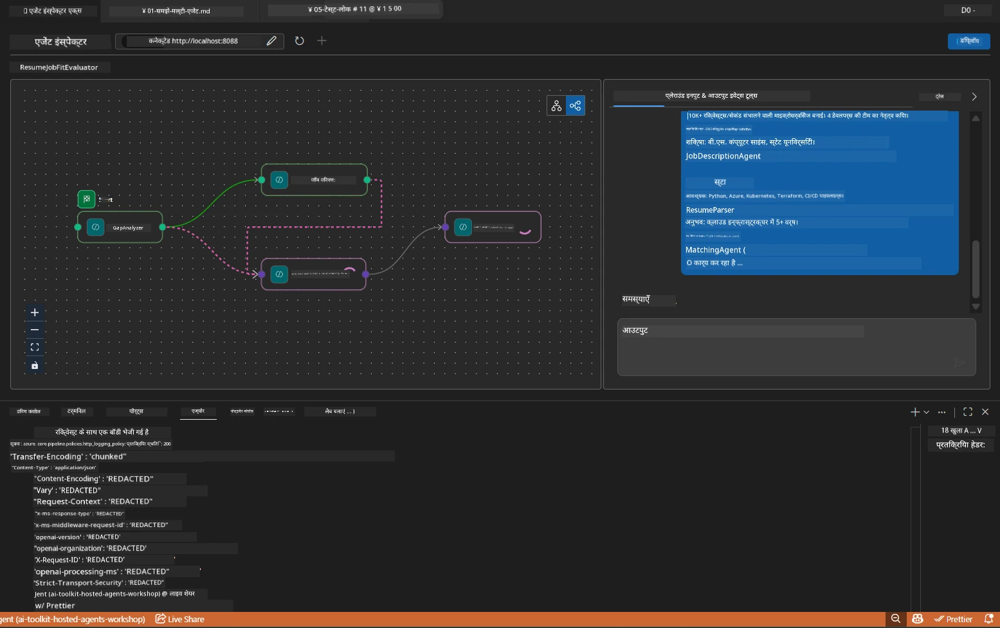

# Module 5 - स्थानीय रूप से परीक्षण करें (मल्टी-एजेंट)

इस मॉड्यूल में, आप मल्टी-एजेंट वर्कफ़्लो को स्थानीय रूप से चलाते हैं, इसे Agent Inspector के साथ परीक्षण करते हैं, और पुष्टि करते हैं कि सभी चार एजेंट और MCP टूल सही ढंग से काम कर रहे हैं, इससे पहले कि आप इसे Foundry पर तैनात करें।

### स्थानीय परीक्षण रन के दौरान क्या होता है


---

## चरण 1: एजेंट सर्वर शुरू करें

### विकल्प A: VS कोड टास्क का उपयोग करना (सिफारिश की गई)

1. `Ctrl+Shift+P` दबाएँ → **Tasks: Run Task** टाइप करें → **Run Lab02 HTTP Server** चुनें।
2. टास्क सर्वर को debugpy के साथ पोर्ट `5679` पर और एजेंट को पोर्ट `8088` पर शुरू करता है।
3. आउटपुट का इंतजार करें जब तक यह दिखाए:

```
INFO:resume-job-fit:Starting Resume -> Job Fit Evaluator HTTP server...
INFO:resume-job-fit:Server running on http://localhost:8088
```

### विकल्प B: टर्मिनल में मैनुअली उपयोग करना

```powershell
cd workshop\lab02-multi-agent\PersonalCareerCopilot
```

वर्चुअल एन्वायरनमेंट सक्रिय करें:

**PowerShell (Windows):**
```powershell
.\.venv\Scripts\Activate.ps1
```

**macOS/Linux:**
```bash
source .venv/bin/activate
```

सर्वर शुरू करें:

```powershell
python -m debugpy --listen 127.0.0.1:5679 -m agentdev run main.py --verbose --port 8088
```

### विकल्प C: F5 (डिबग मोड) का उपयोग करना

1. `F5` दबाएँ या **Run and Debug** (`Ctrl+Shift+D`) पर जाएं।
2. ड्रॉपडाउन से **Lab02 - Multi-Agent** लॉन्च कॉन्फ़िगरेशन चुनें।
3. सर्वर पूरी ब्रेकपॉइंट सपोर्ट के साथ शुरू होगा।

> **टिप:** डिबग मोड आपको `search_microsoft_learn_for_plan()` के अंदर ब्रेकपॉइंट सेट करने देता है ताकि MCP प्रतिक्रियाओं का निरीक्षण किया जा सके, या एजेंट के इंस्ट्रक्शन स्ट्रिंग्स के अंदर यह देखने के लिए कि प्रत्येक एजेंट क्या प्राप्त करता है।

---

## चरण 2: Agent Inspector खोलें

1. `Ctrl+Shift+P` दबाएँ → **Foundry Toolkit: Open Agent Inspector** टाइप करें।
2. Agent Inspector ब्राउज़र टैब में `http://localhost:5679` पर खुल जाता है।
3. आपको एजेंट इंटरफ़ेस संदेश स्वीकार करने के लिए तैयार दिखना चाहिए।

> **यदि Agent Inspector नहीं खुलता:** सुनिश्चित करें कि सर्वर पूरी तरह से शुरू हो चुका है (आपको "Server running" लॉग दिखाई दे रहा है)। यदि पोर्ट 5679 व्यस्त है, तो देखें [Module 8 - Troubleshooting](08-troubleshooting.md)।

---

## चरण 3: स्मोक टेस्ट चलाएं

इन तीन परीक्षणों को क्रम से चलाएं। प्रत्येक वर्कफ़्लो के अधिक हिस्से का परीक्षण करता है।

### परीक्षण 1: बुनियादी रिज्यूमे + नौकरी विवरण

Agent Inspector में निम्नलिखित पेस्ट करें:

```
Resume:
Jane Doe
Senior Software Engineer with 5 years of experience in Python, Django, and AWS.
Built microservices handling 10K+ requests/second. Led a team of 4 developers.
Certifications: AWS Solutions Architect Associate.
Education: B.S. Computer Science, State University.

Job Description:
Senior Cloud Engineer at Contoso Ltd.
Required: Python, Azure, Kubernetes, Terraform, CI/CD pipelines.
Preferred: Go, monitoring (Prometheus/Grafana), cost optimization.
Experience: 5+ years in cloud infrastructure.
Certifications: Azure Solutions Architect Expert preferred.
```

**अपेक्षित आउटपुट संरचना:**

प्रतिक्रिया में ठीक-ठाक चारों एजेंटों का आउटपुट क्रमबद्ध होना चाहिए:

1. **Resume Parser आउटपुट** - कौशल को श्रेणीबद्ध करके संरचित उम्मीदवार प्रोफ़ाइल
2. **JD एजेंट आउटपुट** - आवश्यक बनाम पसंदीदा कौशल के साथ संरचित आवश्यकताएँ
3. **Matching एजेंट आउटपुट** - फिट स्कोर (0-100) ब्रेकडाउन के साथ, मेल खाते कौशल, गायब कौशल, भेद
4. **Gap Analyzer आउटपुट** - प्रत्येक गायब कौशल के लिए व्यक्तिगत गैप कार्ड, प्रत्येक में Microsoft Learn URLs



### परीक्षण 1 में क्या सत्यापित करें

| जांच | अपेक्षित | पास? |
|-------|----------|-------|
| प्रतिक्रिया में फिट स्कोर हो | 0-100 के बीच संख्या ब्रेकडाउन के साथ | |
| मेल खाते कौशल सूचीबद्ध हैं | Python, CI/CD (आंशिक), आदि | |
| गायब कौशल सूचीबद्ध हैं | Azure, Kubernetes, Terraform, आदि | |
| प्रत्येक गायब कौशल के लिए गैप कार्ड मौजूद हैं | प्रत्येक कौशल के लिए एक कार्ड | |
| Microsoft Learn URLs मौजूद हैं | असली `learn.microsoft.com` लिंक | |
| प्रतिक्रिया में कोई त्रुटि संदेश नहीं | साफ़-सुथरी संरचित आउटपुट | |

### परीक्षण 2: MCP टूल निष्पादन सत्यापित करें

जब टेस्ट 1 चल रहा हो, तब **सर्वर टर्मिनल** में MCP लॉग प्रविष्टियों की जाँच करें:

```
GET https://learn.microsoft.com/api/mcp → 405 (Method Not Allowed)
POST https://learn.microsoft.com/api/mcp → 200
DELETE https://learn.microsoft.com/api/mcp → 405 (Method Not Allowed)
```

| लॉग प्रविष्टि | अर्थ | अपेक्षित? |
|-----------|---------|-----------|
| `GET ... → 405` | प्रारंभिककरण के दौरान MCP क्लाइंट GET के साथ जांच करता है | हाँ - सामान्य |
| `POST ... → 200` | Microsoft Learn MCP सर्वर को असली टूल कॉल | हाँ - यह असली कॉल है |
| `DELETE ... → 405` | क्लीनअप के दौरान MCP क्लाइंट DELETE के साथ जांच करता है | हाँ - सामान्य |
| `POST ... → 4xx/5xx` | टूल कॉल विफल | नहीं - देखें [Troubleshooting](08-troubleshooting.md) |

> **मुख्य बिंदु:** `GET 405` और `DELETE 405` पंक्तियाँ **अपेक्षित व्यवहार** हैं। केवल तब चिंता करें यदि `POST` कॉल गैर-200 स्टेटस कोड लौटाते हैं।

### परीक्षण 3: एज केस - उच्च फिट उम्मीदवार

एक रिज्यूमे पेस्ट करें जो नौकरी विवरण के बहुत करीब मैच करता हो ताकि GapAnalyzer उच्च-फिट परिदृश्यों को संभाल सके:

```
Resume:
Alex Chen
Senior Cloud Engineer with 7 years of experience.
Skills: Python, Azure (AKS, Functions, DevOps), Kubernetes, Terraform, CI/CD (GitHub Actions, Azure Pipelines), Go, Prometheus, Grafana, cost optimization.
Certifications: Azure Solutions Architect Expert, Azure DevOps Engineer Expert.
Led infrastructure migration to Azure for 3 enterprise clients.
Education: M.S. Computer Science, Tech University.

Job Description:
Senior Cloud Engineer at Contoso Ltd.
Required: Python, Azure, Kubernetes, Terraform, CI/CD pipelines.
Preferred: Go, monitoring (Prometheus/Grafana), cost optimization.
Experience: 5+ years in cloud infrastructure.
Certifications: Azure Solutions Architect Expert preferred.
```

**अपेक्षित व्यवहार:**
- फिट स्कोर **80+** होना चाहिए (अधिकांश कौशल मेल खाते हैं)
- गैप कार्ड फाउंडेशनल लर्निंग की बजाय पॉलिश/इंटरव्यू तैयारी पर केंद्रित होने चाहिए
- GapAnalyzer निर्देश कहते हैं: "यदि फिट >= 80, तो पॉलिश/इंटरव्यू तैयारी पर ध्यान दें"

---

## चरण 4: आउटपुट की पूर्णता सत्यापित करें

परीक्षणों को चलाने के बाद, आउटपुट निम्न मानदंडों को पूरा करता है यह जांचें:

### आउटपुट संरचना चेकलिस्ट

| भाग | एजेंट | मौजूद? |
|---------|-------|----------|
| उम्मीदवार प्रोफ़ाइल | Resume Parser | |
| तकनीकी कौशल (समूहबद्ध) | Resume Parser | |
| भूमिका अवलोकन | JD एजेंट | |
| आवश्यक बनाम पसंदीदा कौशल | JD एजेंट | |
| फिट स्कोर ब्रेकडाउन के साथ | Matching एजेंट | |
| मेल खाते / गायब / आंशिक कौशल | Matching एजेंट | |
| प्रत्येक गायब कौशल के लिए गैप कार्ड | Gap Analyzer | |
| गैप कार्ड में Microsoft Learn URLs | Gap Analyzer (MCP) | |
| सीखने का क्रम (संख्याबद्ध) | Gap Analyzer | |
| समयरेखा सारांश | Gap Analyzer | |

### इस चरण पर सामान्य समस्याएँ

| समस्या | कारण | समाधान |
|-------|-------|-----|
| केवल 1 गैप कार्ड (बाकी कटा हुआ) | GapAnalyzer निर्देशों में CRITICAL ब्लॉक नहीं | `GAP_ANALYZER_INSTRUCTIONS` में `CRITICAL:` पैराग्राफ जोड़ें - देखें [Module 3](03-configure-agents.md) |
| कोई Microsoft Learn URL नहीं | MCP एंडपॉइंट पहुँच योग्य नहीं | इंटरनेट कनेक्टिविटी जांचें। `.env` में `MICROSOFT_LEARN_MCP_ENDPOINT` सत्यापित करें कि वह `https://learn.microsoft.com/api/mcp` है |
| खाली प्रतिक्रिया | `PROJECT_ENDPOINT` या `MODEL_DEPLOYMENT_NAME` सेट नहीं | `.env` फ़ाइल मान जांचें। टर्मिनल में `echo $env:PROJECT_ENDPOINT` चलाएं |
| फिट स्कोर 0 या गायब | MatchingAgent को कोई ऊपर से डाटा नहीं मिला | सुनिश्चित करें कि `add_edge(resume_parser, matching_agent)` और `add_edge(jd_agent, matching_agent)` `create_workflow()` में मौजूद हैं |
| एजेंट शुरू होता है पर तुरंत बाहर निकलता है | इम्पोर्ट त्रुटि या निर्भरता गायब | दोबारा `pip install -r requirements.txt` चलाएं। टर्मिनल में स्टैक ट्रेस देखें |
| `validate_configuration` त्रुटि | env वेरिएबल गायब | `.env` बनाएँ जिसमें `PROJECT_ENDPOINT=<your-endpoint>` और `MODEL_DEPLOYMENT_NAME=<your-model>` शामिल हो |

---

## चरण 5: अपने डेटा के साथ परीक्षण करें (वैकल्पिक)

अपने रिज्यूमे और असली नौकरी विवरण पेस्ट करके प्रयास करें। इससे पुष्टि होती है:

- एजेंट विभिन्न रिज्यूमे प्रारूपों (कालानुक्रमिक, कार्यात्मक, हाइब्रिड) को संभालते हैं
- JD एजेंट विभिन्न JD शैलियों (बुलेट अंक, पैराग्राफ, संरचित) को संभालता है
- MCP टूल वास्तविक कौशल के लिए प्रासंगिक संसाधन लौटाता है
- गैप कार्ड आपके विशिष्ट पृष्ठभूमि के लिए व्यक्तिगत होते हैं

> **गोपनीयता नोट:** स्थानीय स्तर पर परीक्षण करते समय, आपका डेटा केवल आपके कंप्यूटर पर रहता है और केवल आपके Azure OpenAI तैनाती को भेजा जाता है। इसे कार्यशाला के इन्फ्रास्ट्रक्चर द्वारा लॉग या स्टोर नहीं किया जाता। यदि आप चाहें तो प्लेसहोल्डर नामों का उपयोग करें (जैसे, अपना असली नाम न लिखकर "Jane Doe")।

---

### चेकपॉइंट

- [ ] पोर्ट `8088` पर सर्वर सफलतापूर्वक शुरू हुआ (लॉग में "Server running" दिखता है)
- [ ] Agent Inspector खुला और एजेंट से जुड़ा
- [ ] परीक्षण 1: फिट स्कोर, मेल खाते/गायब कौशल, गैप कार्ड, और Microsoft Learn URLs के साथ पूर्ण प्रतिक्रिया
- [ ] परीक्षण 2: MCP लॉग में `POST ... → 200` दिख रहा है (टूल कॉल सफल)
- [ ] परीक्षण 3: उच्च फिट उम्मीदवार को 80+ स्कोर और पॉलिश केंद्रित सुझाव मिलें
- [ ] सभी गैप कार्ड मौजूद हैं (प्रत्येक गायब कौशल के लिए एक, कोई कटाव नहीं)
- [ ] सर्वर टर्मिनल में कोई त्रुटि या स्टैक ट्रेस नहीं

---

**पिछला:** [04 - Orchestration Patterns](04-orchestration-patterns.md) · **अगला:** [06 - Deploy to Foundry →](06-deploy-to-foundry.md)

---

<!-- CO-OP TRANSLATOR DISCLAIMER START -->
**अस्वीकरण**:  
इस दस्तावेज़ का अनुवाद एआई अनुवाद सेवा [Co-op Translator](https://github.com/Azure/co-op-translator) का उपयोग करके किया गया है। जबकि हम सटीकता के लिए प्रयासरत हैं, कृपया ध्यान दें कि स्वचालित अनुवाद में त्रुटियाँ या असंगतियाँ हो सकती हैं। मूल भाषा में दस्तावेज़ को अधिकारिक स्रोत माना जाना चाहिए। महत्वपूर्ण जानकारी के लिए, पेशेवर मानव अनुवाद की सलाह दी जाती है। इस अनुवाद के उपयोग से उत्पन्न किसी भी गलतफहमी या गलत व्याख्या के लिए हम जिम्मेदार नहीं हैं।
<!-- CO-OP TRANSLATOR DISCLAIMER END -->