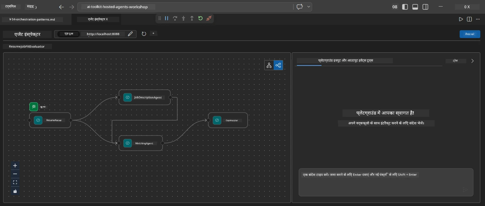
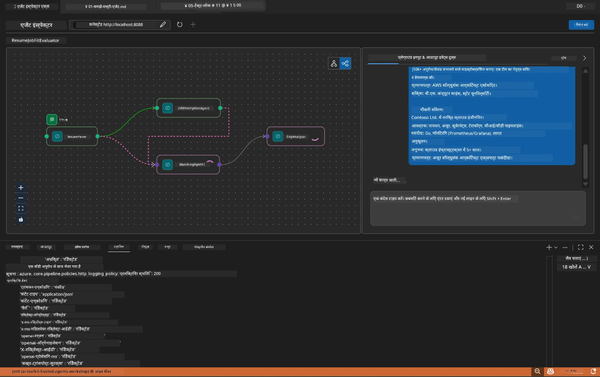
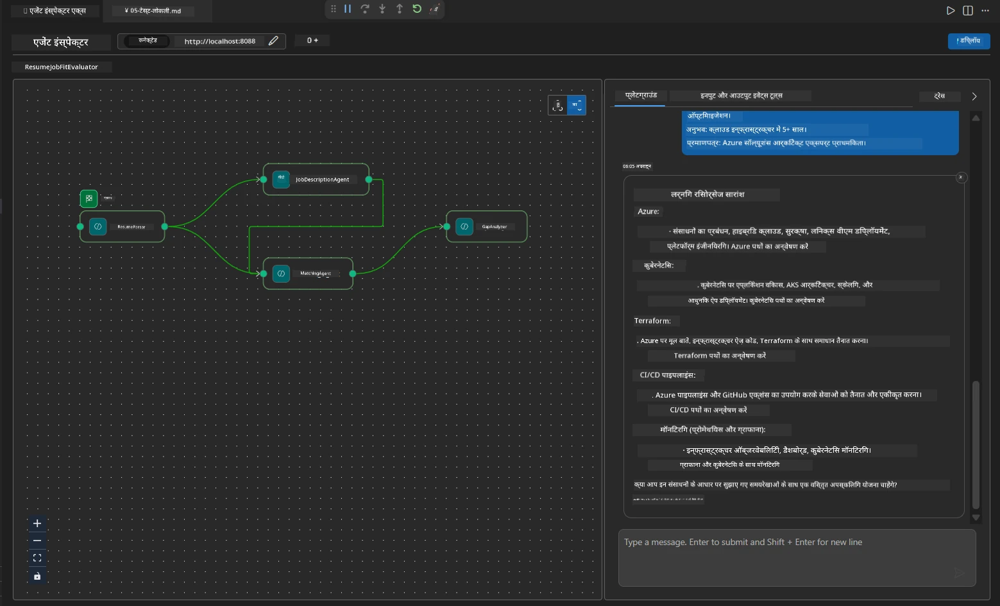

# मॉड्यूल 5 - लोकली परीक्षण करें

⏱️ ~15 मिनट

इस मॉड्यूल में, आप मल्टी-एजेंट वर्कफ़्लो को स्थानीय रूप से चलाते हैं, इसे एजेंट इंस्पेक्टर के साथ टेस्ट करते हैं, और तैनाती से पहले सभी चार एजेंट और MCP टूल सही ढंग से काम करते हैं यह सत्यापित करते हैं।

---

## चरण 1: एजेंट सर्वर शुरू करें

### विकल्प A: VS कोड टास्क का उपयोग करना (सिफारिश की गई)

1. `workshop/lab02-multi-agent/PersonalCareerCopilot/` को अपने VS कोड फ़ोल्डर के रूप में खोलें।
2. `Ctrl+Shift+P` दबाएं → **Tasks: Run Task** टाइप करें → **Run Agent HTTP Server** चुनें।
3. टास्क सर्वर को `5679` पोर्ट पर debugpy के साथ और एजेंट को `8088` पोर्ट पर शुरू करता है।
4. आउटपुट के दिखने तक प्रतीक्षा करें:

```
INFO:resume-job-fit:Starting Resume -> Job Fit Evaluator HTTP server...
INFO:resume-job-fit:Server running on http://localhost:8088
```

### विकल्प B: F5 (डीबग मोड) का उपयोग करना

1. `F5` दबाएं → **Debug Local Agent HTTP Server** चुनें।
2. सर्वर पूरी ब्रेकप्वाइंट सपोर्ट के साथ शुरू होता है - MCP प्रतिक्रियाओं या एजेंट आउटपुट की जाँच के लिए उपयोगी।

---

## चरण 2: एजेंट इंस्पेक्टर खोलें

1. `Ctrl+Shift+P` दबाएं → **Foundry Toolkit: Open Agent Inspector** टाइप करें।
2. एजेंट इंस्पेक्टर एक VS कोड पैनल के रूप में खुलता है जो `http://localhost:8088` से जुड़ा होता है।
3. आपको एजेंट इंटरफ़ेस संदेश स्वीकार करने के लिए तैयार दिखाई देना चाहिए।



> **अगर एजेंट इंस्पेक्टर नहीं खुलता:** सुनिश्चित करें कि सर्वर पूरी तरह से शुरू हो गया है (आप "Server running" लॉग देखें)। यदि पोर्ट 5679 व्यस्त है, तो देखें [मॉड्यूल 8 - समस्या निवारण](08-troubleshooting.md).

---

## चरण 2b: (वैकल्पिक) वर्कफ़्लो विज़ुअलाइज़र खोलें

Foundry Toolkit में एक वास्तविक समय का **Workflow Visualizer** शामिल है जो दिखाता है कि एजेंट ग्राफ निष्पादन के दौरान कैसे इंटरैक्ट करते हैं। यह विशेष रूप से मल्टी-एजेंट डीबगिंग के लिए उपयोगी है।

1. `Ctrl+Shift+P` दबाएं → **Foundry Toolkit: Open Visualizer for Hosted Agents** टाइप करें।
2. एक नया VS कोड टैब खुलता है जो लाइव निष्पादन ग्राफ दिखाता है।
3. जैसे ही आप एजेंट इंस्पेक्टर में संदेश भेजते हैं, विज़ुअलाइज़र स्वचालित रूप से अपडेट हो जाता है - हरे नोड पूरे एजेंट को सूचित करते हैं, और एनिमेटेड एजेज़ उनके बीच डेटा प्रवाह दिखाती हैं।

> **पोर्ट टकराव:** यदि विज़ुअलाइज़र पोर्ट पहले से उपयोग में है, तो इसे VS कोड सेटिंग्स → **प्लगइन्स** → **Microsoft Foundry Configuration** → **Hosted Agents: Visualizer Port** में बदलें।

---

## चरण 3: स्मोक टेस्ट चलाएं

इन तीन परीक्षणों को क्रम से चलाएं। प्रत्येक परीक्षण वर्कफ़्लो के अधिक हिस्सों को परखता है।

### परीक्षण 1: बेसिक रिज्यूमे + जॉब विवरण

निम्नलिखित को एजेंट इंस्पेक्टर में पेस्ट करें:

```
Resume:
Jane Doe
Senior Software Engineer with 5 years of experience in Python, Django, and AWS.
Built microservices handling 10K+ requests/second. Led a team of 4 developers.
Certifications: AWS Solutions Architect Associate.
Education: B.S. Computer Science, State University.

Job Description:
Senior Cloud Engineer at Contoso Ltd.
Required: Python, Azure, Kubernetes, Terraform, CI/CD pipelines.
Preferred: Go, monitoring (Prometheus/Grafana), cost optimization.
Experience: 5+ years in cloud infrastructure.
Certifications: Azure Solutions Architect Expert preferred.
```

**अपेक्षित आउटपुट संरचना:**

प्रतिक्रिया में सभी चार एजेंटों का आउटपुट क्रम से होना चाहिए:

1. **रिज्यूमे पार्सर आउटपुट** - दो लेबल वाले सेक्शन: `[PARSED RESUME]` (ग्रुप्ड स्किल्स के साथ कैंडिडेट प्रोफ़ाइल) और `[JOB DESCRIPTION PASS-THROUGH]` (मूल जॉब विवरण पाठ जो JD एजेंट को भेजा जाता है)
2. **JD एजेंट आउटपुट** - आवश्यक बनाम पसंदीदा कौशल अलग किए गए संरचित आवश्यकताएं
3. **मैचिंग एजेंट आउटपुट** - फिट स्कोर (0-100) विथ ब्रेकडाउन, मेल खाए कौशल, गुम कौशल, अंतर
4. **गैप एनालाइज़र आउटपुट** - प्रत्येक गुम कौशल के लिए व्यक्तिगत गैप कार्ड्स, प्रत्येक के साथ Microsoft Learn URLs





### परीक्षण 1 में क्या सत्यापित करें

| जांचें | अपेक्षित | पास? |
|-------|----------|-------|
| प्रतिक्रिया में फिट स्कोर है | 0-100 के बीच संख्या और ब्रेकडाउन | |
| मेल खाते कौशल सूचीबद्ध हैं | Python, CI/CD (आंशिक), आदि | |
| गुम कौशल सूचीबद्ध हैं | Azure, Kubernetes, Terraform, आदि | |
| प्रत्येक गुम कौशल के लिए गैप कार्ड मौजूद हैं | प्रत्येक कौशल के लिए एक कार्ड | |
| Microsoft Learn URL मौजूद हैं | असली `learn.microsoft.com` लिंक | |
| प्रतिक्रिया में कोई त्रुटि संदेश नहीं है | साफ़-सुथरा संरचित आउटपुट | |

### परीक्षण 2: एज केस - उच्च फिट कैंडिडेट

एक ऐसा रिज्यूमे पेस्ट करें जो JD से बहुत मेल खाता हो ताकि गैपएनालाइज़र उच्च फिट मामलों को संभाल सके:

```
Resume:
Alex Chen
Senior Cloud Engineer with 7 years of experience.
Skills: Python, Azure (AKS, Functions, DevOps), Kubernetes, Terraform, CI/CD (GitHub Actions, Azure Pipelines), Go, Prometheus, Grafana, cost optimization.
Certifications: Azure Solutions Architect Expert, Azure DevOps Engineer Expert.
Led infrastructure migration to Azure for 3 enterprise clients.
Education: M.S. Computer Science, Tech University.

Job Description:
Senior Cloud Engineer at Contoso Ltd.
Required: Python, Azure, Kubernetes, Terraform, CI/CD pipelines.
Preferred: Go, monitoring (Prometheus/Grafana), cost optimization.
Experience: 5+ years in cloud infrastructure.
Certifications: Azure Solutions Architect Expert preferred.
```

**अपेक्षित व्यवहार:**
- फिट स्कोर **80+** होना चाहिए (अधिकांश कौशल मेल खाते हैं)
- गैप कार्ड फाउंडेशनल लर्निंग से अधिक पोलिश/साक्षात्कार तैयारी पर केंद्रित होनी चाहिए
- गैपएनालाइज़र निर्देश कहते हैं: "अगर फिट >= 80, तो पोलिश/साक्षात्कार तैयारी पर ध्यान दें"

---

## चरण 4: अपने डेटा के साथ परीक्षण करें (वैकल्पिक)

अपना रिज्यूमे और वास्तविक जॉब विवरण पेस्ट करके देखें। इससे यह सत्यापित करने में मदद मिलती है कि:

- एजेंट विभिन्न रिज्यूमे प्रारूपों (कालानुक्रमिक, कार्यात्मक, हाइब्रिड) को संभालते हैं
- JD एजेंट विभिन्न JD शैलियों (बुलेट पॉइंट, पैराग्राफ, संरचित) को संभालता है
- MCP टूल वास्तविक कौशलों के लिए प्रासंगिक संसाधन लौटाता है
- गैप कार्ड आपके विशिष्ट पृष्ठभूमि के अनुसार व्यक्तिगत हैं

> **प्राइवेसी - पथ A (Foundry क्लाउड):** रिज्यूमे और JD टेक्स्ट आपके Azure OpenAI डिप्लॉयमेंट को इन्फेरेंस के लिए भेजा जाता है। इसे वर्कशॉप इंफ्रास्ट्रक्चर द्वारा लॉग या स्टोर नहीं किया जाता। आप चाहें तो प्लेसहोल्डर नाम (जैसे "Jane Doe") का उपयोग करें।
>
> **प्राइवेसी - पथ B (Foundry लोकल):** सभी चार एजेंट इन्फेरेंस पूरी तरह से आपके डिवाइस पर चलते हैं। आपका रिज्यूमे और जॉब विवरण टेक्स्ट **कभी भी आपकी मशीन से बाहर नहीं जाता**। एकमात्र आउटबाउंड कॉल MCP टूल द्वारा `https://learn.microsoft.com/api/mcp` से संसाधन प्राप्त करना है; उस क्वेरी में केवल कौशल का नाम होता है, आपकी व्यक्तिगत जानकारी नहीं।

---

### चेकपॉइंट

- [ ] सर्वर सफलतापूर्वक पोर्ट `8088` पर शुरू हुआ (लॉग में "Server running" दिखता है)
- [ ] एजेंट इंस्पेक्टर खुला और एजेंट से जुड़ा हुआ
- [ ] परीक्षण 1: फिट स्कोर, मेल खाते/गुम कौशल, गैप कार्ड, और Microsoft Learn URL के साथ पूर्ण प्रतिक्रिया 
- [ ] परीक्षण 2: उच्च फिट कैंडिडेट को 80+ स्कोर और पोलिश-केंद्रित सिफारिशें मिलीं
- [ ] सभी गैप कार्ड मौजूद हैं (प्रत्येक गुम कौशल के लिए एक, कोई कटौती नहीं)
- [ ] सर्वर टर्मिनल में कोई त्रुटि या स्टैक ट्रेस नहीं

---

**पिछला:** [04 - ऑर्केस्ट्रेशन पैटर्न](04-orchestration-patterns.md) · **अगला:** [06 - Foundry में तैनाती →](06-deploy-to-foundry.md)

---

<!-- CO-OP TRANSLATOR DISCLAIMER START -->
**अस्वीकरण**:
इस दस्तावेज़ का अनुवाद AI अनुवाद सेवा [Co-op Translator](https://github.com/Azure/co-op-translator) का उपयोग करके किया गया है। जबकि हम सटीकता के लिए प्रयास करते हैं, कृपया ध्यान दें कि स्वचालित अनुवादों में त्रुटियाँ या अशुद्धियाँ हो सकती हैं। मूल दस्तावेज़ अपनी मूल भाषा में ही प्रामाणिक स्रोत माना जाना चाहिए। महत्वपूर्ण जानकारी के लिए, पेशेवर मानव अनुवाद की सिफारिश की जाती है। इस अनुवाद के उपयोग से उत्पन्न किसी भी गलतफहमी या गलत व्याख्या के लिए हम उत्तरदायी नहीं हैं।
<!-- CO-OP TRANSLATOR DISCLAIMER END -->