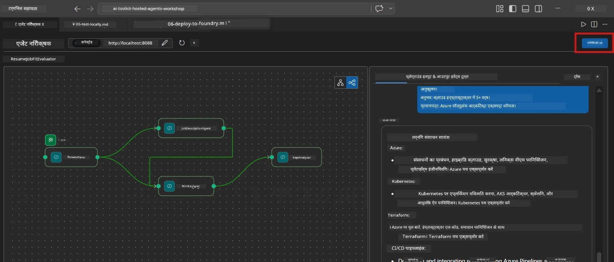
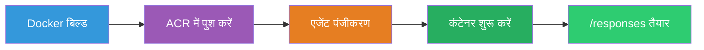
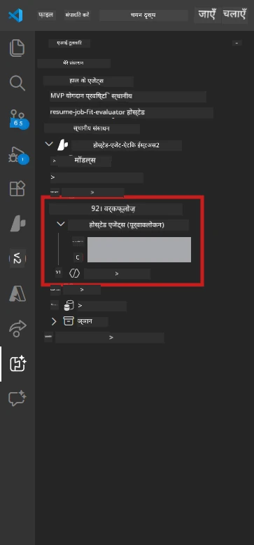

# Module 6 - Foundry एजेंट सेवा में डिप्लॉय करें

इस मॉड्यूल में, आप अपनी स्थानीय रूप से परीक्षण की गई मल्टी-एजेंट वर्कफ़्लो को [Microsoft Foundry](https://learn.microsoft.com/azure/foundry/agents/concepts/hosted-agents) पर **Hosted Agent** के रूप में डिप्लॉय करते हैं। डिप्लॉयमेंट प्रक्रिया एक Docker कंटेनर इमेज बनाती है, इसे [Azure Container Registry (ACR)](https://learn.microsoft.com/azure/container-registry/container-registry-intro) में पुश करती है, और [Foundry Agent Service](https://learn.microsoft.com/azure/foundry/agents/how-to/publish-agent) में एक होस्टेड एजेंट संस्करण बनाती है।

> **Lab 01 से मुख्य अंतर:** डिप्लॉयमेंट प्रक्रिया समान है। Foundry आपकी मल्टी-एजेंट वर्कफ़्लो को एक सिंगल होस्टेड एजेंट के रूप में मानता है - जटिलता कंटेनर के अंदर होती है, लेकिन डिप्लॉयमेंट इंटरफ़ेस वही `/responses` एंडपॉइंट है।

---

## पूर्वापेक्षा जाँच

डिप्लॉय करने से पहले, नीचे दिए गए प्रत्येक आइटम की जाँच करें:

1. **एजेंट स्थानीय स्मोक टेस्ट पास करता है:**
   - आपने [Module 5](05-test-locally.md) में सभी 3 टेस्ट पूरे किए हैं और वर्कफ़्लो ने पूर्ण आउटपुट प्रदान किया है जिसमें गैप कार्ड और Microsoft Learn URL शामिल हैं।

2. **आपके पास [Azure AI User](https://learn.microsoft.com/azure/foundry/concepts/rbac-foundry) भूमिका है:**
   - [Lab 01, Module 2](../../lab01-single-agent/docs/02-create-foundry-project.md) में असाइन की गई। पुष्टि करें:
   - [Azure Portal](https://portal.azure.com) → आपका Foundry **प्रोजेक्ट** रिसोर्स → **Access control (IAM)** → **Role assignments** → सुनिश्चित करें कि **[Azure AI User](https://aka.ms/foundry-ext-project-role)** आपकी अकाउंट के लिए सूचीबद्ध है।

3. **आप VS Code में Azure में साइन इन हैं:**
   - VS Code के नीचे-बाएं अकाउंट आइकन देखें। आपका अकाउंट नाम दिखाई देना चाहिए।

4. **`agent.yaml` में सही मान हैं:**
   - `PersonalCareerCopilot/agent.yaml` खोलें और सत्यापित करें:
     ```yaml
     environment_variables:
       - name: PROJECT_ENDPOINT
         value: ${PROJECT_ENDPOINT}
       - name: MODEL_DEPLOYMENT_NAME
         value: ${MODEL_DEPLOYMENT_NAME}
     ```
   - ये आपके `main.py` द्वारा पढ़े जाने वाले env vars से मेल खाने चाहिए।

5. **`requirements.txt` में सही संस्करण हैं:**
   ```
   agent-framework-azure-ai==1.0.0rc3
   agent-framework-core==1.0.0rc3
   azure-ai-agentserver-agentframework==1.0.0b16
   azure-ai-agentserver-core==1.0.0b16
   debugpy
   agent-dev-cli --pre
   ```

---

## चरण 1: डिप्लॉयमेंट शुरू करें

### विकल्प A: एजेंट इंस्पेक्टर से डिप्लॉय करें (अनुशंसित)

यदि एजेंट F5 के माध्यम से चल रहा है और एजेंट इंस्पेक्टर खुला है:

1. एजेंट इंस्पेक्टर पैनल के **शीर्ष-दाएँ कोना** पर देखें।
2. **Deploy** बटन (इसे ऊपर की ओर तीर ↑ वाले क्लाउड आइकन के साथ) पर क्लिक करें।
3. डिप्लॉयमेंट विजार्ड खुल जाएगा।



### विकल्प B: कमांड पैलेट से डिप्लॉय करें

1. `Ctrl+Shift+P` दबाकर **Command Palette** खोलें।
2. टाइप करें: **Microsoft Foundry: Deploy Hosted Agent** और इसे चुनें।
3. डिप्लॉयमेंट विजार्ड खुल जाएगा।

---

## चरण 2: डिप्लॉयमेंट कॉन्फ़िगर करें

### 2.1 लक्ष्य परियोजना चुनें

1. एक ड्रॉपडाउन आपके Foundry प्रोजेक्ट दिखाता है।
2. उस प्रोजेक्ट का चयन करें जिसे आपने वर्कशॉप के दौरान उपयोग किया था (उदा. `workshop-agents`)।

### 2.2 कंटेनर एजेंट फाइल चुनें

1. आपसे एजेंट एंट्री पॉइंट चुनने के लिए कहा जाएगा।
2. `workshop/lab02-multi-agent/PersonalCareerCopilot/` पर नेविगेट करें और **`main.py`** चुनें।

### 2.3 संसाधन कॉन्फ़िगर करें

| सेटिंग | अनुशंसित मान | नोट्स |
|---------|------------------|-------|
| **CPU** | `0.25` | डिफ़ॉल्ट। मल्टी-एजेंट वर्कफ़्लो को अधिक CPU की जरूरत नहीं क्योंकि मॉडल कॉल I/O-बाउंड होते हैं |
| **मेमोरी** | `0.5Gi` | डिफ़ॉल्ट। यदि आप बड़े डेटा प्रोसेसिंग टूल जोड़ते हैं तो इसे `1Gi` तक बढ़ाएँ |

---

## चरण 3: पुष्टि करें और डिप्लॉय करें

1. विजार्ड एक डिप्लॉयमेंट सारांश दिखाता है।
2. समीक्षा करें और **Confirm and Deploy** पर क्लिक करें।
3. VS Code में प्रगति देखें।

### डिप्लॉयमेंट के दौरान क्या होता है

VS Code के **Output** पैनल (ड्रॉपडाउन से "Microsoft Foundry" चुनें) को देखें:


1. **Docker build** - आपकी `Dockerfile` से कंटेनर बनाता है:
   ```
   Step 1/6 : FROM python:3.14-slim
   Step 2/6 : WORKDIR /app
   ...
   Successfully built abc123def456
   ```

2. **Docker push** - इमेज को ACR में पुश करता है (पहली बार डिप्लॉयमेंट में 1-3 मिनट लग सकते हैं)।

3. **एजेंट पंजीकरण** - Foundry `agent.yaml` मेटाडेटा का उपयोग करके एक होस्टेड एजेंट बनाता है। एजेंट का नाम `resume-job-fit-evaluator` है।

4. **कंटेनर स्टार्ट** - कंटेनर Foundry की मैनेज्ड इन्फ्रास्ट्रक्चर में एक सिस्टम-मैनेज्ड पहचान के साथ शुरू होता है।

> **पहली डिप्लॉयमेंट धीमी होती है** (Docker सभी लेयर पुश करता है)। बाद की डिप्लॉयमेंट कैश्ड लेयर का पुनः उपयोग करती हैं और तेज होती हैं।

### मल्टी-एजेंट विशेष नोट्स

- **सभी चार एजेंट एक कंटेनर के अंदर हैं।** Foundry केवल एक होस्टेड एजेंट के रूप में देखता है। WorkflowBuilder ग्राफ़ आंतरिक रूप से चलता है।
- **MCP कॉल बाहर जाते हैं।** कंटेनर को `https://learn.microsoft.com/api/mcp` तक पहुँचने के लिए इंटरनेट एक्सेस की आवश्यकता है। Foundry की मैनेज्ड इन्फ्रास्ट्रक्चर यह डिफ़ॉल्ट रूप से प्रदान करती है।
- **[Managed Identity](https://learn.microsoft.com/python/api/overview/azure/identity-readme#managed-identity-support).** होस्टेड पर्यावरण में, `main.py` में `get_credential()` `ManagedIdentityCredential()` लौटाता है (क्योंकि `MSI_ENDPOINT` सेट है)। यह स्वचालित है।

---

## चरण 4: डिप्लॉयमेंट स्थिति सत्यापित करें

1. **Microsoft Foundry** साइडबार खोलें (Activity Bar में Foundry आइकन पर क्लिक करें)।
2. अपने प्रोजेक्ट के तहत **Hosted Agents (Preview)** का विस्तार करें।
3. **resume-job-fit-evaluator** (या आपका एजेंट नाम) ढूंढें।
4. एजेंट नाम पर क्लिक करें → संस्करण का विस्तार करें (उदा. `v1`)।
5. संस्करण पर क्लिक करें → **Container Details** → **Status** देखें:



| स्थिति | अर्थ |
|--------|---------|
| **Started** / **Running** | कंटेनर चल रहा है, एजेंट तैयार है |
| **Pending** | कंटेनर शुरू हो रहा है (30-60 सेकंड प्रतीक्षा करें) |
| **Failed** | कंटेनर शुरू करने में विफल (लॉग देखें - नीचे देखें) |

> **मल्टी-एजेंट स्टार्टअप एकल एजेंट की तुलना में अधिक समय लेता है** क्योंकि कंटेनर स्टार्टअप पर 4 एजेंट इंस्टेंस बनाता है। "Pending" की स्थिति 2 मिनट तक सामान्य है।

---

## सामान्य डिप्लॉयमेंट त्रुटियां और समाधान

### त्रुटि 1: Permission denied - `agents/write`

```
Error: lacks the required data action 
Microsoft.CognitiveServices/accounts/AIServices/agents/write
```

**समाधान:** **[Azure AI User](https://learn.microsoft.com/azure/foundry/concepts/rbac-foundry)** भूमिका को **प्रोजेक्ट** स्तर पर असाइन करें। चरण-दर-चरण निर्देशों के लिए [Module 8 - Troubleshooting](08-troubleshooting.md) देखें।

### त्रुटि 2: Docker नहीं चल रहा

```
Error: Docker build failed / Cannot connect to Docker daemon
```

**समाधान:**
1. Docker Desktop शुरू करें।
2. "Docker Desktop is running" का इंतजार करें।
3. सत्यापित करें: `docker info`
4. **Windows:** सुनिश्चित करें कि Docker Desktop सेटिंग में WSL 2 बैकेंड सक्षम है।
5. पुनः प्रयास करें।

### त्रुटि 3: Docker बिल्ड के दौरान pip install विफल

```
Error: Could not find a version that satisfies the requirement agent-dev-cli
```

**समाधान:** Docker में `requirements.txt` में `--pre` फ़्लैग अलग तरीके से हैंडल होता है। सुनिश्चित करें कि आपका `requirements.txt` में:
```
agent-dev-cli --pre
```

यदि Docker अभी भी विफल होता है, तो `pip.conf` बनाएं या बिल्ड आर्गुमेंट के जरिए `--pre` पास करें। विवरण के लिए [Module 8](08-troubleshooting.md) देखें।

### त्रुटि 4: होस्टेड एजेंट में MCP टूल विफल

यदि डिप्लॉयमेंट के बाद गैप एनालाइज़र Microsoft Learn URL उत्पन्न करना बंद कर देता है:

**मूल कारण:** नेटवर्क नीति कंटेनर से आउटबाउंड HTTPS को अवरुद्ध कर सकती है।

**समाधान:**
1. यह सामान्यतः Foundry की डिफ़ॉल्ट कॉन्फ़िगरेशन में समस्या नहीं होता।
2. यदि हो तो जांचें कि Foundry प्रोजेक्ट के वर्चुअल नेटवर्क में आउटबाउंड HTTPS को ब्लॉक करने वाला NSG तो नहीं है।
3. MCP टूल में बिल्ट-इन फॉलबैक URL हैं, इसलिए एजेंट आउटपुट (बिना लाइव URL के) उत्पन्न करता रहेगा।

---

### जांच-बिंदु

- [ ] VS Code में डिप्लॉयमेंट कमांड बिना त्रुटि के पूरा हुआ
- [ ] Foundry साइडबार में **Hosted Agents (Preview)** के तहत एजेंट दिखाई देता है
- [ ] एजेंट नाम `resume-job-fit-evaluator` (या आपका चुना हुआ नाम) है
- [ ] कंटेनर स्थिति **Started** या **Running** दिखाती है
- [ ] (यदि त्रुटियां) आपने त्रुटि पहचानी, समाधान लागू किया, और सफलतापूर्वक पुनः डिप्लॉय किया

---

**पिछला:** [05 - स्थानीय रूप से परीक्षण करें](05-test-locally.md) · **अगला:** [07 - प्लेग्राउंड में सत्यापन →](07-verify-in-playground.md)

---

<!-- CO-OP TRANSLATOR DISCLAIMER START -->
**अस्वीकरण**:  
इस दस्तावेज़ का अनुवाद AI अनुवाद सेवा [Co-op Translator](https://github.com/Azure/co-op-translator) का उपयोग करके किया गया है। जबकि हम सटीकता के लिए प्रयासरत हैं, कृपया ध्यान दें कि स्वचालित अनुवादों में त्रुटियाँ या असत्यताएं हो सकती हैं। मूल दस्तावेज़ अपनी मूल भाषा में अधिकारप्राप्त स्रोत माना जाना चाहिए। महत्वपूर्ण जानकारी के लिए, पेशेवर मानव अनुवाद की सिफारिश की जाती है। हम इस अनुवाद के उपयोग से उत्पन्न किसी भी गलतफहमी या गलत व्याख्या के लिए उत्तरदायी नहीं हैं।
<!-- CO-OP TRANSLATOR DISCLAIMER END -->