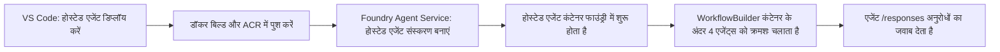
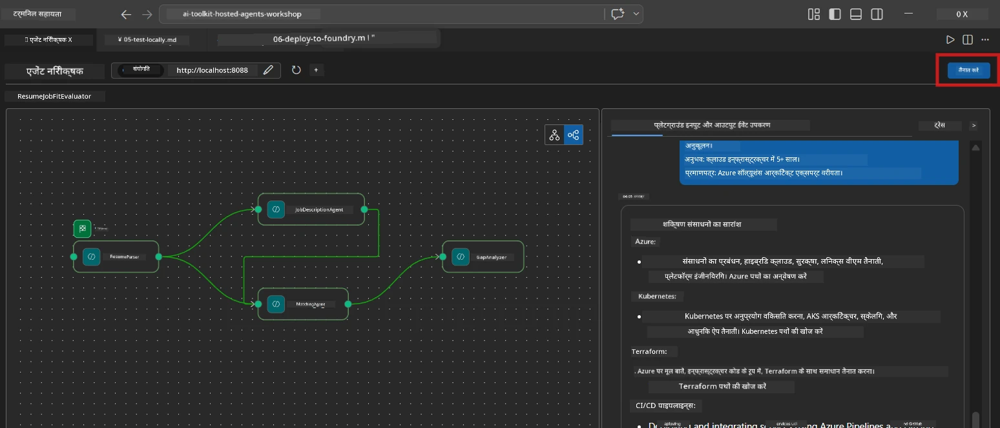

# मॉड्यूल 6 - Foundry एजेंट सेवा में तैनाती

⏱️ ~10 मिनट

इस मॉड्यूल में, आप अपने स्थानीय रूप से परीक्षण किए गए मल्टी-एजेंट वर्कफ़्लो को [Microsoft Foundry](https://learn.microsoft.com/azure/foundry/agents/concepts/hosted-agents) में **होस्टेड एजेंट** के रूप में तैनात करते हैं। तैनाती प्रक्रिया एक डॉकटर कंटेनर इमेज बनाती है, उसे [Azure Container Registry (ACR)](https://learn.microsoft.com/azure/container-registry/container-registry-intro) में पुश करती है, और [Foundry Agent Service](https://learn.microsoft.com/azure/foundry/agents/how-to/publish-agent) में एक होस्टेड एजेंट संस्करण बनाती है।

> **लैब 01 से मुख्य अंतर:** तैनाती प्रक्रिया समान है। Foundry आपके मल्टी-एजेंट वर्कफ़्लो को एक एकल होस्टेड एजेंट के रूप में देखता है - जटिलता कंटेनर के अंदर है, लेकिन तैनाती सतह वही `/responses` एंडपॉइंट है।

### तैनाती पाइपलाइन


```mermaid
flowchart LR
    A[VS Code: होस्टेड एजेंट डिप्लॉय करें] --> B[डॉकर बिल्ड और ACR में पुश करें]
    B --> C[Foundry Agent Service: होस्टेड एजेंट संस्करण बनाएं]
    C --> D[होस्टेड एजेंट कंटेनर फाउंड्री में शुरू होता है]
    D --> E[WorkflowBuilder कंटेनर के अंदर 4 एजेंट्स को क्रमशः चलाता है]
    E --> F[एजेंट /responses अनुरोधों का जवाब देता है]
```

---

## आवश्यकताओं की जांच

तैनाती से पहले, नीचे दिए गए प्रत्येक आइटम की पुष्टि करें:

1. **एजेंट स्थानीय स्मोक टेस्ट पास करता है:**
   - आपने [मॉड्यूल 5](05-test-locally.md) में सभी 3 टेस्ट पूरे किए हैं और वर्कफ़्लो ने गैप कार्ड और Microsoft Learn URL के साथ पूर्ण आउटपुट दिया है।

2. **आपके पास [Foundry उपयोगकर्ता](https://learn.microsoft.com/azure/foundry/concepts/rbac-foundry) भूमिका है** (तैनाती के लिए, आपके पास न्यूनतम स्तर पर **Foundry प्रोजेक्ट मैनेजर** होना चाहिए):

   > **नोट:** Foundry RBAC भूमिकाओं के नाम हाल ही में बदले गए हैं - **Foundry उपयोगकर्ता**, **Foundry ओनर**, और **Foundry प्रोजेक्ट मैनेजर** पहले Azure AI उपयोगकर्ता, Azure AI ओनर, और Azure AI प्रोजेक्ट मैनेजर के रूप में जाने जाते थे। भूमिका IDs और अनुमतियाँ अपरिवर्तित हैं।

   - [Azure Portal](https://portal.azure.com) → अपने Foundry **प्रोजेक्ट** संसाधन → **Access control (IAM)** → **Role assignments** → सुनिश्चित करें कि आपके खाते के लिए **Foundry उपयोगकर्ता** (या उससे ऊपर) सूचीबद्ध है।

3. **आप VS Code में Azure में साइन इन किए हुए हैं:**
   - VS Code के नीचे-बाएँ कोने में अकाउंट्स आइकन देखें। आपका खाता नाम दिखाई देना चाहिए।

4. **`agent.yaml` में सही मान हैं:**
   - `PersonalCareerCopilot/agent.yaml` खोलें और सत्यापित करें:
     ```yaml
     environment_variables:
       - name: AZURE_AI_MODEL_DEPLOYMENT_NAME
         value: ${AZURE_AI_MODEL_DEPLOYMENT_NAME}
     ```
   - `FOUNDRY_PROJECT_ENDPOINT` यहाँ सूचीबद्ध नहीं है - Foundry इसे रनटाइम में इंजेक्ट करता है। केवल `AZURE_AI_MODEL_DEPLOYMENT_NAME` को घोषित करने की आवश्यकता है।

5. **`requirements.txt` में सही संस्करण हैं:**
   ```
   agent-framework-foundry
   agent-framework-foundry-hosting
   mcp<2,>=1.24.0
   debugpy
   ```

---

## चरण 1: तैनाती आरंभ करें

### विकल्प A: एजेंट इंस्पेक्टर से तैनात करें (अनुशंसित)

यदि एजेंट F5 के माध्यम से एजेंट इंस्पेक्टर खुलने के साथ चल रहा है:

1. एजेंट इंस्पेक्टर पैनल के **ऊपरी-दाएँ कोने** को देखें।
2. **Deploy** बटन (क्लाउड आइकन जिसमें ऊपर की ओर तीर ↑) पर क्लिक करें।
3. तैनाती विज़ार्ड खुल जाएगा।



### विकल्प B: कमांड पैलेट से तैनात करें

1. `Ctrl+Shift+P` दबाकर **Command Palette** खोलें।
2. टाइप करें: **Foundry Toolkit: Deploy Hosted Agent** और इसे चुनें।
3. तैनाती विज़ार्ड खुल जाएगा।

---

## चरण 2: तैनाती कॉन्फ़िगर करें

### 2.1 लक्षित प्रोजेक्ट चयन करें

1. एक ड्रॉपडाउन आपके Foundry प्रोजेक्ट दिखाता है।
2. उस प्रोजेक्ट का चयन करें जिसे आपने पूरे कार्यशाला में इस्तेमाल किया है (जैसे, `workshop-agents`)।

### 2.2 कंटेनर एजेंट फ़ाइल चुनें

1. आपसे एजेंट एंट्री पॉइंट चुनने को कहा जाएगा।
2. `workshop/lab02-multi-agent/PersonalCareerCopilot/` पर जाएँ और **`main.py`** चुनें।

### 2.3 संसाधन कॉन्फ़िगर करें

| सेटिंग | अनुशंसित मान | नोट्स |
|---------|------------------|-------|
| **तैनाती विधि** | **कंटेनर** (अनुशंसित) या **कोड** | कंटेनर एक डॉकटर इमेज बनाता है; कोड सोर्स को ZIP के रूप में अपलोड करता है (पूर्वावलोकन) |
| **कंटेनर रजिस्ट्री** | **डिफ़ॉल्ट ACR** | Foundry आपके लिए एक बनाता और प्रबंधित करता है |
| **CPU** | `0.25` | डिफ़ॉल्ट। मल्टी-एजेंट वर्कफ़्लो को अधिक CPU की आवश्यकता नहीं है क्योंकि मॉडल कॉल I/O-बाउंड हैं |
| **मेमोरी** | `0.5Gi` | डिफ़ॉल्ट। यदि आप बड़े डेटा प्रोसेसिंग उपकरण जोड़ते हैं तो `1Gi` तक बढ़ाएँ |

---

## चरण 3: पुष्टि करें और तैनात करें

1. विज़ार्ड तैनाती सारांश दिखाता है।
2. समीक्षा करें और **Confirm and Deploy** पर क्लिक करें।
3. VS Code में प्रगति देखें।

### तैनाती के दौरान क्या होता है

VS Code **Output** पैनल देखें ("Microsoft Foundry" ड्रॉपडाउन चुनें):

1. **Docker build** - आपके `Dockerfile` से कंटेनर बनाता है
   ```
   Step 1/6 : FROM python:3.12-slim
   Step 2/6 : WORKDIR /app
   ...
   Successfully built abc123def456
   ```

2. **Docker push** - इमेज को ACR पर पुश करता है (पहली तैनाती पर 1-3 मिनट लगते हैं)।

3. **एजेंट पंजीकरण** - Foundry `agent.yaml` मेटाडेटा का उपयोग करके होस्टेड एजेंट बनाता है। एजेंट का नाम `resume-job-fit-evaluator` है।

4. **कंटेनर शुरू** - कंटेनर Foundry के प्रबंधित अवसंरचना में सिस्टम-प्रबंधित पहचान के साथ शुरू होता है।

> **पहली तैनाती धीमी होती है** (Docker सभी लेयर पुश करता है)। बाद की तैनातियाँ कैश्ड लेयर्स का पुन: उपयोग करती हैं और तेज़ होती हैं।

### मल्टी-एजेंट विशिष्ट नोट्स

- **सभी चार एजेंट एक कंटेनर में हैं।** Foundry इसे एकल होस्टेड एजेंट के रूप में देखता है। WorkflowBuilder ग्राफ आंतरिक रूप से चलता है।
- **MCP कॉल आउटबाउंड होते हैं।** कंटेनर को `https://learn.microsoft.com/api/mcp` तक पहुँचने के लिए इंटरनेट एक्सेस की आवश्यकता है। Foundry की प्रबंधित अवसंरचना यह डिफ़ॉल्ट रूप से प्रदान करती है।
- **[मैनेज्ड आइडेंटिटी](https://learn.microsoft.com/azure/foundry/agents/concepts/agent-identity)।** Foundry तैनाती के समय प्रत्येक होस्टेड एजेंट के लिए एक समर्पित प्रति-एजेंट Entra पहचान स्वचालित रूप से बनाता है। होस्टेड वातावरण में, `DefaultAzureCredential` स्वचालित रूप से इस एजेंट पहचान को हल करता है - मैन्युअल मैनेज्ड आइडेंटिटी कॉन्फ़िगरेशन की आवश्यकता नहीं है।

---

## चरण 4: तैनाती स्थिति सत्यापित करें

1. **Microsoft Foundry** साइडबार खोलें (Activity Bar में Foundry आइकन पर क्लिक करें)।
2. अपने प्रोजेक्ट के अंतर्गत **Hosted Agents (Preview)** को विस्तृत करें।
3. **resume-job-fit-evaluator** (या आपका एजेंट नाम) खोजें।
4. एजेंट नाम पर क्लिक करें → संस्करण (जैसे `v1`) विस्तृत करें।
5. संस्करण पर क्लिक करें → **Container Details** → **Status** जांचें:


| स्थिति | मतलब |
|--------|---------|
| **active** | एजेंट चल रहा है और अनुरोध स्वीकार करने के लिए तैयार है |
| **creating** | कंटेनर शुरू हो रहा है (30–60 सेकंड प्रतीक्षा करें) |
| **failed** | कंटेनर शुरू नहीं हो पाया (लॉग देखें - नीचे) |

> **नोट:** VS Code साइडबार पर "Running" या "Started" जैसे लेबल दिख सकते हैं जबकि अंतर्निहित API स्थिति `active`/`creating` होती है। दोनों ही एक ही स्थिति को दर्शाते हैं।

> **मल्टी-एजेंट स्टार्टअप अधिक समय लेता है** क्योंकि कंटेनर स्टार्टअप पर 4 एजेंट इंस्टेंस बनाता है। `creating` की स्थिति 2 मिनट तक सामान्य है।

---

## सामान्य तैनाती त्रुटियां और समाधान

### त्रुटि 1: अनुमति अस्वीकृत - `agents/write`

```
Error: lacks the required data action 
Microsoft.CognitiveServices/accounts/AIServices/agents/write
```

**समाधान:** **[Foundry उपयोगकर्ता](https://learn.microsoft.com/azure/foundry/concepts/rbac-foundry)** भूमिका (पूर्व में **Azure AI उपयोगकर्ता**) को **प्रोजेक्ट** स्तर पर सौंपें। चरण-दर-चरण निर्देशों के लिए [मॉड्यूल 8 - ट्रबलशूटिंग](08-troubleshooting.md) देखें।

### त्रुटि 2: Docker नहीं चल रहा

```
Error: Docker build failed / Cannot connect to Docker daemon
```

**समाधान:**
1. Docker Desktop शुरू करें।
2. "Docker Desktop is running" का इंतजार करें।
3. जांचें: `docker info`
4. **Windows:** सुनिश्चित करें कि Docker Desktop सेटिंग्स में WSL 2 बैकएंड सक्षम है।
5. पुनः प्रयास करें।

### त्रुटि 3: Docker बिल्ड के दौरान pip install फेल

```
Error: Could not find a version that satisfies the requirement agent-framework-foundry
```

**समाधान:** पुष्टि करें कि `requirements.txt` निम्नलिखित के अनुरूप है:
```
agent-framework-foundry
agent-framework-foundry-hosting
mcp<2,>=1.24.0
debugpy
```

यदि बिल्ड फिर भी विफल होता है, तो आपका Docker नेटवर्क PyPI को ब्लॉक कर सकता है। प्रॉक्सी सेटिंग्स के लिए `docker info` जांचें।

### त्रुटि 4: MCP टूल होस्टेड एजेंट में फेल

यदि Gap Analyzer तैनाती के बाद Microsoft Learn URL उत्पन्न करना बंद कर देता है:

**मूल कारण:** नेटवर्क नीति कंटेनर से आउटबाउंड HTTPS को ब्लॉक कर सकती है।

**समाधान:**
1. यह आम तौर पर Foundry की डिफ़ॉल्ट कॉन्फ़िगरेशन में समस्या नहीं होती।
2. यदि होती है, तो जांचें कि क्या Foundry प्रोजेक्ट के वर्चुअल नेटवर्क में कोई NSG आउटबाउंड HTTPS को ब्लॉक कर रहा है।
3. MCP टूल में अंतर्निहित फॉलबैक URL होते हैं, इसलिए एजेंट फिर भी आउटपुट देगा (बिना लाइव URL के)।

---

### चेकपॉइंट

- [ ] VS Code में बिना त्रुटियों के तैनाती कमांड पूरी हुई
- [ ] एजेंट Foundry साइडबार में **Hosted Agents (Preview)** के तहत दिखाई दे रहा है
- [ ] एजेंट नाम `resume-job-fit-evaluator` है (या आपकी चुनी हुई नाम)
- [ ] कंटेनर स्थिति **Started** या **Running** दिखा रही है
- [ ] (यदि त्रुटियाँ हैं) आपने त्रुटि की पहचान की, उसका समाधान लागू किया और सफलतापूर्वक पुनः तैनात किया

---

**पिछला:** [05 - स्थानीय परीक्षण](05-test-locally.md) · **अगला:** [07 - प्लेग्राउंड में सत्यापन →](07-verify-in-playground.md)

---

<!-- CO-OP TRANSLATOR DISCLAIMER START -->
**अस्वीकरण**:
इस दस्तावेज़ का अनुवाद AI अनुवाद सेवा [Co-op Translator](https://github.com/Azure/co-op-translator) का उपयोग करके किया गया है। जबकि हम सटीकता के लिए प्रयास करते हैं, कृपया ध्यान दें कि स्वचालित अनुवादों में त्रुटियाँ या अशुद्धियाँ हो सकती हैं। मूल दस्तावेज़ अपनी मूल भाषा में ही प्रामाणिक स्रोत माना जाना चाहिए। महत्वपूर्ण जानकारी के लिए, पेशेवर मानव अनुवाद की सिफारिश की जाती है। इस अनुवाद के उपयोग से उत्पन्न किसी भी गलतफहमी या गलत व्याख्या के लिए हम उत्तरदायी नहीं हैं।
<!-- CO-OP TRANSLATOR DISCLAIMER END -->