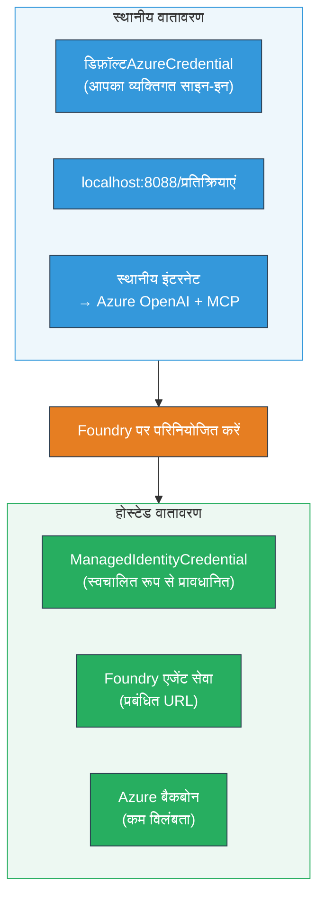

# Module 7 - प्लेग्राउंड में सत्यापन करें

इस मॉड्यूल में, आप अपने तैनात मल्टी-एजेंट वर्कफ़्लो का परीक्षण **VS Code** और **[Foundry Portal](https://ai.azure.com)** दोनों में करते हैं, यह पुष्टि करते हुए कि एजेंट स्थानीय परीक्षण के समान व्यवहार करता है।

---

## तैनाती के बाद सत्यापन क्यों करें?

आपका मल्टी-एजेंट वर्कफ़्लो स्थानीय रूप से पूरी तरह से चला, तो फिर पुनः परीक्षण क्यों करें? होस्टेड वातावरण कई तरीकों से अलग होता है:


| अंतर | स्थानीय | होस्टेड |
|-----------|-------|--------|
| **पहचान** | [`DefaultAzureCredential`](https://learn.microsoft.com/azure/developer/python/sdk/authentication/credential-chains#defaultazurecredential-overview) (आपका व्यक्तिगत साइन-इन) | [`ManagedIdentityCredential`](https://learn.microsoft.com/python/api/overview/azure/identity-readme#managed-identity-support) (स्वतः प्रावधानित) |
| **एंडपॉइंट** | `http://localhost:8088/responses` | [Foundry Agent Service](https://learn.microsoft.com/azure/foundry/agents/concepts/hosted-agents) एंडपॉइंट (प्रबंधित URL) |
| **नेटवर्क** | स्थानीय मशीन → Azure OpenAI + MCP आउटबाउंड | Azure बैकबोन (सेवाओं के बीच कम विलंबता) |
| **MCP कनेक्टिविटी** | स्थानीय इंटरनेट → `learn.microsoft.com/api/mcp` | कंटेनर आउटबाउंड → `learn.microsoft.com/api/mcp` |

यदि कोई भी पर्यावरण चर गलत कॉन्फ़िगर किया गया है, RBAC अलग है, या MCP आउटबाउंड अवरुद्ध है, तो आप इसे यहाँ पकड़ लेंगे।

---

## विकल्प A: VS Code प्लेग्राउंड में परीक्षण करें (सर्वोत्तम पहले)

[Foundry एक्सटेंशन](https://marketplace.visualstudio.com/items?itemName=TeamsDevApp.vscode-ai-foundry) में एक एकीकृत प्लेग्राउंड शामिल है जो आपको VS Code छोड़ने के बिना तैनात एजेंट के साथ चैट करने देता है।

### चरण 1: अपने होस्टेड एजेंट पर नेविगेट करें

1. VS Code के **Activity Bar** (बाएँ साइडबार) में **Microsoft Foundry** आइकन पर क्लिक करें ताकि Foundry पैनल खुले।
2. अपने जुड़े हुए प्रोजेक्ट (जैसे `workshop-agents`) को फैलाएं।
3. **Hosted Agents (Preview)** को फैलाएं।
4. आपको अपने एजेंट का नाम दिखना चाहिए (जैसे `resume-job-fit-evaluator`)।

### चरण 2: एक संस्करण चुनें

1. एजेंट नाम पर क्लिक करके इसके संस्करण फैलाएं।
2. आपने जो संस्करण तैनात किया है (जैसे `v1`), उस पर क्लिक करें।
3. एक **डिटेल पैनल** खुलेगा जिसमें कंटेनर विवरण दिखेगा।
4. सुनिश्चित करें कि स्थिति **Started** या **Running** है।

### चरण 3: प्लेग्राउंड खोलें

1. डिटेल पैनल में, **Playground** बटन पर क्लिक करें (या संस्करण पर राइट-क्लिक करें → **Open in Playground**)।
2. एक चैट इंटरफ़ेस VS Code टैब में खुलेगा।

### चरण 4: अपने स्मोक टेस्ट चलाएं

[Module 5](05-test-locally.md) से वही 3 परीक्षण करें। प्रत्येक संदेश को प्लेग्राउंड इनपुट बॉक्स में टाइप करें और **Send** (या **Enter**) दबाएं।

#### परीक्षण 1 - पूरा रिज्यूमे + JD (मानक प्रवाह)

Module 5 के परीक्षण 1 से पूरा रिज्यूमे + JD प्रॉम्प्ट पेस्ट करें (Jane Doe + Contoso Ltd में सीनियर क्लाउड इंजीनियर)।

**अपेक्षित:**
- फिट स्कोर के साथ गणितीय टूट-फूट (100-पॉइंट स्केल)
- मेल खाती कुशलताएँ अनुभाग
- गुम कुशलताएँ अनुभाग
- **प्रत्येक गुम कौशल के लिए एक गैप कार्ड** Microsoft Learn URLs के साथ
- टाइमलाइन के साथ लर्निंग रोडमैप

#### परीक्षण 2 - त्वरित छोटा परीक्षण (न्यूनतम इनपुट)

```
RESUME: 3 years Python developer, knows Django and PostgreSQL, no cloud experience.

JOB: Cloud DevOps Engineer requiring AWS, Kubernetes, Terraform, CI/CD. 5 years needed.
```

**अपेक्षित:**
- कम फिट स्कोर (< 40)
- ईमानदार मूल्यांकन के साथ चरणबद्ध अध्ययन मार्ग
- कई गैप कार्ड (AWS, Kubernetes, Terraform, CI/CD, अनुभव में अन्तर)

#### परीक्षण 3 - उच्च फिट उम्मीदवार

```
RESUME:
10 years Azure Cloud Architect. AZ-305 certified. Expert in AKS, Terraform, Azure DevOps, 
Azure Functions, Helm, Prometheus, Grafana, Python, Go. Led platform team of 8.

JOB:
Senior Cloud Engineer. Required: AKS, Terraform, Azure DevOps, Python. Preferred: Helm, Go.
5+ years experience. AZ-305 preferred.
```

**अपेक्षित:**
- उच्च फिट स्कोर (≥ 80)
- इंटरव्यू तैयारी और सुधार पर केंद्रित
- कम या कोई गैप कार्ड नहीं
- तैयारी पर केंद्रित संक्षिप्त टाइमलाइन

### चरण 5: स्थानीय परिणामों के साथ तुलना करें

Module 5 में अपने नोट्स या ब्राउज़र टैब खोलें जहाँ आपने स्थानीय प्रतिक्रियाएँ सहेजी थीं। प्रत्येक परीक्षण के लिए:

- क्या प्रतिक्रिया की **संरचना समान** है (फिट स्कोर, गैप कार्ड, रोडमैप)?
- क्या यह **एक ही स्कोरिंग नियम** का पालन करता है (100-पॉइंट टूट-फूट)?
- क्या गैप कार्ड में **Microsoft Learn URLs अभी भी हैं**?
- क्या हर गायब कौशल के लिए **एक गैप कार्ड है** (संक्षेपित नहीं)?

> **छोटे वाक्यांश भिन्नताएँ सामान्य हैं** - मॉडल नॉन-डिटर्मिनिस्टिक है। संरचना, स्कोरिंग स्थिरता, और MCP टूल उपयोग पर ध्यान दें।

---

## विकल्प B: Foundry Portal में परीक्षण करें

[Foundry Portal](https://ai.azure.com) एक वेब-आधारित प्लेग्राउंड प्रदान करता है जो साथियों या हितधारकों के साथ साझा करने के लिए उपयोगी है।

### चरण 1: Foundry Portal खोलें

1. अपने ब्राउज़र में [https://ai.azure.com](https://ai.azure.com) खोलें।
2. उसी Azure खाते से साइन इन करें जिसका उपयोग आप वर्कशॉप में कर रहे हैं।

### चरण 2: अपने प्रोजेक्ट पर नेविगेट करें

1. होम पेज पर, बाएँ साइडबार में **Recent projects** देखें।
2. अपने प्रोजेक्ट नाम (जैसे `workshop-agents`) पर क्लिक करें।
3. यदि नहीं दिखता, तो **All projects** पर क्लिक करें और खोजें।

### चरण 3: तैनात एजेंट खोजें

1. प्रोजेक्ट की बाएं नेविगेशन में, **Build** → **Agents** पर क्लिक करें (या **Agents** खंड देखें)।
2. एजेंटों की सूची दिखेगी। अपना तैनात एजेंट खोजें (जैसे `resume-job-fit-evaluator`)।
3. एजेंट नाम पर क्लिक करें ताकि इसकी डिटेल पेज खुले।

### चरण 4: प्लेग्राउंड खोलें

1. एजेंट डिटेल पेज पर, शीर्ष टूलबार देखें।
2. **Open in playground** (या **Try in playground**) पर क्लिक करें।
3. एक चैट इंटरफ़ेस खुलेगा।

### चरण 5: वही स्मोक टेस्ट चलाएं

VS Code प्लेग्राउंड सेक्शन से सभी 3 परीक्षण दोहराएं। प्रत्येक प्रतिक्रिया की तुलना स्थानीय परिणामों (Module 5) और VS Code प्लेग्राउंड परिणामों (उपरोक्त विकल्प A) से करें।

---

## मल्टी-एजेंट विशिष्ट सत्यापन

बुनियादी शुद्धता से आगे, इन मल्टी-एजेंट-विशिष्ट व्यवहारों को सत्यापित करें:

### MCP टूल निष्पादन

| जांच | सत्यापित करने का तरीका | पास की शर्त |
|-------|---------------|----------------|
| MCP कॉल सफल | गैप कार्ड में `learn.microsoft.com` URLs शामिल हैं | असली URL, फॉलबैक संदेश नहीं |
| कई MCP कॉल | प्रत्येक उच्च/मध्यम प्राथमिकता गैप के पास संसाधन हैं | केवल पहला गैप कार्ड नहीं |
| MCP फॉलबैक काम करता है | यदि URL गायब हैं, तो फॉलबैक टेक्स्ट जांचें | एजेंट फिर भी गैप कार्ड बनाता है (URLs के साथ या बिना) |

### एजेंट समन्वय

| जांच | सत्यापित करने का तरीका | पास की शर्त |
|-------|---------------|----------------|
| सभी 4 एजेंट चले | आउटपुट में फिट स्कोर और गैप कार्ड शामिल हैं | स्कोर MatchingAgent से, कार्ड GapAnalyzer से |
| समानांतर फेन-आउट | प्रतिक्रिया समय उचित है (< 2 मिनट) | यदि > 3 मिनट, तो समानांतर निष्पादन काम नहीं कर रहा हो सकता |
| डेटा प्रवाह की अखंडता | गैप कार्ड मिलान रिपोर्ट के कौशलों का संदर्भ देते हैं | कोई कल्पित कौशल जो JD में नहीं है नहीं |

---

## मान्यकरण योग्यता सूची

अपने मल्टी-एजेंट वर्कफ़्लो के होस्ट किए गए व्यवहार का मूल्यांकन करने के लिए इस योग्यता सूची का उपयोग करें:

| # | मापदंड | पास की शर्त | पास? |
|---|----------|---------------|-------|
| 1 | **कार्यात्मक शुद्धता** | एजेंट रिज्यूमे + JD के लिए फिट स्कोर और गैप विश्लेषण के साथ प्रतिक्रिया देता है | |
| 2 | **स्कोरिंग स्थिरता** | फिट स्कोर 100-पॉइंट स्केल के साथ टूट-फूट गणित का उपयोग करता है | |
| 3 | **गैप कार्ड पूर्णता** | प्रत्येक गायब कौशल के लिए एक कार्ड (संक्षेपित या संयुक्त नहीं) | |
| 4 | **MCP टूल एकीकरण** | गैप कार्ड में वास्तविक Microsoft Learn URLs शामिल हैं | |
| 5 | **संरचनात्मक स्थिरता** | आउटपुट संरचना स्थानीय और होस्टेड रन के बीच मेल खाती है | |
| 6 | **प्रतिक्रिया समय** | होस्टेड एजेंट पूर्ण मूल्यांकन के लिए 2 मिनट के भीतर प्रतिक्रिया देता है | |
| 7 | **कोई त्रुटि नहीं** | कोई HTTP 500 त्रुटियाँ, टाइमआउट, या खाली प्रतिक्रियाएँ नहीं | |

> एक "पास" का मतलब है सभी 3 स्मोक परीक्षणों के लिए कम से कम एक प्लेग्राउंड (VS Code या पोर्टल) में सभी 7 मानदंड पूरे होते हैं।

---

## प्लेग्राउंड समस्याएँ सुलझाना

| लक्षण | संभावित कारण | समाधान |
|---------|-------------|-----|
| प्लेग्राउंड लोड नहीं होता | कंटेनर की स्थिति "Started" नहीं है | वापस [Module 6](06-deploy-to-foundry.md) पर जाएं, तैनाती की स्थिति सत्यापित करें। यदि "Pending" हो तो प्रतीक्षा करें |
| एजेंट खाली प्रतिक्रिया देता है | मॉडल तैनाती नाम मेल नहीं खाता | `agent.yaml` → `environment_variables` → `MODEL_DEPLOYMENT_NAME` जांचें कि यह आपके तैनात मॉडल से मेल खाता है |
| एजेंट त्रुटि संदेश देता है | [RBAC](https://learn.microsoft.com/azure/foundry/concepts/rbac-foundry) अनुमति गायब है | प्रोजेक्ट स्कोप पर **[Azure AI User](https://aka.ms/foundry-ext-project-role)** सौंपें |
| गैप कार्ड में Microsoft Learn URLs नहीं हैं | MCP आउटबाउंड अवरुद्ध या MCP सर्वर अनुपलब्ध | जांचें कि कंटेनर `learn.microsoft.com` तक पहुंच सकता है। देखें [Module 8](08-troubleshooting.md) |
| केवल 1 गैप कार्ड (संक्षेपित) | GapAnalyzer निर्देशों में "CRITICAL" ब्लॉक गायब है | देखें [Module 3, Step 2.4](03-configure-agents.md) |
| फिट स्कोर स्थानीय से बहुत अलग | विभिन्न मॉडल या निर्देश तैनात हैं | `agent.yaml` env vars की तुलना स्थानीय `.env` से करें। आवश्यकता हो तो पुनः तैनात करें |
| पोर्टल में "Agent not found" | तैनाती अभी भी प्रसारित हो रही है या असफल हुई | 2 मिनट प्रतीक्षा करें, पेज रिफ्रेश करें। यदि अभी भी नहीं मिला, तो [Module 6](06-deploy-to-foundry.md) से पुनः तैनात करें |

---

### चेकप्वाइंट

- [ ] VS Code प्लेग्राउंड में एजेंट का परीक्षण किया - सभी 3 स्मोक परीक्षण पास हुए
- [ ] [Foundry Portal](https://ai.azure.com) प्लेग्राउंड में एजेंट का परीक्षण किया - सभी 3 स्मोक परीक्षण पास हुए
- [ ] प्रतिक्रियाएँ स्थानीय परीक्षण के साथ संरचनात्मक रूप से संगत हैं (फिट स्कोर, गैप कार्ड, रोडमैप)
- [ ] गैप कार्ड में Microsoft Learn URLs मौजूद हैं (होस्टेड वातावरण में MCP टूल काम कर रहा है)
- [ ] प्रत्येक गायब कौशल के लिए एक गैप कार्ड (कोई संक्षेप नहीं)
- [ ] परीक्षण के दौरान कोई त्रुटि या टाइमआउट नहीं
- [ ] मान्यकरण योग्यता सूची पूरी की (सभी 7 मापदंड पास)

---

**पिछला:** [06 - Deploy to Foundry](06-deploy-to-foundry.md) · **अगला:** [08 - Troubleshooting →](08-troubleshooting.md)

---

<!-- CO-OP TRANSLATOR DISCLAIMER START -->
**अस्वीकरण**:
इस दस्तावेज़ का अनुवाद AI अनुवाद सेवा [Co-op Translator](https://github.com/Azure/co-op-translator) का उपयोग करके किया गया है। जबकि हम सटीकता के लिए प्रयासरत हैं, कृपया ध्यान दें कि स्वचालित अनुवादों में त्रुटियाँ या असंगतियाँ हो सकती हैं। मूल दस्तावेज़ अपनी मूल भाषा में सर्वज्ञ स्रोत माना जाना चाहिए। महत्वपूर्ण जानकारी के लिए, पेशेवर मानव अनुवाद की सलाह दी जाती है। इस अनुवाद के उपयोग से उत्पन्न किसी भी गलतफहमी या गलत व्याख्या के लिए हम जिम्मेदार नहीं हैं।
<!-- CO-OP TRANSLATOR DISCLAIMER END -->