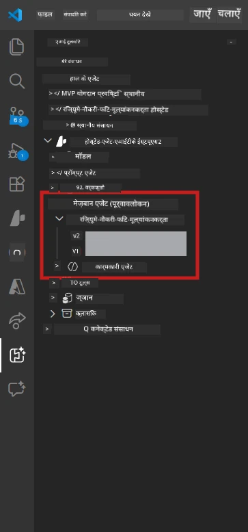

# मॉड्यूल 7 - प्लेग्राउंड में सत्यापित करें

⏱️ ~10 मिनट

इस मॉड्यूल में, आप अपने तैनात मल्टी-एजेंट वर्कफ़्लो को VS Code और Foundry पोर्टल में परीक्षण करते हैं, यह पुष्टि करते हुए कि एजेंट स्थानीय परीक्षण की तरह व्यवहार करता है।

---

## तैनाती के बाद फिर से परीक्षण क्यों करें?

मेज़बान वातावरण स्थानीय से कुछ महत्वपूर्ण तरीकों से भिन्न होता है:

| | लोकल | होस्टेड |
|--|-------|--------|
| **पहचान** | आपका व्यक्तिगत साइन-इन (`DefaultAzureCredential`) | प्रति-एजेंट समर्पित Entra पहचान (तैनाती के समय स्वचालित रूप से प्रावधानित) |
| **एंडपॉइंट** | `http://localhost:8088/responses` | Foundry एजेंट सेवा द्वारा प्रबंधित URL |
| **नेटवर्क** | आपका मशीन → Azure OpenAI + MCP | Azure बैकबोन (कम विलंबता) |

एक गलत कॉन्फ़िगर किया गया env var, RBAC समस्या, या अवरुद्ध MCP आउटबाउंड कॉल यहाँ सबसे पहले दिखेगा।

---

## विकल्प A: VS Code प्लेग्राउंड में टेस्ट करें (सबसे पहले सिफारिश की गई)

### चरण 1: अपने होस्टेड एजेंट पर जाएं

1. एक्टिविटी बार में **Foundry Toolkit** आइकन पर क्लिक करें।
2. अपने प्रोजेक्ट को एक्सपैंड करें → **Hosted Agents (Preview)** → अपना एजेंट खोजें।



### चरण 2: एक संस्करण चुनें

1. एजेंट पर क्लिक करें ताकि इसके संस्करण खुल जाएं।
2. `v1` पर क्लिक करें → स्थिति **सक्रिय** होनी चाहिए (साइडबार "Running" या "Started" दिखा सकता है - दोनों का अर्थ है कि एजेंट तैयार है)।

### चरण 3: प्लेग्राउंड खोलें

1. **Playground** पर क्लिक करें (या संस्करण पर राइट-क्लिक करें → **Open in Playground**).
2. एक चैट विंडो VS Code के टैब में खुलती है।

### चरण 4: अपने स्मोक टेस्ट चलाएं

[मॉड्यूल 5](05-test-locally.md) से वही 3 परीक्षणों का उपयोग करें। प्लेग्राउंड इनपुट बॉक्स में प्रत्येक संदेश टाइप करें और **Send** (या **Enter**) दबाएं।

#### टेस्ट 1 - पूर्ण रिज्यूमे + JD (मानक प्रवाह)

मॉड्यूल 5, टेस्ट 1 (जेन डो + सीनियर क्लाउड इंजीनियर @ Contoso Ltd) से पूर्ण रिज्यूमे + JD प्रॉम्प्ट चिपकाएँ।

**अपेक्षित:**
- फिट स्कोर के साथ गणितीय ब्रेकडाउन (100-बिंदु पैमाना)
- मेल खाने वाले कौशल अनुभाग
- गायब कौशल अनुभाग
- **प्रत्येक गायब कौशल के लिए एक गैप कार्ड** जिसमें Microsoft Learn URL शामिल हों
- समयरेखा के साथ सीखने का रोडमैप

#### टेस्ट 2 - त्वरित छोटा परीक्षण (न्यूनतम इनपुट)

```
RESUME: 3 years Python developer, knows Django and PostgreSQL, no cloud experience.

JOB: Cloud DevOps Engineer requiring AWS, Kubernetes, Terraform, CI/CD. 5 years needed.
```

**अपेक्षित:**
- कम फिट स्कोर (< 40)
- चरणबद्ध सीखने के पथ के साथ ईमानदार आकलन
- कई गैप कार्ड (AWS, Kubernetes, Terraform, CI/CD, अनुभव गैप)

#### टेस्ट 3 - उच्च-फिट उम्मीदवार

```
RESUME:
10 years Azure Cloud Architect. AZ-305 certified. Expert in AKS, Terraform, Azure DevOps, 
Azure Functions, Helm, Prometheus, Grafana, Python, Go. Led platform team of 8.

JOB:
Senior Cloud Engineer. Required: AKS, Terraform, Azure DevOps, Python. Preferred: Helm, Go.
5+ years experience. AZ-305 preferred.
```

**अपेक्षित:**
- उच्च फिट स्कोर (≥ 80)
- साक्षात्कार तैयारी और सुधार पर ध्यान केंद्रित
- कुछ या कोई गैप कार्ड नहीं
- तैयारी पर केंद्रित संक्षिप्त समयरेखा

### चरण 5: स्थानीय परिणामों से तुलना करें

अपने नोट्स या मॉड्यूल 5 से ब्राउज़र टैब खोलें जहाँ आपने स्थानीय प्रतिक्रियाएँ सहेजी थीं। प्रत्येक परीक्षण के लिए:

- क्या प्रतिक्रिया में **वही संरचना** है (फिट स्कोर, गैप कार्ड, रोडमैप)?
- क्या यह **उसी स्कोरिंग रूब्रिक** (100-बिंदु ब्रेकडाउन) का पालन करता है?
- क्या गैप कार्ड में अभी भी **Microsoft Learn URL** मौजूद हैं?
- क्या प्रत्येक गायब कौशल के लिए **एक गैप कार्ड** है (छंटा हुआ नहीं)?

> **छोटे शब्दों के अंतर सामान्य हैं** - मॉडल गैर-नियतात्मक है। संरचना, स्कोरिंग स्थिरता, और MCP उपकरण के उपयोग पर ध्यान दें।

---

## विकल्प B: Foundry पोर्टल में टेस्ट करें

[Foundry पोर्टल](https://ai.azure.com) एक वेब-आधारित प्लेग्राउंड प्रदान करता है जो टीम के सदस्यों या हितधारकों के साथ साझा करने के लिए उपयोगी है।

### चरण 1: Foundry पोर्टल खोलें

1. अपना ब्राउज़र खोलें और [https://ai.azure.com](https://ai.azure.com) पर जाएँ।
2. उसी Azure खाते से साइन इन करें जिसे आप कार्यशालाओं में उपयोग कर रहे हैं।

### चरण 2: अपने प्रोजेक्ट पर जाएं

1. होम पेज पर, बाएँ साइडबार में **Recent projects** देखें।
2. अपने प्रोजेक्ट के नाम (जैसे, `workshop-agents`) पर क्लिक करें।
3. यदि यह दिखाई नहीं देता है, तो **All projects** पर क्लिक करें और खोजें।

### चरण 3: अपना तैनात एजेंट खोजें

1. प्रोजेक्ट के बाएँ नेविगेशन में, **Build** → **Agents** पर क्लिक करें (या **Agents** सेक्शन देखें)।
2. आपको एजेंट की सूची दिखाई देगी। अपना तैनात एजेंट खोजें (जैसे, `resume-job-fit-evaluator`)।
3. एजेंट नाम पर क्लिक करें ताकि इसका डिटेल पेज खुले।

### चरण 4: प्लेग्राउंड खोलें

1. एजेंट डिटेल पेज पर, शीर्ष टूलबार देखें।
2. **Open in playground** (या **Try in playground**) पर क्लिक करें।
3. एक चैट इंटरफ़ेस खुलता है।

### चरण 5: वही स्मोक टेस्ट चलाएं

ऊपर VS Code प्लेग्राउंड सेक्शन से सभी 3 परीक्षण दोहराएं। प्रत्येक प्रतिक्रिया की तुलना स्थानीय परिणामों (मॉड्यूल 5) और VS Code प्लेग्राउंड परिणामों (विकल्प A ऊपर) से करें।

---

## मल्टी-एजेंट विशिष्ट सत्यापन

बुनियादी सहीपन के अलावा, इन मल्टी-एजेंट विशिष्ट व्यवहारों को सत्यापित करें:

### MCP टूल निष्पादन

| जांचें | सत्यापित करने का तरीका | पास की शर्त |
|-------|---------------|----------------|
| MCP कॉल सफल | गैप कार्ड में `learn.microsoft.com` URL शामिल हैं | वास्तविक URL, फॉलबैक संदेश नहीं |
| एक से अधिक MCP कॉल | प्रत्येक उच्च/मध्यम प्राथमिकता गैप के पास संसाधन हैं | केवल पहला गैप कार्ड नहीं |
| MCP फॉलबैक काम करता है | यदि URL गायब हैं, तो फॉलबैक टेक्स्ट देखें | एजेंट अभी भी गैप कार्ड बनाता है (URL के साथ या बिना) |

### एजेंट समन्वय

| जांचें | सत्यापित करने का तरीका | पास की शर्त |
|-------|---------------|----------------|
| सभी 4 एजेंट चले | आउटपुट में फिट स्कोर और गैप कार्ड हैं | स्कोर MatchingAgent से, कार्ड GapAnalyzer से |
| अनुक्रमिक निष्पादन | प्रतिक्रिया समय वाजिब है (< 2 मिनट) | यदि > 3 मिनट, तो टर्मिनल लॉग में त्रुटियाँ देखें |
| डेटा फ्लो अखंडता | गैप कार्ड कौशल की समीक्षा मेल खाते रिपोर्ट से होती है | कोई काल्पनिक कौशल जो JD में नहीं हैं नहीं |

---

## मान्यता रूब्रिक

अपने मल्टी-एजेंट वर्कफ़्लो के होस्टेड व्यवहार का मूल्यांकन करने के लिए इस रूब्रिक का उपयोग करें:

| # | मानदंड | पास की शर्त | पास? |
|---|----------|---------------|-------|
| 1 | **कार्यात्मक सहीपन** | एजेंट रिज्यूमे + JD का फिट स्कोर और गैप विश्लेषण के साथ जवाब देता है | |
| 2 | **स्कोरिंग स्थिरता** | फिट स्कोर 100-बिंदु पैमाने और ब्रेकडाउन गणित का उपयोग करता है | |
| 3 | **गैप कार्ड पूर्णता** | प्रत्येक गायब कौशल के लिए एक कार्ड (छंटा हुआ या संयुक्त नहीं) | |
| 4 | **MCP टूल एकीकरण** | गैप कार्ड में वास्तविक Microsoft Learn URL शामिल हैं | |
| 5 | **संरचनात्मक स्थिरता** | आउटपुट संरचना स्थानीय और होस्टेड रनों के बीच मेल खाती है | |
| 6 | **प्रतिक्रिया समय** | होस्टेड एजेंट पूरी आकलन के लिए 2 मिनट के भीतर जवाब देता है | |
| 7 | **कोई त्रुटि नहीं** | HTTP 500 त्रुटियाँ, टाइमआउट या खाली प्रतिक्रियाएं नहीं | |

> "पास" का अर्थ है कि सभी 7 मानदंड कम से कम एक प्लेग्राउंड (VS Code या पोर्टल) में सभी 3 स्मोक परीक्षणों के लिए पूरे हुए हैं।

---

## प्लेग्राउंड मुद्दों का निवारण

| लक्षण | संभावित कारण | समाधान |
|---------|-------------|-----|
| प्लेग्राउंड लोड नहीं होता | कंटेनर `active` स्थिति में नहीं | वापस [मॉड्यूल 6](06-deploy-to-foundry.md) पर जाएं, तैनाती की स्थिति सत्यापित करें। यदि `creating` हो तो प्रतीक्षा करें |
| एजेंट खाली प्रतिक्रिया लौटाता है | मॉडल तैनाती नाम मेल नहीं खाता | `agent.yaml` → `environment_variables` → `AZURE_AI_MODEL_DEPLOYMENT_NAME` की जांच करें कि यह आपके तैनात मॉडल से मेल खाता है |
| एजेंट त्रुटि संदेश लौटाता है | [RBAC](https://learn.microsoft.com/azure/foundry/concepts/rbac-foundry) अनुमति गायब है | प्रोजेक्ट स्कोप पर **[Foundry User](https://aka.ms/foundry-ext-project-role)** (पहले Azure AI User) असाइन करें |
| गैप कार्ड में कोई Microsoft Learn URL नहीं | MCP आउटबाउंड ब्लॉक या MCP सर्वर अनुपलब्ध | जांचें कि कंटेनर `learn.microsoft.com` तक पहुँच सकता है। देखें [मॉड्यूल 8](08-troubleshooting.md) |
| केवल 1 गैप कार्ड (छंटा हुआ) | GapAnalyzer निर्देशों में "CRITICAL" ब्लॉक गायब है | समीक्षा करें [मॉड्यूल 3, चरण 2.4](03-configure-agents.md) |
| फिट स्कोर स्थानीय से बहुत अलग | विभिन्न मॉडल या निर्देश तैनात हैं | `agent.yaml` env vars की तुलना स्थानीय `.env` से करें। आवश्यक होने पर पुनः तैनात करें |
| पोर्टल में "Agent not found" | तैनाती अभी प्रसारित हो रही है या विफल हुई है | 2 मिनट प्रतीक्षा करें, रिफ्रेश करें। यदि अभी भी गायब है, तो पुनः [मॉड्यूल 6](06-deploy-to-foundry.md) से तैनात करें |

---

### जाँच बिंदु

- [ ] VS Code प्लेग्राउंड में एजेंट का परीक्षण किया - सभी 3 स्मोक टेस्ट पास हुए
- [ ] [Foundry पोर्टल](https://ai.azure.com) प्लेग्राउंड में एजेंट का परीक्षण किया - सभी 3 स्मोक टेस्ट पास हुए
- [ ] प्रतिक्रियाएं स्थानीय परीक्षण के साथ संरचनात्मक रूप से सुसंगत हैं (फिट स्कोर, गैप कार्ड, रोडमैप)
- [ ] गैप कार्ड में Microsoft Learn URL मौजूद हैं (MCP टूल होस्टेड वातावरण में काम कर रहा है)
- [ ] प्रत्येक गायब कौशल के लिए एक गैप कार्ड (कोई छंटाई नहीं)
- [ ] परीक्षण के दौरान कोई त्रुटि या टाइमआउट नहीं
- [ ] मान्यता रूब्रिक पूरी की (सभी 7 मानदंड पास)

---

**पिछला:** [06 - Foundry पर तैनात करें](06-deploy-to-foundry.md) · **अगला:** [08 - समस्या निवारण →](08-troubleshooting.md)

---

<!-- CO-OP TRANSLATOR DISCLAIMER START -->
**अस्वीकरण**:
इस दस्तावेज़ का अनुवाद AI अनुवाद सेवा [Co-op Translator](https://github.com/Azure/co-op-translator) का उपयोग करके किया गया है। जबकि हम सटीकता के लिए प्रयास करते हैं, कृपया ध्यान दें कि स्वचालित अनुवादों में त्रुटियाँ या अशुद्धियाँ हो सकती हैं। मूल दस्तावेज़ अपनी मूल भाषा में ही प्रामाणिक स्रोत माना जाना चाहिए। महत्वपूर्ण जानकारी के लिए, पेशेवर मानव अनुवाद की सिफारिश की जाती है। इस अनुवाद के उपयोग से उत्पन्न किसी भी गलतफहमी या गलत व्याख्या के लिए हम उत्तरदायी नहीं हैं।
<!-- CO-OP TRANSLATOR DISCLAIMER END -->