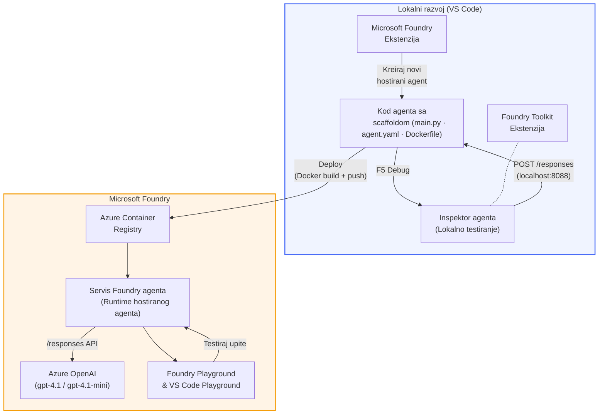

# Foundry Toolkit + Foundry Hosted Agents radionica

[](https://www.python.org/)
[](https://github.com/microsoft/agents)
[](https://learn.microsoft.com/azure/ai-foundry/agents/concepts/hosted-agents/)
[](https://ai.azure.com/)
[](https://learn.microsoft.com/azure/ai-services/openai/)
[](https://learn.microsoft.com/cli/azure/install-azure-cli)
[](https://learn.microsoft.com/azure/developer/azure-developer-cli/install-azd)
[](https://www.docker.com/)
[](https://marketplace.visualstudio.com/items?itemName=ms-windows-ai-studio.windows-ai-studio)
[](LICENSE)

Izgradite, testirajte i implementirajte AI agente na **Microsoft Foundry Agent Service** kao **Hosted Agents** - u potpunosti iz VS Code koristeći **Microsoft Foundry proširenje** i **Foundry Toolkit**.

> **Hosted Agents su trenutno u pregledu.** Podržane regije su ograničene - pogledajte [dostupnost regija](https://learn.microsoft.com/azure/foundry/agents/concepts/hosted-agents#region-availability).

> Mapa `agent/` unutar svakog laboratorija je **automatski generirana** pomoću Foundry proširenja - zatim prilagodite kod, testirate lokalno i implementirate.

### 🌐 Podrška za više jezika

#### Podržano putem GitHub Akcije (Automatski & Uvijek ažurno)

<!-- CO-OP TRANSLATOR LANGUAGES TABLE START -->
[Arapski](../ar/README.md) | [Bengalski](../bn/README.md) | [Bugarski](../bg/README.md) | [Burmanski (Myanmar)](../my/README.md) | [Kineski (pojednostavljeni)](../zh-CN/README.md) | [Kineski (tradicionalni, Hong Kong)](../zh-HK/README.md) | [Kineski (tradicionalni, Macau)](../zh-MO/README.md) | [Kineski (tradicionalni, Tajvan)](../zh-TW/README.md) | [Hrvatski](./README.md) | [Češki](../cs/README.md) | [Danski](../da/README.md) | [Nizozemski](../nl/README.md) | [Estonski](../et/README.md) | [Finski](../fi/README.md) | [Francuski](../fr/README.md) | [Njemački](../de/README.md) | [Grčki](../el/README.md) | [Hebrejski](../he/README.md) | [Hindi](../hi/README.md) | [Mađarski](../hu/README.md) | [Indonezijski](../id/README.md) | [Talijanski](../it/README.md) | [Japanski](../ja/README.md) | [Kannada](../kn/README.md) | [Khmer](../km/README.md) | [Korejski](../ko/README.md) | [Litvanski](../lt/README.md) | [Malajski](../ms/README.md) | [Malajalamski](../ml/README.md) | [Marathi](../mr/README.md) | [Nepalski](../ne/README.md) | [Nigerijski pidžin](../pcm/README.md) | [Norveški](../no/README.md) | [Persijski (Farsi)](../fa/README.md) | [Poljski](../pl/README.md) | [Portugalski (Brazil)](../pt-BR/README.md) | [Portugalski (Portugal)](../pt-PT/README.md) | [Punjabi (Gurmukhi)](../pa/README.md) | [Rumunjski](../ro/README.md) | [Ruski](../ru/README.md) | [Srpski (ćirilica)](../sr/README.md) | [Slovački](../sk/README.md) | [Slovenski](../sl/README.md) | [Španjolski](../es/README.md) | [Svahili](../sw/README.md) | [Švedski](../sv/README.md) | [Tagalog (Filipinski)](../tl/README.md) | [Tamilski](../ta/README.md) | [Telugu](../te/README.md) | [Tajlandski](../th/README.md) | [Turski](../tr/README.md) | [Ukrajinski](../uk/README.md) | [Urdu](../ur/README.md) | [Vijetnamski](../vi/README.md)

> **Radije klonirati lokalno?**
>
> Ovaj repozitorij uključuje 50+ prijevoda na jezike što značajno povećava veličinu preuzimanja. Da biste klonirali bez prijevoda, koristite sparse checkout:
>
> **Bash / macOS / Linux:**
> ```bash
> git clone --filter=blob:none --sparse https://github.com/microsoft-foundry/Foundry_Toolkit_for_VSCode_Lab.git
> cd Foundry_Toolkit_for_VSCode_Lab
> git sparse-checkout set --no-cone '/*' '!translations' '!translated_images'
> ```
>
> **CMD (Windows):**
> ```cmd
> git clone --filter=blob:none --sparse https://github.com/microsoft-foundry/Foundry_Toolkit_for_VSCode_Lab.git
> cd Foundry_Toolkit_for_VSCode_Lab
> git sparse-checkout set --no-cone "/*" "!translations" "!translated_images"
> ```
>
> Ovo vam daje sve što vam treba za završetak tečaja s mnogo bržim preuzimanjem.
<!-- CO-OP TRANSLATOR LANGUAGES TABLE END -->

---

## Arhitektura


**Tijek:** Foundry proširenje generira agenta → vi prilagođavate kod i upute → testirate lokalno s Agent Inspector → implementirate na Foundry (Docker slika gurnuta u ACR) → provjerite u Playgroundu.

---

## Što ćete izgraditi

| Radionica | Opis | Status |
|-----|-------------|--------|
| **Radionica 01 - Pojedinačni agent** | Izgradite **"Objasni kao da sam izvršni direktor" agenta**, testirajte ga lokalno i implementirajte na Foundry | ✅ Dostupno |
| **Radionica 02 - Višeagentski tijek rada** | Izgradite **"Resume → Evaluator prilagodbe za posao"** - 4 agenta surađuju da ocijene podudarnost životopisa i generiraju obrazovni plan | ✅ Dostupno |

---

## Upoznajte izvršnog agenta

Na ovoj radionici izgradit ćete **"Objasni kao da sam izvršni direktor" agenta** - AI agenta koji uzima komplicirani tehnički žargon i pretvara ga u smirene, spremne za odbor sažetke. Jer budimo iskreni, nitko u C-suiteu ne želi slušati o "iskorištenju thread pool-a uzrokovanom sinkronim pozivima uvedenim u v3.2."

Izgradio sam ovog agenta nakon što sam previše puta doživio situacije kad je moj savršeno sastavljen izvještaj u post-mortemu dobio odgovor: *"Dakle... je li web stranica pala ili nije?"*

### Kako djeluje

Unesete mu tehničku nadopunu. On vam vrati izvršni sažetak - tri točke, bez žargona, bez stack trace-ova, bez egzistencijalnog straha. Samo **što se dogodilo**, **poslovni utjecaj** i **sljedeći korak**.

### Pogledajte ga u akciji

**Vi kažete:**
> "API latencija se povećala zbog iscrpljenosti thread pool-a uzrokovane sinkronim pozivima uvedenim u v3.2."

**Agent odgovara:**

> **Izvršni sažetak:**
> - **Što se dogodilo:** Nakon zadnjeg izdanja, sustav je usporio.
> - **Poslovni utjecaj:** Neki korisnici su iskusili kašnjenje pri korištenju usluge.
> - **Sljedeći korak:** Promjena je povučena i priprema se popravak prije ponovne implementacije.

### Zašto ovaj agent?

To je jednostavan, jednofunkcijski agent - savršen za učenje tijeka rada hosted agenta od početka do kraja bez gubljenja u složenim alatima. I iskreno? Svaki inženjerski tim mogao bi koristiti jednog ovakvog.

---

## Struktura radionice

```
📂 Foundry_Toolkit_for_VSCode_Lab/
├── 📄 README.md                      ← You are here
├── 📂 ExecutiveAgent/                ← Standalone hosted agent project
│   ├── agent.yaml
│   ├── Dockerfile
│   ├── main.py
│   └── requirements.txt
└── 📂 workshop/
    ├── 📂 lab01-single-agent/        ← Full lab: docs + agent code
    │   ├── README.md                 ← Hands-on lab instructions
    │   ├── 📂 docs/                  ← Step-by-step tutorial modules
    │   │   ├── 00-prerequisites.md
    │   │   ├── 01-install-foundry-toolkit.md
    │   │   ├── 02-create-foundry-project.md
    │   │   ├── 03-create-hosted-agent.md
    │   │   ├── 04-configure-and-code.md
    │   │   ├── 05-test-locally.md
    │   │   ├── 06-deploy-to-foundry.md
    │   │   ├── 07-verify-in-playground.md
    │   │   └── 08-troubleshooting.md
    │   └── 📂 agent/                 ← Reference solution (auto-scaffolded by Foundry extension)
    │       ├── agent.yaml
    │       ├── Dockerfile
    │       ├── main.py
    │       └── requirements.txt
    └── 📂 lab02-multi-agent/         ← Resume → Job Fit Evaluator
        ├── README.md                 ← Hands-on lab instructions (end-to-end)
        ├── 📂 docs/                  ← Step-by-step tutorial modules
        │   ├── 00-prerequisites.md
        │   ├── 01-understand-multi-agent.md
        │   ├── 02-scaffold-multi-agent.md
        │   ├── 03-configure-agents.md
        │   ├── 04-orchestration-patterns.md
        │   ├── 05-test-locally.md
        │   ├── 06-deploy-to-foundry.md
        │   ├── 07-verify-in-playground.md
        │   └── 08-troubleshooting.md
        └── 📂 PersonalCareerCopilot/ ← Reference solution (multi-agent workflow)
            ├── agent.yaml
            ├── Dockerfile
            ├── main.py
            └── requirements.txt
```

> **Napomena:** Mapa `agent/` unutar svake radionice je ono što generira **Microsoft Foundry proširenje** kada pokrenete `Microsoft Foundry: Create a New Hosted Agent` iz Command Palette-a. Datoteke se zatim prilagođavaju s uputama, alatima i konfiguracijom vašeg agenta. Radionica 01 vas vodi kroz ponovno stvaranje ovoga od nule.

---

## Početak rada

### 1. Klonirajte repozitorij

```bash
git clone https://github.com/microsoft-foundry/Foundry_Toolkit_for_VSCode_Lab.git
cd Foundry_Toolkit_for_VSCode_Lab
```

### 2. Postavite Python virtualno okruženje

```bash
python -m venv venv
```

Aktivirajte ga:

- **Windows (PowerShell):**
  ```powershell
  .\venv\Scripts\Activate.ps1
  ```
- **macOS / Linux:**
  ```bash
  source venv/bin/activate
  ```

### 3. Instalirajte ovisnosti

```bash
pip install -r workshop/lab01-single-agent/agent/requirements.txt
```

### 4. Konfigurirajte varijable okoline

Kopirajte primjer `.env` datoteke unutar mape agenta i unesite svoje vrijednosti:

```bash
cp workshop/lab01-single-agent/agent/.env.example workshop/lab01-single-agent/agent/.env
```

Uredite `workshop/lab01-single-agent/agent/.env`:

```env
AZURE_AI_PROJECT_ENDPOINT=https://<your-account>.services.ai.azure.com/api/projects/<your-project>
MODEL_DEPLOYMENT_NAME=<your-model-deployment-name>
```

### 5. Slijedite radionice

Svaka radionica je samostalna s vlastitim modulima. Počnite s **Radionicom 01** za učenje osnova, zatim nastavite na **Radionicu 02** za tijekove rada s više agenata.

#### Radionica 01 - Pojedinačni agent ([pune upute](workshop/lab01-single-agent/README.md))

| # | Modul | Link |
|---|--------|------|
| 1 | Pročitajte preduvjete | [00-prerequisites.md](workshop/lab01-single-agent/docs/00-prerequisites.md) |
| 2 | Instalirajte Foundry Toolkit & Foundry proširenje | [01-install-foundry-toolkit.md](workshop/lab01-single-agent/docs/01-install-foundry-toolkit.md) |
| 3 | Kreirajte Foundry projekt | [02-create-foundry-project.md](workshop/lab01-single-agent/docs/02-create-foundry-project.md) |
| 4 | Kreirajte hosting agenta | [03-create-hosted-agent.md](workshop/lab01-single-agent/docs/03-create-hosted-agent.md) |
| 5 | Konfigurirajte upute i okruženje | [04-configure-and-code.md](workshop/lab01-single-agent/docs/04-configure-and-code.md) |
| 6 | Testirajte lokalno | [05-test-locally.md](workshop/lab01-single-agent/docs/05-test-locally.md) |
| 7 | Implementirajte na Foundry | [06-deploy-to-foundry.md](workshop/lab01-single-agent/docs/06-deploy-to-foundry.md) |
| 8 | Provjerite u playgroundu | [07-verify-in-playground.md](workshop/lab01-single-agent/docs/07-verify-in-playground.md) |
| 9 | Rješavanje problema | [08-troubleshooting.md](workshop/lab01-single-agent/docs/08-troubleshooting.md) |

#### Radionica 02 - Višeagentski tijek rada ([pune upute](workshop/lab02-multi-agent/README.md))

| # | Modul | Link |
|---|--------|------|
| 1 | Preduvjeti (Radionica 02) | [00-prerequisites.md](workshop/lab02-multi-agent/docs/00-prerequisites.md) |
| 2 | Razumijevanje arhitekture s više agenata | [01-understand-multi-agent.md](workshop/lab02-multi-agent/docs/01-understand-multi-agent.md) |
| 3 | Generiranje multi-agent projekta | [02-scaffold-multi-agent.md](workshop/lab02-multi-agent/docs/02-scaffold-multi-agent.md) |
| 4 | Konfiguracija agenata i okruženja | [03-configure-agents.md](workshop/lab02-multi-agent/docs/03-configure-agents.md) |
| 5 | Obrasci orkestracije | [04-orchestration-patterns.md](workshop/lab02-multi-agent/docs/04-orchestration-patterns.md) |
| 6 | Testirajte lokalno (više agenata) | [05-test-locally.md](workshop/lab02-multi-agent/docs/05-test-locally.md) |
| 7 | Objavi na Foundry | [06-deploy-to-foundry.md](workshop/lab02-multi-agent/docs/06-deploy-to-foundry.md) |
| 8 | Provjeri u playgroundu | [07-verify-in-playground.md](workshop/lab02-multi-agent/docs/07-verify-in-playground.md) |
| 9 | Rješavanje problema (višestruki agenti) | [08-troubleshooting.md](workshop/lab02-multi-agent/docs/08-troubleshooting.md) |

---

## Održavatelj

<table>
<tr>
    <td align="center"><a href="https://github.com/ShivamGoyal03">
        <br />
        <sub><b>Shivam Goyal</b></sub>
    </a><br />
    </td>
</tr>
</table>

---

## Potrebne dozvole (brzi pregled)

| Scenarij | Potrebne uloge |
|----------|----------------|
| Kreiraj novi Foundry projekt | **Azure AI vlasnik** na Foundry resursu |
| Objavi na postojeći projekt (novi resursi) | **Azure AI vlasnik** + **Suradnik** na pretplati |
| Objavi na potpuno konfigurirani projekt | **Čitatelj** na računu + **Azure AI korisnik** na projektu |

> **Važno:** Azure `Vlasnik` i `Suradnik` uloge uključuju samo *upravljanje* dozvolama, ne i *razvojne* (radnje nad podacima) dozvole. Potreban vam je **Azure AI korisnik** ili **Azure AI vlasnik** za izgradnju i objavu agenata.

---

## Reference

- [Brzi početak: Objavite svog prvog hostanog agenta (VS Code)](https://learn.microsoft.com/azure/foundry/agents/quickstarts/quickstart-hosted-agent)
- [Što su hostani agenti?](https://learn.microsoft.com/azure/foundry/agents/concepts/hosted-agents)
- [Kreirajte workflow hostanih agenata u VS Code](https://learn.microsoft.com/azure/foundry/agents/how-to/vs-code-agents-workflow-pro-code)
- [Objavite hostanog agenta](https://learn.microsoft.com/azure/foundry/agents/how-to/deploy-hosted-agent)
- [RBAC za Microsoft Foundry](https://learn.microsoft.com/azure/foundry/concepts/rbac-foundry)
- [Primjer agenta za arhitektonski pregled](https://github.com/Azure-Samples/agent-architecture-review-sample) - Hostani agent iz stvarnog svijeta s MCP alatima, Excalidraw dijagramima i dvostrukom objavom

---


## Licenca

[MIT](../../LICENSE)

---

<!-- CO-OP TRANSLATOR DISCLAIMER START -->
**Odricanje od odgovornosti**:
Ovaj dokument preveden je koristeći AI servis za prijevod [Co-op Translator](https://github.com/Azure/co-op-translator). Iako nastojimo postići točnost, imajte na umu da automatizirani prijevodi mogu sadržavati pogreške ili netočnosti. Izvorni dokument na izvornom jeziku treba smatrati autoritativnim izvorom. Za kritične informacije preporučuje se profesionalni ljudski prijevod. Ne snosimo odgovornost za eventualne nesporazume ili kriva tumačenja koja proizlaze iz korištenja ovog prijevoda.
<!-- CO-OP TRANSLATOR DISCLAIMER END -->